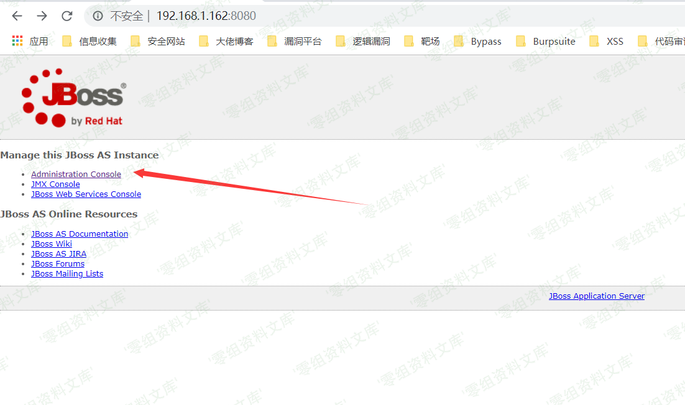
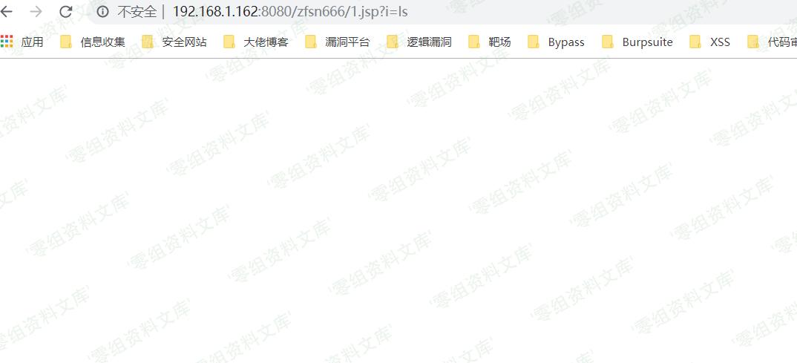

# JBoss Administration Console 弱口令 Getshell

<!-- vulwiki-editorial:start -->
## 校订与适用边界

- 适用前提：对应版本提供admin-console、弱/默认凭据仍有效、账户有部署权限
- 证据范围：非全版本代码漏洞，必须限定测试发行版与配置。

### 尚未解决的证据缺口

以下限制仍适用于后文历史材料；相关版本、结果或修复结论不能据此视为已验证：

- 全版本和默认admin/admin无范围证据，不能覆盖所有JBoss/WildFly/EAP
- 未给测试版本、管理路径、WAR生成内容与调用路径
- 无弱口令加固、卸载部署和来源

本页为文本校订，未执行代码、PoC 或目标请求；原图仅保留引用，未据此确认复现成功。
<!-- vulwiki-editorial:end -->

## 技术正文与历史材料

一、漏洞简介
------------

Administration Console 存在默认密码 admin admin
我们可以登录到后台部署war包getshell

二、漏洞影响
------------

全版本

三、复现过程
------------

1、点击Administration console

2、输入弱口令 admin admin 进去

3、点击Web application ,然后点击右上角的add

4、把文件传上去即可getshell

