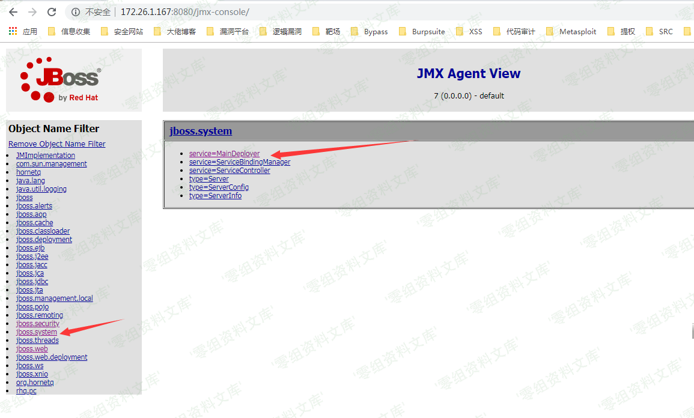
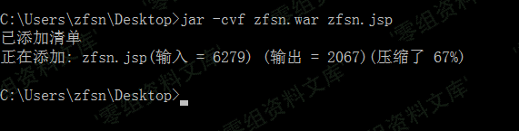
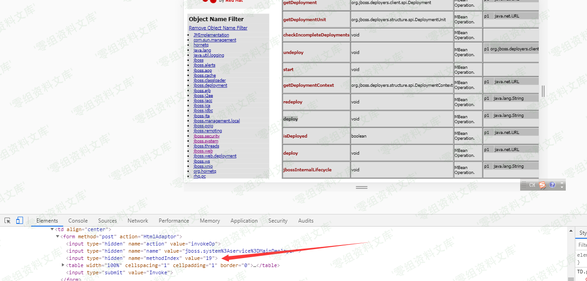
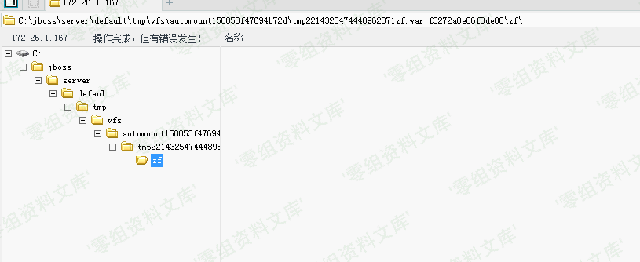

# JBoss JMX Console未授权访问Getshell

<!-- vulwiki-editorial:start -->
## 校订与适用边界

- 适用前提：旧版JMX Console可无鉴权访问、允许部署、服务端能取到远程WAR
- 证据范围：正常管理能力暴露，不应称全版本独立漏洞；与2007-1036条目后续关联需保持配置和CVE分界。

### 尚未解决的证据缺口

以下限制仍适用于后文历史材料；相关版本、结果或修复结论不能据此视为已验证：

- 版本全版本错误泛化，简介为空
- 部署methodIndex17/19依赖实际MBean版本，应标不稳定索引
- 命令zfsn. jsp有空格且中文说明嵌入，URL显示文本jmx/null-console损坏
- 最终URL漏8080端口，与开始目标不一致
- 无来源、WAR卸载/控制台访问控制修复

本页为文本校订，未执行代码、PoC 或目标请求；原图仅保留引用，未据此确认复现成功。
<!-- vulwiki-editorial:end -->

## 技术正文与历史材料

一、漏洞简介
------------

二、漏洞影响
------------

全版本

三、复现过程
------------

先输入[http://172.26.1.167:8080/jmx](http://172.26.1.167:8080/jmx-console/)-console/[null-console/](http://172.26.1.167:8080/jmx-console/)进入到页面

-   先点击[jboss.system](http://172.26.1.167:8080/jmx-console/HtmlAdaptor?action=displayMBeans&filter=jboss.system),然后点击[service=MainDeployer](http://172.26.1.167:8080/jmx-console/HtmlAdaptor?action=inspectMBean&name=jboss.system%3Aservice%3DMainDeployer)

> 创建一个war包

先准备好一个jsp的木马,然后打开cmd创建,输入命令:jar -cvf
zfsn.war(你要创建war的名字，可随意填) zfsn. jsp

我们找到methodIndex为17 or
19的deploy，把远程的war包填入进去，进行远程war包的部署

部署完成之后,我们的木马地址为<http://172.26.1.167/zfsn/zfsn.jsp>

