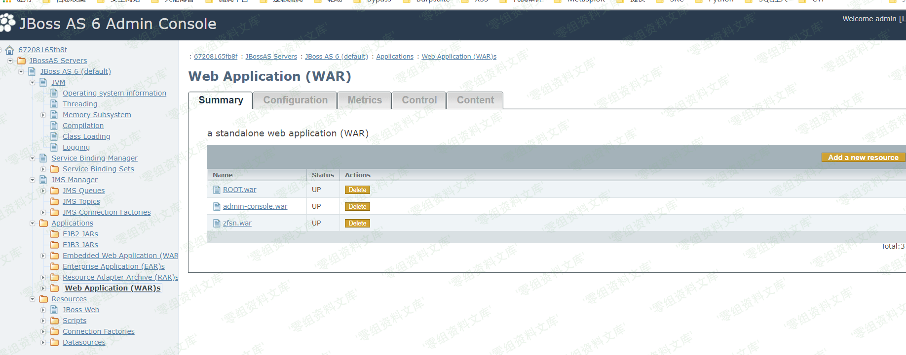
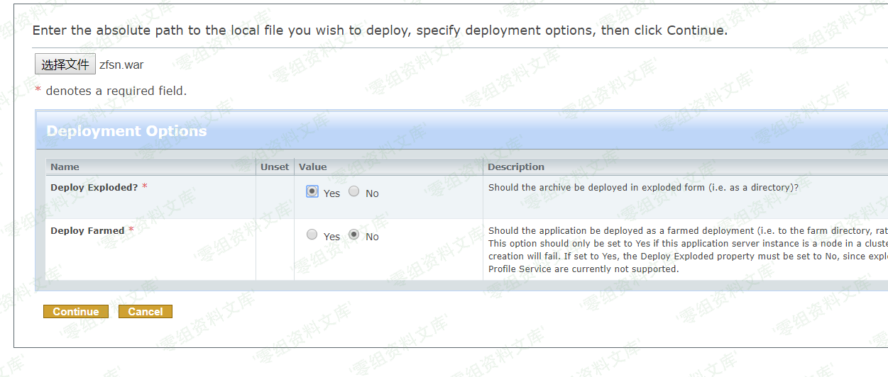

# （CVE-2007-1036）JBoss JMX Console HtmlAdaptor Getshell

<!-- vulwiki-editorial:start -->
## 校订与适用边界

- 适用前提：旧版控制台未配置访问保护，管理服务具部署能力
- 证据范围：默认配置风险有正式CVE，但全版本并不成立；取得的是服务器进程权限，不自动控制整台机器。

### 已有来源支持的更正

- 官方说明默认未限制管理界面，安装时可设置密码，原始包部署前需自行安全配置

### 尚未解决的证据缺口

以下限制仍适用于后文历史材料；相关版本、结果或修复结论不能据此视为已验证：

- 全版本无依据，需区别安装器选择安全配置与原始发行包
- 只列四参数，实际store常见还有boolean参数；需固定MBean签名
- 两图片误指弱口令AdminConsole资源且带尾部路径残渣，需视检内容
- 无原始来源/修复访问控制与卸载部署

### 核验来源

- https://access.redhat.com/security/cve/cve-2007-1036

### 操作风险与资料使用

- 含落盘脚本或账户创建：会留下持久状态。记录本次生成的路径或账户，测试后清理这些对象并撤销关联令牌；不要删除既有业务对象。

本页为文本校订，未执行代码、PoC 或目标请求；原图仅保留引用，未据此确认复现成功。
<!-- vulwiki-editorial:end -->

## 技术正文与历史材料

一、漏洞简介
------------

此漏洞主要是由于JBoss中/jmx-console/HtmlAdaptor路径对外开放，并且没有任何身份验证机制，导致攻击者可以进入到jmx控制台，并在其中执行任何功能。该漏洞利用的是后台中jboss.admin
-\> DeploymentFileRepository -\>
store()方法，通过向四个参数传入信息，达到上传shell的目的，其中arg0传入的是部署的war包名字，arg1传入的是上传的文件的文件名，arg2传入的是上传文件的文件格式，arg3传入的是上传文件中的内容。通过控制这四个参数即可上传shell，控制整台服务器。但是通过实验发现，arg1和arg2可以进行文件的拼接，例如arg1=she，arg2=ll.jsp。这个时候服务器还是会进行拼接，将shell.jsp传入到指定路径下

二、漏洞影响
------------

全版本

三、复现过程
------------

输入url:<http://172.26.1.169:8080/jmx-console/HtmlAdaptor?action=inspectMBean&name=jboss.admin%3Aservice%3DDeploymentFileRepository>,定位到store方法

JBossJMXConsoleHtmlAdaptorGetshell/media/rId25.png)

传入相应的值，即可getshell

JBossJMXConsoleHtmlAdaptorGetshell/media/rId26.png)
