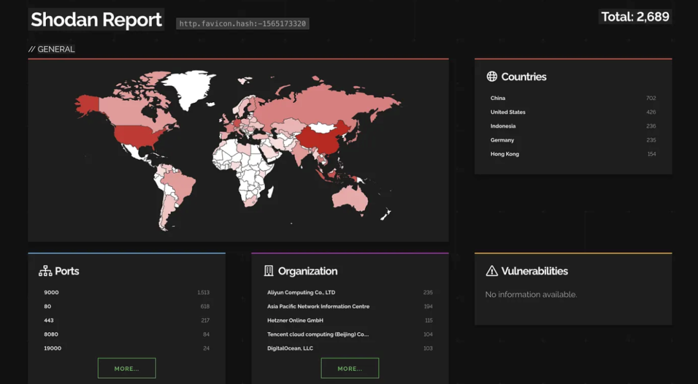

# CVE-2026-33032：可实现Nginx服务器完全控制

<!-- vulwiki-editorial:start -->
## 校订与适用边界

- 适用前提：MCP启用、/mcp_message可达、默认空IP白名单或可绕过该约束；完整未认证会话建立过程未给
- 证据范围：路由缺AuthRequired差异明确，属于管理面板应重分类；管理配置权限不必然等于主机root。

### 尚未解决的证据缺口

以下限制仍适用于后文历史材料；相关版本、结果或修复结论不能据此视为已验证：

- 标题Nginx服务器完全控制应限定nginx-ui管理能力与服务账号权限
- 先描述受保护GET /mcp取session，再说未认证POST可调用但没展示如何获得有效session，利用链缺一环
- 2689暴露的是何产品/版本不清，不能称全球Nginx全部实例或均受影响
- 所有配置改动都会立即重启、错误配置必停服过度概括，未给代码/配置检测行为证据
- X-Node-Secret与JWT REST授权边界、捕获Authorization头需要真实用户流量，不能自动得管理员令牌
- 在野利用只二次文章来源，缺原始观测；HTML/广告噪声

本页为文本校订，未执行代码、PoC 或目标请求；原图仅保留引用，未据此确认复现成功。
<!-- vulwiki-editorial:end -->

## 技术正文与历史材料

原创 骨哥说事
                    骨哥说事  骨哥说事   2026-04-22 02:06  
  
<table><tbody><tr><td data-colwidth="557" width="557" valign="top" style="word-break: break-all;"><h1 data-selectable-paragraph="" style="white-space: normal;outline: 0px;max-width: 100%;font-family: -apple-system, system-ui, &#34;Helvetica Neue&#34;, &#34;PingFang SC&#34;, &#34;Hiragino Sans GB&#34;, &#34;Microsoft YaHei UI&#34;, &#34;Microsoft YaHei&#34;, Arial, sans-serif;letter-spacing: 0.544px;background-color: rgb(255, 255, 255);box-sizing: border-box !important;overflow-wrap: break-word !important;"><strong style="outline: 0px;max-width: 100%;box-sizing: border-box !important;overflow-wrap: break-word !important;"><span style="outline: 0px;max-width: 100%;font-size: 18px;box-sizing: border-box !important;overflow-wrap: break-word !important;"><span style="color: rgb(255, 0, 0);"><strong><span style="font-size: 15px;"><span leaf="">声明：</span></span></strong></span></span></strong><span style="outline: 0px;max-width: 100%;font-size: 18px;box-sizing: border-box !important;overflow-wrap: break-word !important;"><span style="font-size: 15px;"><span leaf="">文章中涉及的程序(方法)可能带有攻击性，仅供安全研究与教学之用，读者将其信息做其他用途，由用户承担全部法律及连带责任，文章作者不承担任何法律及连带责任。</span></span></span></h1></td></tr></tbody></table>

#   
  
#   
  
****# 防走失：https://gugesay.com/  
  
**不想错过任何消息？设置星标****↓ ↓ ↓**  
#   
  
  
  
  
近日，一款流行的基于Web的Nginx管理工具nginx-ui中发现了一个关键安全漏洞，并且已被在野利用。该工具在GitHub上拥有超过11K星标和43万+的Docker拉取量。漏洞CVE-2026-33032  
的CVSS得分为9.8，使攻击者能够完全控制Nginx服务器。  
## 场景理解  
  
nginx-ui使用了mcp-go库中的SSE传输。以下是两个重要的端点：  
  
GET /mcp  
 - 打开一个持久的SSE流。用于建立持久的Server-Sent Events连接以接收JSON-RPC响应并启动会话。  
  
POST /mcp_message  
 - 用于向MCP服务器发送命令。  
  
当一个客户端发送GET请求到 /mcp  
 端点以打开流时，服务器会响应一个会话ID，如下所示：  
```
data: /mcp_message?sessionId=9a7f3d21-6c5e-4b8a-9d72-3f1e8c4b2a11
```  
  
之后，通过POST请求调用工具到 /mcp_message  
 端点，并携带有效的 sessionId  
，响应通过SSE流发送回客户端。这里，nginx-ui使用 node_secret  
 对MCP连接进行身份验证。  
  
但你现在肯定在想这有什么问题，到目前为止一切看起来都正常。我们来看看。  
### 理解安全漏洞  
```
// Vulnerable Code
func InitRouter(r *gin.Engine) {
 r.Any(
"/mcp"
, middleware.IPWhiteList(), middleware.AuthRequired(),
  func(c *gin.Context) {
   mcp.ServeHTTP(c)
  })
 r.Any(
"/mcp_message"
, middleware.IPWhiteList(),
  func(c *gin.Context) {
   mcp.ServeHTTP(c)
  })
}
```  
  
如果你仔细观察，/mcp  
 端点受 middleware.AuthRequired()  
 保护，但 /mcp_message  
 没有。因为 mcp.ServeHTTP()  
 处理所有的MCP工具调用，任何人都可以在未经身份验证的情况下通过 /mcp_message  
 端点执行工具。  
  
虽然 /mcp_message  
 端点确实使用了 middleware.IPWhiteList()  
，但这一层仅存的保护自身存在一个关键缺陷：  
```
// internal/middleware/ip_whitelist.go:11-26 - Empty whitelist allows all
func IPWhiteList() gin.HandlerFunc {
 
return
 func(c *gin.Context) {
  clientIP := c.ClientIP()
  
if
 len(settings.AuthSettings.IPWhiteList) == 0 || clientIP == 
""
 || clientIP == 
"127.0.0.1"
 || clientIP == 
"::1"
 {
   c.Next()
   
return
  }
  // ...
 }
}
```  
  
这里，我们可以看到如果 IPWhiteList  
 为空，那么这个机制就完全失效，因为它允许所有没有IP过滤的请求；并且默认安装时 IPWhiteList  
 是空的，这是一个失效开放的设计。  
  
总之，如果 IPWhiteList  
 为空，那么下面列出的12个MCP工具可以在没有任何身份验证的情况下被攻击者访问。  
### 可用的MCP工具  
  
来自 mcp/nginx/  
:  
- restart_nginx  
 - 重启Nginx进程  
  
- reload_nginx  
 - 重新加载Nginx配置  
  
- nginx_status  
 - 读取Nginx状态  
  
来自 mcp/config/  
:  
- nginx_config_add  
 - 创建新的Nginx配置文件  
  
- nginx_config_modify  
 - 修改现有配置文件  
  
- nginx_config_list  
 - 列出所有配置  
  
- nginx_config_get  
 - 读取配置文件内容  
  
- nginx_config_enable  
 - 启用/禁用站点  
  
- nginx_config_rename  
 - 重命名配置文件  
  
- nginx_config_mkdir  
 - 创建目录  
  
- nginx_config_history  
 - 查看配置历史  
  
- nginx_config_base_path  
 - 获取Nginx配置目录路径  
  
### 影响  
1. 攻击者可以完全控制Nginx服务，并且可以在配置目录内创建、修改和删除任何Nginx配置文件，这会触发立即重启。  
  
1. 攻击者可以通过代理所有流经攻击者控制端点的流量，窃取凭证、会话令牌和其他敏感数据。  
  
1. 写入无效的配置文件会导致服务器重启并完全中断服务。  
  
1. 攻击者可以通过注入包含自定义 log_format  
 模式的 access_logs  
 指令来捕获 Authorization  
 头，这使其能够提升权限，访问REST API。  
  
数据显示全球范围内暴露的Nginx实例数量。  
  
全球共有2689个暴露的实例，其中大部分来自中国、美国、印度尼西亚、德国和香港。  
  
  
## 现在该怎么做？  
  
已确认CVE-2026-33032  
在野被积极利用。如果你正在运行易受攻击的版本，请立即更新。  
  
如果你正在运行启用了MCP的nginx-ui：  
- 立即更新到 v2.3.4  
 或更高版本  
  
- 如果你无法立即更新，请立即禁用MCP，或者紧急地将可信主机添加到IP白名单中，切勿将其留空。  
  
### 修复  
  
该漏洞在2026年3月15日发布的 v2.3.4  
 中得到了修复，你猜对了，修复方法就是在 /mcp_message  
 端点上添加缺失的身份验证。  
  
修复后的代码看起来像这样：  
```
// Patched code
r.Any(
"/mcp_message"
, middleware.IPWhiteList(), middleware.AuthRequired(),
func
(c *gin.Context)
 {
        mcp.ServeHTTP(c)
    })
```  
  
原文：  
  
https://infosecwriteups.com/cve-2026-33032-exploitation-allows-full-control-over-nginx-server-838949e8637c  
  
- END -  
  
**感谢阅读，如果觉得还不错的话，动动手指给个三连吧～**  
  
  


---

> 来源：gelusus/wxvl（微信公众号漏洞文章自动归档，原文见文首链接）
