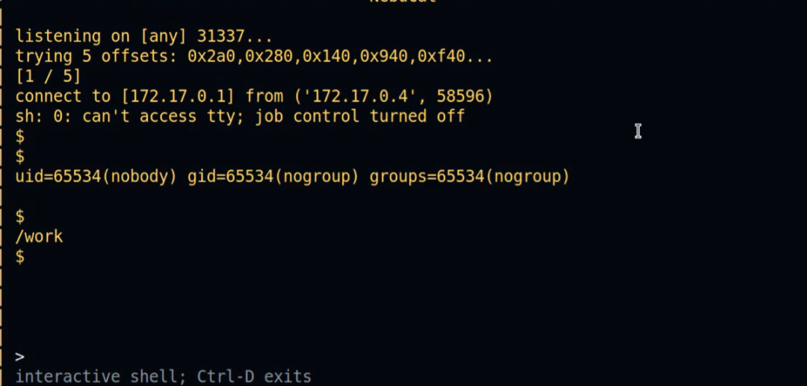

# CVE-2026-42530 NGINX 远程代码执行

<!-- vulwiki-editorial:start -->
## 校订与适用边界

- 适用前提：1.31.0/.1且编译并启用HTTP3/QUIC，具体视频内存布局与配置未提供
- 证据范围：主条目官方是HTTP3 use-after-free，RCE视频未附可播放直链/脚本，不能把转述当独立复现。42055为同时修复的另一问题。

### 已有来源支持的更正

- 官方确认42530为HTTP3 UAF，影响1.31.0–.1，1.31.2修复；42055另为proxy_v2/grpc缓冲区溢出

### 尚未解决的证据缺口

以下限制仍适用于后文历史材料；相关版本、结果或修复结论不能据此视为已验证：

- 缺明确完整影响1.31.0–1.31.1，只举1.31.1
- SSL443是视频配置不一定漏洞硬要求，需区分
- nobody是实验服务账号非固定漏洞权限，页面锁定/ASLR绕过断言缺技术证据
- 原X视频链接缺失，公众号图片未视检

### 核验来源

- https://nginx.org/en/security_advisories.html

本页为文本校订，未执行代码、PoC 或目标请求；原图仅保留引用，未据此确认复现成功。
<!-- vulwiki-editorial:end -->

## 技术正文与历史材料

 Ots安全   2026-06-20 06:00  
  
**威胁简报**  
  
  
**恶意软件**  
  
  
**漏洞攻击**  
  
  
  
X 的帖子 @akaclandestine分享了一段 27 秒的 PoC 视频，该视频利用了 NGINX 的 ngx_http_v3_module (HTTP/3 QUIC) 中的 CVE-2026-42530 漏洞，演示了如何通过地址探测、堆操作和反向 shell 以 nobody 用户身份在易受攻击的 1.31.1 版本上执行远程代码。  
  
该演示需要使用 --with-http_v3_module 编译 NGINX 并启用 QUIC，以及特定的配置，例如端口 443 上的 SSL，通过有针对性的内存探测和页面锁定来触发漏洞，从而成功绕过 ASLR。  
  
F5 在 NGINX 开源版 1.31.2 及其他版本中修复了 CVE-2026-42530 (CVSS 9.2) 和 CVE-2026-42055；利用此漏洞的条件是 HTTP/3 处于活动状态且设置非默认。  
  
  
参考：  
  
https://my.f5.com/manage/s/article/K000161616  
  
https://www.cve.org/CVERecord?id=CVE-2026-42530  
  
**END**  
  
  
  
  
  
公众号内容都来自国外平台-所有文章可通过点击阅读原文到达原文地址或参考地址  
  
排版 编辑 | Ots 小安   
  
采集 翻译 | Ots Ai牛马  
  
公众号 |   
AnQuan7 (Ots安全)  
  

---

> 来源：gelusus/wxvl（微信公众号漏洞文章自动归档，原文见文首链接）
