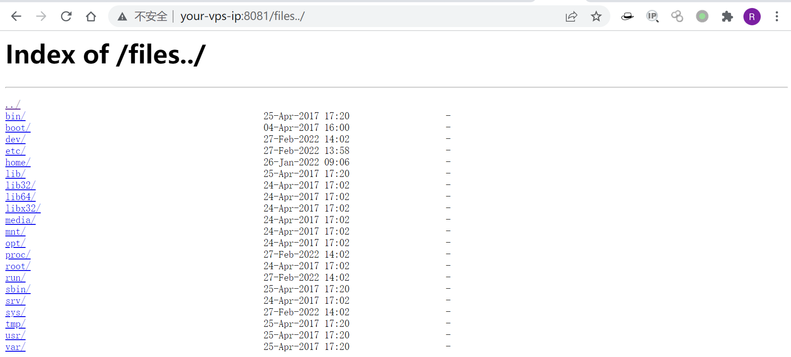

# Nginx 配置错误漏洞

<!-- vulwiki-editorial:start -->
## 校订与适用边界

- 证据范围：426–428拆分主题的综合版，建议合并关联保留最完整来源；Bottle9964只是利用技巧外链，不是NGINX主漏洞。

### 本次正文校订

- 按实际内容修正 1 处代码围栏语言标记，保留其中方法与请求内容。

### 尚未解决的证据缺口

以下限制仍适用于后文历史材料；相关版本、结果或修复结论不能据此视为已验证：

- 错误3标题缺具体名称
- 缺每类缓解和完整docker-compose来源/测试版本
- alias忘/应明确location，CSP不继承不会自己产生XSS
- %0a%0d为LFCR需标实现行为，不能泛称所有当前版本支持
- 图片/配置与原始教程来源需统一

本页为文本校订，未执行代码、PoC 或目标请求；原图仅保留引用，未据此确认复现成功。
<!-- vulwiki-editorial:end -->

## 技术正文与历史材料

## 环境搭建

```shell
docker-compose up -d
```

Vulhub运行成功后，Nginx将会监听8080/8081/8082三个端口，分别对应三种漏洞。

## 漏洞复现

### 错误1  CRLF注入漏洞

Nginx会将`$uri`进行解码，导致传入`%0a%0d`即可引入换行符，造成CRLF注入漏洞。

错误的配置文件示例（原本的目的是为了让http的请求跳转到https上）：

```
location / {
    return 302 https://$host$uri;
}
```

Payload: `http://your-ip:8080/%0a%0dSet-Cookie:%20a=1`，可注入Set-Cookie头。

利用《[Bottle HTTP 头注入漏洞探究](https://www.leavesongs.com/PENETRATION/bottle-crlf-cve-2016-9964.html)》中的技巧，即可构造一个XSS漏洞。

### 错误2 目录穿越漏洞

Nginx在配置别名（Alias）的时候，如果忘记加`/`，将造成一个目录穿越漏洞。

错误的配置文件示例（原本的目的是为了让用户访问到/home/目录下的文件）：

```
location /files {
    alias /home/;
}
```

Payload: `http://your-ip:8081/files../` ，成功穿越到根目录。



### 错误3 

Nginx配置文件子块（server、location、if）中的`add_header`，将会覆盖父块中的`add_header`添加的HTTP头，造成一些安全隐患。

如下列代码，整站（父块中）添加了CSP头：

```
add_header Content-Security-Policy "default-src 'self'";
add_header X-Frame-Options DENY;

location = /test1 {
    rewrite ^(.*)$ /xss.html break;
}

location = /test2 {
    add_header X-Content-Type-Options nosniff;
    rewrite ^(.*)$ /xss.html break;
}
```

但`/test2`的location中又添加了`X-Content-Type-Options`头，导致父块中的`add_header`全部失效，XSS可被触发。


---

> 来源：Threekiii/Awesome-POC
