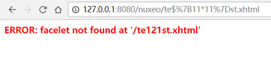
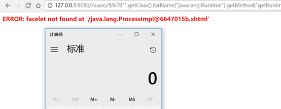
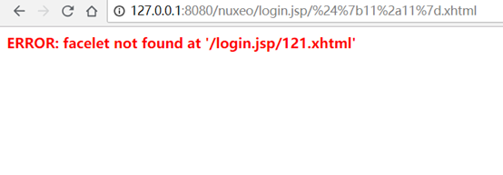
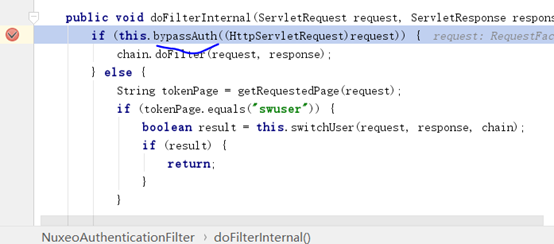
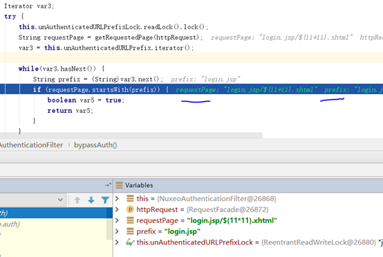
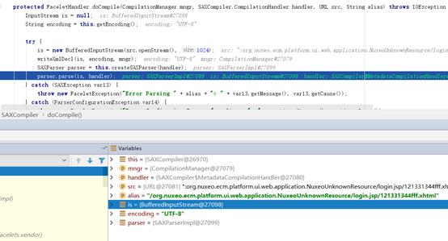
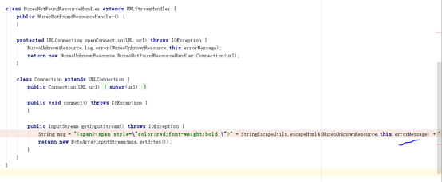
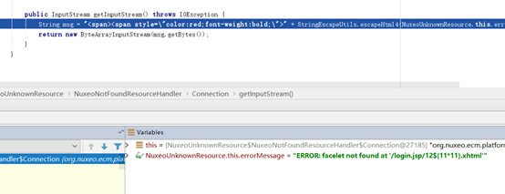
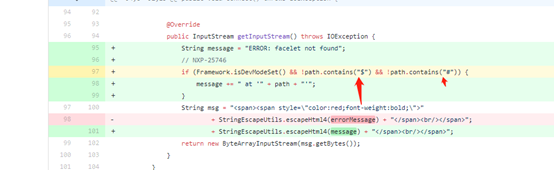

# Nuxeo 认证绕过和 RCE 漏洞分析（CVE-2018-16341) - 斗象能力中心

<!-- vulwiki-editorial:start -->
## 校订与适用边界

- 适用前提：nuxeo-jsf-ui组件安装；10.2默认未装，需特别启用；不存在Facelet路径被作为模板处理，login.jsp前缀绕过
- 证据范围：作者两问题同CVE链，明确插件前提及prefix/path-mapping关系，独立分析有价值；不能按所有Nuxeo<10.3默认RCE概括。

### 尚未解决的证据缺口

以下限制仍适用于后文历史材料；相关版本、结果或修复结论不能据此视为已验证：

- Servlet匹配前面*.xhtml后面*.html笔误
- 核心源码多仅外站截图，未视检；依赖原图片可用性
- 命令calc为Windows例子，缺系统/JRE测试细节
- 10.3已修复但发行日志未提为作者历史自述，需官方commit与补丁分支核定
- 来源链接Markdown被转义，需恢复规范链接

本页为文本校订，未执行代码、PoC 或目标请求；原图仅保留引用，未据此确认复现成功。
<!-- vulwiki-editorial:end -->

## 技术正文与历史材料

<meta name="referrer" content="no-referrer"/>

> 本文由 [简悦 SimpRead](http://ksria.com/simpread/) 转码， 原文地址 [blog.riskivy.com](https://blog.riskivy.com/nuxeo-rce-analysis-cve-2018-16341/)

Nuxeo 认证绕过和 RCE 漏洞分析（CVE-2018-16341)
------------------------------------

**简介**
------

Nuxeo Platform 是一款跨平台开源的企业级内容管理系统 (CMS)。  
nuxeo-jsf-ui 组件处理 facelet 模板不当，当访问的 facelet 模板不存在时，相关的文件名会输出到错误页面上，而错误页面会当成模板被解析，文件名包含表达式也会被输出同时被解析执行，从而导致远程代码执行漏洞。  
在漏洞挖掘过程中发现 nuxeo-jsf 组件默认在 10.2 没有安装，历史版本是默认就安装的。可以通过 nuxeoctl mp-install nuxeo-jsf-ui 命令安装。  
本文介绍的两个漏洞由笔者发现并提交给官方，CVE 编号为：CVE-2018-16341。有趣的是在官方 10.3 版本的发布日志中并没有提及该漏洞 (CVE-2018-16341)，但实际已被修复。

**影响范围**
--------

Nuxeo Server 版本 < 10.3

**漏洞复现**
--------

通过在官网下载 Nuxeo 10.2 的安装包在本地安装，使用默认密码登陆 Administrator/Administrator。

在登陆状态下访问 test${11\*11}.xhtml，可以看到表达式被执行  


**执行系统命令**
----------

Nuxeo 是构建在 Seam Framework 之上的, Seam 是由 Jboss 开发的 Web 应用程序框架，在前几年比较流行，但依然有很多应用程序使用了 Seam。  
当用 EL 来执行任意系统命令时，Seam 内部对 EL 的解析有一定的防护，用下面的 Payload 可绕过。

```
${"".getClass().forName("java.lang.Runtime").getMethod("getRuntime",null).invoke(null,null).exec("calc",null).toString()}


```



**认证绕过**
--------

在不登陆的情况下，是无法访问 facelet 模板的，如果需要登陆才能命令执行，漏洞略显得有点鸡肋。发现可以通过  
login.jsp/%24%7b%31%31%2a%31%31%7d.xhtml 绕过访问。  


**认证绕过分析**
----------

通过查看 web.xml 配置文件，开发者为 \*.xhtml 资源注册了名为 NuxeoAuthenticationFilter 的过滤器和 Faces Servlet。凭借经验认证工作应该在 filter 处理。  
通过调试发现，在 NuxeoAuthenticationFilter 类中的 bypassAuth 方法中有相关逻辑  


进入到该方法中，unAuthenticatedURLPrefix 是一个列表，值为 \[“login.jsp”,”webservices/”\] ，requestPag 只要以 unAuthenticatedURLPrefix 数组中的字符串开头就不会验证用户身份。



根据注册的 Faces Servlet 规则”\*.html”， login.jsp/test.xhtml 肯定是匹配的，如果要对资源进行访问控制肯定要先进入到访问控制逻辑中的，但是访问控制逻辑中只是通过 startsWith 方法来比较的，肯定也是符合的，所以 login.jsp/test.xhtml 这个路径可以绕过 NuxeoAuthenticationFilter 认证控制进入到 Faces Servlet（模版相关）中。

可能会问，那我使用 / webservices/xx.xhtml 是不是也可以绕过呢？答案是不可以。对 / webservices/\* 资源注册了另一个 Servlet，一个请求只能被一个 Servlet 处理，这个注册方式优先级更高。

**RCE 分析**
----------

先来一张案发现场的图，is 变量含有用户可控的内容进入到了 parse 方法中。  


src 的 handler 为 NuxeoNotFoundResourceHandler，看下实现，  


getInputStream 中的错误信息中包含表达式，也会进入 parse 方法中执行， 即请求的路径不存在时将会把路径当成源内容返回给调用者，这里就会进入到模版的 parse 方法中，然后就被解析执行了。  


**补丁分析**
--------

https://github.com/nuxeo/nuxeo/commit/eb54a9145c6d8297eba9d7dafc74556e735fa388#diff-cf2094833ef0eea473d03bf6559f1798R97

这是通过过滤的方式修复的，在 getInputStream 中，只有当路径中不包含”#” 和”$” 时才会把路径输出到输入流中，这样就无法执行 EL 了。  


**参考链接**
--------

https://doc.nuxeo.com/nxdoc/nuxeo-jsf-ui/  
http://blog.orange.tw/2018/08/how-i-chained-4-bugs-features-into-rce-on-amazon.html  
https://github.com/nuxeo/nuxeo

作者：斗象能力中心 TCC – 星光

---

> 来源：MrWQ/vulnerability-paper（https://github.com/MrWQ/vulnerability-paper）
