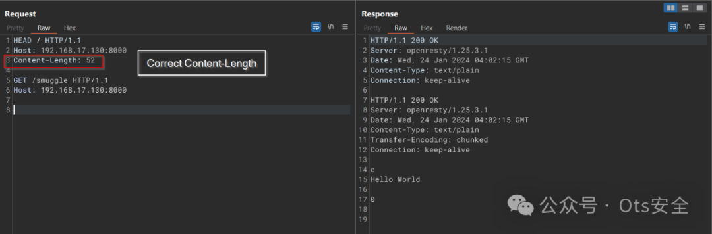
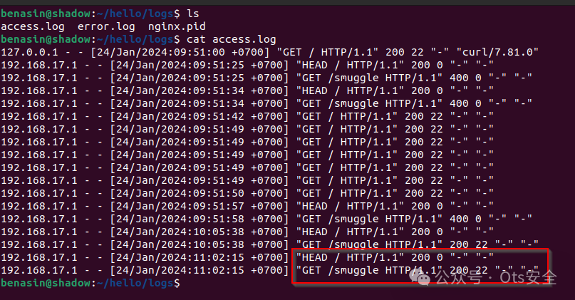
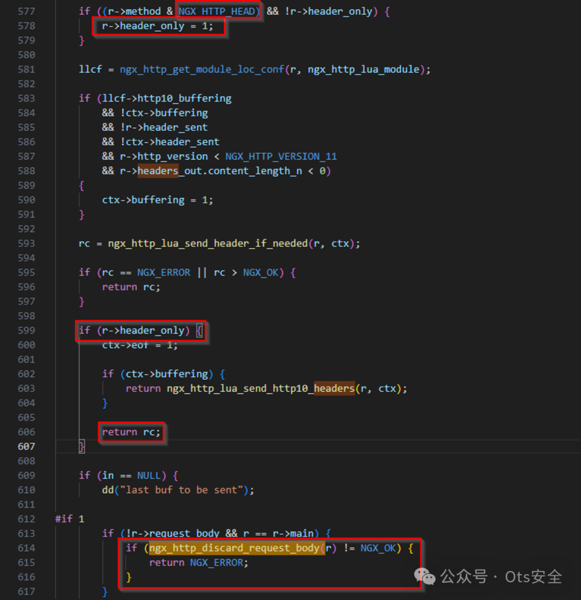
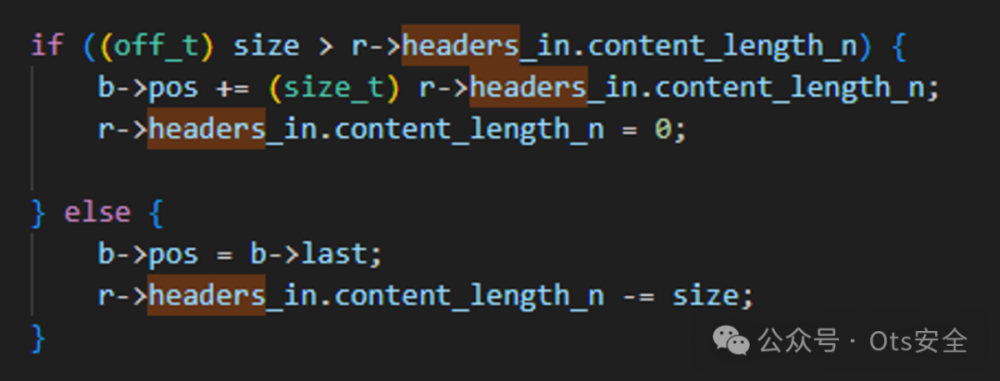
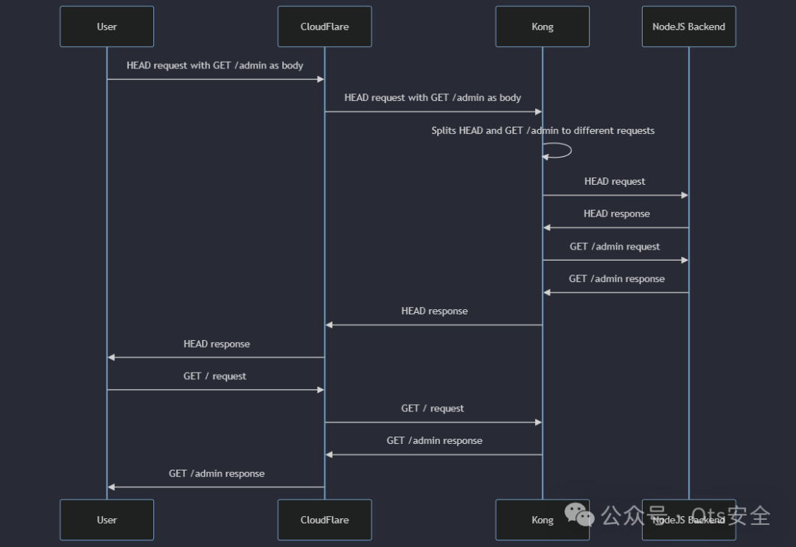

# OpenResty/lua-nginx-module HEAD 请求中的 HTTP 请求走私 - CVE-2024-33452

<!-- vulwiki-editorial:start -->
## 校订与适用边界

- 适用前提：受影响Lua响应路径提前返回不消费HEAD body，前端代理与后端解析不同、后端连接跨用户复用才能产生所述安全影响
- 证据范围：说明独立前端与链式代理差异以及源码早退点，较单纯双响应材料完整；仍需实际代理版本和连接配置。

### 本次正文校订

- 按实际内容修正 2 处代码围栏语言标记，保留其中方法与请求内容。

### 尚未解决的证据缺口

以下限制仍适用于后文历史材料；相关版本、结果或修复结论不能据此视为已验证：

- 全部关键HTTP请求丢换行，甚至Host/Content-Length被中文化、HEAD与路径缺空格，原文不可复现
- 声称任何前端保护、同池所有用户均被影响过宽，取决于连接复用、路由和前端HEAD处理
- <=0.10.26无修复版本/commit/厂商争议状态说明，需进一步核验
- 视频/POC仓库外链未实际运行，核心结果只截图
- 前端独立时正常流水线表述应区分仍有请求体解析偏差但未跨安全边界

本页为文本校订，未执行代码、PoC 或目标请求；原图仅保留引用，未据此确认复现成功。
<!-- vulwiki-editorial:end -->

## 技术正文与历史材料

 Ots安全   2025-03-29 19:42  
  
  
  
发现与动机  
  
我第一次遇到这个 HTTP 请求走私漏洞是在为工作中的客户进行内部渗透测试时。意识到它的潜在影响后，我决定深入挖掘其根本原因，并发现它源于 OpenResty 中的 lua-nginx-module 实现，它忽略了 HEAD 请求的主体。  
  
在这篇博文中，我将详细介绍该漏洞的技术细节、其影响以及它所导致的攻击场景。此外，请继续关注这项研究的第二部分，我们将展示实际应用中的案例利用，以获得FrogSec Research的精彩发现和巨额赏金。  
  
最后，我要感谢James Kettle 先生提供的宝贵见解，他提供有关 HTTP 请求走私的丰富资源，并回答了我的问题，这极大地帮助我理解了这个漏洞。  
  
描述  
  
我在 OpenResty/ lua-nginx-module<= v0.10.26 中发现了一个 HTTP 请求走私漏洞，该漏洞允许攻击者走私请求。  
  
处理 HTTP/1.1 请求时，lua-nginx-module错误地解析HEAD带有主体的请求并将主体视为新的单独请求。  
  
通常对于其他代理，以下请求被视为单个请求，因为 GET /smuggle 请求位于HEAD请求正文内。  
  
```http
HEAD / HTTP/1.1主机：localhost内容长度：52GET /smuggle HTTP/1.1主机：localhost
```  
  
  
但解析时，lua-nginx-module此请求被视为 2 个独立请求。如果链接在一起，这会导致代理之间出现差异。  
  
重现步骤：  
  
1.lua-nginx-module按照以下视频设置 OpenResty/  
  
https://www.youtube.com/watch?v=eSfYLvVQMxw  
  
2.在 Burp Suite 中发送此请求。  
  
```http
HEAD / HTTP/1.1Host: 192.168.17.130:8000Content-Length: 52GET /smuggle HTTP/1.1Host: 192.168.17.130:8000
```  
  
  
  
  
  
  
正如您在响应和访问日志中看到的。尽管我们只发送了 HEAD 请求，但有一个被走私的 GET 请求。  
  
根本原因分析：  
  
该漏洞存在于 src/ngx_http_lua_util.c 文件中。  
  
- 在处理管道请求时会调用 ngx_http_lua_send_chain_link 。  
  
- ngx_http_discard_request_body 位于第 614 行，指示 nginx 丢弃（跳过）请求主体  
  
  
- ngx_http_discard_request_body 调用 ngx_http_discard_request_body_filter ，将请求指针向前移动 Content-Length 值以跳过主体并正确定位服务器以处理下一个请求。  
  
- 然而在 599 行，如果当前方法是 HEAD ， ngx_http_lua_send_chain_link 会在到达 ngx_http_discard_request_body 之前就返回，当前请求体会被视为一个新的请求，从而引发 HTTP 请求走私问题！  
  
攻击场景：  
  
我观察到在 lua-nginx-module 之上实现的代理也存在此问题（Kong Gateway、Apache APISIX 等）。以下是一些攻击场景，以表明此漏洞的影响程度：  
  
我将使用 Kong Gateway 作为我的 POC 的示例。  
  
如果 Kong 独立运行在前端，则不会出现问题，因为这只是正常的 HTTP 流水线行为。但是，如果 Kong 与前端代理（Nginx、Cloudflare 等）链接，攻击者就会通过与 Kong 保持持久连接（保持连接）的前端代理提供恶意响应并走私请求。让我解释一下：  
  
正如我在许多代理中观察到的那样，带有主体的 HEAD 请求将被视为单个请求，但是当此请求传递到 Kong 网关时，由于 lua-nginx-module 行为，它将被视为 2 个独立的管道请求（主体中的 HEAD 请求和恶意请求）。这会使恶意请求悬在响应队列中，当另一个用户发送请求时，恶意响应将被发送回给他们。  
  
攻击场景 1：向所有受害者提供 XSS 响应  
  
我已经设置了另一个 POC（在 kong-xss 文件夹中），其中最新的 Nginx 将作为前端代理，Kong 作为 API 网关，并使用单一配置将 /assets 重定向到 /assets/ 路径的默认 Apache 页面。  
  
即使使用默认的 Apache 网页，攻击者也可以利用此攻击实现 XSS。  
  
XSS 走私载荷：  
  
```
HEAD/ HTTP/1.1Host: localhostContent-Length: 122HEAD/app HTTP/1.1Host: localhostConnection: keep-aliveGET /app/assets?<script>alert(origin)</script> HTTP/1.1X:
```  
  
  
  
您可以在此处阅读有关 HEAD 技术的更多详细信息。  
https://portswigger.net/research/browser-powered-desync-attacks#:~:text=Akamai%20%2D%20stacked%20HEAD  
  
攻击场景 2：绕过前端代理保护（例如：Cloudflare）  
  
我创建了一个攻击场景，其中 CloudFlare 将阻止对 /admin 的请求。但是，攻击者可以将 GET /admin 请求偷偷放入 HEAD 请求的主体中以绕过 CloudFlare。  
  
  
攻击示例 3：窃取其他用户的回复  
  
此攻击允许攻击者取消响应队列的同步并捕获其他用户的响应。以下是有关此攻击如何工作的可视化视频：  
  
  
POC  
  
代理设置可以在我的 GitHub 存储库中找到：  
  
https://github.com/Benasin/OpenResty_HEAD_HRS/tree/main  
  
影响：  
  
攻击者可以利用此攻击绕过任何前端代理保护，向同一连接池中的所有用户提供恶意响应并捕获其他用户的响应。  
  
  
  
感谢您抽出  
  
  
  
.  
  
  
  
.  
  
  
  
来阅读本文  
  
  
  
**点它，分享点赞在看都在这里**  
  
  


---

> 来源：gelusus/wxvl（微信公众号漏洞文章自动归档，原文见文首链接）
