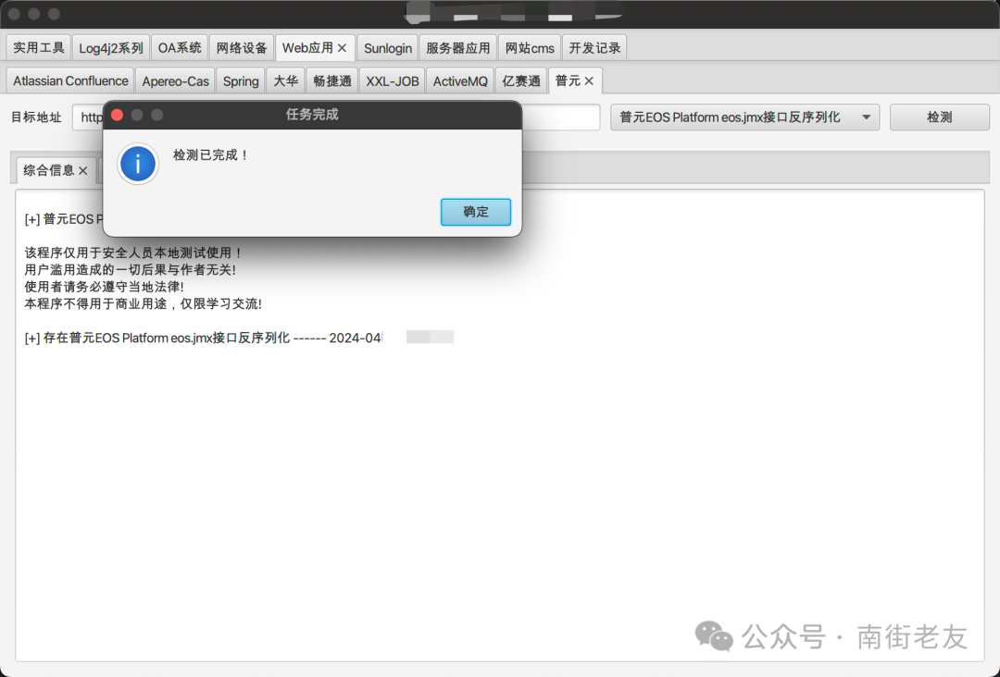
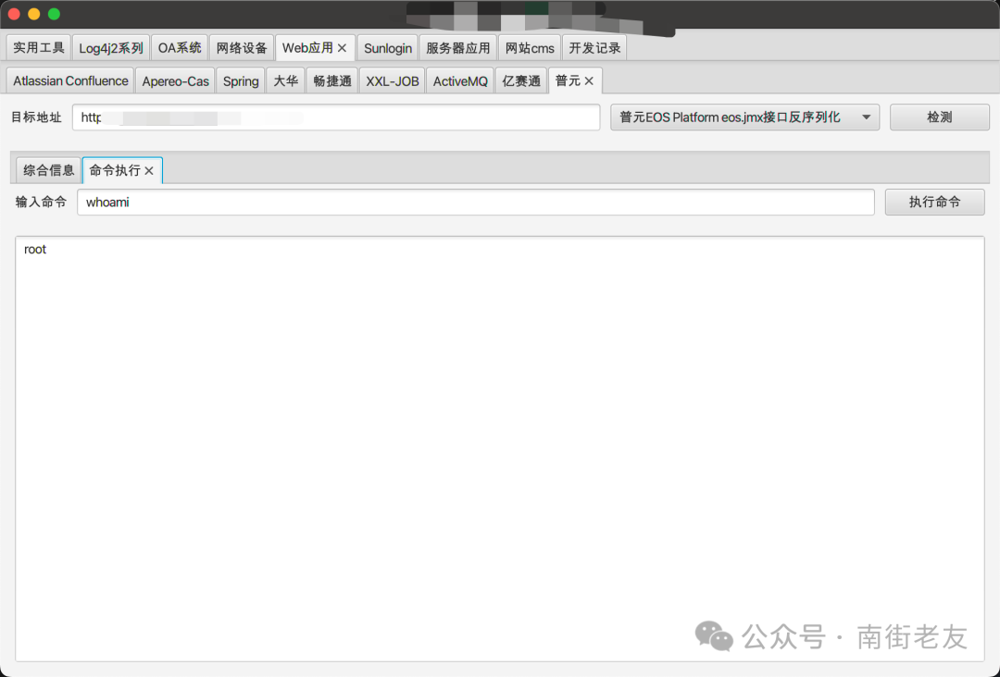

# Primeton EOS Platform jmx反序列化远程代码执行

<!-- vulwiki-editorial:start -->
## 校订与适用边界

- 适用前提：特定JMX HTTP端点开启可达，目标gadget/JRE/鉴权条件未提供
- 证据范围：只有两截图且全文不含具体端点/载荷/响应，不能据标题和<=7.6认定复现完整。

### 尚未解决的证据缺口

以下限制仍适用于后文历史材料；相关版本、结果或修复结论不能据此视为已验证：

- 漏洞描述标题重复，无官方公告/修补版本/参考出处
- 关键检测与利用仅图片未视检
- 修复只说屏蔽JMX请求未区分HTTP管理接口与RMI端口
- 后半几乎全是励志段落与技术无关，应清除

本页为文本校订，未执行代码、PoC 或目标请求；原图仅保留引用，未据此确认复现成功。
<!-- vulwiki-editorial:end -->

## 技术正文与历史材料

原创 SXdysq  南街老友   2024-04-28 21:20  
  
**漏洞描述**  
  
Primeton EOS Platform是一个由普元科技开发的企业级应用软件平台，旨在提供数字化转型、数据管理和流程优化的解决方案。  
  
普元EOS某接口开启了JMX over HTTP功能，且未对反序列化数据进行充分的安全检查和限制。  
  
**漏洞描述**  
  
攻击者通过利用反序列化漏洞，可以在服务器上执行任意代码，从而获得服务器的进一步控制权。  
  
**漏洞影响范围**  
  
普元EOS ≤ 7.6  
  
**漏洞检测与利用**  
  
  
  
  
  
  
**修复建议**  
  
直接关闭相关功能可以更彻底地解决问题。建议在确认不需要使用该功能的情况下，屏蔽JMX的请求。**鸡汤**  
  
当生活给你一百个理由哭泣，你就要用一千个理由去笑；  
  
不经历风雨，怎能见彩虹；  
  
成功并不是重要的事情，重要的是努力和坚持；  
  
生活不会因为你眼泪而停滞，它还在继续，所以请振作起来；  
  
世界总是让你感到孤独时，别忘了还有自己；  
  
只有脚踏实地，才能走得更远；  
  
每一次跌倒都是为了让你学会如何更加坚强地站起来；  
  
别让别人的眼光左右你的人生，你的选择决定了你的人生；  
  
相信自己，你比自己想象的更勇敢，更坚强；  
  
无论遇到什么困难，都要相信自己，坚持下去，你一定能突破困境，看到更美好的明天；  
  
当你感到迷茫时，记得你曾经为何出发。  
  
生命中最困难的挑战，往往也是最美好的经历。  
  
不要等待机会，而是创造机会。  
  
成功的秘诀在于坚持不懈。  
  
勇敢的人在每一次跌倒后都会站起来，再次出发。  
  
失败只是通往成功的必经之路。  
  
别人能做到的，你也能做到，只要你有勇气和决心。  
  
每一步的努力都是向梦想更近一步。  
  
相信自己，你比自己想象的更强大。  
  
只要心怀希望，没有什么是不可能的。  
  
  
  
  

---

> 来源：gelusus/wxvl（微信公众号漏洞文章自动归档，原文见文首链接）
