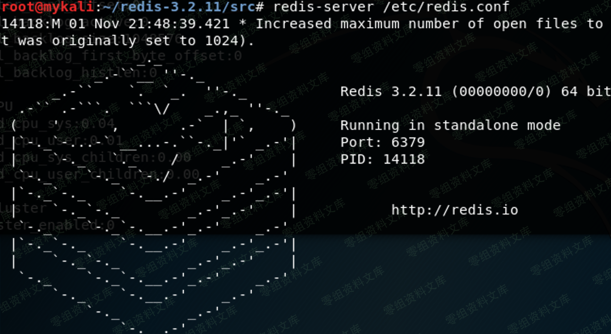
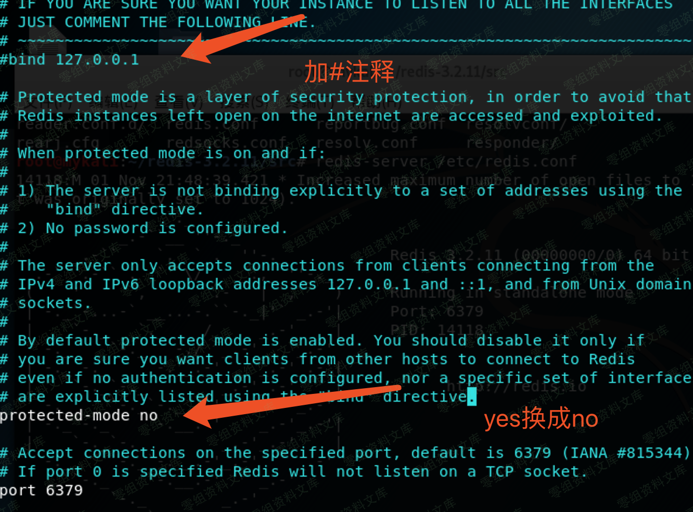
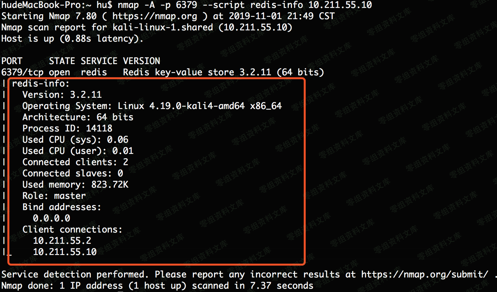
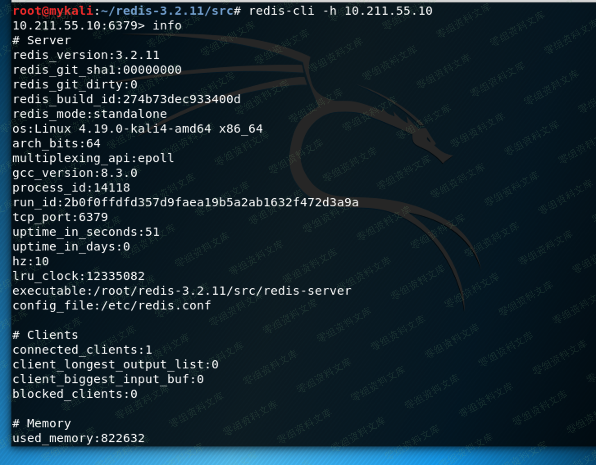

# redis未授权访问漏洞

<!-- vulwiki-editorial:start -->
## 校订与适用边界

- 证据范围：教程人为关闭安全默认，不能说所有Redis默认未授权；高危删除命令混入常用命令必须分离警告。

### 尚未解决的证据缺口

以下限制仍适用于后文历史材料；相关版本、结果或修复结论不能据此视为已验证：

- flushdb说刷新数据库错误，实际删除当前库全部数据；flushall删除全部库也不应无警告列常用
- KEYS*只列键不读值，GET读键值而非变量名称；config get dir/dbfilename不是同时获取两项的语法
- 源码解压后缺make/install就调用redis-server，不保证实际跑3.2.11
- 缺requirepass/ACL、恢复bind/protected-mode与隔离测试限制
- 无漏洞编号/原始出处/影响范围，nmap/msf仅工具用法

### 操作风险与资料使用

- 含 FLUSHDB/FLUSHALL 清空数据操作：可能永久丢失所选数据库或整个实例的数据；仅在有快照的隔离测试实例操作。

本页为文本校订，未执行代码、PoC 或目标请求；原图仅保留引用，未据此确认复现成功。
<!-- vulwiki-editorial:end -->

## 技术正文与历史材料

一、漏洞简介
------------

redis未授权访问漏洞

二、影响范围
------------

三、复现过程
------------

##### 1.环境安装

    从官网wget到本地
    wget http://download.redis.io/releases/redis-3.2.11.tar.gz 
    tar xzf redis-3.2.11.tar.gz 
    将redis.conf copy到 /etc/下
    启动时使用命令 redis-server /etc/redis.conf
    测试时建议 vim /etc/redis.conf
    去掉ip绑定，允许除本地外的主机远程登录redis服务
    (1)bind 127.0.0.1前面加上##号注释掉 或者更改成 0.0.0.0
    (2)protected-mode设为no

如图

##### 2.攻击者常用命令

        （1）info                       查看信息     
        （2）flushall                 删除所有数据库内容：
        （3）flushdb                    刷新数据库
        （4）看所有键：KEYS *，使用select num可以查看键值数据。
        （5）set test "who am i"        设置变量
        （6）config set dir dirpath     设置路径等配置
        （7）config get dir/dbfilename  获取路径及数据配置信息
        （8）save                       保存
        （9）get                        变量，查看变量名称

##### 3.msf下利用模块

    auxiliary/scanner/redis/file_upload 
    auxiliary/scanner/redis/redis_login
    auxiliary/scanner/redis/redis_server

##### 4.nmap获取信息

    命令：nmap -A -p 6379 --script redis-info ipaddress

##### 5.连接Redis服务器

