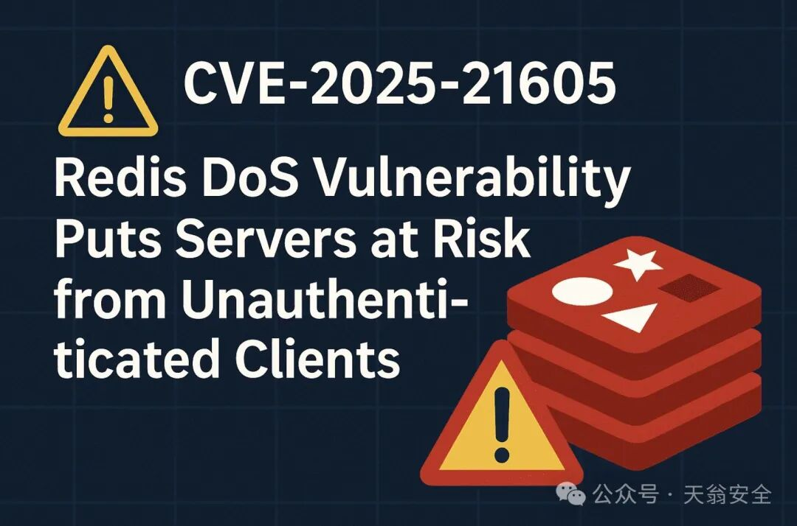
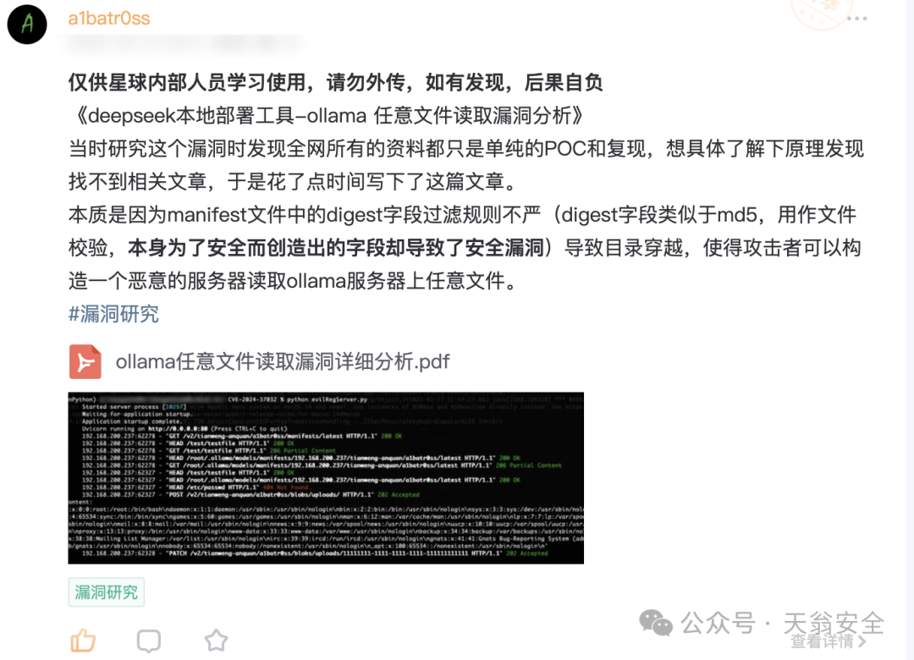
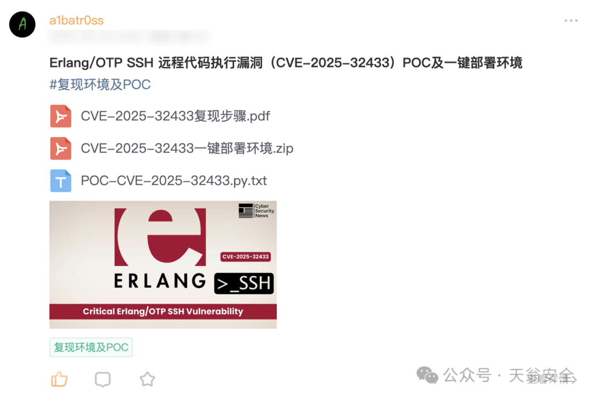
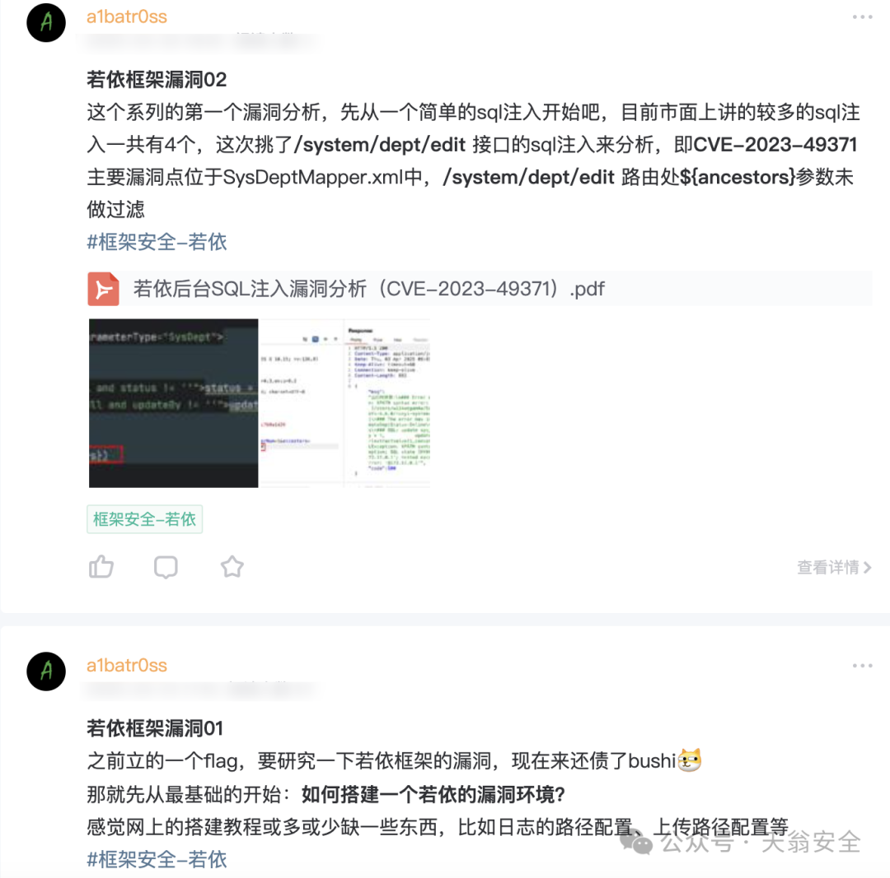
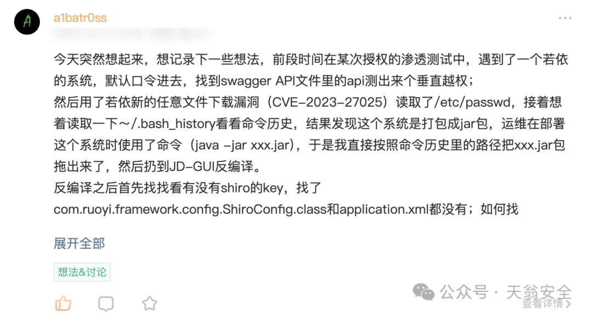

# 尽快更新Redis，最新漏洞可导致服务器遭受拒绝服务攻击（CVE-2025-21605）

<!-- vulwiki-editorial:start -->
## 校订与适用边界

- 适用前提：可达Redis端点、未认证NOAUTH响应输出缓冲区无适当限制，攻击者持续发送且不充分读取响应
- 证据范围：明确有密码也可能受DoS，区别普通无认证配置风险；三产品修补体系应分开不能按通用版本排序。

### 尚未解决的证据缺口

以下限制仍适用于后文历史材料；相关版本、结果或修复结论不能据此视为已验证：

- 没有官方公告链接，所有版本补丁列表需按产品分支核对
- Redis软件版本应明确商业Redis Software而非OSS，7.22等不能误认为开源服务器版本
- 执行未知OS命令/文件系统变更等入侵迹象不是此DoS独有证据，需区分泛安全排查与漏洞验证
- TLS只有要求客户端证书mTLS才控制匿名访问，单TLS加密不修复
- 未发现生产利用为当时官方自述需日期；尾部Ollama/OTP编号仅广告不得当主漏洞

### 操作风险与资料使用

- 含资源消耗、延时或崩溃验证：可能影响服务可用性；限制请求次数、并发与超时，保留无攻击负载的对照结果。

本页为文本校订，未执行代码、PoC 或目标请求；原图仅保留引用，未据此确认复现成功。
<!-- vulwiki-editorial:end -->

## 技术正文与历史材料

原创 a1batr0ss  天翁安全   2025-04-25 10:15  
  
## 漏洞背景  
  
Redis是一款广泛使用的开源内存数据库，支持持久化存储。Redis因其高性能、灵活性和广泛的应用场景而受到众多企业和开发者的青睐。随着其使用范围不断扩大，其安全性也受到越来越多的关注。  
  
2025年4月23日，Redis官方发布了一则关于CVE-2025-21605安全漏洞的公告。该漏洞被评估为高危漏洞，CVSS评分为7.5，可能导致Redis服务器遭受拒绝服务(DoS)攻击，严重影响业务连续性和系统可用性。  
  
  
## 漏洞介绍  
  
CVE-2025-21605是Redis中的一个拒绝服务漏洞，主要由未经认证的客户端滥用输出缓冲区无限增长造成。具体问题描述如下：  
### 漏洞原理  
  
默认情况下，Redis配置不会限制普通客户端的输出缓冲区大小。因此，输出缓冲区会随着时间无限增长，最终导致服务耗尽内存资源或被强制终止。  
  
当在Redis服务器上启用密码认证，但客户端未提供密码时，攻击者仍然可以利用"NOAUTH"响应导致输出缓冲区不断增长，直到系统耗尽内存资源。  
### 攻击条件  
  
要利用此漏洞，攻击者需要能够访问公开暴露的Redis端点。该漏洞特别危险，因为它：  
  
1.  
不需要任何认证即可触发  
2.  
可远程利用  
3.  
攻击复杂度低  
4.  
可能完全耗尽系统内存资源  
## 漏洞修复方案  
### 官方补丁  
  
Redis官方已经发布了修复此安全漏洞的补丁版本。建议所有用户尽快更新到以下版本：  
### Redis软件版本  
  
•  
7.22.0-28及以上版本  
•  
7.18.0-76及以上版本  
•  
7.8.4-95及以上版本  
•  
7.4.6-232及以上版本  
•  
7.2.4-122及以上版本  
•  
6.4.2-121及以上版本  
### Redis OSS/CE版本  
  
•  
7.4.3及以上版本  
•  
7.2.8及以上版本  
•  
6.2.18及以上版本  
### Redis Stack版本  
  
•  
7.4.0-v4及以上版本  
•  
7.2.0-v16及以上版本  
•  
6.2.6-v20及以上版本  
### 临时缓解措施  
  
如果无法立即更新Redis版本，可以采取以下临时缓解措施：  
  
1.   
限制网络访问：确保只有授权用户和系统可以访问Redis数据库。使用防火墙和网络策略限制访问，仅允许可信来源连接，防止未授权连接。  
  
2.   
强制使用TLS：如果端点是公开访问的且未启用TLS，则强制启用TLS并要求用户使用客户端证书进行身份验证（也称为mTLS或双向TLS）。  
  
3.   
网络隔离：将Redis服务部署在私有网络中，避免直接暴露在公网上。  
## 检测方法  
  
虽然Redis官方表示目前没有发现该漏洞在生产环境中被利用的证据，但仍建议用户检查以下可能的入侵迹象：  
  
1.  
来自未授权或未知来源的Redis数据库访问  
2.  
针对Redis数据库的异常网络入站流量  
3.  
不明原因的Redis服务器崩溃  
4.  
redis-server用户执行的未知、意外或异常命令  
5.  
来自Redis数据库的异常网络出站流量（或尝试）  
6.  
文件系统中的未知或异常更改，特别是在托管Redis持久化或配置文件的目录中  
## 漏洞披露  
  
该漏洞由研究人员@polaris-alioth通过Redis官方漏洞报告流程发现并报告。  
## 知识星球  
> 星球不定期更新市面上最新的热点漏洞及复现环境，欢迎加入交流和学习  
  
  
**市面热点漏洞详细分析**  
，与**deepseek本地部署**  
息息相关的：Ollama任意文件读取漏洞（CVE-2024-37032）详细分析  
  
  
  
**本月最新披露**  
漏洞：Erlang/OTP SSH 远程代码执行漏洞（CVE-2025-32433）POC及一键部署环境  
  
  
  
**框架漏洞专题-若依：**  
  
  
  
**实战渗透测试技巧分享&讨论**  
：某次若依系统渗透测试带来的思考与讨论  
  
  
  
一些比较新奇有趣的漏洞分享：Windows**拖拽图标**  
而触发的漏洞  
  
  
  
知识星球限时新人立减券发放  
  
  
  
  

---

> 来源：gelusus/wxvl（微信公众号漏洞文章自动归档，原文见文首链接）
