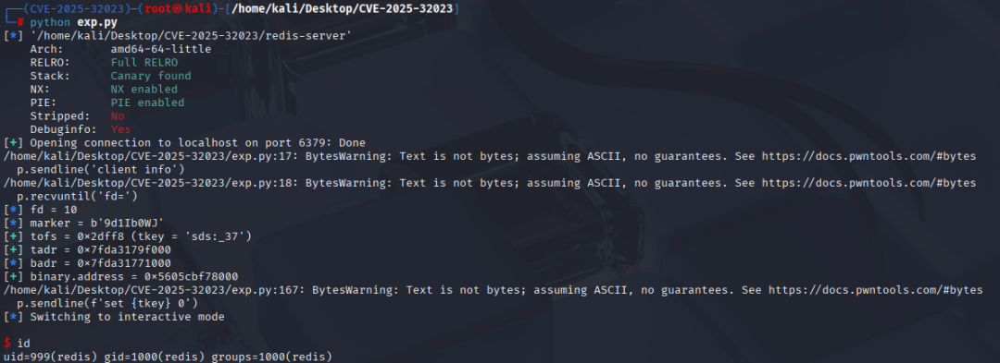

# 漏洞预警 | Redis hyperloglog 远程代码执行漏洞(CVE-2025-32023)

<!-- vulwiki-editorial:start -->
## 校订与适用边界

官方 7.0 分值对应 CVSS v3 AV:L/AC:H/PR:L 等向量。原表中“网络远程、难度低”的描述不能直接套用这组评分；8.0.3 的发布说明已列修复。

- 适用前提：已认证用户及可用 HyperLogLog 命令权限；HLL 栈/堆越界写的实际利用还取决于运行时条件
- 证据范围：根因描述run-length整数溢出到越界写合理，但复现仅厂商成功宣称和截图，没有协议/载荷/测试版本。

### 已有来源支持的更正

- 官方明确已认证用户、HLL栈/堆越界写。7.0评分实际CVSSv3 AV:L/AC:H/PR:L，故本文网络远程/利用难度低表格不对应引用官方向量；实际网络利用需另有证据解释。官方advisory Patched仍TBD属滞后，而8.0.3 release明确修复32023。

### 尚未解决的证据缺口

以下限制仍适用于后文历史材料；相关版本、结果或修复结论不能据此视为已验证：

- 影响分支用8.0.*<=等不合法范围语法，旧2.8–6.2.19区间未涵盖7.0等未列维护分支，需官方准确表
- 未明确认证/命令权限前提，利用难度低与仅截图RCE声明无法独立确认
- 评分7.0未标CVSS版本/向量
- 几乎整篇HTML表格样式，关键技术内容少；修复tag列表尚可但截图未视检
- ACL限制HyperLogLog应明确命令集合及业务影响，不能只用自然语言断言已缓解

### 核验来源

- https://github.com/redis/redis/security/advisories/GHSA-rp2m-q4j6-gr43

本页为文本校订，未执行代码、PoC 或目标请求；原图仅保留引用，未据此确认复现成功。
<!-- vulwiki-editorial:end -->

## 技术正文与历史材料

 内存泄漏   2025-07-09 01:49  
  
## 漏洞概述  
  
        Redis 是一个高性能的开源键值存储系统，支持多种数据结构如字符串、哈希、列表、集合和有序集合等，广泛用于缓存、消息队列和数据库场景。它基于内存存储，读写速度快，同时提供 RDB 和 AOF 持久化机制，确保数据安全。Redis 还支持事务功能，可以将多个命令打包执行，保证操作的原子性，适用于高并发场景。Redis HyperLogLog 是一种用于统计集合中不重复元素数量的概率型数据结构，基于 HyperLogLog 算法实现。它通过哈希映射和桶机制，以极低的内存占用（通常几十 KB）估算集合的基数，误差范围小且支持高并发操作。它还支持多个 HyperLogLog 对象的合并，适用于独立访客统计、社交网络用户关系统计等场景，能够高效地处理大规模数据集合的基数统计问题。  
  
        CVE-2025-32023 是 Redis HyperLogLog 数据结构中的一个高危漏洞，受影响版本在解析 HyperLogLog 稀疏编码数据时，未能充分验证操作码中的运行长度（run-length），导致攻击者可通过构造恶意数据引发整数溢出，绕过边界检查，最终实现堆内存的越界写入，进而可能触发远程代码执行。  
<table><tbody><tr style="-webkit-tap-highlight-color: transparent;margin: 0px;padding: 0px;outline: 0px;max-width: 100%;box-sizing: border-box !important;overflow-wrap: break-word !important;visibility: visible;"><td data-colwidth="280" style="-webkit-tap-highlight-color: transparent;margin: 0px;padding: 5px 10px;outline: 0px;overflow-wrap: break-word !important;word-break: break-all;hyphens: auto;border: 1px solid rgb(221, 221, 221);max-width: 100%;box-sizing: border-box !important;visibility: visible;"><section style="-webkit-tap-highlight-color: transparent;margin: 0px;padding: 0px;outline: 0px;max-width: 100%;box-sizing: border-box !important;overflow-wrap: break-word !important;text-align: center;visibility: visible;">漏洞编号</section></td><td data-colwidth="268" style="-webkit-tap-highlight-color: transparent;margin: 0px;padding: 5px 10px;outline: 0px;overflow-wrap: break-word !important;word-break: break-all;hyphens: auto;border: 1px solid rgb(221, 221, 221);max-width: 100%;box-sizing: border-box !important;visibility: visible;">
CVE-2025-32023
</td></tr><tr style="-webkit-tap-highlight-color: transparent;margin: 0px;padding: 0px;outline: 0px;max-width: 100%;box-sizing: border-box !important;overflow-wrap: break-word !important;visibility: visible;"><td data-colwidth="280" style="-webkit-tap-highlight-color: transparent;margin: 0px;padding: 5px 10px;outline: 0px;overflow-wrap: break-word !important;word-break: break-all;hyphens: auto;border: 1px solid rgb(221, 221, 221);max-width: 100%;box-sizing: border-box !important;visibility: visible;"><section style="-webkit-tap-highlight-color: transparent;margin: 0px;padding: 0px;outline: 0px;max-width: 100%;box-sizing: border-box !important;overflow-wrap: break-word !important;text-align: center;visibility: visible;">漏洞类型</section></td><td data-colwidth="268" style="-webkit-tap-highlight-color: transparent;margin: 0px;padding: 5px 10px;outline: 0px;overflow-wrap: break-word !important;word-break: break-all;hyphens: auto;border: 1px solid rgb(221, 221, 221);max-width: 100%;box-sizing: border-box !important;visibility: visible;"><section style="-webkit-tap-highlight-color: transparent;margin: 0px;padding: 0px;outline: 0px;max-width: 100%;box-sizing: border-box !important;overflow-wrap: break-word !important;text-align: center;visibility: visible;">代码执行漏洞</section></td></tr><tr style="-webkit-tap-highlight-color: transparent;margin: 0px;padding: 0px;outline: 0px;max-width: 100%;box-sizing: border-box !important;overflow-wrap: break-word !important;visibility: visible;"><td data-colwidth="280" style="-webkit-tap-highlight-color: transparent;margin: 0px;padding: 5px 10px;outline: 0px;overflow-wrap: break-word !important;word-break: break-all;hyphens: auto;border: 1px solid rgb(221, 221, 221);max-width: 100%;box-sizing: border-box !important;visibility: visible;"><section style="-webkit-tap-highlight-color: transparent;margin: 0px;padding: 0px;outline: 0px;max-width: 100%;box-sizing: border-box !important;overflow-wrap: break-word !important;text-align: center;visibility: visible;">漏洞评分</section></td><td data-colwidth="268" style="-webkit-tap-highlight-color: transparent;margin: 0px;padding: 5px 10px;outline: 0px;overflow-wrap: break-word !important;word-break: break-all;hyphens: auto;border: 1px solid rgb(221, 221, 221);max-width: 100%;box-sizing: border-box !important;visibility: visible;"><section style="-webkit-tap-highlight-color: transparent;margin: 0px;padding: 0px;outline: 0px;max-width: 100%;box-sizing: border-box !important;overflow-wrap: break-word !important;text-align: center;visibility: visible;">7.0</section></td></tr><tr style="-webkit-tap-highlight-color: transparent;margin: 0px;padding: 0px;outline: 0px;max-width: 100%;box-sizing: border-box !important;overflow-wrap: break-word !important;visibility: visible;"><td data-colwidth="280" style="-webkit-tap-highlight-color: transparent;margin: 0px;padding: 5px 10px;outline: 0px;overflow-wrap: break-word !important;word-break: break-all;hyphens: auto;border: 1px solid rgb(221, 221, 221);max-width: 100%;box-sizing: border-box !important;visibility: visible;"><section style="-webkit-tap-highlight-color: transparent;margin: 0px;padding: 0px;outline: 0px;max-width: 100%;box-sizing: border-box !important;overflow-wrap: break-word !important;text-align: center;visibility: visible;">漏洞等级</section></td><td data-colwidth="268" style="-webkit-tap-highlight-color: transparent;margin: 0px;padding: 5px 10px;outline: 0px;overflow-wrap: break-word !important;word-break: break-all;hyphens: auto;border: 1px solid rgb(221, 221, 221);max-width: 100%;box-sizing: border-box !important;visibility: visible;"><section style="-webkit-tap-highlight-color: transparent;margin: 0px;padding: 0px;outline: 0px;max-width: 100%;box-sizing: border-box !important;overflow-wrap: break-word !important;text-align: center;visibility: visible;">高危</section></td></tr><tr style="-webkit-tap-highlight-color: transparent;margin: 0px;padding: 0px;outline: 0px;max-width: 100%;box-sizing: border-box !important;overflow-wrap: break-word !important;visibility: visible;"><td data-colwidth="280" style="-webkit-tap-highlight-color: transparent;margin: 0px;padding: 5px 10px;outline: 0px;overflow-wrap: break-word !important;word-break: break-all;hyphens: auto;border: 1px solid rgb(221, 221, 221);max-width: 100%;box-sizing: border-box !important;visibility: visible;"><section style="-webkit-tap-highlight-color: transparent;margin: 0px;padding: 0px;outline: 0px;max-width: 100%;box-sizing: border-box !important;overflow-wrap: break-word !important;text-align: center;visibility: visible;">影响组件</section></td><td data-colwidth="268" style="-webkit-tap-highlight-color: transparent;margin: 0px;padding: 5px 10px;outline: 0px;overflow-wrap: break-word !important;word-break: break-all;hyphens: auto;border: 1px solid rgb(221, 221, 221);max-width: 100%;box-sizing: border-box !important;visibility: visible;"><section style="-webkit-tap-highlight-color: transparent;margin: 0px;padding: 0px;outline: 0px;max-width: 100%;box-sizing: border-box !important;overflow-wrap: break-word !important;text-align: center;visibility: visible;">Redis HyperLogLog</section></td></tr><tr style="-webkit-tap-highlight-color: transparent;margin: 0px;padding: 0px;outline: 0px;max-width: 100%;box-sizing: border-box !important;overflow-wrap: break-word !important;visibility: visible;"><td data-colwidth="280" style="-webkit-tap-highlight-color: transparent;margin: 0px;padding: 5px 10px;outline: 0px;overflow-wrap: break-word !important;word-break: break-all;hyphens: auto;border: 1px solid rgb(221, 221, 221);max-width: 100%;box-sizing: border-box !important;visibility: visible;"><section style="-webkit-tap-highlight-color: transparent;margin: 0px;padding: 0px;outline: 0px;max-width: 100%;box-sizing: border-box !important;overflow-wrap: break-word !important;text-align: center;visibility: visible;">利用成熟度</section></td><td data-colwidth="268" style="-webkit-tap-highlight-color: transparent;margin: 0px;padding: 5px 10px;outline: 0px;overflow-wrap: break-word !important;word-break: break-all;hyphens: auto;border: 1px solid rgb(221, 221, 221);max-width: 100%;box-sizing: border-box !important;visibility: visible;"><section style="-webkit-tap-highlight-color: transparent;margin: 0px;padding: 0px;outline: 0px;max-width: 100%;box-sizing: border-box !important;overflow-wrap: break-word !important;text-align: center;visibility: visible;">PoC已公开</section></td></tr><tr style="-webkit-tap-highlight-color: transparent;margin: 0px;padding: 0px;outline: 0px;max-width: 100%;box-sizing: border-box !important;overflow-wrap: break-word !important;visibility: visible;"><td data-colwidth="280" style="-webkit-tap-highlight-color: transparent;margin: 0px;padding: 5px 10px;outline: 0px;overflow-wrap: break-word !important;word-break: break-all;hyphens: auto;border: 1px solid rgb(221, 221, 221);max-width: 100%;box-sizing: border-box !important;visibility: visible;"><section style="-webkit-tap-highlight-color: transparent;margin: 0px;padding: 0px;outline: 0px;max-width: 100%;box-sizing: border-box !important;overflow-wrap: break-word !important;text-align: center;visibility: visible;">利用难度</section></td><td data-colwidth="268" style="-webkit-tap-highlight-color: transparent;margin: 0px;padding: 5px 10px;outline: 0px;overflow-wrap: break-word !important;word-break: break-all;hyphens: auto;border: 1px solid rgb(221, 221, 221);max-width: 100%;box-sizing: border-box !important;visibility: visible;"><section style="-webkit-tap-highlight-color: transparent;margin: 0px;padding: 0px;outline: 0px;max-width: 100%;box-sizing: border-box !important;overflow-wrap: break-word !important;text-align: center;visibility: visible;">低</section></td></tr><tr style="-webkit-tap-highlight-color: transparent;margin: 0px;padding: 0px;outline: 0px;max-width: 100%;box-sizing: border-box !important;overflow-wrap: break-word !important;visibility: visible;"><td data-colwidth="280" style="-webkit-tap-highlight-color: transparent;margin: 0px;padding: 5px 10px;outline: 0px;overflow-wrap: break-word !important;word-break: break-all;hyphens: auto;border: 1px solid rgb(221, 221, 221);max-width: 100%;box-sizing: border-box !important;visibility: visible;"><section style="-webkit-tap-highlight-color: transparent;margin: 0px;padding: 0px;outline: 0px;max-width: 100%;box-sizing: border-box !important;overflow-wrap: break-word !important;text-align: center;visibility: visible;">利用方式</section></td><td data-colwidth="268" style="-webkit-tap-highlight-color: transparent;margin: 0px;padding: 5px 10px;outline: 0px;overflow-wrap: break-word !important;word-break: break-all;hyphens: auto;border: 1px solid rgb(221, 221, 221);max-width: 100%;box-sizing: border-box !important;visibility: visible;"><section style="-webkit-tap-highlight-color: transparent;margin: 0px;padding: 0px;outline: 0px;max-width: 100%;box-sizing: border-box !important;overflow-wrap: break-word !important;text-align: center;visibility: visible;">网络远程</section></td></tr></tbody></table>

## 影响范围  
<table><tbody><tr style="-webkit-tap-highlight-color: transparent;margin: 0px;padding: 0px;outline: 0px;max-width: 100%;box-sizing: border-box !important;overflow-wrap: break-word !important;visibility: visible;"><td data-colwidth="148" align="center" style="-webkit-tap-highlight-color: transparent;margin: 0px;padding: 5px 10px;outline: 0px;word-break: break-all;hyphens: auto;border: 1px solid rgb(221, 221, 221);max-width: 100%;overflow-wrap: break-word !important;box-sizing: border-box !important;visibility: visible;"><section style="-webkit-tap-highlight-color: transparent;margin: 0px;padding: 0px;outline: 0px;max-width: 100%;box-sizing: border-box !important;overflow-wrap: break-word !important;visibility: visible;">受影响版本</section></td><td data-colwidth="408" align="center" style="-webkit-tap-highlight-color: transparent;margin: 0px;padding: 5px 10px;outline: 0px;word-break: break-all;hyphens: auto;border: 1px solid rgb(221, 221, 221);max-width: 100%;overflow-wrap: break-word !important;box-sizing: border-box !important;visibility: visible;"><section>8.0.* &lt;= redis &lt; 8.0.3</section><section>7.2.* &lt;= redis &lt; 7.2.10</section><section>7.4.* &lt;= redis &lt; 7.4.5</section><section>2.8 &lt;= redis &lt; 6.2.19</section></td></tr><tr style="-webkit-tap-highlight-color: transparent;margin: 0px;padding: 0px;outline: 0px;max-width: 100%;box-sizing: border-box !important;overflow-wrap: break-word !important;visibility: visible;"><td data-colwidth="148" align="center" style="-webkit-tap-highlight-color: transparent;margin: 0px;padding: 5px 10px;outline: 0px;word-break: break-all;hyphens: auto;border: 1px solid rgb(221, 221, 221);max-width: 100%;overflow-wrap: break-word !important;box-sizing: border-box !important;visibility: visible;"><section style="-webkit-tap-highlight-color: transparent;margin: 0px;padding: 0px;outline: 0px;max-width: 100%;box-sizing: border-box !important;overflow-wrap: break-word !important;visibility: visible;">修复版本</section><section style="-webkit-tap-highlight-color: transparent;margin: 0px;padding: 0px;outline: 0px;max-width: 100%;box-sizing: border-box !important;overflow-wrap: break-word !important;visibility: visible;"> </section></td><td data-colwidth="408" align="center" style="-webkit-tap-highlight-color: transparent;margin: 0px;padding: 5px 10px;outline: 0px;word-break: break-all;hyphens: auto;border: 1px solid rgb(221, 221, 221);max-width: 100%;overflow-wrap: break-word !important;box-sizing: border-box !important;visibility: visible;"><section style="visibility: visible;">8.0.3 = redis</section><section style="visibility: visible;">7.2.10 = redis</section><section style="visibility: visible;">7.4.5 = redis</section><section style="visibility: visible;">6.2.19 = redis</section></td></tr></tbody></table>

## 漏洞复现  
  
银河哈希已成功复现Redis hyperloglog 远程代码执行漏洞  
  
## 解决方案  
  
升级至安全版本  
  
https://github.com/redis/redis/releases  
  
**临时缓解措施**  
  
使用Redis ACL限制用户执行 hyperloglog 操作。  
## 参考文献  
  
https://github.com/redis/redis/releases   
  
https://github.com/redis/redis/security/advisories/GHSA-rp2m-q4j6-gr43  
> ❝  
> 大连银河哈希安全技术科技有限公司成立于2022年，公司初创团队源于国内知名战队ChaMd5安全团队组建，曾获2023年大连市“连盾”演练第二名及各地市优秀攻击队，并获得多地网信办、经侦支队及应急保障中心感谢信，也服务多家CTF厂商举办赛事。  
> ❞  
  
  

---

> 来源：gelusus/wxvl（微信公众号漏洞文章自动归档，原文见文首链接）
