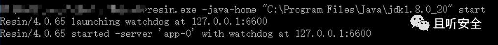
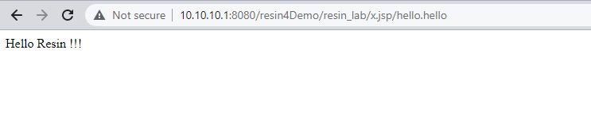
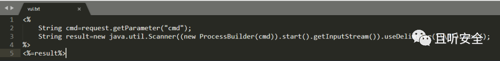

# Resin 4.0.65 非严格映射下的 JSP 目录解析分析

本文以原创中文摘要整理 FrameVul 引用的《Resin容器文件解析漏洞深入分析》。原文来自 QCyber／且听安全，正文和截图已从其精确 URL 的 2021-11-30 公开存档恢复；存档日期不是发布日期。保存的页面时间字段对应 2021-10-12（UTC+8）。

## 适用范围与证据分层

原作者使用 Windows Resin 4.0.65、JDK `1.8.0_20`，手工在 Web 应用目录建立 `vul.jsp` 文件夹并放入 `vul.txt`。这是“已经能放置文件后，文件如何被解析”的案例，没有展示通过 HTTP 上传文件或取得写入权限的漏洞。不能推成任意匿名访问者可直接远程执行代码，也不能把原文“影响全部版本”的说法升级为本库确认的版本范围。



证据分为三层：

1. **原作者实验记录**：4.0.65 启动信息、`webapps/ROOT/vul.jsp/vul.txt` 路径及本机浏览器结果来自原文图片。它们是作者记录，本库没有复现。
2. **固定源码镜像**：`l2dy/resin-src-4.0.x` 提交 [72db80b9c25fe32329c3ad3127ced7d5b86b95be](https://github.com/l2dy/resin-src-4.0.x/commit/72db80b9c25fe32329c3ad3127ced7d5b86b95be)自述从 `resin-4.0.65-src.tar.gz` 导入，[`configure.ac` 第1行](https://github.com/l2dy/resin-src-4.0.x/blob/72db80b9c25fe32329c3ad3127ced7d5b86b95be/configure.ac#L1)也声明4.0.65。本次核对的是这个第三方镜像的固定字节，没有证明它与官方发行包逐字节相同，不能称为厂商 Git 源码验证。
3. **厂商文档**：[Caucho 4.0 配置文档的 strict-mapping 节](https://caucho.com/resin-4.0/admin/deploy-ref.xtp)明确说明默认非严格匹配允许 JSP 后附带路径，并提供严格模式设置。[官方发行说明](https://caucho.com/newsletter/caucho-newsletter-august-2020)确认4.0.65的发行标识；它不证明本问题的修复版本。

## 已公开的完整非命令执行示例

为避免猜补原作者截图中被水印遮挡的 JSP 字符，以下采用另一份已固定的公开演示，**不是对遮挡代码的重建，也不是原作者实验的逐字恢复**。

[istoliving/JavaSec 固定 README 第10–34行](https://github.com/istoliving/JavaSec/blob/c5b02696cd0551c53464881baa699f92f006232d/middleware/resin/note/README.md#L10-L34)给出4.0.65配置路径、完整 JSP 内容，以及“JSP后缀目录内的其他后缀文件会被作为JSP解析”的步骤。其三行代码原样为：

```jsp
<%
    response.getWriter().write("Hello Resin !!!");
%>
```

同一节的[固定原图](https://github.com/istoliving/JavaSec/blob/c5b02696cd0551c53464881baa699f92f006232d/middleware/resin/note/img/144174242-db437f8b-0feb-4683-8e46-7e7586905a15-164000592925175.png)显示完整示例地址：

```text
http://10.10.10.1:8080/resin4Demo/resin_lab/x.jsp/hello.hello
```

在该作者给定的 Web 应用目录与非严格 JSP 映射条件下，公开步骤是先建立 `x.jsp` 目录，将示例 JSP 内容存入其中的 `hello.hello`，再访问上述文件路径。图中响应正文为 `Hello Resin !!!`，而不是 JSP 源文本；这才是该演示的解析结果，单独 HTTP 200 不足以说明解析成功。地址、文件名和测试字符串均为来源原值，本次没有请求该地址。



原始且听安全案例则使用 `vul.jsp/vul.txt` 与 `cmd=whoami`。其 JSP 截图中的第三行被原有水印部分遮挡，因此不转录成所谓完整可运行代码；下图原字节保存，遮挡没有被补字或移除。可见部分调用 `ProcessBuilder(cmd).start()`，会把请求中的 `cmd` 用作进程启动参数，这是有副作用的命令执行示例，不是被动解析检查。



## 固定镜像中的路由机制

以下结论仅来自上述第三方4.0.65源码镜像：

- [`conf/app-default.xml` 第19–53行](https://github.com/l2dy/resin-src-4.0.x/blob/72db80b9c25fe32329c3ad3127ced7d5b86b95be/conf/app-default.xml#L19-L53)把 `*.jsp`、`*.jspf` 交给 `resin-jsp`，把 `*.jspx` 交给 `resin-jspx`。配置显示映射存在，不单独证明三个变体都在原作者环境中测试过。
- [`ServletMapper.addUrlMapping` 第165–172行](https://github.com/l2dy/resin-src-4.0.x/blob/72db80b9c25fe32329c3ad3127ced7d5b86b95be/modules/resin/src/com/caucho/server/dispatch/ServletMapper.java#L165-L172)按 `isStrictMapping()` 选择严格或普通映射分支。
- [`UrlMap.addMap` 第160–221行](https://github.com/l2dy/resin-src-4.0.x/blob/72db80b9c25fe32329c3ad3127ced7d5b86b95be/modules/resin/src/com/caucho/server/dispatch/UrlMap.java#L160-L221)将普通扩展名映射转为正则；对 `*.jsp`，依其字符串构造逻辑可得到 `^.*\.jsp(?=/)|^.*\.jsp\z`。这是静态推导，不是执行该类后的输出。前一分支可匹配路径中斜杠前的 `.jsp`，无需整个 URL 以 `.jsp` 结束。
- [`UrlMap.map` 第482–537行](https://github.com/l2dy/resin-src-4.0.x/blob/72db80b9c25fe32329c3ad3127ced7d5b86b95be/modules/resin/src/com/caucho/server/dispatch/UrlMap.java#L482-L537)用 `matcher.find()` 选中映射；[`ServletMapper.mapServlet` 第325–364行](https://github.com/l2dy/resin-src-4.0.x/blob/72db80b9c25fe32329c3ad3127ced7d5b86b95be/modules/resin/src/com/caucho/server/dispatch/ServletMapper.java#L325-L364)保存 servletPath/pathInfo，再建立对应处理链。这解释了来源所述路径为何进入 JSP 处理，而不是仅按最后一段文件扩展名决定处理器。

## 配置缓解与未知修复版本

不能仅校验上传文件的最后扩展名，还需约束整个保存路径以及内容的可执行性。根据本案例的前提，将不可信上传内容隔离在不能进入 JSP 解析的存储/服务边界，并禁止不可信输入控制 `.jsp` 等解析目录名，可切断这条路径；这是从已读数据流得到的缓解分析，不是已完成的部署测试。

Caucho 4.0 文档提供的 `resin-web.xml` 严格映射示例原样为：

```xml
<web-app xmlns="http://caucho.com/ns/resin">
  <strict-mapping>true</strict-mapping>
</web-app>
```

文档说明它禁用上述 PATH_INFO 匹配行为。固定镜像的 [`UrlMap.addStrictMap` 第285–343行](https://github.com/l2dy/resin-src-4.0.x/blob/72db80b9c25fe32329c3ad3127ced7d5b86b95be/modules/resin/src/com/caucho/server/dispatch/UrlMap.java#L285-L343)也采用末尾锚定。更改会影响依赖这类路径的正常应用路由，应先由维护者评估兼容性；本次没有应用配置、重启服务或验证修复效果。未取得本问题的厂商修复发行版，`fixed_version` 保持 `unknown`，不把4.0.66的其他安全修复当成同一问题已修。

## 静态审查与副作用边界

- 已完整读原文可见技术文字、前7张原图、独立固定 README 的第1–96行及其3张相关图片；没有补读原文后续14张图片，也没有展开独立仓库的其他利用主题。
- 独立 Hello JSP 仅向当前 HTTP 响应写入固定字符串，没有网络回连、进程启动、安装下载、持久化或文件删除语句。文件创建、JSP编译缓存及访问日志是流程本身的留存。
- 原文的命令执行 JSP 因水印遮挡没有被宣称完整审阅或完整转录；它不作为本节完整示例的代码来源。原作者调试配置还开启 `address=18000,server=y,suspend=n` 的 JDWP 监听，扩大了调试接口暴露面，不是实现解析行为所必需的操作建议。
- 固定镜像的 `UrlMap.java` 与 `ServletMapper.java` 全文已读；配置文件仅核对第1–90行，`ServletMapping` 和 XML schema 只核对严格映射字段/声明。未发现两份完整已读类中有与路由目的无关的下载、外传或安装逻辑；这不覆盖其余产品、Java依赖、镜像构建脚本、二进制或发行包。
- 本文没有提供或运行新写的利用程序，没有执行来源命令、开启远程调试、安装依赖或访问示例主机；所有技术结论止于所列文献与源码范围。

