# 【最新漏洞预警】CVE-2022-22733 ShardingSphere ElasticJob-UI从权限提升到H2 RCE

<!-- vulwiki-editorial:start -->
## 校订与适用边界

- 适用前提：已有来宾账户/有效guest登录，返回Token含root凭据；H2执行需数据源测试权限、兼容H2/JDK与远程SQL可达
- 证据范围：JSON序列化认证对象泄露root密码是核心CVE，H2 JDBC执行是取得管理权限后的链式影响；不是无凭据访问。

### 尚未解决的证据缺口

以下限制仍适用于后文历史材料；相关版本、结果或修复结论不能据此视为已验证：

- 未授权的来宾账号容易误解，应写低权限已认证用户
- Access-Token头本身只是正常认证机制，需说明为何能伪造/获得高权限值才称绕过
- 关键token解码程序、JDBC URL与路径及修复版本都在图片，未视检；只给poc.sql无法独立复现
- 没有Apache原始公告/修复tag直链，标题最新无日期
- SQL创建EXEC alias会留状态且calc限Windows，无清理

本页为文本校订，未执行代码、PoC 或目标请求；原图仅保留引用，未据此确认复现成功。
<!-- vulwiki-editorial:end -->

## 技术正文与历史材料

<meta name="referrer" content="no-referrer"/>

> 本文由 [简悦 SimpRead](http://ksria.com/simpread/) 转码， 原文地址 [mp.weixin.qq.com](https://mp.weixin.qq.com/s/g7yOHp_T4JssCeM9snJusA)

  ** 且听安全 ** 聪者听于无形，明者见于未形；专注网络安全，关注漏洞态势；拒绝重复搬运，只做精品原创。 75篇原创内容   公众号

**关注公众号回复“漏洞”获取研究环境或工具**

  

  

  

漏洞信息

  

2022年1月20日，Apache官方通报了一则 Apache ShardingSphere ElasticJob-UI的漏洞信息：

  

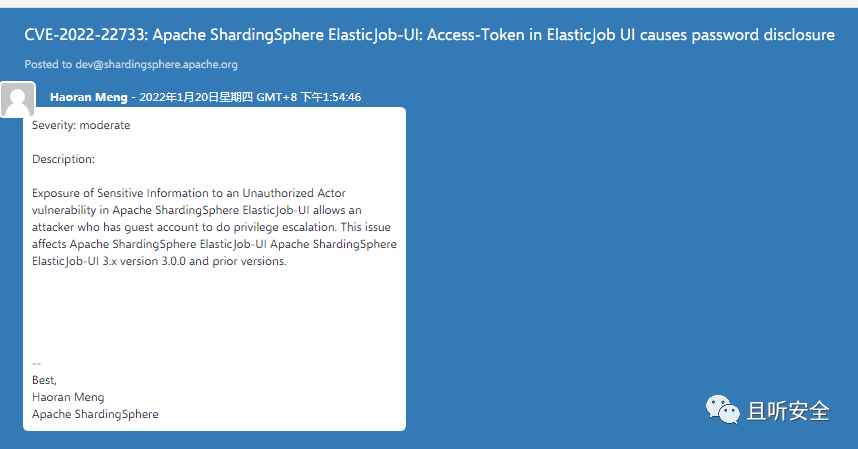

  

未授权的来宾账号可实现权限提升，获取管理员权限，进而实现RCE。影响Apache ShardingSphere ElasticJob-UI v3.0.0 及之前的版本。

  

  

  

环境搭建

  

下载v3.0.0版本：

  

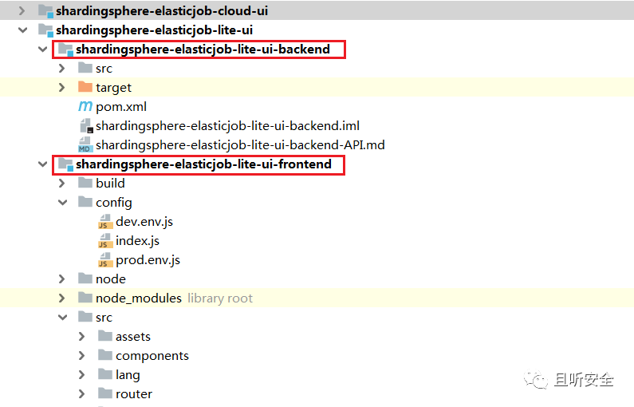

  

Apache ShardingSphere ElasticJob-UI采用的是前后端分离的架构，后端程序`shardingsphere-elasticjob-lite-ui-backend`采用SpringBoot框架设计，完成`pom.xml`依赖的jar包安装后，直接启动：

  

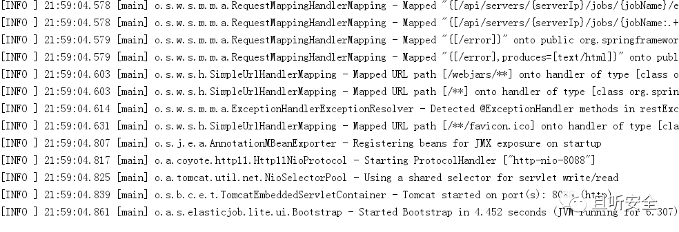

  

前端程序`shardingsphere-elasticjob-lite-ui-frontend`采用VUE框架设计，可以通过`npm install`完成依赖项安装，然后运行`npm run dev`启动：

  

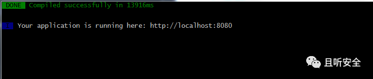

  

前后端路由映射规则如下：

  

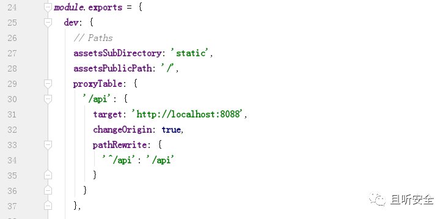

  

  

  

权限提升

  

利用来宾账号`guest/guest`登录，将进入`org.apache.shardingsphere.elasticjob.lite.ui.security.AuthenticationFilter`拦截器：

  

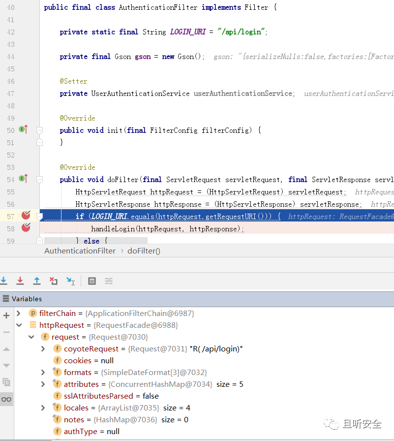

  

进入`handleLogin`函数：

  

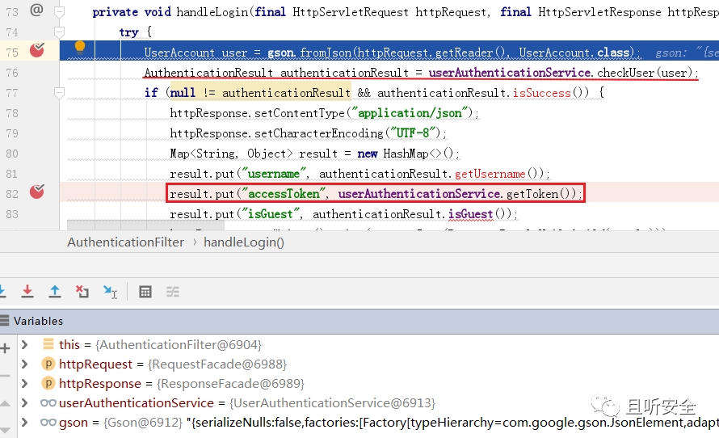

  

`userAuthenticationService.checkUser`完成认证检查，当登录成功后，将调用`userAuthenticationService.getToken`：  

  

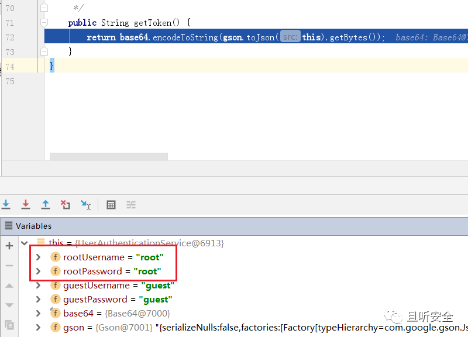

  

`getToken`将`userAuthenticationService`对象通过Json序列化处理，而`userAuthenticationService`包含了root用户的密码信息，返回`handleLogin`函数：

  

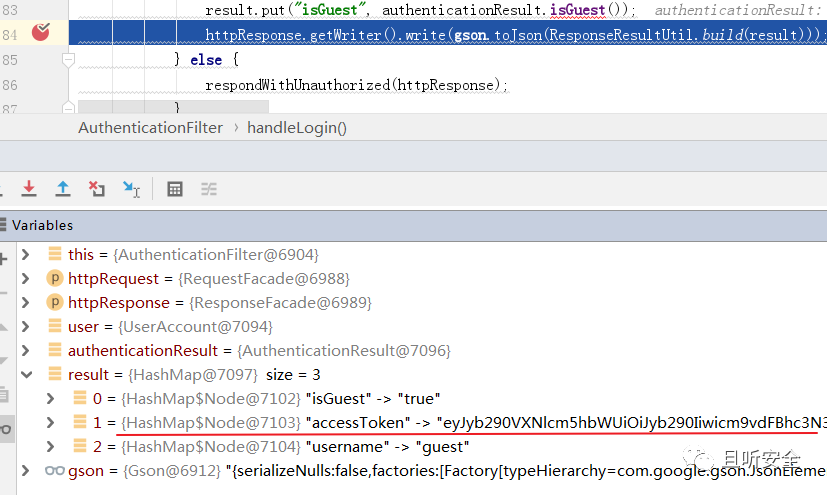

  

将密码信息直接返回给用户：

  

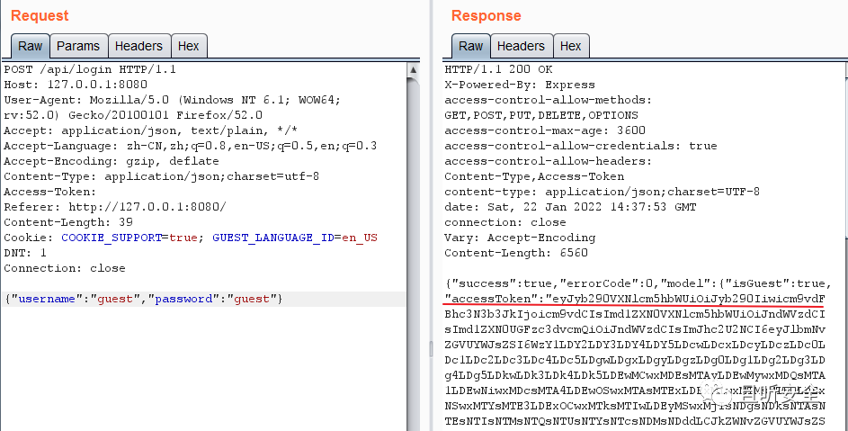

  

回顾`getToken`函数，我们可以通过构造如下代码解码提取密码：

  

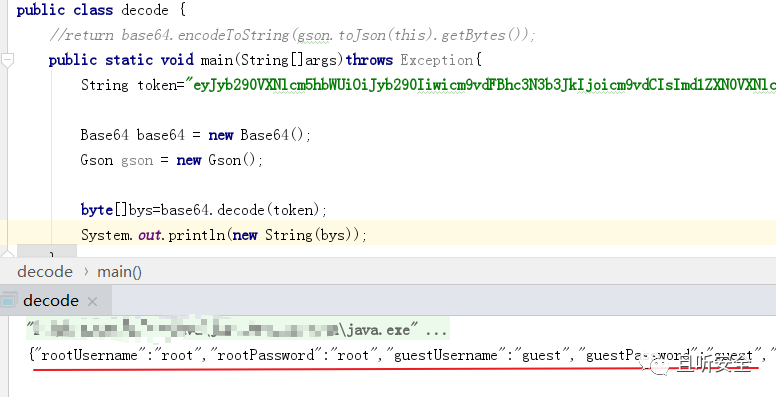

  

可以利用root账号和密码登录，从而实现权限提升。回顾`AuthenticationFilter`认证的处理过程，也可以直接通过添加`Access-Token`的HTTP头完成认证绕过：

  

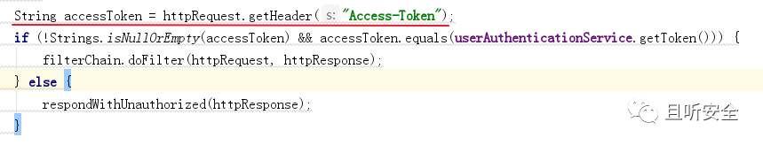

  

  

  

命令执行

  

root用户登录后存在一个`Add a data source`的功能：

  

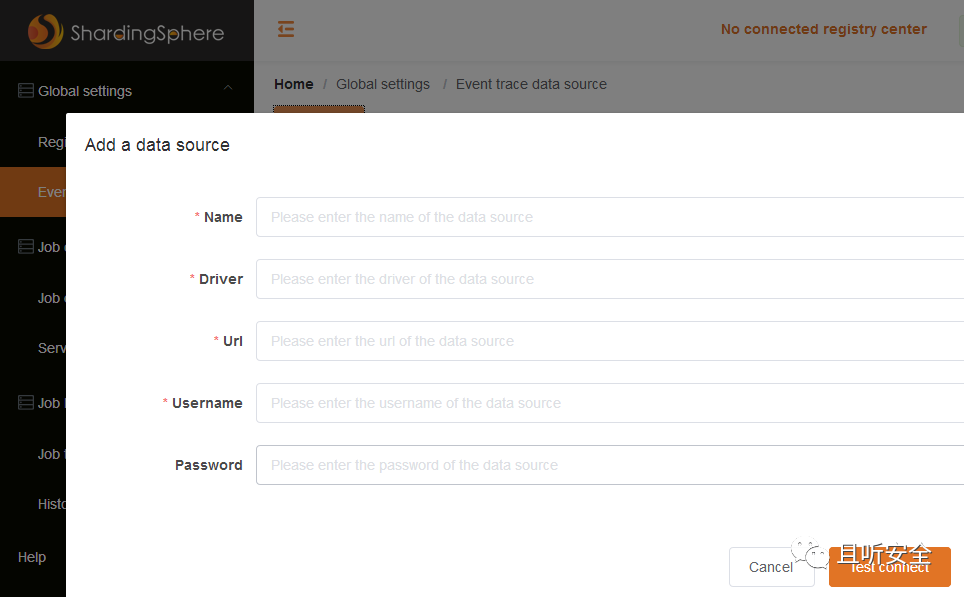

  

可以选择H2 database数据源类型，点击`Test connect`，进入`EventTraceDataSourceController#connectTest`：

  

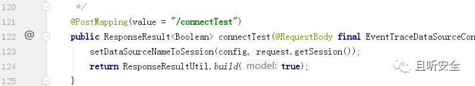

  

一路往下，来到`EventTraceDataSource`，参考HITB2021议题《Make JDBC Attacks Brilliant Again》,可以实现JDBC Connection URL攻击：

  

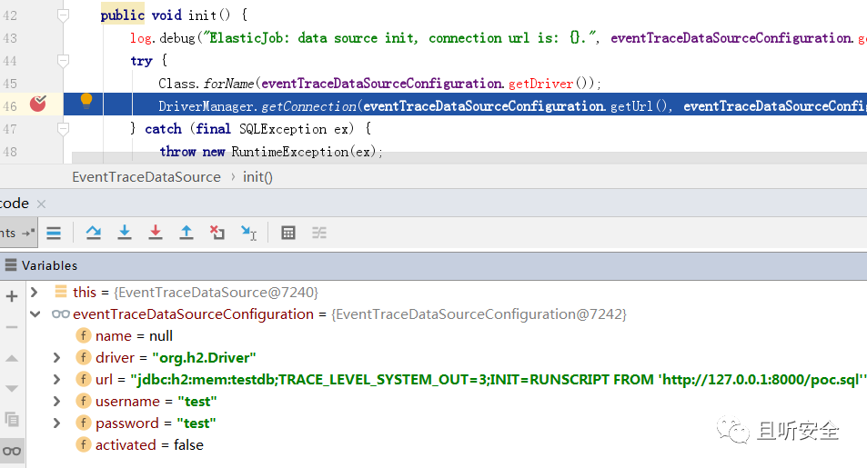

  

其中`poc.sql`内容如下：

  

```
CREATE ALIAS EXEC AS 'String shellexec(String cmd) throws java.io.IOException {Runtime.getRuntime().exec(cmd);return "Q";}';CALL EXEC ('calc')
```

  

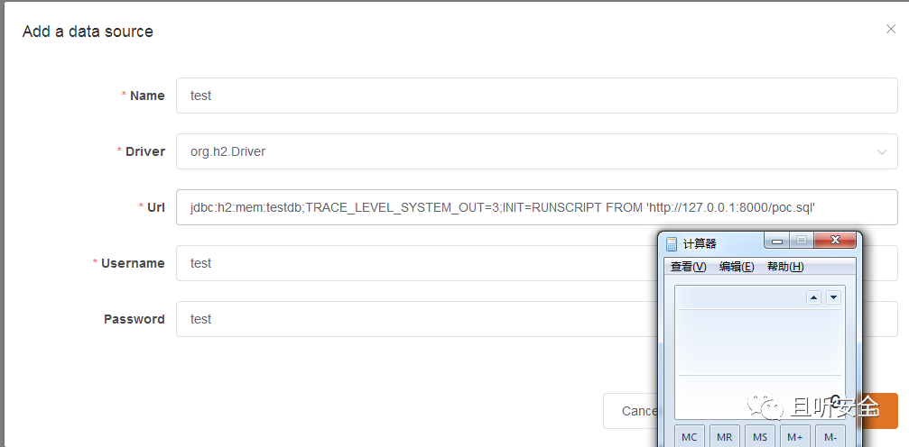

  

  

  

修复方式

  

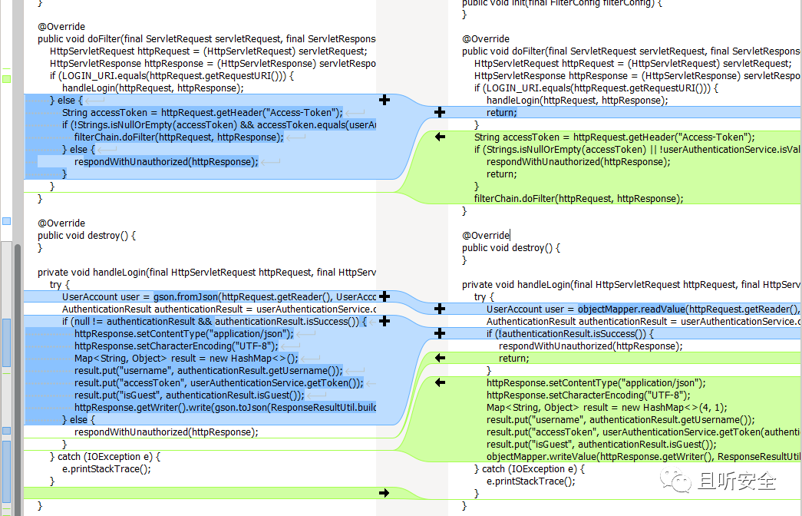

  

`handleLogin`函数在返回`accessToken`时的修改如下：

  

```
result.put("accessToken", userAuthenticationService.getToken(authenticationResult.getUsername(), authenticationResult.isGuest()));
```

  

去掉了密码信息。

  

  

**由于传播、利用此文档提供的信息而造成任何直接或间接的后果及损害，均由使用本人负责，且听安全团队及文章作者不为此承担任何责任。**

  

  

点关注，不迷路！


**关注公众号回复“漏洞”获取研究环境或工具**

---

> 来源：MrWQ/vulnerability-paper（https://github.com/MrWQ/vulnerability-paper）
