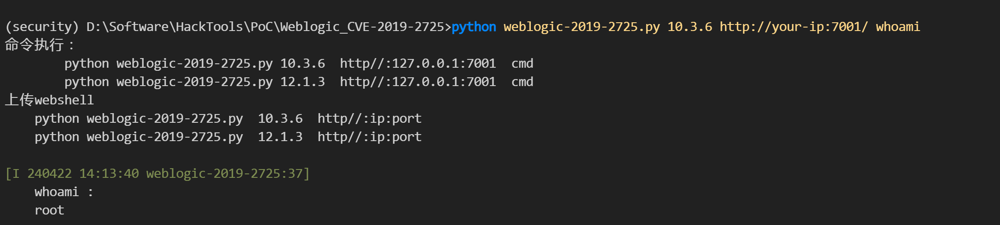
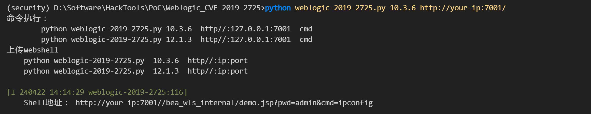
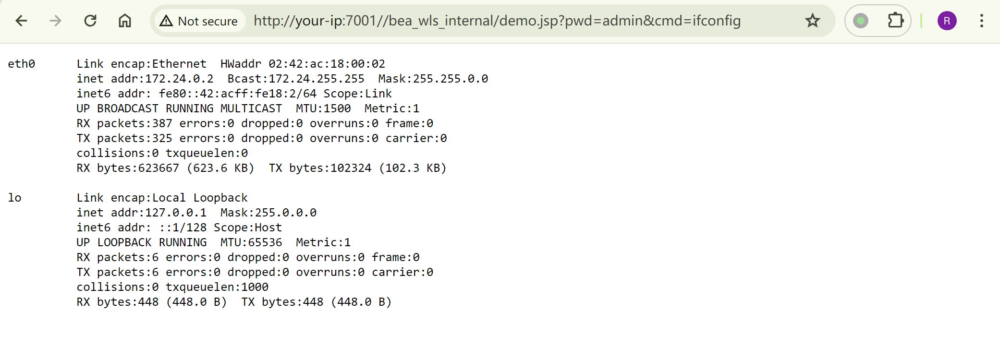

# Weblogic XMLDecoder 反序列化远程代码执行漏洞 CVE-2019-2725

<!-- vulwiki-editorial:start -->
## 校订与适用边界

- 适用前提：Unpatched async/WLS-WSAT endpoint and external TopScrew script; test lab uses old 10271 image
- 证据范围：Short command-only reproduction relies on an external script; old lab success alone does not establish bypass of earlier patched XMLDecoder flaw.

### 本次正文校订

- 按实际内容修正 3 处代码围栏语言标记，保留其中方法与请求内容。

### 尚未解决的证据缺口

以下限制仍适用于后文历史材料；相关版本、结果或修复结论不能据此视为已验证：

- No installed patch baseline, JDK conditions, raw request or resulting output in text
- No fix guidance or cleanup of uploaded webshell
- Component name wsat.war needs exact deployment-name verification

### 操作风险与资料使用

- 含落盘脚本或账户创建：会留下持久状态。记录本次生成的路径或账户，测试后清理这些对象并撤销关联令牌；不要删除既有业务对象。

本页为文本校订，未执行代码、PoC 或目标请求；原图仅保留引用，未据此确认复现成功。
<!-- vulwiki-editorial:end -->

## 技术正文与历史材料

## 漏洞描述

由于在反序列化处理输入信息的过程中存在缺陷，未经授权的攻击者可以发送精心构造的恶意 HTTP 请求，利用该漏洞获取服务器权限，实现远程代码执行。

参考链接：

- https://github.com/TopScrew/CVE-2019-2725

## 漏洞影响

```
Weblogic 10.3.6
Weblogic 12.1.3
```

影响组件：

```
bea_wls9_async_response.war
wsat.war
```

## 环境搭建

Vulhub 搭建 weblogic 10.3.6.0 环境：

```shell
git clone https://github.com/vulhub/vulhub.git
cd vulhub/weblogic/CVE-2017-10271
docker-compose up -d
```

启动完成后访问`http://your-vps-ip:7001/console`可以看到管理界面。


## 漏洞复现

命令执行：

```shell
python weblogic-2019-2725.py 10.3.6 http://your-ip:7001/ whoami
```



上传 webshell：

```shell
python weblogic-2019-2725.py 10.3.6 http://your-ip:7001/
```





## 漏洞POC

- https://github.com/TopScrew/CVE-2019-2725


---

> 来源：Threekiii/Awesome-POC
