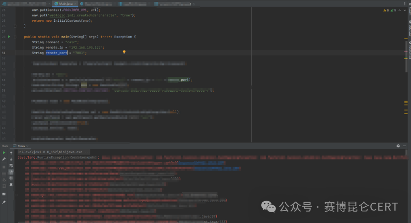
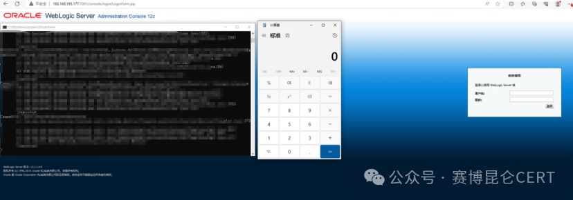

# 【复现】 WebLogic T3/IIOP 反序列化漏洞（CVE-2024-21216）风险通告

<!-- vulwiki-editorial:start -->
## 校订与适用边界

Oracle 核验支持 9.8 分、T3/IIOP 和无需认证；本页没有运行时矩阵证明任意 JDK 或完全无出站连接条件。

- 适用前提：T3/IIOP 服务可达、对应未修复版本；官方列无需认证，但不等同所有 JDK、无需出站连接等额外断言均已成立
- 证据范围：Claims author reproduction with precise pre-fix PSU but evidence only screenshots; no public procedure or source. Distinct advisory from 21007 despite same template.

### 已有来源支持的更正

- Oracle confirms9.8/T3/IIOP/unauthenticated,12.2.1.4.0 and14.1.1.0.0; does not establish article all-JDK/no-egress claim

### 尚未解决的证据缺口

以下限制仍适用于后文历史材料；相关版本、结果或修复结论不能据此视为已验证：

- No exploitation conditions is overbroad: protocol exposure and affected patch state are required
- No outbound/JDK-independent claim needs runtime matrix or technical proof
- Table public PoC/EXP unknown should be labelled public availability, separate from author private reproduction
- Huge HTML table, broken line layout, marketing content
- Only support homepage for patch downloads; fixed patch IDs missing
- Publication date should include timezone when differing from Oracle US date

### 核验来源

- https://www.oracle.com/security-alerts/cpuoct2024.html

本页为文本校订，未执行代码、PoC 或目标请求；原图仅保留引用，未据此确认复现成功。
<!-- vulwiki-editorial:end -->

## 技术正文与历史材料

原创 赛博昆仑CERT  赛博昆仑CERT   2024-10-16 10:26  
  
  
  
  
-  
赛博昆仑漏洞安全通告-  
  
  WebLogic T3/IIOP 反序列化漏洞（CVE-2024-21216）风险通告  
  
  
  
  
  
  
****  
**漏洞描述**  
  
  
WebLogic是美国  
Oracle公司出品的一个  
application server，确切的说是一个基于  
JAVAEE架构的中间件，  
WebLogic是用于开发、集成、部署和管理大型分布式  
Web应用、网络应用和数据库应用的  
Java应用服务器。将  
Java的动态功能和  
Java Enterprise标准的安全性引入大型网络应用的开发、集成、部署和管理之中。  
  
近日，赛博昆仑  
CERT监测到  
WebLogic  T3/IIOP 反序列化漏洞（  
CVE-2024-21216）。未经身份验证的攻击者可以利用该漏洞在远程的  
WebLogic服务器上执行任意代码，从而获取到远程服务器的权限。该漏洞并不需要出网，不受  
JDK版本限制。  
  
<table><tbody><tr><td valign="top" style="border-width: 1pt;border-color: rgb(221, 221, 221);padding: 3pt 6pt 1.5pt;" width="127">
<strong>漏洞名称</strong><o:p></o:p>
</td><td colspan="3" valign="top" style="border-top-width: 1pt;border-color: rgb(221, 221, 221);border-right-width: 1pt;border-bottom-width: 1pt;border-left-width: initial;border-left-style: none;padding: 3pt 6pt 1.5pt;">
WebLogic T3/IIOP 远程代码执行漏洞<o:p></o:p>
</td></tr><tr><td valign="top" style="border-right-width: 1pt;border-color: rgb(221, 221, 221);border-bottom-width: 1pt;border-left-width: 1pt;border-top-width: initial;border-top-style: none;padding: 3pt 6pt 1.5pt;" width="127">
<strong>漏洞公开编号</strong><o:p></o:p>
</td><td colspan="3" valign="top" style="border-top: none rgb(221, 221, 221);border-left: none rgb(221, 221, 221);border-bottom-width: 1pt;border-bottom-color: rgb(221, 221, 221);border-right-width: 1pt;border-right-color: rgb(221, 221, 221);padding: 3pt 6pt 1.5pt;">
CVE-2024-21216<o:p></o:p>
</td></tr><tr><td valign="top" style="border-right-width: 1pt;border-color: rgb(221, 221, 221);border-bottom-width: 1pt;border-left-width: 1pt;border-top-width: initial;border-top-style: none;padding: 3pt 6pt 1.5pt;" width="127">
<strong>昆仑漏洞库编号</strong><o:p></o:p>
</td><td colspan="3" valign="top" style="border-top: none rgb(221, 221, 221);border-left: none rgb(221, 221, 221);border-bottom-width: 1pt;border-bottom-color: rgb(221, 221, 221);border-right-width: 1pt;border-right-color: rgb(221, 221, 221);padding: 3pt 6pt 1.5pt;">
CYKL-2024-018902<o:p></o:p>
</td></tr><tr><td valign="top" style="border-right-width: 1pt;border-color: rgb(221, 221, 221);border-bottom-width: 1pt;border-left-width: 1pt;border-top-width: initial;border-top-style: none;padding: 3pt 6pt 1.5pt;" width="127">
<strong>漏洞类型</strong><o:p></o:p>
</td><td valign="top" style="border-top: none rgb(221, 221, 221);border-left: none rgb(221, 221, 221);border-bottom-width: 1pt;border-bottom-color: rgb(221, 221, 221);border-right-width: 1pt;border-right-color: rgb(221, 221, 221);padding: 3pt 6pt 1.5pt;" width="127">
反序列化<o:p></o:p>
</td><td valign="top" style="border-top: none rgb(221, 221, 221);border-left: none rgb(221, 221, 221);border-bottom-width: 1pt;border-bottom-color: rgb(221, 221, 221);border-right-width: 1pt;border-right-color: rgb(221, 221, 221);padding: 3pt 6pt 1.5pt;" width="127">
<strong>公开时间</strong><o:p></o:p>
</td><td valign="top" style="border-top: none rgb(221, 221, 221);border-left: none rgb(221, 221, 221);border-bottom-width: 1pt;border-bottom-color: rgb(221, 221, 221);border-right-width: 1pt;border-right-color: rgb(221, 221, 221);padding: 3pt 6pt 1.5pt;" width="127">
2024-10-16<o:p></o:p>
</td></tr><tr><td valign="top" style="border-right-width: 1pt;border-color: rgb(221, 221, 221);border-bottom-width: 1pt;border-left-width: 1pt;border-top-width: initial;border-top-style: none;padding: 3pt 6pt 1.5pt;" width="127">
<strong>漏洞等级</strong><o:p></o:p>
</td><td valign="top" style="border-top: none rgb(221, 221, 221);border-left: none rgb(221, 221, 221);border-bottom-width: 1pt;border-bottom-color: rgb(221, 221, 221);border-right-width: 1pt;border-right-color: rgb(221, 221, 221);padding: 3pt 6pt 1.5pt;" width="127">
高危<o:p></o:p>
</td><td valign="top" style="border-top: none rgb(221, 221, 221);border-left: none rgb(221, 221, 221);border-bottom-width: 1pt;border-bottom-color: rgb(221, 221, 221);border-right-width: 1pt;border-right-color: rgb(221, 221, 221);padding: 3pt 6pt 1.5pt;" width="127">
<strong>评分</strong><o:p></o:p>
</td><td valign="top" style="border-top: none rgb(221, 221, 221);border-left: none rgb(221, 221, 221);border-bottom-width: 1pt;border-bottom-color: rgb(221, 221, 221);border-right-width: 1pt;border-right-color: rgb(221, 221, 221);padding: 3pt 6pt 1.5pt;" width="127">
9.8<o:p></o:p>
</td></tr><tr><td valign="top" style="border-right-width: 1pt;border-color: rgb(221, 221, 221);border-bottom-width: 1pt;border-left-width: 1pt;border-top-width: initial;border-top-style: none;padding: 3pt 6pt 1.5pt;" width="127">
<strong>漏洞所需权限</strong><o:p></o:p>
</td><td valign="top" style="border-top: none rgb(221, 221, 221);border-left: none rgb(221, 221, 221);border-bottom-width: 1pt;border-bottom-color: rgb(221, 221, 221);border-right-width: 1pt;border-right-color: rgb(221, 221, 221);padding: 3pt 6pt 1.5pt;" width="127">
无权限要求<o:p></o:p>
</td><td valign="top" style="border-top: none rgb(221, 221, 221);border-left: none rgb(221, 221, 221);border-bottom-width: 1pt;border-bottom-color: rgb(221, 221, 221);border-right-width: 1pt;border-right-color: rgb(221, 221, 221);padding: 3pt 6pt 1.5pt;" width="127">
<strong>漏洞利用难度</strong><o:p></o:p>
</td><td valign="top" style="border-top: none rgb(221, 221, 221);border-left: none rgb(221, 221, 221);border-bottom-width: 1pt;border-bottom-color: rgb(221, 221, 221);border-right-width: 1pt;border-right-color: rgb(221, 221, 221);padding: 3pt 6pt 1.5pt;" width="127">
低<o:p></o:p>
</td></tr><tr><td valign="top" style="border-right-width: 1pt;border-color: rgb(221, 221, 221);border-bottom-width: 1pt;border-left-width: 1pt;border-top-width: initial;border-top-style: none;padding: 3pt 6pt 1.5pt;" width="127">
<strong>PoC</strong><strong>状态</strong><o:p></o:p>
</td><td valign="top" style="border-top: none rgb(221, 221, 221);border-left: none rgb(221, 221, 221);border-bottom-width: 1pt;border-bottom-color: rgb(221, 221, 221);border-right-width: 1pt;border-right-color: rgb(221, 221, 221);padding: 3pt 6pt 1.5pt;" width="127">
未知<o:p></o:p>
</td><td valign="top" style="border-top: none rgb(221, 221, 221);border-left: none rgb(221, 221, 221);border-bottom-width: 1pt;border-bottom-color: rgb(221, 221, 221);border-right-width: 1pt;border-right-color: rgb(221, 221, 221);padding: 3pt 6pt 1.5pt;" width="127">
<strong>EXP</strong><strong>状态</strong><o:p></o:p>
</td><td valign="top" style="border-top: none rgb(221, 221, 221);border-left: none rgb(221, 221, 221);border-bottom-width: 1pt;border-bottom-color: rgb(221, 221, 221);border-right-width: 1pt;border-right-color: rgb(221, 221, 221);padding: 3pt 6pt 1.5pt;" width="127">
未知<o:p></o:p>
</td></tr><tr><td valign="top" style="border-right-width: 1pt;border-color: rgb(221, 221, 221);border-bottom-width: 1pt;border-left-width: 1pt;border-top-width: initial;border-top-style: none;padding: 3pt 6pt 1.5pt;" width="127">
<strong>漏洞细节</strong><o:p></o:p>
</td><td valign="top" style="border-top: none rgb(221, 221, 221);border-left: none rgb(221, 221, 221);border-bottom-width: 1pt;border-bottom-color: rgb(221, 221, 221);border-right-width: 1pt;border-right-color: rgb(221, 221, 221);padding: 3pt 6pt 1.5pt;" width="127">
未知<o:p></o:p>
</td><td valign="top" style="border-top: none rgb(221, 221, 221);border-left: none rgb(221, 221, 221);border-bottom-width: 1pt;border-bottom-color: rgb(221, 221, 221);border-right-width: 1pt;border-right-color: rgb(221, 221, 221);padding: 3pt 6pt 1.5pt;" width="127">
<strong>在野利用</strong><o:p></o:p>
</td><td valign="top" style="border-top: none rgb(221, 221, 221);border-left: none rgb(221, 221, 221);border-bottom-width: 1pt;border-bottom-color: rgb(221, 221, 221);border-right-width: 1pt;border-right-color: rgb(221, 221, 221);padding: 3pt 6pt 1.5pt;" width="127">
未知
</td></tr></tbody></table>  
  
  
  
  
**影响版本**  
  
WebLogic Server 12.2.1.4.0  
  
WebLogic Server 14.1.1.0.0  
  
  
  
**利用条件**  
  
  
  
无需任何利用条件  
  
**漏洞复现**  
  
目前赛博昆仑CERT已确认漏洞原理，复现截图如下：  
  
复现版本为 36805124;WLS PATCH SET UPDATE 12.2.1.4.240704  
  
  
  
  
  
  
**防护措施**  
  
  
目前，官方已发布修复建议，建议受影响的用户尽快安装最新补丁。  
  
下载地址：  
https://support.oracle.com/  
  
**技术咨询**  
  
赛博昆仑支持对用户提供轻量级的检测规则或热补方式，可提供定制化服务适  
配多种产品及规则，帮助用户进行漏洞检测和修复。  
  
赛博昆仑CERT已开启年订阅服务，付费客户(可申请试用)将获取更多技术详情，并支持适配客户的需求。  
  
联系邮箱：cert@cyberkl.com  
  
公众号：赛博昆仑CERT  
  
**参考链接**  
  
https://www.oracle.com/security-alerts/cpuoct2024.html  
  
**时间线**  
  
   
  
   
  
  
2024年  
10月  
16日，官方发布通告  
  
2024年  
10月  
16日，赛博昆仑  
CERT公众号发布漏洞风险通告  
  
  
  
  
  
  
  
  
  
  
  

---

> 来源：gelusus/wxvl（微信公众号漏洞文章自动归档，原文见文首链接）
