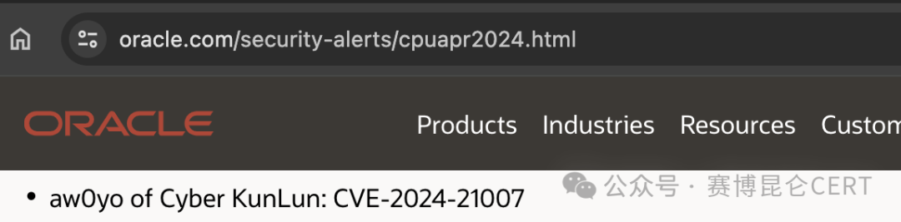
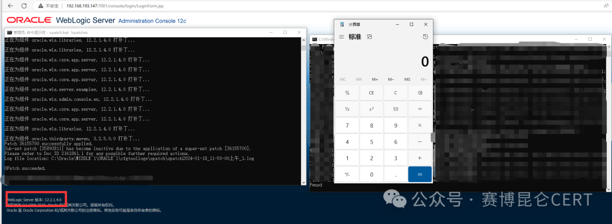

# WebLogic T3/IIOP 风险通告（CVE-2024-21007，影响结论待核）

<!-- vulwiki-editorial:start -->
## 校订与适用边界

Oracle CPU 对此项列机密性影响、7.5 分。原报道更强的 RCE 断言和“已复现”题名缺公开请求或代码支撑，应分别归因，不能混作厂商结论。

- 适用前提：Default-enabled T3/IIOP reachable; tested PSU12.2.1.4.240104
- 证据范围：Reporter asserts RCE but shows only screenshot and no technical chain; preserve as attributed researcher claim rather than independently reproduced result.

### 已有来源支持的更正

- Oracle confirms report credit aw0yo/CyberKunLun, confidentiality-only7.5 with supported affected12.2.1.4.0/14.1.1.0.0; article12.2.1.3.0 and RCE claims exceed this matrix and need researcher evidence

### 本次正文校订

- 修正题名；原文件路径保持不变，以保留已有链接和资源定位。

### 尚未解决的证据缺口

以下限制仍适用于后文历史材料；相关版本、结果或修复结论不能据此视为已验证：

- No public PoC or raw request despite title reproduction
- Need reconcile 7.5 advisory impact with stronger RCE claim and chain prerequisites
- No fixed PSU/patch IDs
- HTML presentation overwhelms small matrix and text
- Same template as 21216 but different research/PSU/CVE, do not merge as duplicate
- Official supported-version matrix does not list12.2.1.3.0; distinguish unsupported branch testing from vendor-listed affected supported branches

### 核验来源

- https://www.oracle.com/security-alerts/cpuapr2024.html

本页为文本校订，未执行代码、PoC 或目标请求；原图仅保留引用，未据此确认复现成功。
<!-- vulwiki-editorial:end -->

## 技术正文与历史材料

原创 赛博昆仑CERT  赛博昆仑CERT   2024-04-17 11:23  
  
  
  
  
-  
赛博昆仑漏洞安全通告-  
  
WebLogic T3/IIOP 远程代码执行漏洞（CVE-2024-21007）的风险通告   
  
  
  
  
  
  
****  
**漏洞描述**  
  
WebLogic是美国Oracle公司出品的一个application server，确切的说是一个基于JAVAEE架构的中间件，WebLogic是用于开发、集成、部署和管理大型分布式Web应用、网络应用和数据库应用的Java应用服务器。将Java的动态功能和Java Enterprise标准的安全性引入大型网络应用的开发、集成、部署和管理之中。  
  
2023年8月，赛博昆仑安全研究员向Oracle官方报送了一个WebLogic T3/IIOP 远程代码执行漏洞（CVE-2024-21007）。未经身份验证的攻击者可以利用该漏洞在远程服务器上执行任意代码，从而获取到远程服务器的权限。近日，Oracle 官方发布了补丁通告。  
  
  
  
  
<table><tbody><tr><td valign="top" style="border-width: 1pt;border-color: rgb(221, 221, 221);padding: 3pt 6pt 1.5pt;" width="127">
<strong>漏洞名称</strong><o:p></o:p>
</td><td colspan="3" valign="top" style="border-top-width: 1pt;border-color: rgb(221, 221, 221);border-right-width: 1pt;border-bottom-width: 1pt;border-left-width: initial;border-left-style: none;padding: 3pt 6pt 1.5pt;">
WebLogic T3/IIOP 远程代码执行漏洞<o:p></o:p>
</td></tr><tr><td valign="top" style="border-right-width: 1pt;border-color: rgb(221, 221, 221);border-bottom-width: 1pt;border-left-width: 1pt;border-top-width: initial;border-top-style: none;padding: 3pt 6pt 1.5pt;" width="127">
<strong>漏洞公开编号</strong><o:p></o:p>
</td><td colspan="3" valign="top" style="border-top: none rgb(221, 221, 221);border-left: none rgb(221, 221, 221);border-bottom-width: 1pt;border-bottom-color: rgb(221, 221, 221);border-right-width: 1pt;border-right-color: rgb(221, 221, 221);padding: 3pt 6pt 1.5pt;">
CVE-2024-21007<o:p></o:p>
</td></tr><tr><td valign="top" style="border-right-width: 1pt;border-color: rgb(221, 221, 221);border-bottom-width: 1pt;border-left-width: 1pt;border-top-width: initial;border-top-style: none;padding: 3pt 6pt 1.5pt;" width="127">
<strong>昆仑漏洞库编号</strong><o:p></o:p>
</td><td colspan="3" valign="top" style="border-top: none rgb(221, 221, 221);border-left: none rgb(221, 221, 221);border-bottom-width: 1pt;border-bottom-color: rgb(221, 221, 221);border-right-width: 1pt;border-right-color: rgb(221, 221, 221);padding: 3pt 6pt 1.5pt;">
CYKL-2023-005238<o:p></o:p>
</td></tr><tr><td valign="top" style="border-right-width: 1pt;border-color: rgb(221, 221, 221);border-bottom-width: 1pt;border-left-width: 1pt;border-top-width: initial;border-top-style: none;padding: 3pt 6pt 1.5pt;" width="127">
<strong>漏洞类型</strong><o:p></o:p>
</td><td valign="top" style="border-top: none rgb(221, 221, 221);border-left: none rgb(221, 221, 221);border-bottom-width: 1pt;border-bottom-color: rgb(221, 221, 221);border-right-width: 1pt;border-right-color: rgb(221, 221, 221);padding: 3pt 6pt 1.5pt;" width="127">
代码执行<o:p></o:p>
</td><td valign="top" style="border-top: none rgb(221, 221, 221);border-left: none rgb(221, 221, 221);border-bottom-width: 1pt;border-bottom-color: rgb(221, 221, 221);border-right-width: 1pt;border-right-color: rgb(221, 221, 221);padding: 3pt 6pt 1.5pt;" width="127">
<strong>公开时间</strong><o:p></o:p>
</td><td valign="top" style="border-top: none rgb(221, 221, 221);border-left: none rgb(221, 221, 221);border-bottom-width: 1pt;border-bottom-color: rgb(221, 221, 221);border-right-width: 1pt;border-right-color: rgb(221, 221, 221);padding: 3pt 6pt 1.5pt;" width="127">
2024-04-17<o:p></o:p>
</td></tr><tr><td valign="top" style="border-right-width: 1pt;border-color: rgb(221, 221, 221);border-bottom-width: 1pt;border-left-width: 1pt;border-top-width: initial;border-top-style: none;padding: 3pt 6pt 1.5pt;" width="127">
<strong>漏洞等级</strong><o:p></o:p>
</td><td valign="top" style="border-top: none rgb(221, 221, 221);border-left: none rgb(221, 221, 221);border-bottom-width: 1pt;border-bottom-color: rgb(221, 221, 221);border-right-width: 1pt;border-right-color: rgb(221, 221, 221);padding: 3pt 6pt 1.5pt;" width="127">
高危<o:p></o:p>
</td><td valign="top" style="border-top: none rgb(221, 221, 221);border-left: none rgb(221, 221, 221);border-bottom-width: 1pt;border-bottom-color: rgb(221, 221, 221);border-right-width: 1pt;border-right-color: rgb(221, 221, 221);padding: 3pt 6pt 1.5pt;" width="127">
<strong>评分</strong><o:p></o:p>
</td><td valign="top" style="border-top: none rgb(221, 221, 221);border-left: none rgb(221, 221, 221);border-bottom-width: 1pt;border-bottom-color: rgb(221, 221, 221);border-right-width: 1pt;border-right-color: rgb(221, 221, 221);padding: 3pt 6pt 1.5pt;" width="127">
7.5<o:p></o:p>
</td></tr><tr><td valign="top" style="border-right-width: 1pt;border-color: rgb(221, 221, 221);border-bottom-width: 1pt;border-left-width: 1pt;border-top-width: initial;border-top-style: none;padding: 3pt 6pt 1.5pt;" width="127">
<strong>漏洞所需权限</strong><o:p></o:p>
</td><td valign="top" style="border-top: none rgb(221, 221, 221);border-left: none rgb(221, 221, 221);border-bottom-width: 1pt;border-bottom-color: rgb(221, 221, 221);border-right-width: 1pt;border-right-color: rgb(221, 221, 221);padding: 3pt 6pt 1.5pt;" width="127">
无权限要求<o:p></o:p>
</td><td valign="top" style="border-top: none rgb(221, 221, 221);border-left: none rgb(221, 221, 221);border-bottom-width: 1pt;border-bottom-color: rgb(221, 221, 221);border-right-width: 1pt;border-right-color: rgb(221, 221, 221);padding: 3pt 6pt 1.5pt;" width="127">
<strong>漏洞利用难度</strong><o:p></o:p>
</td><td valign="top" style="border-top: none rgb(221, 221, 221);border-left: none rgb(221, 221, 221);border-bottom-width: 1pt;border-bottom-color: rgb(221, 221, 221);border-right-width: 1pt;border-right-color: rgb(221, 221, 221);padding: 3pt 6pt 1.5pt;" width="127">
低<o:p></o:p>
</td></tr><tr><td valign="top" style="border-right-width: 1pt;border-color: rgb(221, 221, 221);border-bottom-width: 1pt;border-left-width: 1pt;border-top-width: initial;border-top-style: none;padding: 3pt 6pt 1.5pt;" width="127">
<strong>PoC</strong><strong>状态</strong><o:p></o:p>
</td><td valign="top" style="border-top: none rgb(221, 221, 221);border-left: none rgb(221, 221, 221);border-bottom-width: 1pt;border-bottom-color: rgb(221, 221, 221);border-right-width: 1pt;border-right-color: rgb(221, 221, 221);padding: 3pt 6pt 1.5pt;" width="127">
未知<o:p></o:p>
</td><td valign="top" style="border-top: none rgb(221, 221, 221);border-left: none rgb(221, 221, 221);border-bottom-width: 1pt;border-bottom-color: rgb(221, 221, 221);border-right-width: 1pt;border-right-color: rgb(221, 221, 221);padding: 3pt 6pt 1.5pt;" width="127">
<strong>EXP</strong><strong>状态</strong><o:p></o:p>
</td><td valign="top" style="border-top: none rgb(221, 221, 221);border-left: none rgb(221, 221, 221);border-bottom-width: 1pt;border-bottom-color: rgb(221, 221, 221);border-right-width: 1pt;border-right-color: rgb(221, 221, 221);padding: 3pt 6pt 1.5pt;" width="127">
未知<o:p></o:p>
</td></tr><tr><td valign="top" style="border-right-width: 1pt;border-color: rgb(221, 221, 221);border-bottom-width: 1pt;border-left-width: 1pt;border-top-width: initial;border-top-style: none;padding: 3pt 6pt 1.5pt;" width="127">
<strong>漏洞细节</strong><o:p></o:p>
</td><td valign="top" style="border-top: none rgb(221, 221, 221);border-left: none rgb(221, 221, 221);border-bottom-width: 1pt;border-bottom-color: rgb(221, 221, 221);border-right-width: 1pt;border-right-color: rgb(221, 221, 221);padding: 3pt 6pt 1.5pt;" width="127">
未知<o:p></o:p>
</td><td valign="top" style="border-top: none rgb(221, 221, 221);border-left: none rgb(221, 221, 221);border-bottom-width: 1pt;border-bottom-color: rgb(221, 221, 221);border-right-width: 1pt;border-right-color: rgb(221, 221, 221);padding: 3pt 6pt 1.5pt;" width="127">
<strong>在野利用</strong><o:p></o:p>
</td><td valign="top" style="border-top: none rgb(221, 221, 221);border-left: none rgb(221, 221, 221);border-bottom-width: 1pt;border-bottom-color: rgb(221, 221, 221);border-right-width: 1pt;border-right-color: rgb(221, 221, 221);padding: 3pt 6pt 1.5pt;word-break: break-all;" width="127">
未知
</td></tr></tbody></table>  
  
  
**影响版本**  
  
  
WebLogic Server 12.2.1.3.0  
  
WebLogic Server 12.2.1.4.0  
  
WebLogic Server 14.1.1.0.0  
  
**利用条件**  
  
  
使用该应用的默认配置，开启 T3/IIOP 协议。  
  
**漏洞复现**  
  
  
目前赛博昆仑CERT已确认漏洞原理，复现截图如下：  
  
复现版本为  
 WLS PATCH SET UPDATE 12.2.1.4.240104  
  
  
  
  
  
**防护措施**  
  
  
- **临时缓解措施**  
  
在业务允许的前提下禁用 T3/IIOP 协议。  
- **修复建议**  
  
目前，官方已发布修复建议，建议受影响的用户尽快升级至安全版本。  
  
下载地址：https://support.oracle.com/epmos/faces/MyAccount  
  
  
**技术咨询**  
  
赛博昆仑支持对用户提供轻量级的检测规则或热补方式，可提供定制化服务适  
配多种产品及规则，帮助用户进行漏洞检测和修复。  
  
赛博昆仑CERT已开启年订阅服务，付费客户(可申请试用)将获取更多技术详情，并支持适配客户的需求。  
  
联系邮箱：cert@cyberkl.com  
  
公众号：赛博昆仑CERT  
  
**参考链接**  
  
https://www.oracle.com/security-alerts/cpuapr2024.html  
  
**时间线**  
  
2023年08月03日，赛博昆仑报送漏洞  
  
2024年04月17日，Oracle 官方发布漏洞通告  
  
2024年04月17日，赛博昆仑CERT公众号发布漏洞风险通告  
  
  
  

---

> 来源：gelusus/wxvl（微信公众号漏洞文章自动归档，原文见文首链接）
