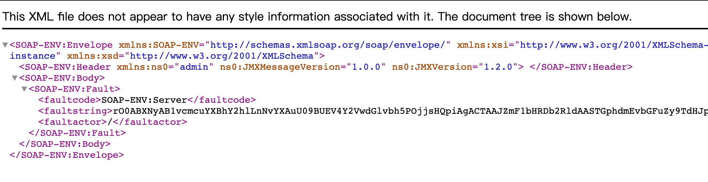

# CVE-2020-4276 4362 IBM WebSphere远程代码执行漏洞

<!-- vulwiki-editorial:start -->
## 校订与适用边界

- 适用前提：SOAP connector exposure; article claims unauthenticated while IBM4362 states token-based admin-request authentication and PR:L
- 证据范围：Claims failed first fix followed by second CVE. Preserve linked vulnerability/fix history, but do not erase distinct identifiers or silently accept unconditional unauthenticated RCE claim conflicting with vendor scope.

### 已有来源支持的更正

- IBM states token-authentication privilege escalation, PR:L AC:H; PH23853 or9.0.5.5/8.5.5.18 fixes, legacy7/8 require interim fix

### 尚未解决的证据缺口

以下限制仍适用于后文历史材料；相关版本、结果或修复结论不能据此视为已验证：

- High-priority auth/complexity conflict with IBM advisory must be resolved through original technical research
- Major-version-only scope includes fixed builds
- PoC section explicitly says unavailable; image alone not reproducible procedure
- Fix IDs PH21511/PH23853 given but no exact downloadable advisory

### 核验来源

- https://www.ibm.com/support/pages/security-bulletin-privilege-escalation-vulnerability-websphere-application-server-cve-2020-4362

本页为文本校订，未执行代码、PoC 或目标请求；原图仅保留引用，未据此确认复现成功。
<!-- vulwiki-editorial:end -->

## 技术正文与历史材料

## 简介 

**WebSphere SOAP Connector 是什么服务？**

WebSphere SOAP Connector 服务用于管理远程节点和数据同步，因此主要是在服务器与服务器之间进行通信。它的默认监听地址为 0.0.0.0:8880。

 

CVE-2020-4276 和 CVE-2020-4362 漏洞编号的由来？

长亭科技于今年一月份的时候向 IBM 官方报告了此漏洞，随后官方确认了漏洞，发布对应的补丁 PH21511，分配漏洞编号 CVE-2020-4276。但我们马上发现补丁 PH21511 似乎并未起到漏洞修复的效果，于是再次与官方沟通，经过最终确认后，官方再次发布补丁 PH23853，分配漏洞编号 CVE-2020-4362。因此这两个 CVE 编号，实际上是同一个漏洞。

远程且未经授权的攻击者通过成功利用此漏洞，可以在目标服务端执行任意恶意代码，获取系统权限。

 

哪些版本的 WebSphere 受到 CVE-2020-4276、CVE-2020-4362 漏洞影响？

• WebSphere Application Server 9.0.x
• WebSphere Application Server 8.5.x
• WebSphere Application Server 8.0.x
• WebSphere Application Server 7.0.x

什么情况下的WebSphere可以被 CVE-2020-4276、CVE-2020-4362 漏洞利用？

对于受漏洞影响的 WebSphere 来说，如果攻击者可以访问到其 SOAP Connector 服务端口，即存在被漏洞利用的风险（WebSphereSOAP Connector 默认监听地址为 0.0.0.0:8880，且此漏洞的利用无额外条件限制）。
由于WebSphere SOAP Connector 主要用于服务器之间的通信，因此多见于企业内网环境中。

## 漏洞利用

暂无
